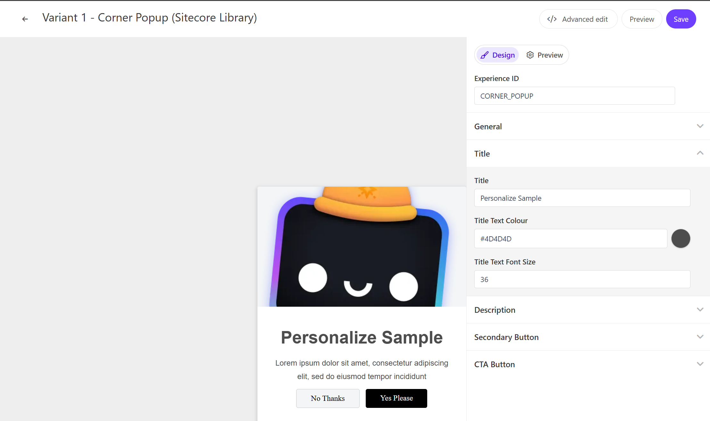

On this page, you can check the demo of the standard template Corner Popup provided by Sitecore Personalize.



## Settings

### Image

You can set one image for the Corner Popup. This item can be changed in `General` - `Image URL`.

### Description

You can specify the text used in the popup. This item can be changed in `Description` - `Description`.

### Secondary Button

You can change the label of the button that only closes the popup. This item can be changed in `Secondary Button` - `Dismiss Text`.

### CTA Button

You can change the label for the action button in response to the popup message. This item can be changed in `CTA Button` - `CTA Text`.

## Code Review

The variables included in the HTML are as follows:

| Variable     | Type   | Description                  |
| ------------ | ------ | ---------------------------- |
| Title        | string | Title                        |
| Description  | string | Description                  |
| Dismiss Text | string | Label for the dismiss button |
| CTA Text     | string | Label for the CTA button     |

### HTML Code

The HTML for the Corner Popup is set as follows:

```html
// CornerPopup.html
<!-- Use dynamic Guest variables, type ctrl+space or guest to explore available entities.-->
<!-- Type "d" to see decisioning helpers -->
<div id="pers-transition-card">
    <div class="img-container">
        <div class="img-container__image"></div>
    </div>
    <div class="pers-transition-card__body">
        <h3>[[Title | string | Title | {required:true, group:
        <h3>[[Title | string | Title | {required:true, group: Title, order: 1}]]</h3>
        <p>[[Description | text | Lorem ipsum dolor sit amet, consectetur adipiscing elit, sed do eiusmod tempor incididunt | {required:true, group: Description, order: 1}]]</p>
        <div class="options-container">
            <a id="pers-transition-card--secondary" class="options-container__secondary">[[Dismiss Text | string | No Thanks | {required:true, group: Secondary Button, order: 1}]]</a>
            <a id="pers-transition-card--primary" class="options-container__primary">[[CTA Text | string | Yes Please | {required:true, group: CTA Button, order: 1}]]</a>
        </div>
    </div>
</div>
```

### JavaScript コード

Alert Bar の JavaScript は以下のように設定されています。

```js
// CornerPopup.js
// Adds a unique variant identifier to CSS when deployed to ensure CSS does not impact styling of other elements.
var compiledCSS = Engage.templating.compile(variant.assets.css)(variant);
var styleTag = document.getElementById('style-' + variant.ref);
if (styleTag) {
  styleTag.innerHTML = compiledCSS;
}
// End Adds a unique variant identifier to CSS when deployed to ensure CSS does not impact styling of other elements.

// make space in the body for the experience
insertHTMLAfter('body', 'pers-');
var persContent = document.querySelector('#pers-' + variant.ref + ' #pers-transition-card');

setTimeout(function () {
  persContent.classList.add('open');
  sendInteractionToPersonalize('VIEWED');
});

var persCardClose = document.body.querySelector(
  '#pers-' + variant.ref + ' #pers-transition-card--secondary'
);
persCardClose.onclick = function () {
  sendInteractionToPersonalize('DISMISSED');
  persContent.classList.remove('open');
};

var persCardCta = persContent.querySelector(
  '#pers-' + variant.ref + ' #pers-transition-card--primary'
);
persCardCta.onclick = function () {
  sendInteractionToPersonalize('CLICKED');
  window.location.href = '[[CTA destination URL | string || {required:true, group: CTA Button}]]';
};

function sendInteractionToPersonalize(interactionType) {
  const type = '[[ Experience ID | String | CORNER_POPUP | {required: true}]]_INTERACTION';
  const eventData = {
    channel: 'WEB',
    pointOfSale: Engage.settings.pointOfSale,
    interactionID: 'PERS_CORNER_POPUP',
    interactionType: interactionType,
  };

  window.engage.event(type, eventData);
}
```

- [Back to Sample List](/en/personalize/sample/)

