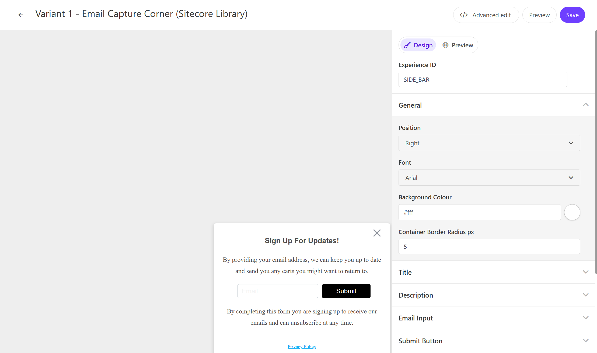
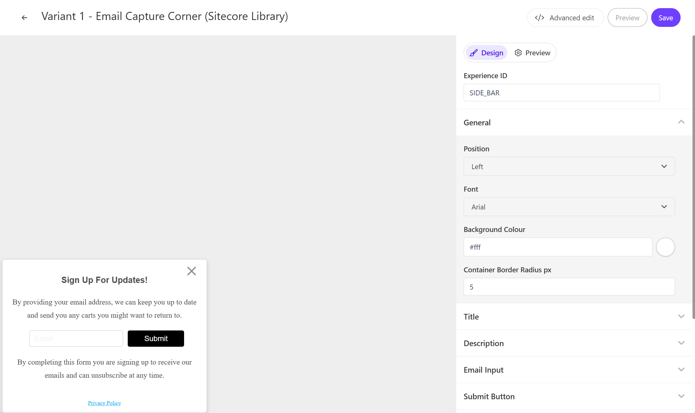

On this page, you can check out the demo of the standard Email Capture Corner template provided by Sitecore Personalize.

## Configuration Items

### Display Position

Email Capture Corner can be displayed on the right or left side of the page. You can change this in the `General` - `Position` section.





### Title Text

You can set the title text of the Email Capture Corner popup. This can be changed in the `Title` - `Title Text` section.

### Description

You can set the text used in the popup. In the `Description` section, you can change the text above the input box in `Description Top` and the text below the input box in `Description Bottom`.

### Input Placeholder

You can set the placeholder text displayed in the input box of the Email Capture Corner. This can be changed in the `Email Input` - `Input Ghost Text` section.

### Submit Button

You can set the label of the Email Capture Corner button. This can be changed in the `Submit Button` - `Button Text` section.

### Privacy Link

You can set the display and link for the privacy policy. In the `Privacy Link` - `Privacy Text` section, you can set the link text, and in `Privacy Link`, you can set the link destination.

### Response After Input

You can set the text displayed after input. In the `Modal Title` - `Modal Title Text` section, you can set the message, and in `Modal Description` - `Modal Description Text`, you can set the description.

## Code Review

The variables included in the HTML are as follows:

| Variable               | Type   | Description                       |
| ---------------------- | ------ | --------------------------------- |
| Title Text             | string | Popup title text                  |
| Description Top        | string | Description above the input box   |
| Input Ghost Text       | string | Placeholder text in the input box |
| Button Text            | string | Button label                      |
| Description Bottom     | string | Description below the input box   |
| Privacy Text           | string | Privacy policy text               |
| Privacy Link           | string | URL for the privacy policy link   |
| Modal Title Text       | string | Text displayed after input        |
| Modal Description Text | string | Description displayed after input |

### HTML Code

The HTML for Email Capture Corner is set as follows:

```html
// EmailCaptureCorner.html
<!-- Use dynamic Guest variables, type ctrl+space or guest to explore available entities.-->
<!-- Type "d" to see decisioning helpers -->
<div id="pers-transition-card">
  <div class="pers-transition-card__body">
    <div class="pers__btn-close"></div>
    <div class="pers-email_capture_container" id="pers-email_capture_container">
      <h3>
        [[ Title Text | string | Sign Up For Updates! | { required: true, group: Title, groupOrder:
        2, order: 1 } ]]
      </h3>
      <p>
        [[ Description Top | text | By providing your email address, we can keep you up to date and
        send you any carts you might want to return to.| { required: true ,group: Description,
        groupOrder: 3, order: 1 }]]
      </p>

      <div class="options-container">
        <input
          type="email"
          name="pers-email_input"
          class="pers-email_input input-box"
          id="pers-email_input"
          placeholder="[[ Input Ghost Text | string | Email | { required: true , group: Email Input, groupOrder: 4, order: 1 } ]]"
        />
        <a id="pers-transition-card--primary" class="options-container__primary"
          >[[ Button Text | string | Submit | {required: true,max: 15, group: Submit Button, order:
          1 } ]]</a
        >
      </div>
      <p>
        [[ Description Bottom | text |By completing this form you are signing up to receive our
        emails and can unsubscribe at any time.|{ required: true, group: Description, order: 2 }]]
      </p>
      <p>
        <a
          class="options-container__privacy-link"
          href="[[ Privacy Link | string | https://www.example.com/ | { required: true, group: Privacy Link, groupOrder: 5, order: 2 } ]]"
          >[[ Privacy Text | string | Privacy Policy | { required: true, group: Privacy Link, order:
          1 }]]</a
        >
      </p>
    </div>
  </div>
</div>

<div class="pers-thank_you_container" id="pers-thank_you_modal">
  <div class="pers-modal_backdrop" id="pers-thank_you_backdrop"></div>
  <div class="pers-modal_content">
    <h3>
      [[ Modal Title Text | string | Thank You! | { required: true, group: Modal Title, groupOrder:
      8, order: 1 } ]]
    </h3>
    <p>
      [[ Modal Description Text | text | You're all signed up. | { required: true, group: Modal
      Description, groupOrder: 9, order: 1 } ]]
    </p>

    <div class="pers__btn-close" id="pers-thank_you_close"></div>
  </div>
</div>
```

### JavaScript Code

The JavaScript for Email Capture Corner is set as follows:

```js
// EmailCaptureCorner.js
//Adds a unique variant identifier to CSS when deployed to ensure CSS does not impact styling of other elements.
var compiledCSS = Engage.templating.compile(variant.assets.css)(variant);
var styleTag = document.getElementById('style-' + variant.ref);
if (styleTag) {
  styleTag.innerHTML = compiledCSS;
}
//End

insertHTMLAfter('body', 'pers-');

// show popup on pers load
let persContent = document.querySelector('#pers-transition-card');
persContent.style.display = 'flex';

function showThankYou() {
  document.querySelector('#pers-' + variant.ref + ' #pers-thank_you_modal').style.display = 'flex';
}

function dismissThankYou() {
  document.querySelector('#pers-' + variant.ref + ' #pers-thank_you_modal').style.display = 'none';
}

//declarations
const persEmailCaptureContainer = document.getElementById('pers-email_capture_container');
const persThankYouClose = document.querySelector('#pers-' + variant.ref + ' #pers-thank_you_close');
const persThankYouBackdrop = document.querySelector(
  '#pers-' + variant.ref + ' #pers-thank_you_backdrop'
);
const persThankYouContainer = document.querySelector(
  '#pers-' + variant.ref + ' #pers-thank_you_modal'
);
const persClose = persContent.querySelector('.pers__btn-close');
const persCTA = document.getElementById('pers-transition-card--primary');

// LIsteners
//on Email submission
persCTA.onclick = function () {
  let persEmail = document.getElementById('pers-email_input').value;
  let emailVerified = validateEmail(persEmail);
  emailVerified
    ? onSuccessValidation(persEmail)
    : //friendly error
      (document.getElementById('pers-email_input').style.backgroundColor = 'rgba(200,0,0,0.1)');
};

persClose.onclick = function () {
  persContent.style.display = 'none';
  sendInteractionToPersonalize('DISMISSED');
};

persThankYouClose.onclick = function () {
  dismissThankYou();
};

persThankYouBackdrop.onclick = function () {
  dismissThankYou();
};

//declare functions
const sendInteractionToPersonalize = function (interactionType) {
  const type = '[[ Experience ID | String | SIDE_BAR | {required: true}]]_' + interactionType;
  const eventData = {
    channel: 'WEB',
    pointOfSale: Engage.settings.pointOfSale,
  };
  window.engage.event(type, eventData);
};

const onSuccessValidation = function (email) {
  sendInteractionToPersonalize('IDENTITY');

  const eventData = {
    channel: 'WEB',
    pointOfSale: Engage.settings.pointOfSale,
    email: email,
    identifiers: [
      {
        id: email,
        provider: 'email',
      },
    ],
  };
  window.engage.identity(eventData);

  persEmailCaptureContainer.style.display = 'none';
  let X = document.querySelector('.pers__btn-close');
  X.style.display = 'none';
  showThankYou();
  // flash thank you message
  setTimeout(function () {
    document.querySelector('#pers-transition-card').style.display = 'none';
  }, 100);
};

const validateEmail = function (persEmail) {
  let validation = false;
  let mailformat = /^[a-zA-Z0-9.!#$%&'*+/=?^_`{|}~-]+@[a-zA-Z0-9-]+(?:.[a-zA-Z0-9-]+)*$/.test(
    persEmail
  );
  mailformat ? (validation = true) : (validation = false);
  return validation;
};
```

- [Back to Sample List](/en/personalize/sample/)

