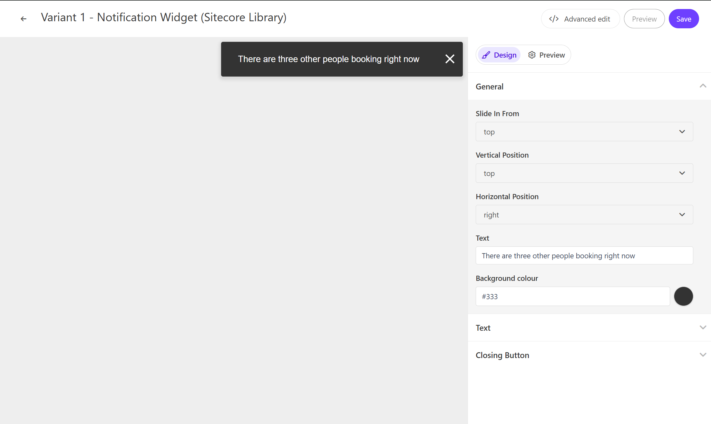
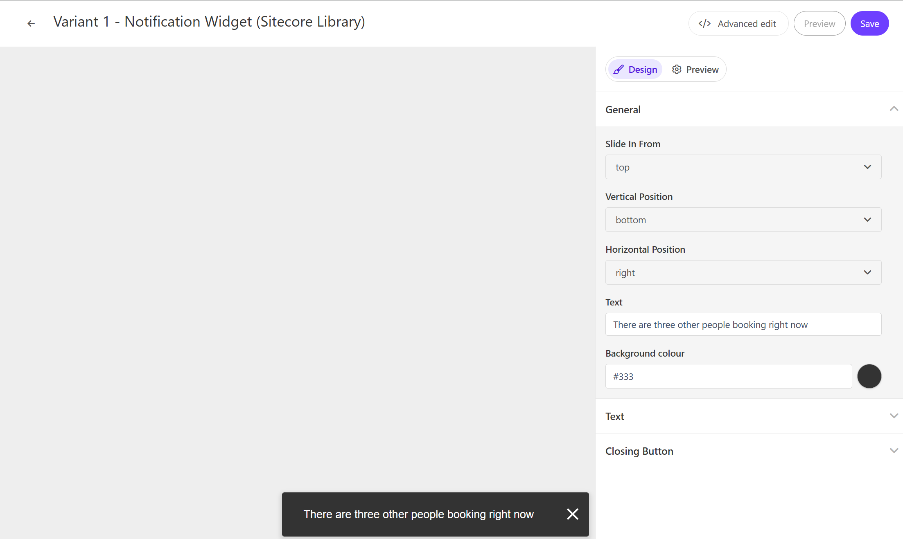
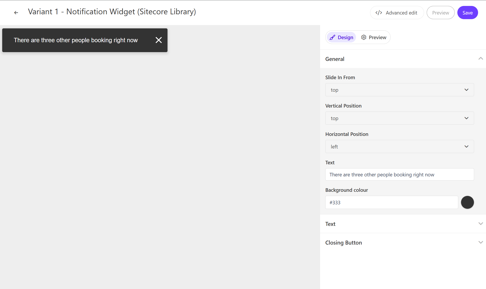
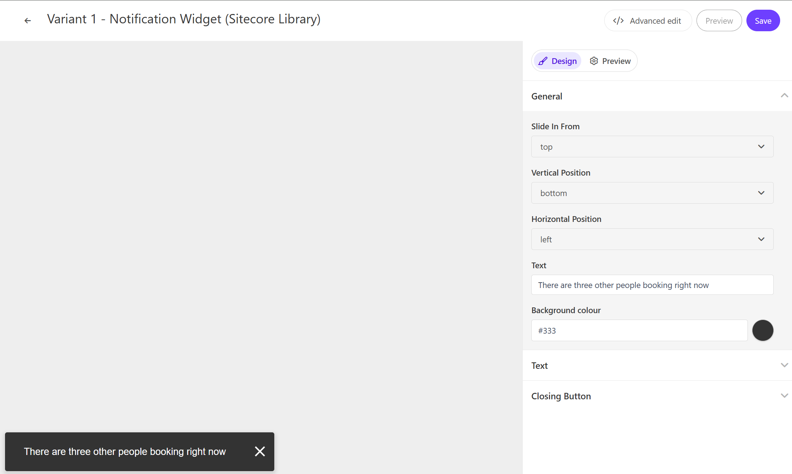

On this page, you can check out a demo of the Notification Widget provided by Sitecore Personalize.

## Configuration Items

### Display Position and Slide Movement

You can control the display position of the notification widget. This can be set with three items.

- Vertical Position: Can be set to top or bottom
- Horizontal Position: Can be set to right or left
- Display Direction: Can be set to display from any of the four directions (top, bottom, left, right)









### Notification Text

The Notification Widget allows you to set one text. This item can be changed in `General` - `Text`.

## Code Review

The variables included in the HTML are as follows:

| Variable | Type   | Description        |
| -------- | ------ | ------------------ |
| Text     | string | Notification title |

### HTML Code

The HTML for the Notification Widget is set as follows:

```html
// Notification.html
<div
  id="pers-transition-card"
  class="animate-[[ Slide In From ]] position-[[Horizontal Position]]-[[Vertical Position]]"
>
  <div class="pers-transition-card__body">
    <p>
      [[ Text | string | There are three other people booking right now | {required: true, group:
      General, groupOrder: 1, order: 3} ]]
    </p>
  </div>
  <div class="pers__btn-close" id="pers-modal__btn-close-icon"></div>
</div>
```

### JavaScript Code

The JavaScript for the Notification Widget is set as follows:

```js
// Notification.js
// Adds a unique variant identifier to CSS when deployed to ensure CSS does not impact styling of other elements.
var compiledCSS = Engage.templating.compile(variant.assets.css)(variant);
var styleTag = document.getElementById('style-' + variant.ref);
if (styleTag) {
  styleTag.innerHTML = compiledCSS;
}
// End Adds a unique variant identifier to CSS when deployed to ensure CSS does not impact styling of other elements.

// make space in the body for the experience
insertHTMLAfter('body', 'pers-');
var persContent = document.querySelector('#pers-' + variant.ref + ' #pers-transition-card');
setTimeout(function () {
  persContent.classList.add('open');
}, 10);

var persCardClose = document.body.querySelector(
  '#pers-' + variant.ref + ' #pers-modal__btn-close-icon'
);
persCardClose.onclick = function () {
  persContent.classList.remove('open');
};
```

- [Back to Sample List](/en/personalize/sample/)

