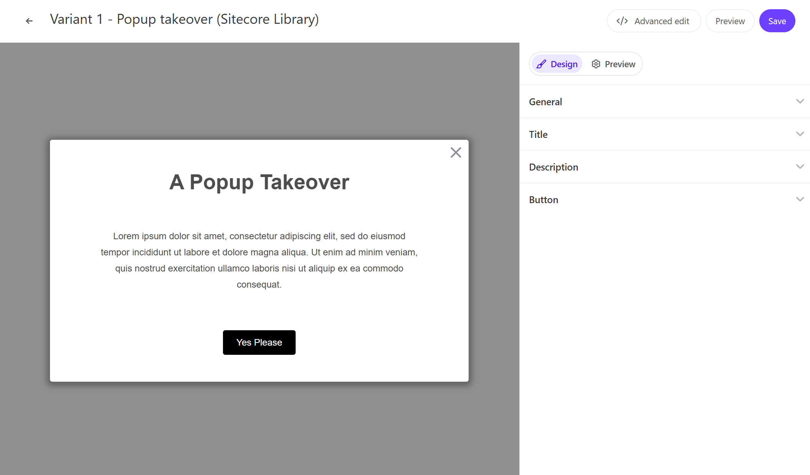

This page demonstrates the standard template for Popup takeover provided by Sitecore Personalize.



## Configuration Items

### Title Text

You can set the title text for the Popup takeover. This item can be changed in `Title` - `Title Text`.

### Description Text

You can set the text displayed in the Popup takeover. This item can be changed in `Description` - `Description Text`.

### Button Label

You can set the label for the button displayed in the Popup takeover. This item can be changed in `Button` - `Button title`.

## Code Review

The variables included in the HTML are as follows:

| Variable         | Type   | Description                 |
| ---------------- | ------ | --------------------------- |
| Title Text       | string | Title                       |
| Description Text | string | Text displayed in the popup |
| Button title     | string | Button label                |

### HTML Code

The HTML for the Popup takeover is set as follows:

```html
// Popuptakeover.html
<!-- Use dynamic Guest variables, type ctrl+space or guest to explore available entities.-->
<!-- Type "d" to see decisioning helpers -->
<div id="pers-modal_overlay">
  <div class="pers-modal_content">
    <h3>
      [[ Title Text | string | A Popup Takeover | { required: true, group: Title, groupOrder: 2,
      order: 1 } ]]
    </h3>
    <p>
      [[ Description Text | text | Lorem ipsum dolor sit amet, consectetur adipiscing elit, sed do
      eiusmod tempor incididunt ut labore et dolore magna aliqua. Ut enim ad minim veniam, quis
      nostrud exercitation ullamco laboris nisi ut aliquip ex ea commodo consequat. | {required:
      true, group: Description, groupOrder: 3, order: 1 }]]
    </p>
    <div class="pers-modal_button-wrapper">
      <a target="_blank" href="https://www.sitecore.com" class="pers-modal_button">
        [[ Button title | string | Yes Please | {required:true, group: Button, groupOrder: 4, order:
        1 }]]
      </a>
    </div>
    <div class="pers-modal__btn-close-icon"></div>
  </div>
</div>
```

### JavaScript Code

The JavaScript for the Popup takeover is set as follows:

```js
// Popuptakeover.js
// Adds a unique variant identifier to CSS when deployed to ensure CSS does not impact styling of other elements.
var compiledCSS = Engage.templating.compile(variant.assets.css)(variant);
var styleTag = document.getElementById('style-' + variant.ref);
if (styleTag) {
  styleTag.innerHTML = compiledCSS;
}
// End Adds a unique variant identifier to CSS when deployed to ensure CSS does not impact styling of other elements.

// make space in the body for the experience
insertHTMLBefore('body', 'pers-');
document.querySelector('#pers-modal_overlay').style.display = 'flex';
document.body.classList.add('pers-modal_content');
var persCardClose = document.querySelector('.pers-modal__btn-close-icon');
persCardClose.onclick = function () {
  document.querySelector('#pers-modal_overlay').style.display = 'none';
};
```

- [Back to Sample List](/en/personalize/sample/)

