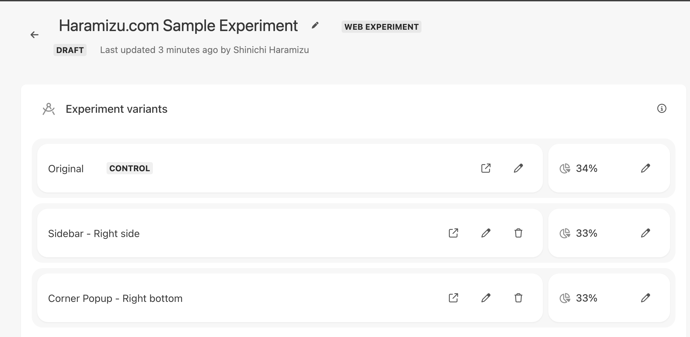
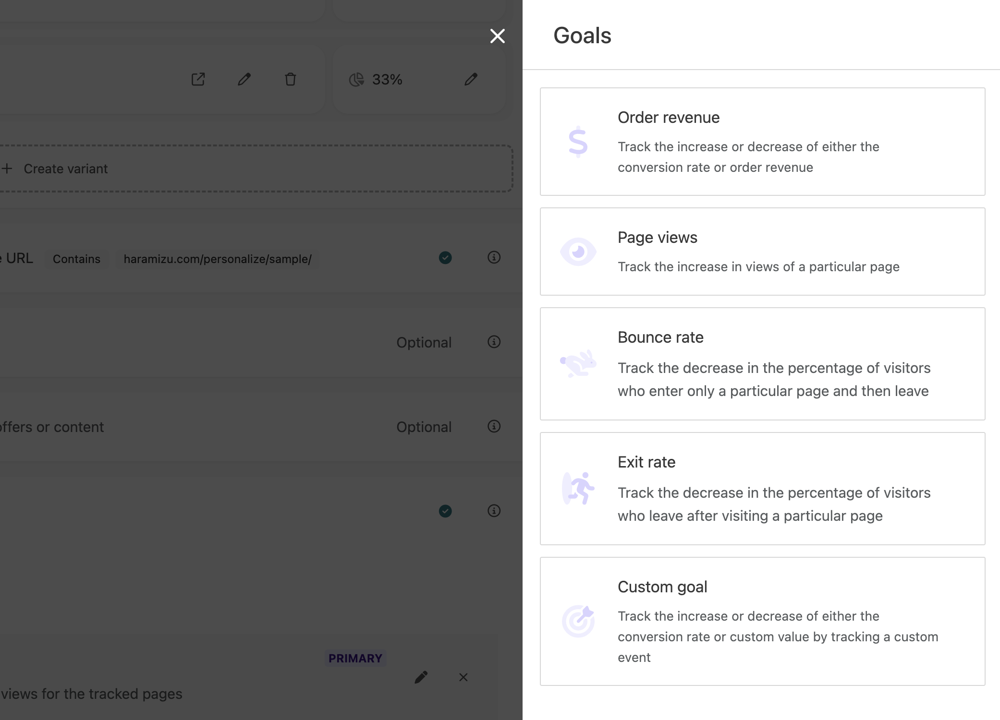
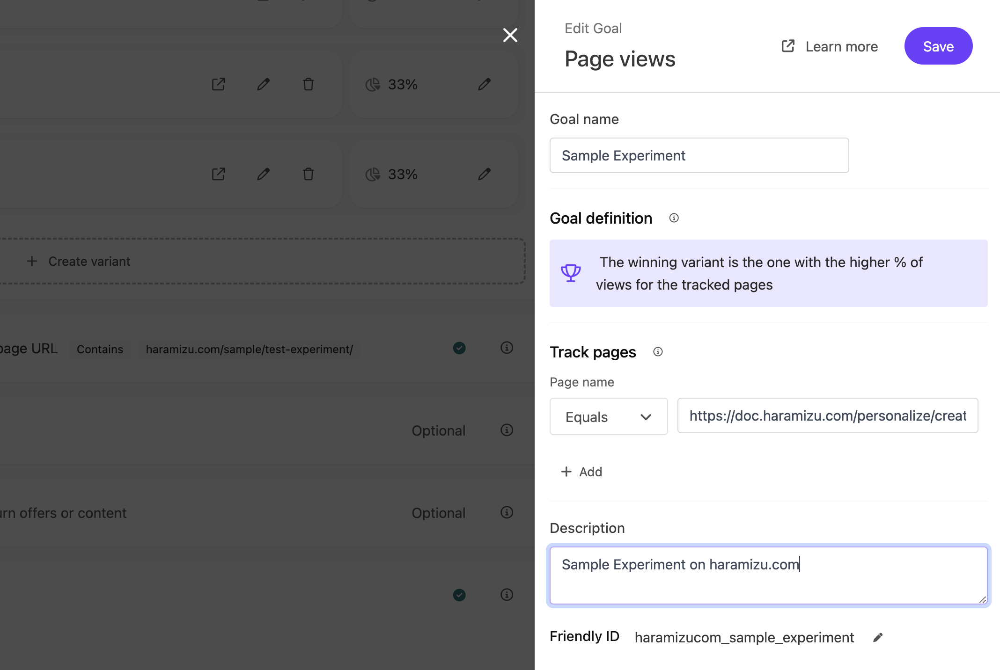

This page demonstrates a sample experiment created with Sitecore Personalize. For instructions on how to create it, please refer back to the following page:

- [Creating Experiments](/en/personalize/create-experiments/)

## Experience A/B Testing

To view different patterns, please perform one of the following actions:

- Access in the browser's private mode
- Use a different browser
- Delete the relevant cookies and access again

These actions are listed in order of ease. Please experience the switching of displays.

This page offers three display variants, including the original:

- **Original**: This page is displayed normally
- **Sidebar - Right side**: A sidebar opens from the right
- **Corner popup - Right bottom**: A popup opens at the bottom right

All variants guide you to the [Creating Experiments](/en/personalize/create-experiments/) page.

## Setting Goals

This sample includes the following goal settings:

The goal settings are as follows:

## Report

After publication, the actual operation information will be introduced here (update coming soon).

- [Back to Sample List](/en/personalize/sample/)

