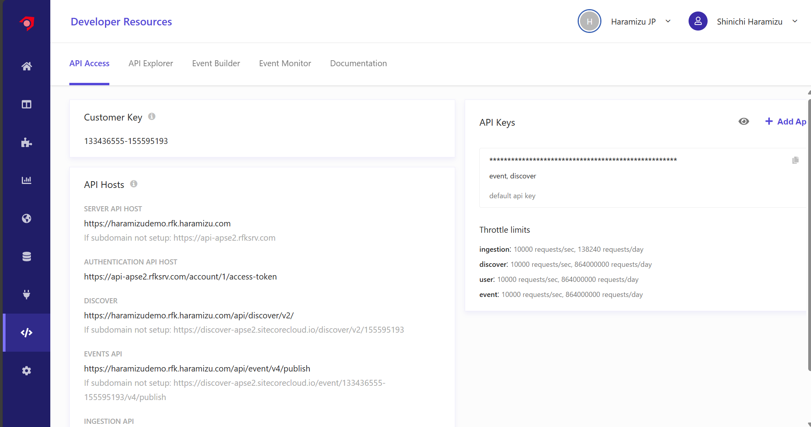
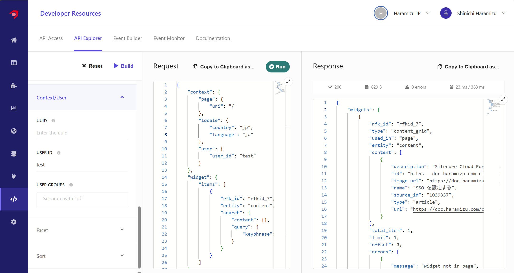
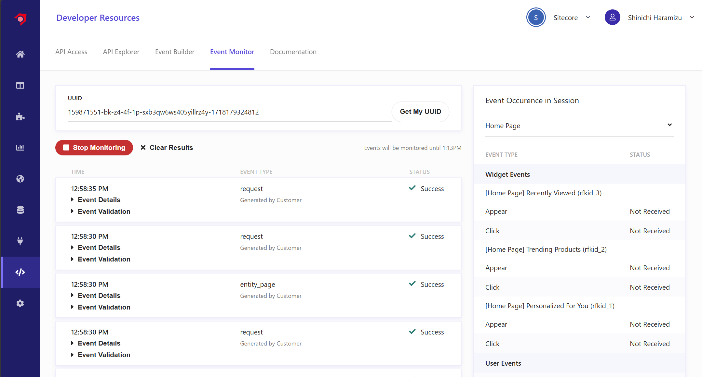
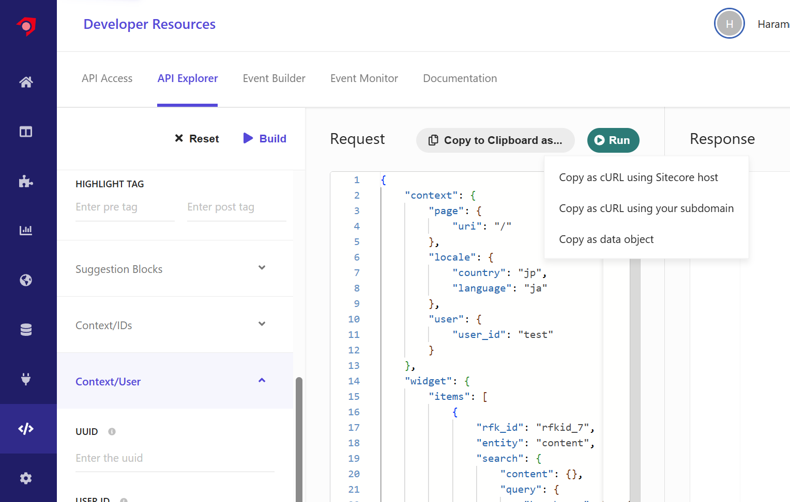
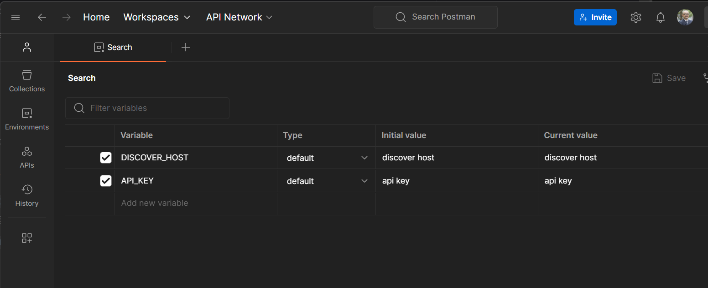
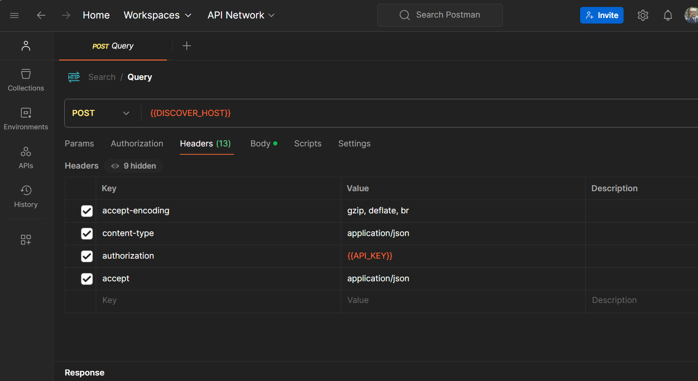
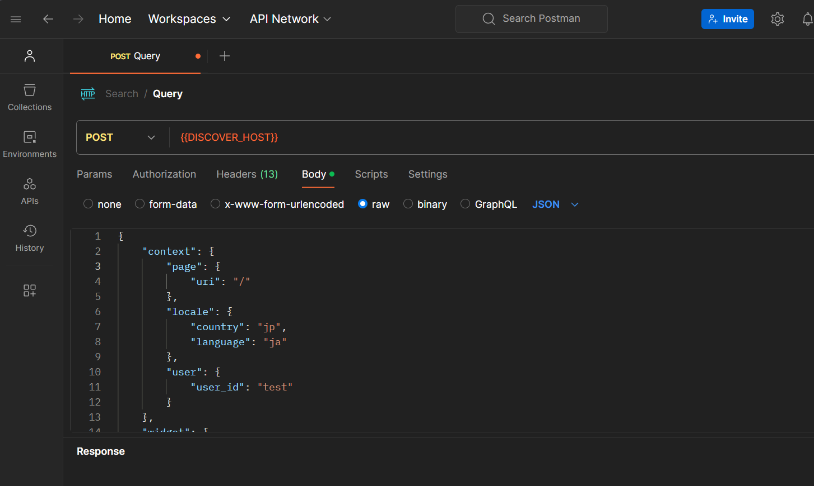
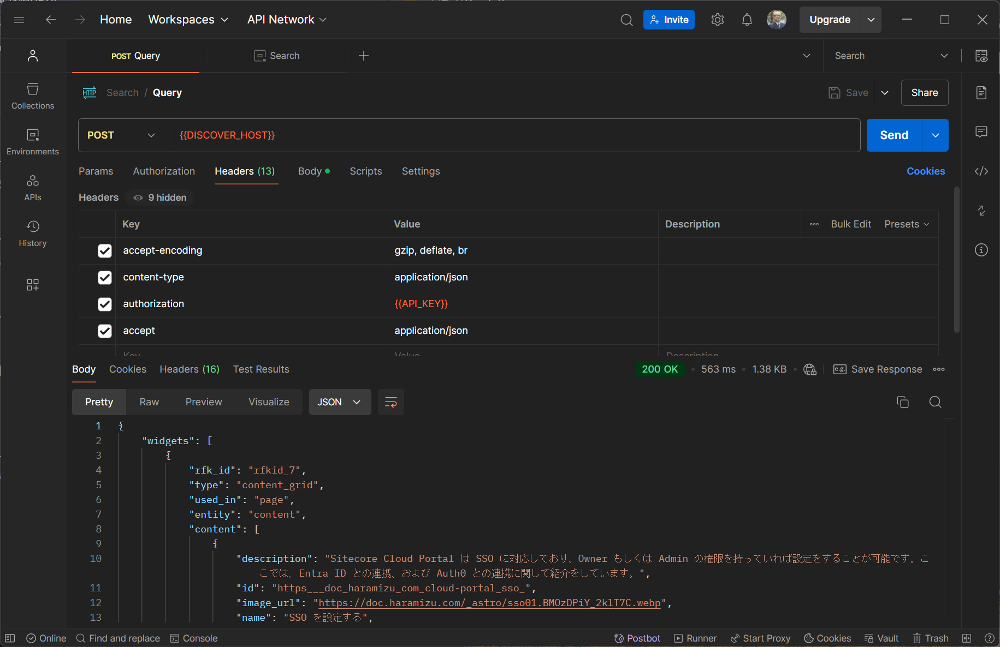

{/* https://blog.haramizu.com/ja-JP/blog/2023/08/14/search-developer-resource */}
{/* https://blog.haramizu.com/ja-JP/blog/2023/11/01/get-search-results-using-postman */}

We have introduced the basic crawling mechanism of Sitecore Search. In this document, we will introduce developer resources that are useful when setting up an on-site search using the data obtained.

## Developer Resource

When you open the Developer Resource in the Sitecore Search management screen, it switches to the following management screen. Using the information displayed here, you can build a search service that integrates with your site.



Here, we will switch tabs to check.

### API Access

In this screen (above), the data necessary for using the API is displayed.

- **Customer Key**: The key used by the search service
- **API Hosts**: URLs of API hosts for different purposes are listed here
- **API Key**: Manages the API key used when using the service

The usage of the above will be introduced in another document.

### API Explorer

By preparing the parameters for using the API on the screen, the data necessary for the request is generated, and you can check the results.

For this operation check, first set the items on the far right as follows:

- **Page**: Search Results Page
- **URI**: /
- **Entity**: Content
- **Locale**: ja-JP
- **Keywords**: SSO
- **User ID**: test

Click the Build button to generate the following query.

```json
{
  "context": {
    "page": {
      "uri": "/"
    },
    "locale": {
      "country": "jp",
      "language": "ja"
    },
    "user": {
      "user_id": "test"
    }
  },
  "widget": {
    "items": [
      {
        "rfk_id": "rfkid_7",
        "entity": "content",
        "search": {
          "content": {},
          "query": {
            "keyphrase": "SSO"
          }
        }
      }
    ]
  }
}
```

Click the Run button to get the result.

```json
{
  "widgets": [
    {
      "rfk_id": "rfkid_7",
      "type": "content_grid",
      "used_in": "page",
      "entity": "content",
      "content": [
        {
          "description": "Sitecore Cloud Portal supports SSO, and if you have Owner or Admin privileges, you can configure it. Here, we introduce the integration with Entra ID and Auth0.",
          "id": "https___doc_haramizu_com_cloud-portal_sso_",
          "image_url": "https://doc.haramizu.com/_astro/sso01.BMOzDPiY_2klT7C.webp",
          "name": "Configure SSO",
          "source_id": "1039337",
          "type": "article",
          "url": "https://doc.haramizu.com/cloud-portal/sso/"
        }
      ],
      "total_item": 1,
      "limit": 1,
      "offset": 0,
      "errors": [
        {
          "message": "widget not in page",
          "type": "widget_not_in_page",
          "severity": "low"
        }
      ]
    }
  ],
  "dt": 23,
  "ts": 1732765336741
}
```

The screen will display as follows.



### Event Builder

Various interactions occur due to user actions, such as clicking widgets or logging in. By using this Event Builder, you can test these events on the management screen.

### Event Monitor

The Event Monitor is a tool that helps verify that website events are being sent to Sitecore Search in the correct format. Event monitoring can be used in any environment connected to the search account.

The name of the cookie used by Sitecore Search is `__ruid`. When monitoring with UUID on an actual search site, events are recorded as follows.



When checking the details of the event, you can see the following data (some data has been replaced with dummy data).

```json
{
  "action": "get",
  "ce": [
    {
      "entity": "content",
      "rfkid": "rfkid_7",
      "type": "content_grid",
      "wid": "730944",
      "wver": 56,
      "wvid": "730945",
      "wvver": 49
    },
    {
      "type": "global",
      "wid": "730893",
      "wver": 73,
      "wvid": "730894",
      "wvver": 54
    }
  ],
  "ckey": "159871551",
  "client_time_ms": 1732766311801,
  "name": "request",
  "request_id": "1461d5b9-cd58-4f8d-830b-7988781c3309",
  "server_time_ms": 1732766311803,
  "uid": "uid",
  "uuid": "uuid",
  "value": {
    "context": {
      "browser": {},
      "campaign": {},
      "geo": {
        "ip": "127.0.0.1"
      },
      "page": {
        "locale_country": "us",
        "locale_language": "en"
      }
    },
    "features": [
      {
        "entity_type": "content",
        "feature_type": "search",
        "request": {
          "keyword": "xm cloud",
          "num_requested": 20
        },
        "response": {
          "items": [
            {
              "id": "https___www_sitecore_com_products_xm-cloud",
              "source_id": "1029552"
            },
            {
              "id": "https___www_sitecore_com_resources_events-webinars_2023_06_xm-cloud-hands-on",
              "source_id": "1029552"
            },
            {
              "id": "https___developers_sitecore_com_products_xm-cloud",
              "source_id": "774111"
            },
            {
              "id": "https___www_sitecore_com_partners_solution-catalog_americaneaglemigrationaccelerator",
              "source_id": "1029552"
            }
          ],
          "num_results": 20,
          "page_size": 20,
          "tqr": 138
        },
        "rfk_id": "rfkid_7",
        "widget_type": "content_grid"
      }
    ]
  }
}
```

You can see that information such as search keywords and history is taken as events. Note that Sitecore Search tracks users based on cookies, but it does not track them in conjunction with personal information.

## Using Postman

In addition to the above Developer Resource, you can also use Postman to communicate with the API and do the same. Using the sample run in the API Explorer introduced here, we will prepare an environment that can be accessed from Postman.

### Get the Query

Access the API Explorer, set the search conditions, and click `Copy to Clipboard as...` to get the code to access the built Query.



The options are as follows:

- Copy as cURL using Sitecore host
- Copy as cURL using your subdomain
- Copy as data object

For example, if you specify cURL using the Sitecore host, you can get the following command.

```bash
curl 'https://discover-apse2.sitecorecloud.io/discover/v2/key' -H 'accept-encoding: gzip, deflate, br' -H 'content-type: application/json' -H 'authorization: accesskey' -H 'accept: application/json' --data-binary $'{"context":{"page":{"uri":"/"},"locale":{"country":"jp","language":"ja"},"user":{"user_id":"test"}},"widget":{"items":[{"rfk_id":"rfkid_7","entity":"content","search":{"content":{},"query":{"keyphrase":"SSO"}}}]}}' --compressed
```

If you specify Copy as data object, you simply get the query part.

```json
{
  "context": {
    "page": { "uri": "/" },
    "locale": { "country": "jp", "language": "ja" },
    "user": { "user_id": "test" }
  },
  "widget": {
    "items": [
      {
        "rfk_id": "rfkid_7",
        "entity": "content",
        "search": { "content": {}, "query": { "keyphrase": "SSO" } }
      }
    ]
  }
}
```

If you use the values used in curl as they are in Postman, you can make inquiries and get answers.

### Create an Environment

Actually access Postman, create a Workspace, and proceed with the work. First, create an environment. Checking the various values used in curl, it looks like this:

- The Discover URL is used as the API Host
- The headers are as follows:
  - **accept-encoding**: gzip, deflate, br
  - **content-type**: application/json
  - **authorization**: your API Key
  - **accept**: application/json
- Send the Json data of Copy as data object in the body

With this information, you can easily use Postman. First, add two items to the Environment.

- **DISCOVER_HOST**: Set the Discover URL provided in the API Hosts of the Developer Resource
- **API_KEY**: Set the API Key



Next, create a new request. Use an HTTP request to create a POST request as follows.



Finally, set the Json data obtained with `Copy as data object` in the Body of this Request. This completes the preparation.



When executed, the same result can be confirmed in Postman.



## Summary

This time, we briefly checked how to display search results in the Developer Resource of the management screen. We also confirmed that you can make inquiries and get results using Postman in the same way.

## References

- [The API Access tab](https://doc.sitecore.com/search/en/developers/search-developer-guide/the-api-access-tab.html)
- [The API Explorer tab](https://doc.sitecore.com/search/en/developers/search-developer-guide/the-api-explorer-tab.html)
- [Using the Event Monitor](https://doc.sitecore.com/search/en/developers/search-developer-guide/using-the-event-monitor.html)

