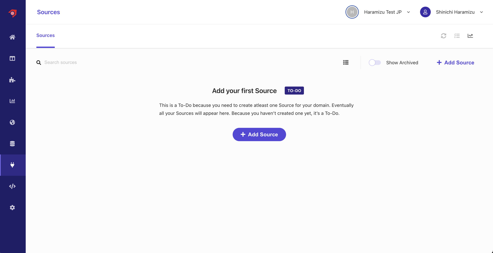
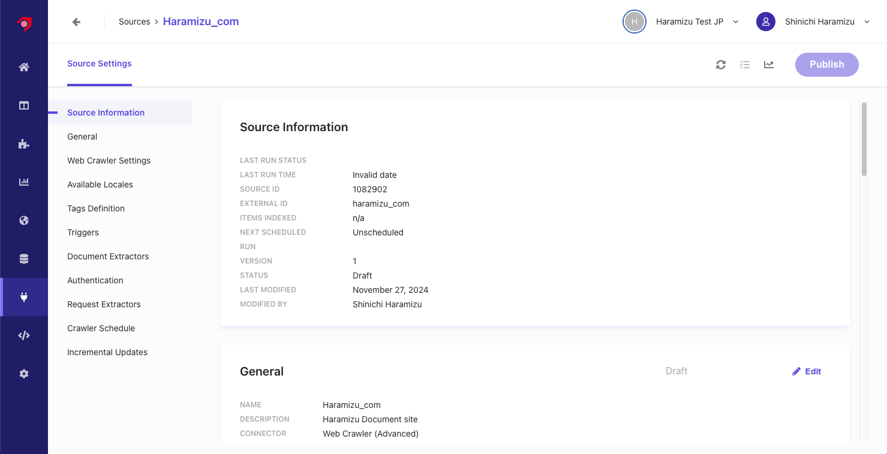
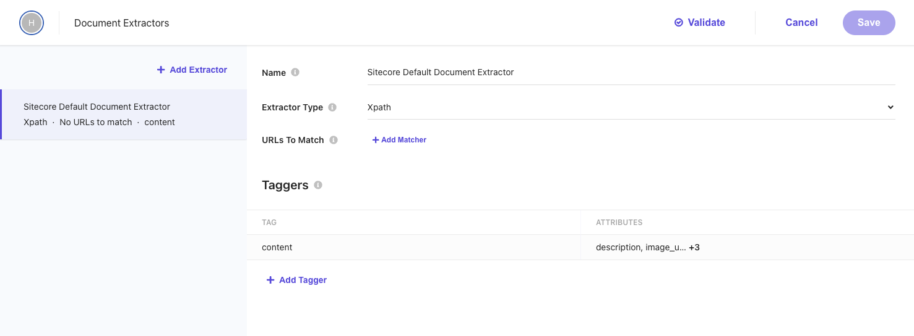
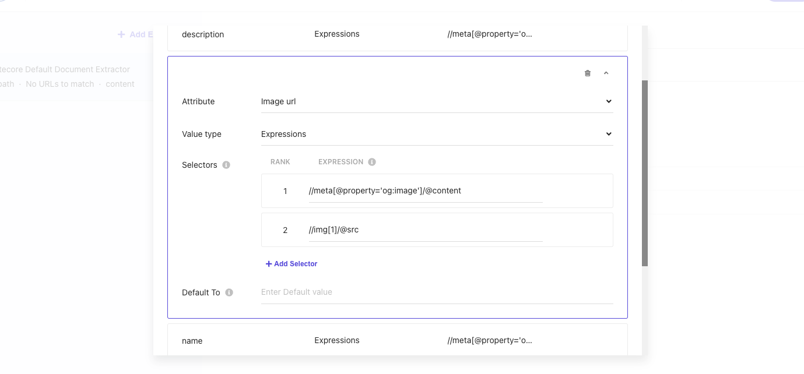
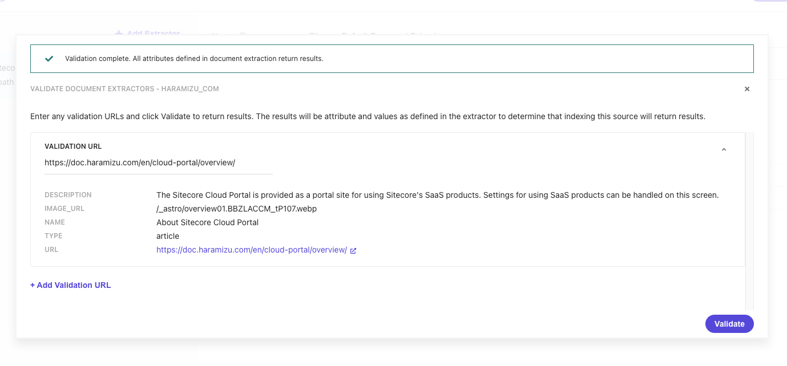
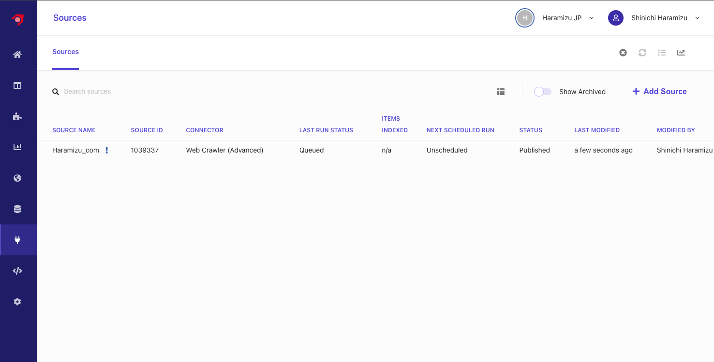
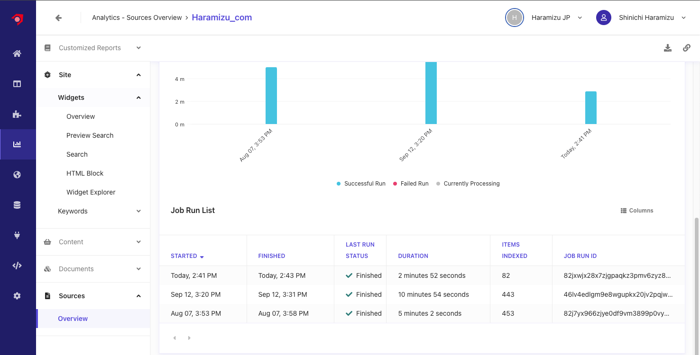
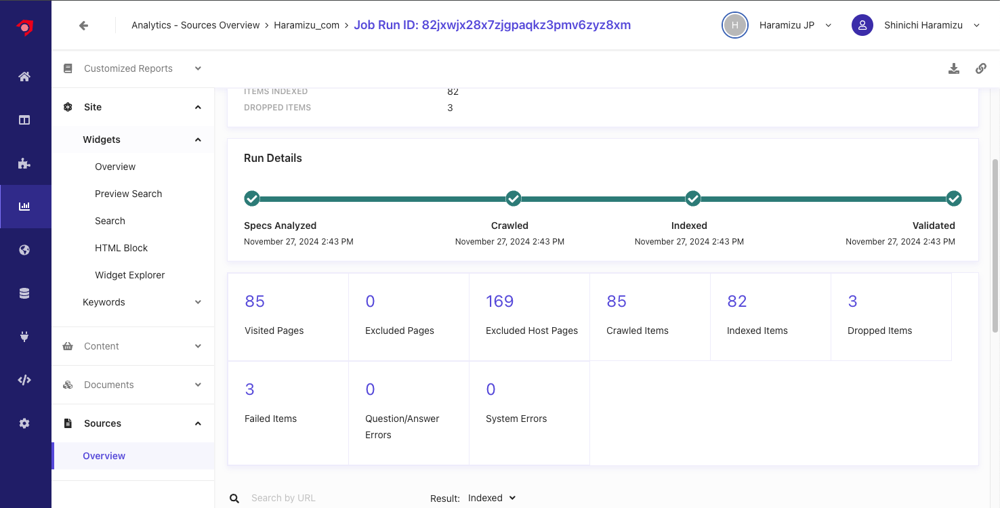
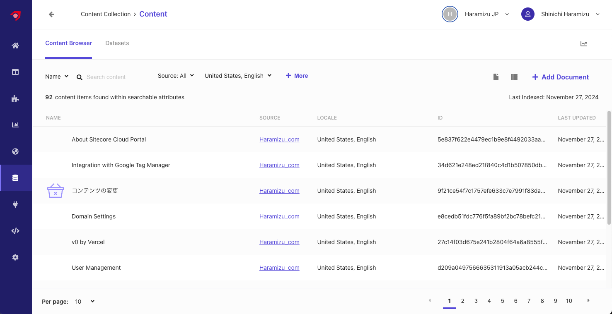

import { Steps } from '@astrojs/starlight/components';

Document Extractor refers to tools or processes that extract specific information or data from documents or files. This technology is used to efficiently obtain information, saving the effort of manual data extraction.

## Three Types of Extractors

Sitecore Search offers three types of extraction tools for crawler settings: Document Extractor, Locale Extractor, and Request Extractor.

### Document Extractor

Document Extractor creates indexed documents from the content URLs or documents of a website. Its main roles are as follows:

1. Text Extraction
   Reads text data from documents and outputs it in a structured format (e.g., JSON or CSV).
2. Keyword Extraction
   Extracts specified keywords or important phrases from documents.
3. Structured Data Extraction
   Extracts itemized data (e.g., amount, date, name) from documents with specific formats such as receipts or invoices.
4. Multilingual Support
   Supports multiple languages, including Japanese, for accurate extraction.

Document Extractor settings include four patterns: XPath, JavaScript, JSONPath, and PDF content.

This document uses XPath to operate the Document Extractor.

### Locale Extractor

You can index localized content using some Sitecore Search sources. To index localized content, extract the locale of content items such as English-US (en-US) or Japanese (ja-JP) and generate a common ID for localized versions of the same content.

Locale Extractor is introduced in a separate document.

### Request Extractor

Creates an additional URL list for the crawler to crawl. Use Request Extractor if the crawler has not reached all the content that needs to be indexed from the initial trigger.

## Haramizu.com

This time, we will use the content of this site to obtain data with the crawler. The data to be crawled is managed as a Source. Click the third icon from the bottom on the left side of the management screen. Initially, no sources are included as shown below.

### Creating a Source

Here, we will create a new Source to obtain data.

<Steps>

1. Click the `+ Add Source` button to add a new source.

2. Enter `Source name` and `Description`, and specify `Web Crawler (Advanced)` for the Connector.

   

   After completing the settings, click the `Save` button.

3. The settings screen for the new Source will be displayed.

   

4. In the `Web Crawler Settings` section, configure the following settings:

   - **Allowed domains**: Specify the target domains
   - **Max depth**: Specify the depth for crawling links
   - **Max URLs**: Specify the maximum number of URLs to crawl and index
   - **Exclusion Patterns**: Specify URLs to exclude
   - **Headers**: Specify headers for the crawler.

   

5. Add `Triggers`. You can specify JS, RSS, Request, Sitemap, or Sitemap Index. Here, we specified Sitemap Index.

   

</Steps>

With the above settings, the configuration other than Document Extractor is complete.

### Creating a Document Extractor

To crawl the content of a website, the important setting to analyze and index the obtained data is the Document Extractor. By default, an Extractor using XPath is set.

You can specify multiple Extractors for a source. The settings items on the screen above have the following roles:

- **Name**: Specify a name for the Extractor
- **Extractor Type**: Choose `CSS`, `XPath`, or `JS` as the Extractor. We will proceed with `XPath`.
- **URLs to Match**: Specify the URLs for which the Extractor will be effective. You can specify rules as `Regular Expression`, `Glob Expression`, or `JS`. We will not specify any this time.

Taggers are used to analyze the content and configure how to index it.

The sample is as follows:

| Attribute   | Rule type   | Rule Value                                    |
| ----------- | ----------- | --------------------------------------------- |
| description | Expressions | `//meta[@property='og:description']/@content` |
| image_url   | Expressions | `//meta[@property='og:image']/@content`       |
| name        | Expressions | `//meta[@property='og:title']/@content`       |
| type        | Expressions | `//meta[@property='og:type']/@content`        |
| type        | Expressions | `//meta[@property='og:url']/@content`         |

To check if the values can be obtained when the site is crawled with this setting, click the `Validate` button at the top of the screen. Specify the URL `https://doc.haramizu.com/about/overview/`, and the execution result will be displayed as follows.

Since this site does not set og:image at the time of introducing this article, it is displayed as blank. Therefore, to specify the first image displayed on the page for `image_url`, add `//img[1]/@src` as Rank 2.

Click the Validate button again and specify the URL `https://doc.haramizu.com/en/cloud-portal/overview/` which has an image. As a result, the path of the first image on the page was obtained.

The basic settings of Document Extractor are complete.

### Executing the Crawl

With the above settings complete, click the Publish button to execute the crawl.

<Steps>

1. A dialog will be displayed. Check the `Trigger Source Scan After Publishing The Source` checkbox to activate the crawler.

   

2. When you refer to the source list page, you can confirm that it is Queued.

   

3. After a while, the status will change to Running, and the content will be crawled and indexed.

4. When it becomes Finish, the crawl is complete.

   

</Steps>

After crawling, it is found that some pages lack required items and result in errors.

### Checking the Error Details

To check the crawler errors, open the `Analytics` screen in the management screen, and open `Source` - `Overview`. The source list will be displayed. Specify `Haramizu_com` to refer to the crawl result report.

Referring to the latest crawl report, it is found that three items have errors.

Details can be checked in the Result section by selecting Dropped.

It is found that the errors include images and RSS URLs.

For the image, it is found that the string described as an explanation in the page was judged as a URL and failed to crawl. We will slightly change the page description.

For RSS, we will exclude URLs ending with **.xml**. This setting is added to `Exclusion Patterns` in `Web Crawler Settings` with the regular expression `.*\.xml$`.

Reflect the settings and execute Publish again to re-crawl. This time, no errors are displayed.

## Checking the Content

You can check the crawled content from Content Collection. Below is the screen confirming the content list obtained by the currently used Sitecore Search.

Clicking on specific content allows you to check the data saved for the Attribute.

## Summary

To obtain data for search, we used Web Crawler (Advanced) to obtain site content, and managed it as content using XPath for Document Extractor. We also confirmed how to handle errors when they occur, ensuring the crawler works correctly.

## References

- [Configure document extractors](https://doc.sitecore.com/search/en/users/search-user-guide/configure-document-extractors.html)
- [Use locale extractors for localized content](https://doc.sitecore.com/search/en/users/search-user-guide/use-locale-extractors-for-localized-content.html)
- [Request extractors](https://doc.sitecore.com/search/en/users/search-user-guide/request-extractors.html)

