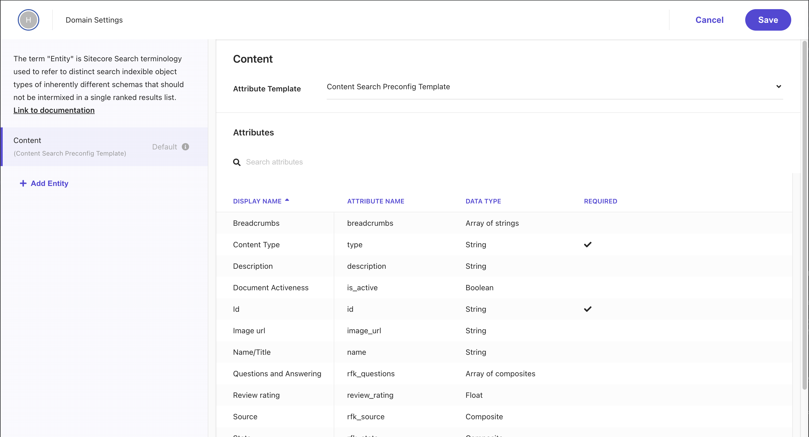

We will review the basic domain settings using the newly created Sitecore Search Sandbox. This document provides an overview, with individual settings provided separately.

## Domain Settings

When you first open the domain settings screen, the settings screen is displayed along with the following tabs.

- General Settings
- Attributes
- Feature Configuration
- Subdomain Setup

Here, we will introduce the roles of each.

## General Settings

This screen is for basic settings for the domain used in Sitecore Search. Clicking on the items displayed on the left will scroll the right area to the top.

### Domain Information

This item is for basic settings related to the domain. If you need to make changes to this area, you must do so from a different domain list, so changes cannot be made on this screen.

### Entities

This screen is for configuring the data structure handled by Sitecore Search. By default, `Content` is set. For more details on Entities, see [Data Types and Entities](/en/search/entity/).

### Locale

You can change the language settings for the search targets on this site. By default, `en-US` is provided as one language, but when using multiple languages, add the locale and check the `Enable Locale Settings` item.

### Website Connect to This Domain

This item allows you to configure which site to connect with. You can also change whether the environment you are using operates as Non-Production or Production on this screen.

### Matching Entities in URL

Using regular expressions, if there is context (product name, SKU, etc.) included in the URL, you can identify the information in the URL. This item is not introduced in this document, but it is a useful feature when using QueryString, etc.

### Activate domain & Other Settings

This is used when setting the domain to active. The screen below shows that `Activate domain` is already enabled.

### Optional Items

The following items are not mandatory but are provided as options. The details of each are omitted here.

- Analytics Exclusion List
- Hosted Pages Settings
- Experimental Features

## Attributes

Here you can check the list of Attributes available for the domain. By default, the list of Attributes set for `Content` is displayed. For the items displayed here, refer to [Data Types and Entities](/en/search/entity/).

## Feature Configuration

In this item, you can configure which features to link with the Attributes included in the Entities created in Domain Settings.

- **API Response**: Return data as a response when accessed from the API
- **Facets**: Use as facets in search results
- **Filters**: Use for narrowing down results
- **Personalization**: Specify the Attribute to use as personalized content items similar to the selected attribute value
- **Sorting Options**: Configure sorting options for search results
- **Suggestions Blocks**: Manage settings to display recommended content
- **Textural Relevance**: Configure which parts of the content items need to search for matching terms and assign relative importance to different content areas

## Subdomain Setup

Since Sitecore Search is a SaaS-based search engine, you need to access the API to get results when performing a search. By using the subdomain feature of Sitecore Search, you can configure it to work with JavaScript on the same domain rather than communicating with different domains.

### Run Setup

When setting up the subdomain, there are two options available.

- **Subdomain Strategy**: CNAME or Delegation
- **Certificate Creation**: Sitecore or Customer Created

This time, we will specify the subdomain with CNAME and select Sitecore Created for the certificate, then execute `Run Setup`.

After a while, the settings on the Sitecore Search side will be completed, and the information to be set in the DNS of the relevant domain will be shared.

### Run Completion

Actually set the specified CNAME items to the DNS and execute Complete Setup. The screen below shows the completed setup, and it is now operating as the Sitecore Search API on your own domain.

## Summary

This time, we introduced the items related to Domain Settings, which are the basic settings of Sitecore Search. Domain Settings include items that have a wide impact, such as adding languages, adding attributes to the content to be searched, and configuring features such as facets. When building, you may need to add settings again. If you are unsure about the items, please refer to this document again.

## References

- [Localize implementation](https://doc.sitecore.com/search/en/users/search-user-guide/localize-implementation.html)
- [CNAME records and subdomain delegation](https://doc.sitecore.com/search/en/users/search-user-guide/cname-records-and-subdomain-delegation.html)

