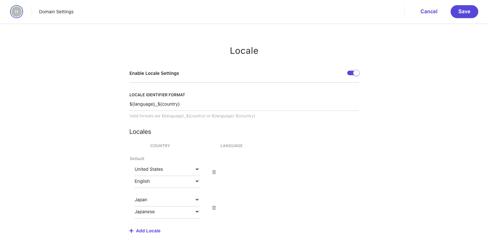
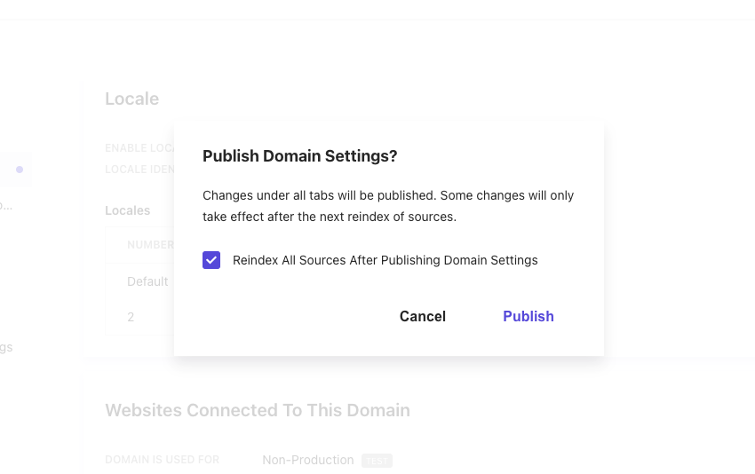
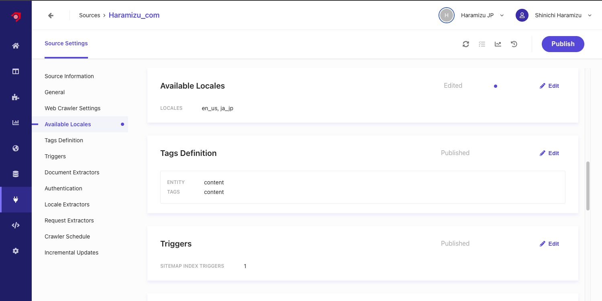
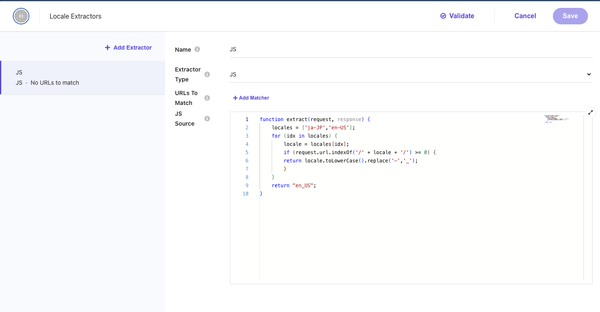
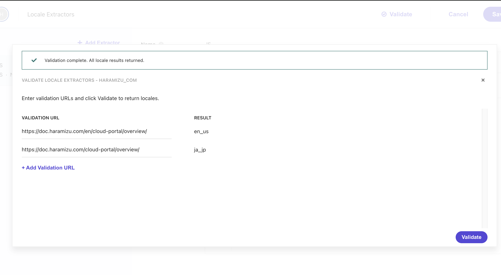
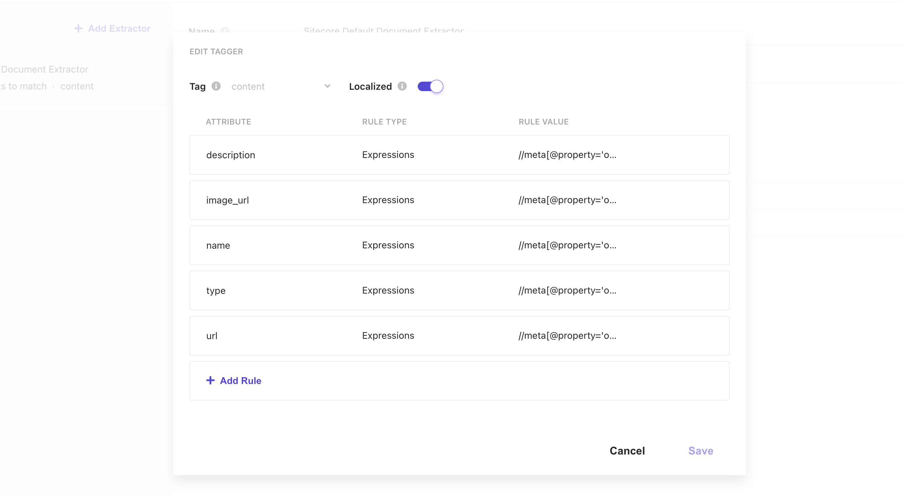
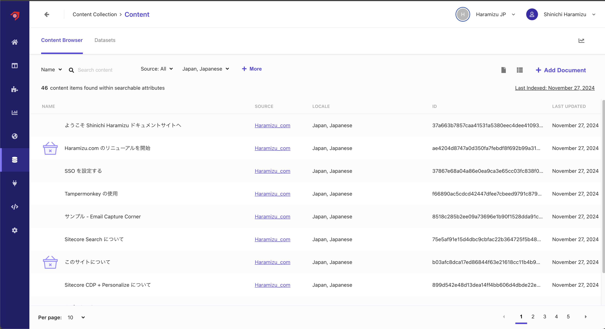
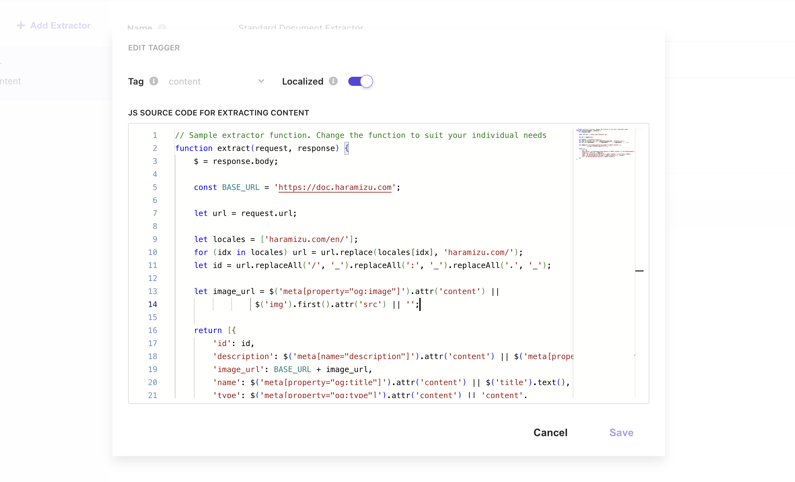
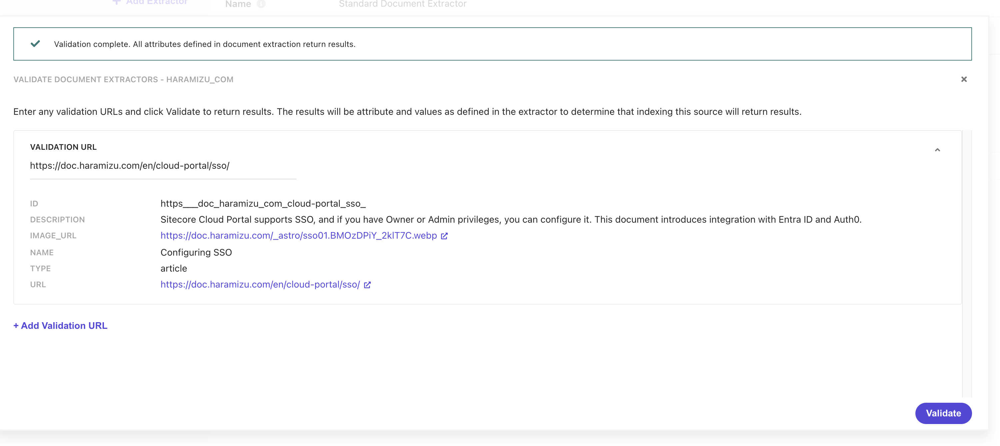
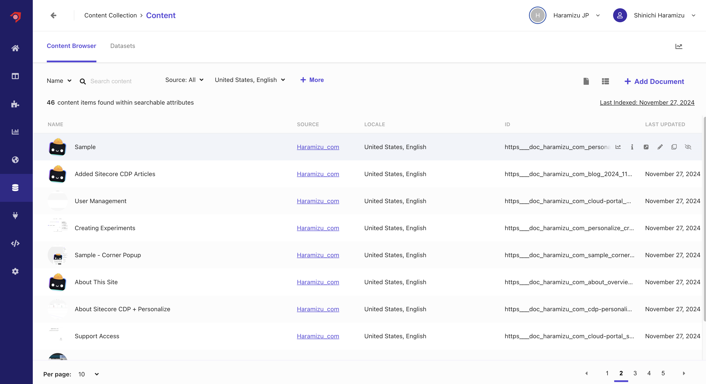

In the previous document, we implemented crawling using Document Extractor with XPath. This document explains the procedure to retrieve content managed in multiple languages using Locale Extractor.

## Adding Locale

Sitecore Search uses only the en-us language by default, so we will first add a language to the domain settings. To add Japanese, add `Japan - Japanese` and enable `Enable Locale Settings`.



After adding the locale, click the `Publish` button to enable the domain settings. A dialog will appear as shown below.



## Updating Source

We will modify the source already set up in [Using Document Extractor](/search/document-extractor/). The modification policy is as follows:

- If the URL contains /en/, it is considered English content; otherwise, it is Japanese content.
- Create an ID using the URL to crawl the same content in both English and Japanese.

For example, `https://doc.haramizu.com/cloud-portal/overview/` and `https://doc.haramizu.com/en/cloud-portal/overview/` provide the same content with the language difference reflected in the URL. We will proceed to treat this as the same content.

### Adding Locale

Add `ja_jp` to `Available Locales`. Adding a locale will add Locale Extractors as a setting item.



### Setting Locale Extractor

Opening the newly added Locale Extractor includes the following settings.



Check the JavaScript code set.

```js
function extract(request, response) {
  locales = ['ja-JP', 'en-US'];
  for (idx in locales) {
    locale = locales[idx];
    if (request.url.indexOf('/' + locale + '/') >= 0) {
      return locale.toLowerCase().replace('-', '_');
    }
  }
  return 'en_US';
}
```

This code is set as follows:

1. Set an array of supported locales.
2. Check if the URL contains `/ja-JP/` or `/en-US/`, convert the locale to lowercase, and replace the hyphen with an underscore if it does.
3. Return `en_US` if neither is found.

Using JavaScript, you can create rules to set the locale. In this case, we created the following JavaScript to set `en_us` if `/en/` is found immediately after the domain name; otherwise, set `ja_jp`.

```js
function extract(request, response) {
  if (request.url.indexOf('haramizu.com/en/') >= 0) {
    return 'en_us';
  }

  return 'ja_jp';
}
```

After rewriting the code above, click the Validate button to verify the Japanese and English URLs. The results are as follows.



Finally, the Document Extractor's Tagger settings include a Localized setting. Check this item to link this Document Extractor with the Locale Extractor.



After completing the above three settings, click the Publish button to crawl and reindex.

### Checking Content

As with the previous Document Extractor, access the Content to check the retrieved content. When accessed, the list of English content is displayed first, confirming that the English content is correctly retrieved.


Switching the language to Japanese shows that the Japanese content is indexed.



Without using Locale Extractor, all content was in English, showing 92 contents in Content. Now, 46 contents are displayed for each language.

The locale was correctly set for each language's content and indexed.

## Updating Document Extractor

When viewing the content list, the same content with different languages has different IDs. For example:

| URL                                             | ID                                                       |
| ----------------------------------------------- | -------------------------------------------------------- |
| `https://doc.haramizu.com/cloud-portal/sso/`    | 37867e68a04a86e0ea9ca3e65cc03fc838f041123e73fb3e4b39accb |
| `https://doc.haramizu.com/en/cloud-portal/sso/` | ccb87f58fbf9fe4d39e70ea13fb0ac6210d79f96bf7fabab932d3668 |

We will improve this situation where the IDs are different. Accordingly, we will change the Document Extractor to work with JavaScript instead of XPath.

### Changing to JavaScript

First, changing the XPath settings to JavaScript displays the following default Extractor code.

```text
// Sample extractor function. Change the function to suit your individual needs
function extract(request, response) {
    $ = response.body;

    return [{
        'description': $('meta[name="description"]').attr('content') || $('meta[property="og:description"]').attr('content') || $('p').text(),
        'name': $('meta[name="searchtitle"]').attr('content') || $('title').text(),
        'type': $('meta[property="og:type"]').attr('content') || 'website_content',
        'url': $('meta[property="og:url"]').attr('content')
    }];
}
```

We added the following processing to this code:

- Retrieve the URL, remove the locale, and create an ID for the content.
- Add the actual hosting URL to the image_url.

The final code is as follows.

```text
// Sample extractor function. Change the function to suit your individual needs
function extract(request, response) {
    $ = response.body;

    const BASE_URL = 'https://doc.haramizu.com';

    let url = request.url;

    let locales = ['haramizu.com/en/'];
    for (idx in locales) url = url.replace(locales[idx], 'haramizu.com/');
    let id = url.replaceAll('/', '_').replaceAll(':', '_').replaceAll('.', '_');

    let image_url = $('meta[property="og:image"]').attr('content') ||
                 $('img').first().attr('src') || '/_astro/houston.CZZyCf7p_ZmSIFK.webp';

    return [{
        'id': id,
        'description': $('meta[name="description"]').attr('content') || $('meta[property="og:description"]').attr('content') || $('p').text(),
        'image_url': BASE_URL + image_url,
        'name': $('meta[property="og:title"]').attr('content') || $('title').text(),
        'type': $('meta[property="og:type"]').attr('content') || 'content',
        'url': $('meta[property="og:url"]').attr('content')
    }];
}
```



After setting the above, use `Validate` to confirm it works correctly on several pages.



### Checking Content

After the above changes, perform Reindex, etc. After a while, the data will be reflected, and the ID will be based on the URL. Also, with the current JavaScript settings, the domain name is added to the image, so the image of the target page is displayed in the content list.



This completes the base part of displaying the results in the respective language when switching the language in the search results.
