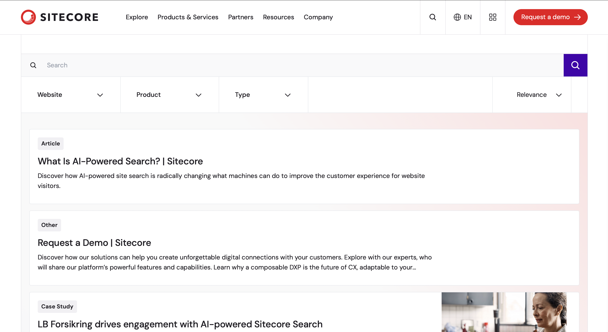
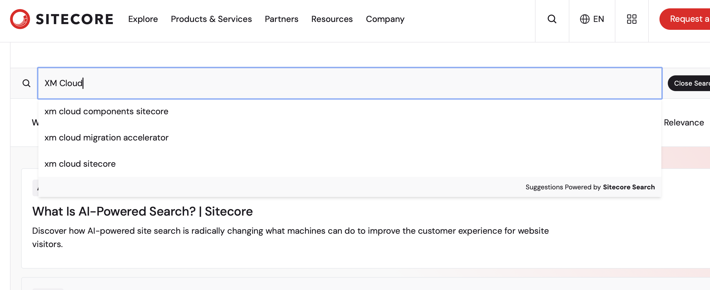

import { LinkCard } from '@astrojs/starlight/components';

Sitecore Search is a search service provided by Sitecore, which allows you to implement on-site search for websites as a SaaS service. This time, we will introduce the product based on the already implemented Sitecore site and the Sitecore developer site.

## What is Sitecore Search?

This product is a more user-friendly and functionally improved version of the e-commerce search service provided by Reflektion, a company acquired by Sitecore in September 2021. The main features included in the product are as follows:

- Management screen
- Crawler
- API Crawler
- Developer tools
- Widget management
- Personalization settings
- Analytics

Each feature will be introduced in a separate document.

## Sample Sites

Now, let's introduce some sites while using them.

### Sitecore.com

Since it has already been implemented in-house, let's first look at its operation on the site.

<LinkCard
  title="Sitecore.com Search"
  href="https://www.sitecore.com/search?page=0"
  target="_blank"
/>

Elements on this page include a search box and items that become facets (Website, Product, and Type) displayed below it. By using these facets, you can perform filtered searches.

When you enter the keyword `XM Cloud` in this search box, recommended keywords are displayed as shown below.

As you can see, when you enter a search keyword, recommended keywords are also displayed. This assists the search process and allows you to deploy a user-friendly on-site search service.

### Sitecore Developer

As a website for Sitecore developers, we have launched a site called https://developers.sitecore.com/. When you access the site and click on the search icon at the top right, a search box is displayed, and recommended content is displayed at that time.

When you enter a keyword, a preview of the content along with the recommended keywords is displayed.

When you hover the mouse cursor over the suggested keywords, a preview of the recommended content for that keyword is displayed.

By providing a preview for this search box, it is possible to quickly approach the content you want to access, implementing this procedure for on-site search.

## Widgets for Sitecore Search

Referring to the two sites above, you can see that elements necessary for a search site, such as a search box and facets, are incorporated. Sitecore Search provides widgets to implement these features on your website.

<LinkCard
  title="Sitecore Search JS SDK and UI Components"
  href="https://developers.sitecorecloud.io/search-sdk/react/latest/storybook/index.html?path=/story/introduction-introduction--page"
  target="_blank"
/>

On the above site, select `Widget Templates` - `Content` - `Preview Search` - `Basic` to check the demo of the widgets provided.

## Summary

This time, we introduced two patterns, Sitecore.com and the developer site, regarding Sitecore Search. We also provide widgets to build these sites, allowing you to implement on-site search with fewer steps.

## Reference Information

<LinkCard title="Sitecore Search" href="https://www.sitecore.com/products/search" target="_blank" />

