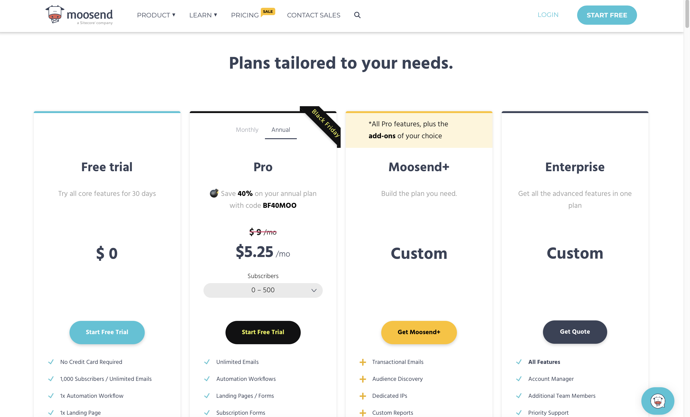
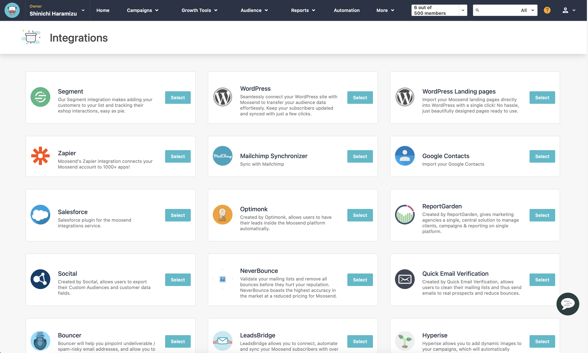
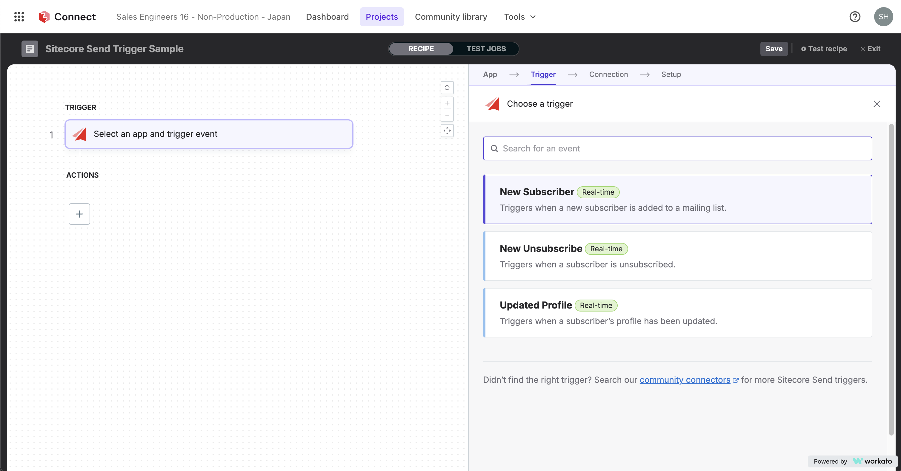
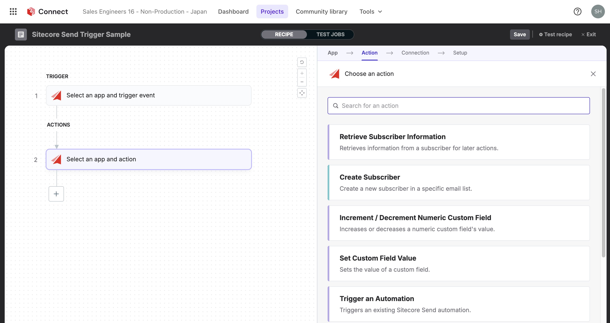

import { LinkCard } from '@astrojs/starlight/components';

Sitecore offers two email marketing tools: Moosend, which is easy to use for small to medium-sized businesses, and Sitecore Send, designed for enterprise use. This document introduces the differences and main features of these two tools.

## Introduce Moosend and Sitecore Send

Moosend / Sitecore Send is an email delivery service that provides marketing automation features. Below are the main features and characteristics of both services.

### Target Customers

Both services are positioned as simple email marketing solutions. They come with templates that can be used immediately after implementation, and the WYSIWYG editor is very convenient for editing as needed. Additionally, there are various integrations with existing tools for actual operation.

These services are ideal for customers in the following industries:

- **Commerce Integration**: Online store operators
- **Marketing Tool**: Integration with potential customers and marketing
- **Agencies**: Marketing agencies
- **Travel Industry**: Travel agencies and tour operators
- **Publishers**: Online and offline publishers
- **SaaS Providers**: Companies providing software as a service

In addition to regular email delivery, they also support transactional emails.

### Main Features

- **Easy-to-use Email Creation Tool**: Intuitive interface that allows anyone to create emails easily.
- **Scheduled Sending**: Allows you to specify the time for email delivery.
- **Design Templates**: Provides numerous templates for email creation, with the option to add new templates.
- **Landing Pages**: Easily create landing pages.
- **Subscription Form Function**: Create subscription forms to embed on your site.
- **Mailing List Management**: Manage the lists to which emails are sent.
- **Opt-in/Opt-out**: Supports email opt-in and opt-out.
- **Segmentation**: Segment registered users based on their attributes.
- **Detailed Reporting**: Provides detailed reports on email open rates, click rates, and open locations.
- **Email Heatmap**: Visually check which parts of the email were clicked.
- **A/B Testing**: Test different versions of emails to choose the best one.
- **Image Editing Tool**: Allows cropping and resizing of images.
- **Countdown Timer**: Add a countdown timer to emails.
- **Subscriber-based Pricing**: Adopts a pricing model based on the number of subscribers, not the number of emails sent.
- **API Integration**: Provides APIs for easy integration with other systems.
- **Multilingual Support**: The management interface supports seven languages, including English and Japanese.

### Differences Between the Two Services

Moosend is offered as Moosend Pro for regular services. The table below shows the main differences between the free version (Free), the regular service (Moosend), the add-on supported Moosend+ and the enterprise-oriented Sitecore Send.

| Main Features        | Free | Moosend | Moosend + | Sitecore Send |
| -------------------- | ---- | ------- | --------- | ------------- |
| Campaigns            | ✔️   | ✔️      | ✔️        | ✔️            |
| Marketing Automation | ✔️   | ✔️      | ✔️        | ✔️            |
| Transactional Emails | ✖️   | ✖️      | Add-on    | ✔️            |
| SMTP Server          | ✖️   | ✔️      | ✔️        | ✔️            |
| WYSIWYG Editor       | ✔️   | ✔️      | ✔️        | ✔️            |
| Templates            | ✔️   | ✔️      | ✔️        | ✔️            |
| Automation           | ✔️   | ✔️      | ✔️        | ✔️            |
| File Hosting         | ✖️   | ✖️      | Add-on    | ✔️            |
| Email Support        | ✔️   | ✔️      | ✔️        | ✔️            |
| Chat Support         | ✔️   | ✔️      | ✔️        | ✔️            |
| API Access           | ✔️   | ✔️      | ✔️        | ✔️            |
| SSO + SAML           | ✖️   | ✖️      | Add-on    | ✔️            |
| SLA                  | ✖️   | ✖️      | ✖️        | ✔️            |
| Dedicated IP         | ✖️   | ✖️      | Add-on    | Optional      |
| Account Manager      | ✖️   | ✖️      | Add-on    | ✔️            |

The free version can be used for 30 days. Moosend and Moosend+ are offered as subscriptions, while Sitecore Send is available only as an annual subscription.

For more detailed differences, please refer to the [Pricing](https://moosend.com/pricing/) page.

### Pricing

Moosend pricing can be checked online, and payment can be made by credit card. No credit card is required for free version registration, so you can sign up easily.

The pricing model is based on the number of subscribers, with no limit on the number of emails sent. The minimum usage is up to 500 registered addresses, and Moosend can be used for up to 1 million registrations. For more subscribers, Sitecore Send is recommended.

To get a quote for Sitecore Send, please contact a Sitecore representative through the [Demo Request](https://www.sitecore.com/ja-jp/request-a-demo) page.

For actual pricing, please refer to the [Pricing](https://moosend.com/pricing/) page.

## Main Integration Tools

The integration tools differ slightly between Moosend and Sitecore Send.

### Moosend Integration Tools

After subscribing to the service, numerous integration solutions are provided. The screen below shows the list of integration solutions displayed after subscribing.

The main features include the following integrations:

- **WordPress**: Easily transfer subscriber data by integrating Moosend with your WordPress site. Keeping subscriber information up-to-date and synchronized is completed with just a few clicks.
- **Mailchimp Synchronizer**: Synchronize Mailchimp user information with Moosend. This is a convenient tool for Mailchimp users migrating to Moosend.
- **Google Contacts**: Import user information managed in Google Contacts.
- **Salesforce CRM**: Integrate information registered in Salesforce CRM with Moosend using the Web API.

### Sitecore Send Integration Tools

When using Sitecore Send, it is assumed that Sitecore Connect will be used to integrate with more services. Sitecore Connect, based on Workato, allows for no-code and low-code system integration, in addition to integration with other Sitecore products.

When integrated with Sitecore Send, the following triggers are available:

- **New Subscriber**: Triggered when added to the mailing list.
- **New Unsubscriber**: Triggered when unsubscribed.
- **Update Profile**: Triggered when the profile is updated.

Additionally, the following actions are available:

- **Retrieve Subscriber Information**: Retrieve subscriber information for use in subsequent actions.
- **Create Subscriber**: Create a new subscriber in a specific mailing list.
- **Increment / Decrement Numeric Custom Field**: Increment or decrement the value of a numeric custom field.
- **Set Custom Field Value**: Set the value of a custom field.
- **Trigger an Automation**: Trigger an existing Sitecore Send automation.
- **Unsubscribe Subscriber**: Unsubscribe a subscriber from all or specific target mailing lists.

### API Integration

All the above integrations for Moosend and Sitecore Send can be executed using APIs, and the documentation is available at the following sites:

<LinkCard
  title="Moosend API reference"
  href="https://docs.moosend.com/developers/api-documentation/en/index-en.html"
  target="_blank"
/>
<LinkCard
  title="Sitecore Send API reference"
  href="https://doc.sitecore.com/send/en/developers/api-documentation/api-reference.html"
  target="_blank"
/>

## References

<LinkCard
  title="Moosend API reference"
  href="https://docs.moosend.com/developers/api-documentation/en/index-en.html"
  target="_blank"
/>
<LinkCard
  title="Moosend API reference"
  href="https://docs.moosend.com/developers/api-documentation/en/index-en.html"
  target="_blank"
/>
<LinkCard
  title="Sitecore Send API reference"
  href="https://doc.sitecore.com/send/en/developers/api-documentation/api-reference.html"
  target="_blank"
/>
