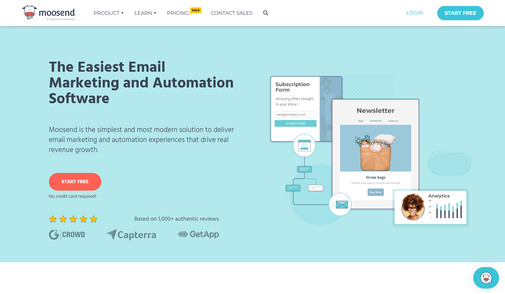
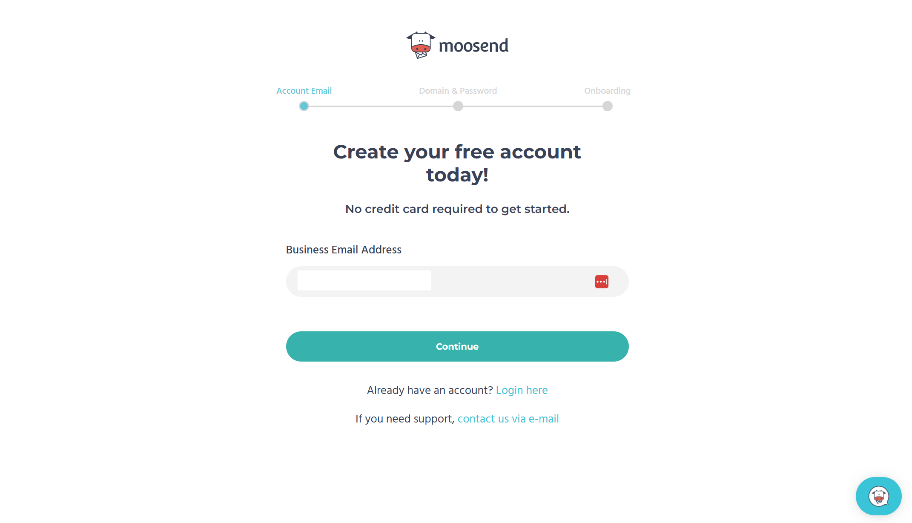
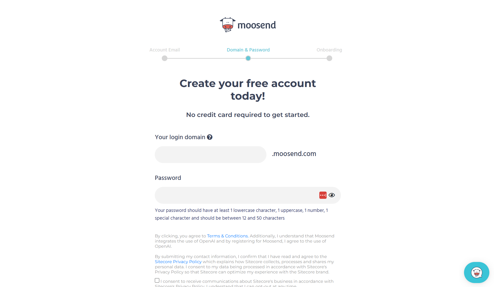
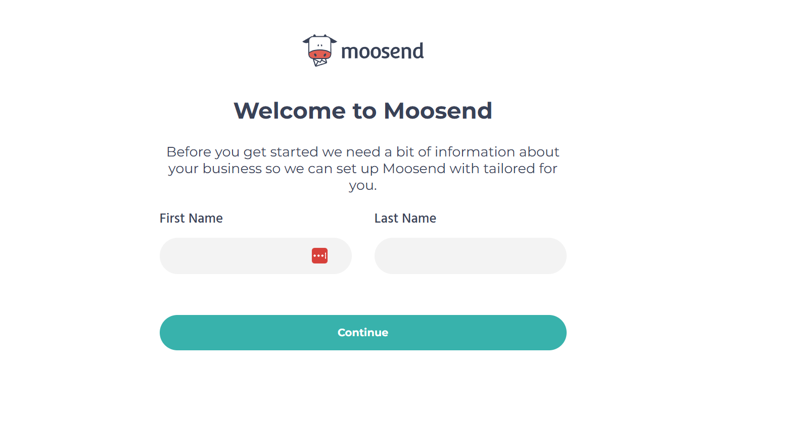
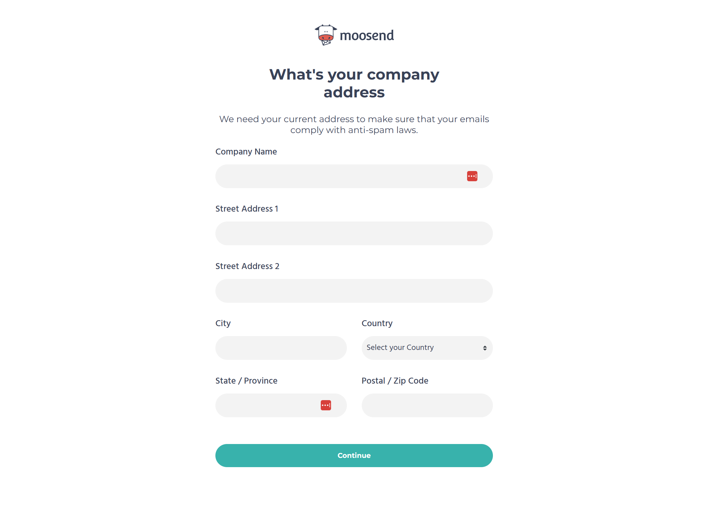
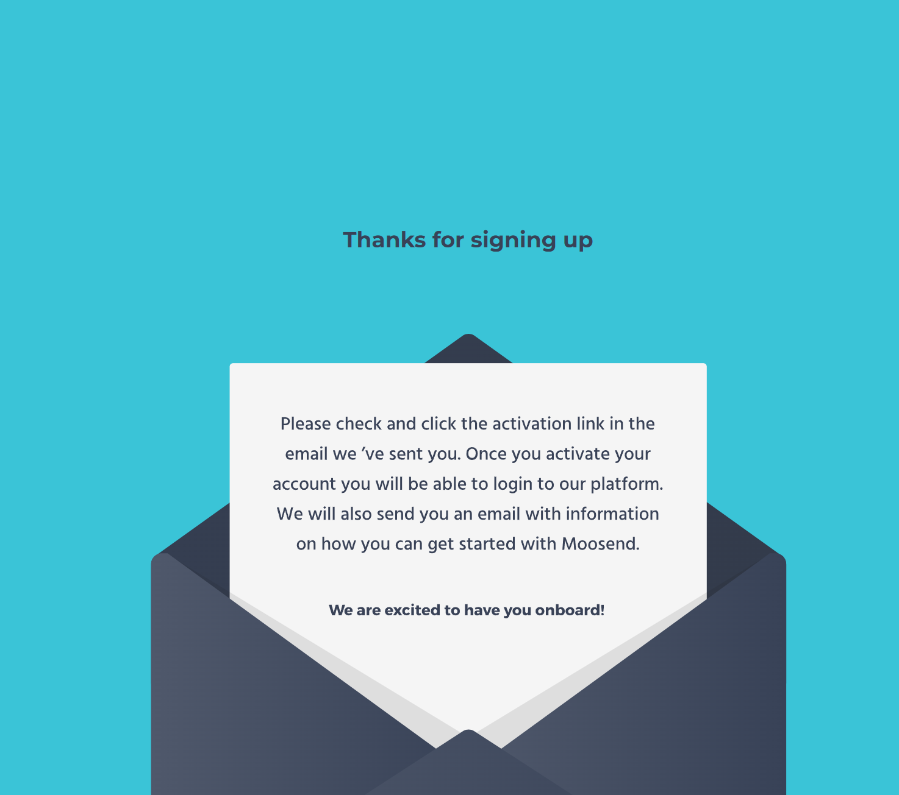
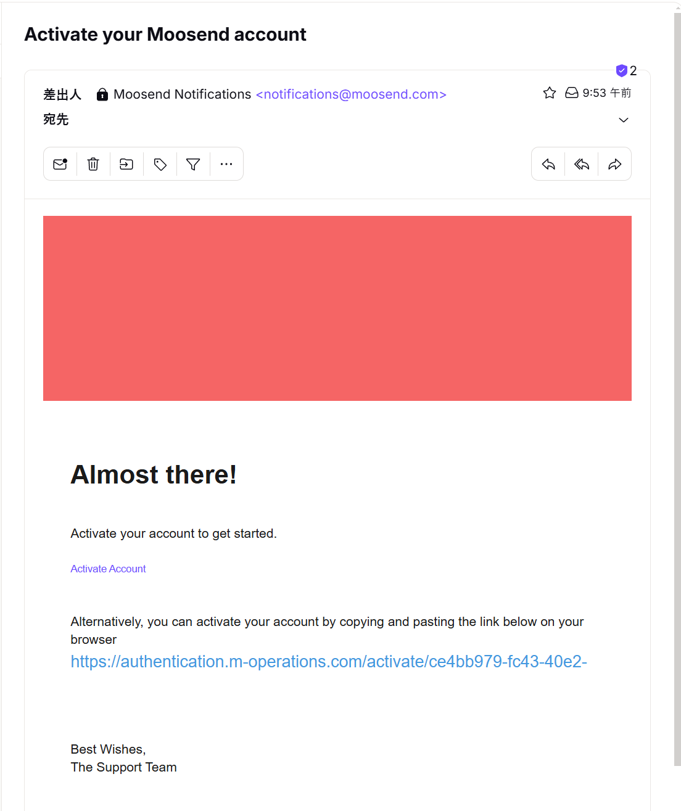
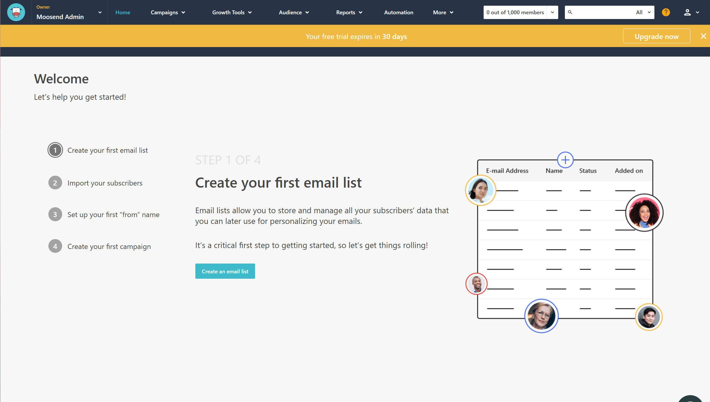
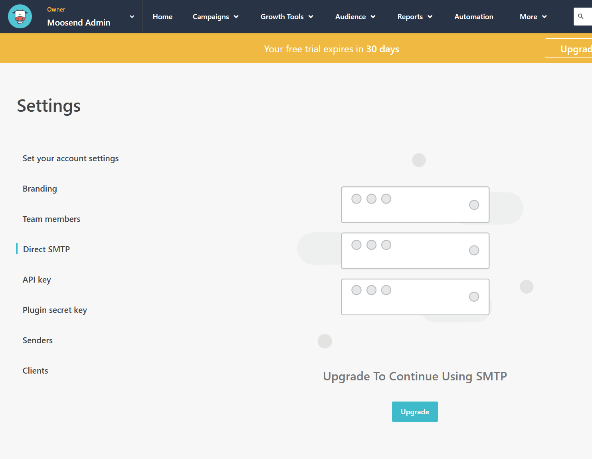

Sitecore Send is based on Moosend and is structured to enhance services for enterprises. Moosend is a service aimed at small and medium-sized businesses, and it can be used for free for a limited period of 30 days as a trial. Therefore, this free period is also useful when evaluating Sitecore Send.

Moosend is also very useful for companies that purely want to start email marketing on a small scale. Especially when starting email marketing, suddenly sending 10,000 emails can appear as SPAM-like behavior, making the service unusable. It is important to gradually build up usage, even when using it on a large scale, to accumulate a track record. This is an important step when using a new service correctly, so starting small can help avoid issues during full-scale implementation.

This time, we will introduce the steps to apply for the 30-day limited trial. Note that to use the 30-day limited service, you do not need to register a credit card, but a valid email address is required.

## Sign up

First, access the Moosend site, and you will see the following page.

- [Moosend Home](https://moosend.com)

### Basic Settings

There is a Start Free button at the top right of the screen. Click this button.

Enter the email address you will use to apply. A confirmation email will be sent to this email address.

Next, a screen will appear to enter the login domain and password.

The login domain is the domain you will set when using the service. After starting the service, you can change this domain to your own domain name. Specifying your company's domain name makes it convenient to use the service. This time, specify a subdomain for the moosend.com domain.

Next, set the name of the user who will use the service. This is just the name displayed on the management screen, so enter it normally.

### Confirm Usage

Next, the purpose of using the service will be displayed. Of course, you will enter the company name and address. It is also possible to use it personally, so in that case, you can write Personal in the company name field.

Next, it will display what kind of industry, what kind of organization, and the scale of usage.

This completes the input, and a confirmation email will be sent to the email address you entered first.

### User Confirmation

The confirmation email arrives relatively quickly. When you check your mailbox, you will see a confirmation email, and clicking the URL will complete the confirmation.

Clicking the confirmation email completes the initial login, and the management screen shows that there are 30 days left in the trial period.

During the 30-day evaluation period, Direct SMTP cannot be used. This service can be used by switching to a paid service.

Now you are ready to evaluate Moosend.

