import { Steps, LinkCard } from '@astrojs/starlight/components';

When providing member-specific information on an actual website, it is sometimes necessary to combine a login authentication mechanism to operate the site. Here, we introduce how to use Auth0.

## What is Auth0?

Auth0 is a cloud-based service designed to simplify the authentication and authorization process. It allows developers to quickly integrate authentication features such as Single Sign-On (SSO), Multi-Factor Authentication (MFA), and social login into their applications. Using Auth0 can enhance security and improve user experience.

The main features of Auth0 are as follows:

- **Single Sign-On (SSO)**: Allows users to access multiple applications with a single login.
- **Multi-Factor Authentication (MFA)**: Provides an additional layer of security to prevent unauthorized access.
- **Social Login**: Allows users to log in using their social media accounts such as Google, Facebook, and Twitter.
- **Customizable Authentication Flow**: Allows customization of the authentication flow to meet the needs of the application.
- **Scalability**: Supports projects ranging from small-scale to large enterprise applications.

By using Auth0, developers can reduce the time and effort required to implement authentication features and focus on the core functionality of their applications.

### About the Free Plan

Auth0 offers a free plan. This free plan was expanded on September 24, 2024.

<LinkCard
  title="Auth0's free plan expanded. Up to 25,000 monthly active users, custom domains, and passwordless support with passkeys"
  href="https://www.publickey1.jp/blog/24/auth025000.html"
  target="_blank"
/>

<LinkCard
  title="Auth0 Takes “Free for Developers” to a New Level with More Users, More Security, Free MFA & Passwordless"
  href="https://www.okta.com/press-room/press-releases/auth0-takes-free-for-developers-to-a-new-level-with-more-users-more/"
  target="_blank"
/>

The scope of the free plan is as follows. It is sufficient for testing and demo purposes.

| Feature            | Free      |
| ------------------ | --------- |
| MAUs               | 25,000    |
| Social Connections | Unlimited |
| Okta Connections   | Unlimited |
| Organizations      | 5         |
| Actions + Forms    | 3         |
| Passwordless       | OK        |
| Custom Domain      | OK        |

This time, we will apply for this free plan and create an account for use in demos.

### Applying

To create an account, you can apply for the free plan on the pricing page of the Auth0 site by clicking the `Start building for free` button.

<LinkCard title="Pricing" href="https://auth0.com/pricing" target="_blank" />

Clicking the above button will switch to the Sign-up screen.

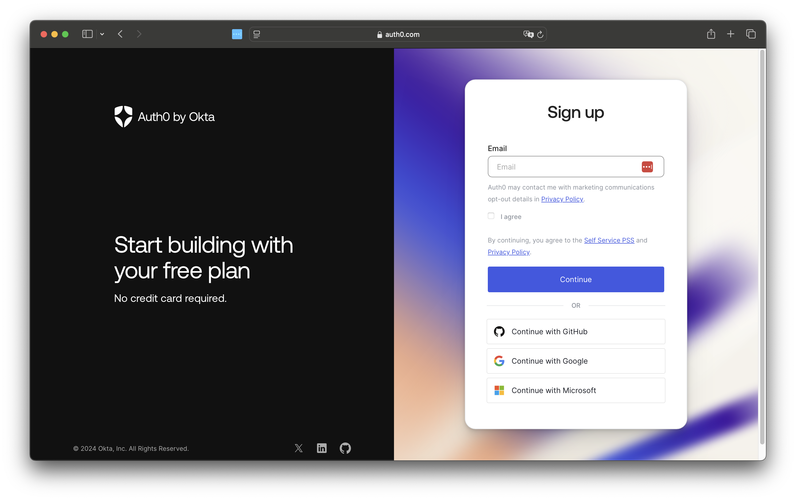

After entering your email address, the password setting screen will be displayed.

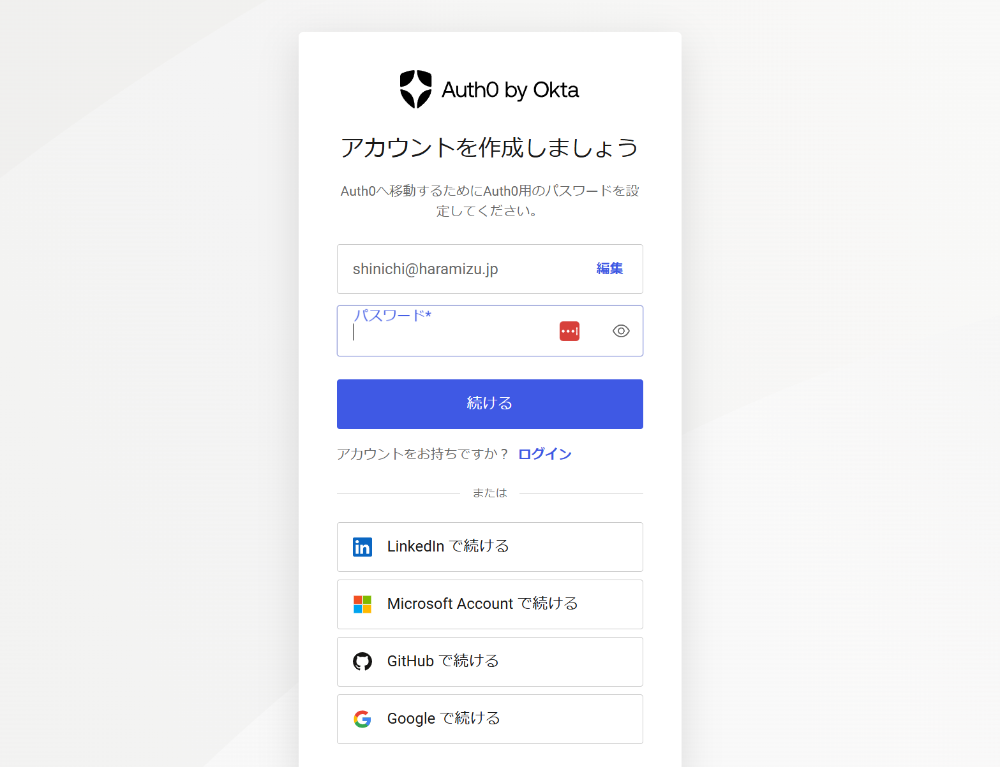

After setting the password, you will be asked to confirm the type of use.

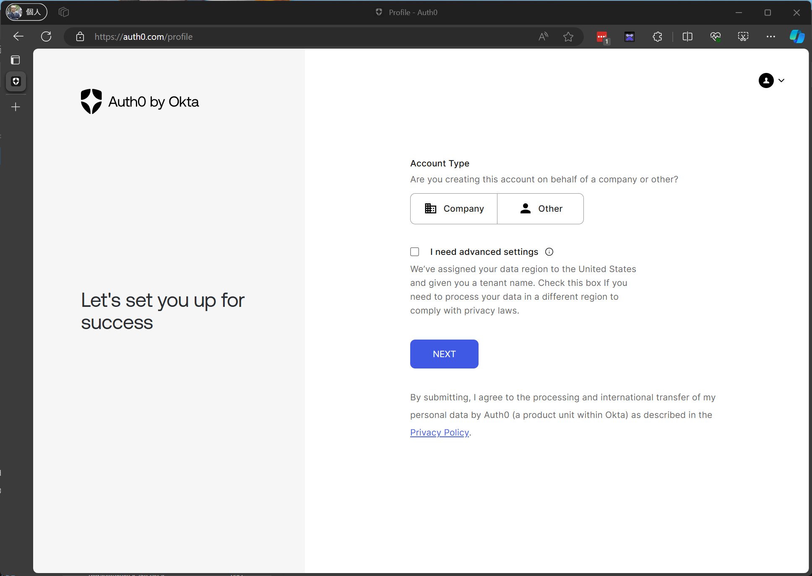

The confirmation items for the settings will be displayed.

> I need advanced settings
>
> We’ve assigned your data region to the United States and given you a tenant name. Check this box If you need to process your data in a different region to comply with privacy laws.

If you want to use it outside the United States, you need to check and change it. This time, we will proceed without making any changes.

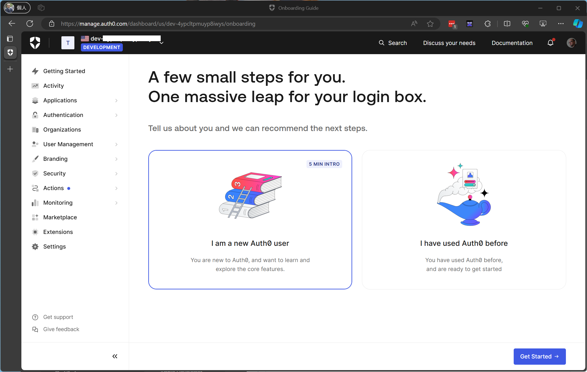

Successfully, an account has been created from the website, and you can log in.

An email with a URL for email address verification has been sent to the login email address. Completing this will complete the account creation.


## Creating an Application

To use Auth0 authentication on a website, you first need to create an application on the Auth0 side. After logging in, proceed with the following screen.

<Steps>

1. Select `Getting Started` in the upper left corner and click the `Create Application` button.

   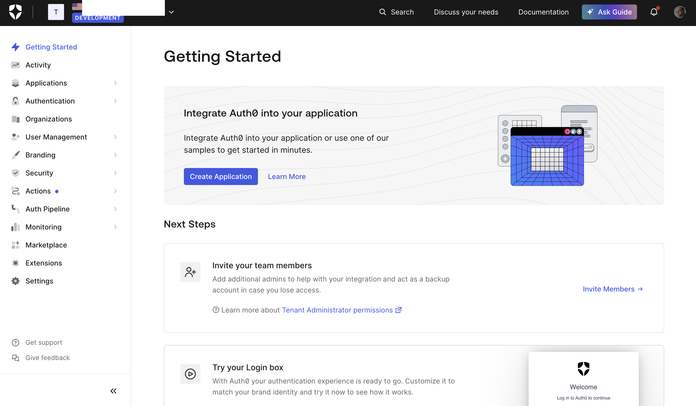

2. Name the application `Sitecore Demo` and select `Regular Web Application` as the application type.

   

3. The integration with which technology will be displayed. The Next.js displayed here is just a tutorial for the App Router, so click `Skip Integration`.

   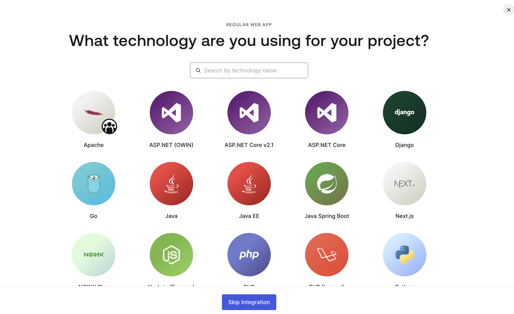

4. Open `Settings`, and the application settings will be displayed as follows.

   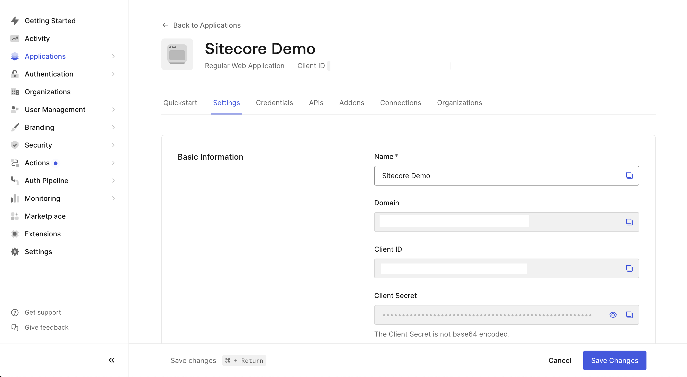

5. Scroll down the `Settings` to find the Application URIs settings. Set the following two values.

   - **Allowed Callback URLs**: `http://localhost:3000/api/auth/callback`
   - **Allowed Logout URLs**: `http://localhost:3000`

   

6. Click `Save Changes` to complete the application creation.

</Steps>

This prepares the environment variables for use with Next.js. The actual sample is as follows.

```text
AUTH0_SECRET=KEY-VALUE
AUTH0_BASE_URL=http://localhost:3000
AUTH0_ISSUER_BASE_URL=Basic Information - domain
AUTH0_CLIENT_ID=Basic Information - Client ID
AUTH0_CLIENT_SECRET=Basic Information - Client Secret
```

Note that the AUTH0_SECRET is not obtained from the management screen but can be generated by running the following command.

```bash
node -e "console.log(crypto.randomBytes(32).toString('hex'))"
```

## Next.js App Router

This time, we will use Next.js as the framework to use Auth0. Next.js allows you to choose between Pages Router and App Router implementations, but we will start with the App Router implementation. If you want to refer to the Pages Router implementation, skip this part.

<LinkCard
  title="Next.js Authentication By Example: Using App Router"
  href="https://developer.auth0.com/resources/guides/web-app/nextjs/basic-authentication"
  target="_blank"
/>

### Prerequisites

We will proceed with the following versions.

- Next.js: 14.2.18
- Typescript: Yes
- App Router: Yes

### Basic Settings

<Steps>

1. Install the package

   ```bash
   npm install @auth0/nextjs-auth0
   ```

2. Create `.env.local` file

   ```text
   AUTH0_SECRET=KEY-VALUE
   AUTH0_BASE_URL=http://localhost:3000
   AUTH0_ISSUER_BASE_URL=Basic Information - domain
   AUTH0_CLIENT_ID=Basic Information - Client ID
   AUTH0_CLIENT_SECRET=Basic Information - Client Secret
   ```

3. Create `src/app/api/auth/[auth0]/route.ts`

   ```ts
   // src/app/api/auth/[auth0]/route.ts
   import { handleAuth, handleLogin } from '@auth0/nextjs-auth0';

   export const GET = handleAuth({
     login: handleLogin({
       returnTo: '/',
     }),
   });
   ```

4. Add `UserProvider` in the `src/app/layout.tsx` file.

   ```diff lang="tsx" ins=/(UserProvider)/
   // src/app/layout.tsx
   import localFont from "next/font/local";
   +import { UserProvider } from "@auth0/nextjs-auth0/client";

   //

     return (
      <html lang="en">
       <body
         className={`${geistSans.variable} ${geistMono.variable} antialiased`}
       >
         <UserProvider>{children}</UserProvider>
       </body>
   ```

5. Create the login button `src/components/buttons/login-button.tsx`.

   ```tsx
   // src/components/buttons/login-button.tsx
   export const LoginButton = () => {
     return <a href="/api/auth/login">Log In</a>;
   };
   ```

6. Create the logout button `src/components/buttons/logout-button.tsx`.

   ```tsx
   // src/components/buttons/logout-button.tsx
   import { Button } from '@chakra-ui/react';

   export const LogoutButton = () => {
     return (
       <Button as="a" href="/api/auth/logout" marginX={1}>
         Log Out
       </Button>
     );
   };
   ```

7. Create the navigation for the login and logout buttons `src/components/navigation/nav-bar-buttons.tsx`.

   ```tsx
   // src/components/navigation/nav-bar-buttons.tsx
   'use client';

   import { useUser } from '@auth0/nextjs-auth0/client';
   import React from 'react';
   import { LoginButton } from '@/components/buttons/login-button';
   import { LogoutButton } from '@/components/buttons/logout-button';

   export const NavBarButtons = () => {
     const { user } = useUser();

     return (
       <>
         <div className="nav-bar__buttons">
           {!user && (
             <>
               <LoginButton />
             </>
           )}
           {user && (
             <>
               <LogoutButton />
             </>
           )}
         </div>
       </>
     );
   };
   ```

8. Finally, add the navigation to the sample page.

   ```diff lang="tsx"
   // src/app/page.tsx
   +import { NavBarButtons } from "@/components/navigation/nav-bar-buttons";
   import Image from "next/image";

   export default function Home() {
     return (
      <div className="grid grid-rows-[20px_1fr_20px] items-center justify-items-center min-h-screen p-8 pb-20 gap-16 sm:p-20 font-[family-name:var(--font-geist-sans)]">
   +      <header>
   +        <NavBarButtons />
   +      </header>
       <main className="flex flex-col gap-8 row-start-2 items-center sm:items-start">
         <Image
   ```

  </Steps>

This completes the setup. When executed, it will work as shown below.


### Adding a Sign-up Screen

In addition to login and logout, it is also possible to add a sign-up feature. The steps are as follows.

  <Steps>

1. Create the sign-up button `src/components/buttons/signup-button.tsx`.

   ```tsx
   // src/components/buttons/signup-button.tsx
   export const SignupButton = () => {
     return <a href="/api/auth/signup">Sign Up</a>;
   };
   ```

2. Add the sign-up action to `src/app/api/auth/[auth0]/route.ts`.

   ```diff lang="ts"
   // src/app/api/auth/[auth0]/route.ts
   import { handleAuth, handleLogin } from "@auth0/nextjs-auth0";

   export const GET = handleAuth({
     login: handleLogin({
       returnTo: "/",
     }),
   +  signup: handleLogin({
   +    authorizationParams: {
   +      screen_hint: "signup",
   +    },
   +    returnTo: "/",
   +  }),
   });
   ```

3. Add the sign-up button to the navigation.

   ```diff lang="tsx"
   import { LogoutButton } from "@/components/buttons/logout-button";
   +import { SignupButton } from "@/components/buttons/signup-button";

   export const NavBarButtons = () => {
     const { user } = useUser();

     return (
      <>
       <div className="nav-bar__buttons">
         {!user && (
          <>
   +            <SignupButton />
           <LoginButton />
          </>
         )}
   ```

4. From the Auth0 management screen, select `Branding` - `Universal Login`, and in the `Advanced Options` settings screen, make sure Universal Login is enabled.

   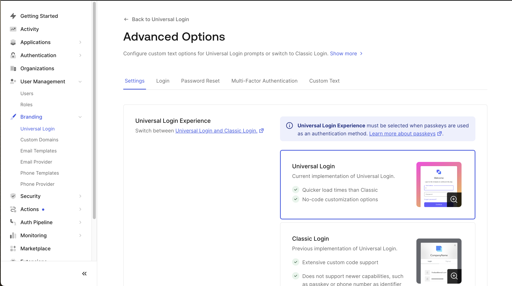

</Steps>

This completes the button setup. When you start it, the Sign-up option will be added as shown below.

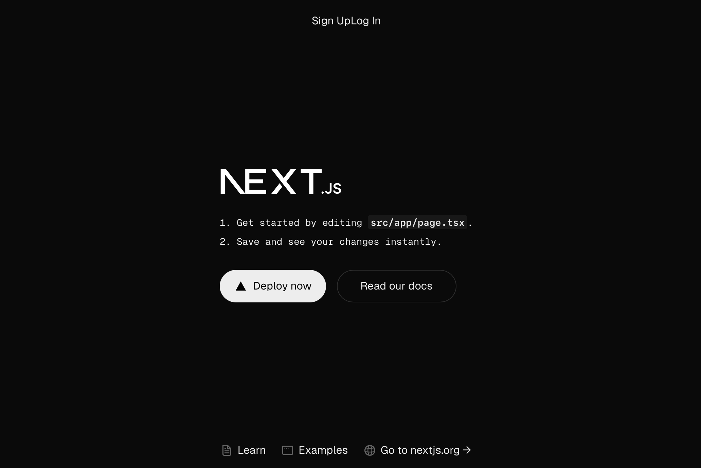
Clicking will switch to the sign-up screen.

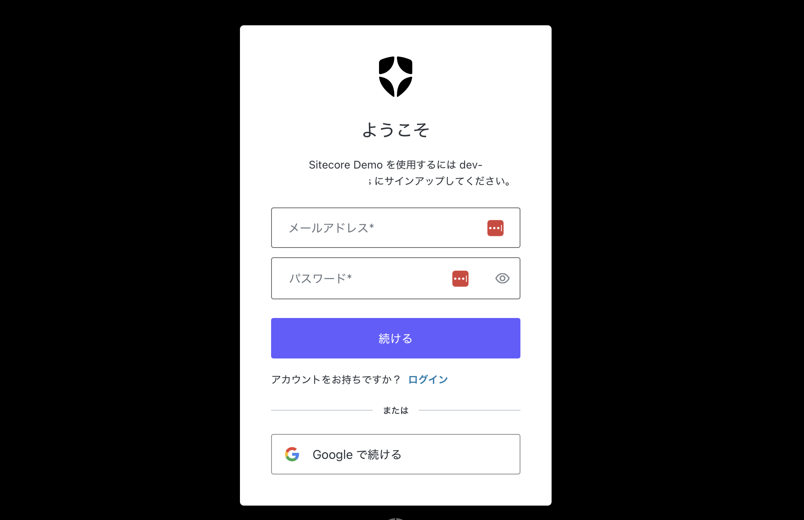

This completes the implementation of basic Auth0 functionality in the Next.js App Router.

The created sample can be referenced in the following repository.

<LinkCard
  title="haramizu / Next.js-sample"
  href="https://github.com/haramizu/Next.js-sample/tree/main/examples/auth0-app"
  target="_blank"
  description="Sample - Next.js App Router with Auth0"
/>

## Next.js Pages Router

In the Next.js Page Router, it is possible to mix with the App Router, so we will proceed with the steps including the work specific to the Pages Router while reproducing the work of the App Router as it is.

### Prerequisites

This time, we will proceed with the following versions.

- Next.js: 14.2.18
- Typescript: Yes
- App Router: No

The project was created as follows.


### Basic Settings

<Steps>

1. Install the package

   ```bash
   npm install @auth0/nextjs-auth0
   ```

2. Create `.env.local` file. The various values are created in the management screen and command line.

   ```text
   AUTH0_SECRET=KEY-VALUE
   AUTH0_BASE_URL=http://localhost:3000
   AUTH0_ISSUER_BASE_URL=Basic Information - domain
   AUTH0_CLIENT_ID=Basic Information - Client ID
   AUTH0_CLIENT_SECRET=Basic Information - Client Secret
   ```

3. Create `src/app/api/auth/[auth0]/route.ts`

   ```ts
   // src/app/api/auth/[auth0]/route.ts
   import { handleAuth, handleLogin } from '@auth0/nextjs-auth0';

   export const GET = handleAuth({
     login: handleLogin({
       returnTo: '/',
     }),
   });
   ```

4. Add `UserProvider` in the `src/pages/_app.tsx` file.

   ```diff lang="tsx" ins=/(UserProvider)/
   // src/pages/_app.tsx
   import "@/styles/globals.css";
   import type { AppProps } from "next/app";
   +import { UserProvider } from "@auth0/nextjs-auth0/client";

   export default function App({ Component, pageProps }: AppProps) {
     return (
   +    <UserProvider>
       <Component {...pageProps} />
   +    </UserProvider>
     );
   }
   ```

5. Create the login button `src/components/buttons/login-button.tsx`.

   ```tsx
   // src/components/buttons/login-button.tsx
   export const LoginButton = () => {
     return <a href="/api/auth/login">Log In</a>;
   };
   ```

6. Create the logout button `src/components/buttons/logout-button.tsx`.

   ```tsx
   // src/components/buttons/logout-button.tsx
   import { Button } from '@chakra-ui/react';

   export const LogoutButton = () => {
     return (
       <Button as="a" href="/api/auth/logout" marginX={1}>
         Log Out
       </Button>
     );
   };
   ```

7. Create the navigation for the login and logout buttons `src/components/navigation/nav-bar-buttons.tsx`.

   ```tsx
   // src/components/navigation/nav-bar-buttons.tsx
   import { useUser } from '@auth0/nextjs-auth0/client';
   import React from 'react';
   import { LoginButton } from '@/components/buttons/login-button';
   import { LogoutButton } from '@/components/buttons/logout-button';

   export const NavBarButtons = () => {
     const { user } = useUser();

     return (
       <>
         <div className="nav-bar__buttons">
           {!user && (
             <>
               <LoginButton />
             </>
           )}
           {user && (
             <>
               <LogoutButton />
             </>
           )}
         </div>
       </>
     );
   };
   ```

8. Finally, add the navigation to the sample page.

   ```diff lang="tsx"
   // src/app/page.tsx
   +import { NavBarButtons } from "@/components/navigation/nav-bar-buttons";
   import Image from "next/image";

   export default function Home() {
     return (
      <div className="grid grid-rows-[20px_1fr_20px] items-center justify-items-center min-h-screen p-8 pb-20 gap-16 sm:p-20 font-[family-name:var(--font-geist-sans)]">
   +      <header>
   +        <NavBarButtons />
   +      </header>
       <main className="flex flex-col gap-8 row-start-2 items-center sm:items-start">
         <Image
   ```

</Steps>

This completes the setup. When executed, it will work as shown below.


### Adding a Sign-up Screen

In addition to login and logout, it is also possible to add a sign-up feature. The steps are as follows.

<Steps>

1. Create the sign-up button `src/components/buttons/signup-button.tsx`.

   ```tsx
   // src/components/buttons/signup-button.tsx
   export const SignupButton = () => {
     return <a href="/api/auth/signup">Sign Up</a>;
   };
   ```

2. Add the sign-up action to `src/app/api/auth/[auth0]/route.ts`.

   ```diff lang="ts"
   // src/app/api/auth/[auth0]/route.ts
   import { handleAuth, handleLogin } from "@auth0/nextjs-auth0";

   export const GET = handleAuth({
     login: handleLogin({
       returnTo: "/",
     }),
   +  signup: handleLogin({
   +    authorizationParams: {
   +      screen_hint: "signup",
   +    },
   +    returnTo: "/",
   +  }),
   });
   ```

3. Add the sign-up button to the navigation.

   ```diff lang="tsx"
   import { LogoutButton } from "@/components/buttons/logout-button";
   +import { SignupButton } from "@/components/buttons/signup-button";

   export const NavBarButtons = () => {
     const { user } = useUser();

     return (
     <>
       <div className="nav-bar__buttons">
         {!user && (
         <>
   +            <SignupButton />
           <LoginButton />
         </>
         )}
   ```

4. From the Auth0 management screen, select `Branding` - `Universal Login`, and in the `Advanced Options` settings screen, make sure Universal Login is enabled.

   

</Steps>

This completes the button setup. When you start it, the Sign-up option will be added as shown below.


Clicking will switch to the sign-up screen.


This completes the implementation of basic Auth0 functionality in the Next.js App Router.

The created sample can be referenced in the following repository.

<LinkCard
  title="haramizu / Next.js-sample"
  href="https://github.com/haramizu/Next.js-sample/tree/main/examples/auth0-pages"
  target="_blank"
  description="Sample - Next.js Pages Router with Auth0"
/>

## Custom Domains

Let's check the steps to set up a custom domain, which was recently made available as part of the free plan. This setting can be configured by opening the Custom Domain tab on the Settings page.

<Steps>

1. Initially, the screen appears as follows.

   

2. To use a custom domain, even with the free plan, a credit card is required for personal authentication. You will not be charged, so proceed with the credit card authentication.

   After entering the credit card number and being authenticated, the screen changes as follows.

   

3. Enter the domain name, and the DNS settings screen will be displayed as follows.

   

4. Set the provided DNS records, and after a while, click the Verify button. If the DNS settings are correct, the completion dialog will be displayed as follows.

   

5. The custom domain has been successfully added.

   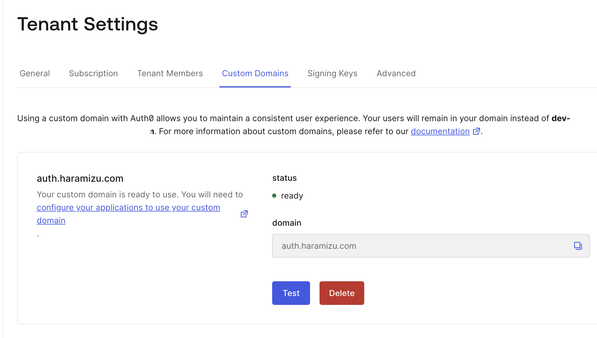

</Steps>

Once the custom domain is set, you can use the custom domain in environment variables and other settings.

## References

<LinkCard title="Pricing" href="https://auth0.com/pricing" target="_brank" />

<LinkCard
  title="Next.js/JavaScript Pages Router Code Sample: Basic Authentication"
  href="https://developer.auth0.com/resources/code-samples/web-app/nextjs/basic-authentication/javascript-pages-router"
  target="_brank"
/>

<LinkCard
  title="Next.js Authentication By Example: Using App Router"
  href="https://developer.auth0.com/resources/guides/web-app/nextjs/basic-authentication"
  target="_brank"
/>

