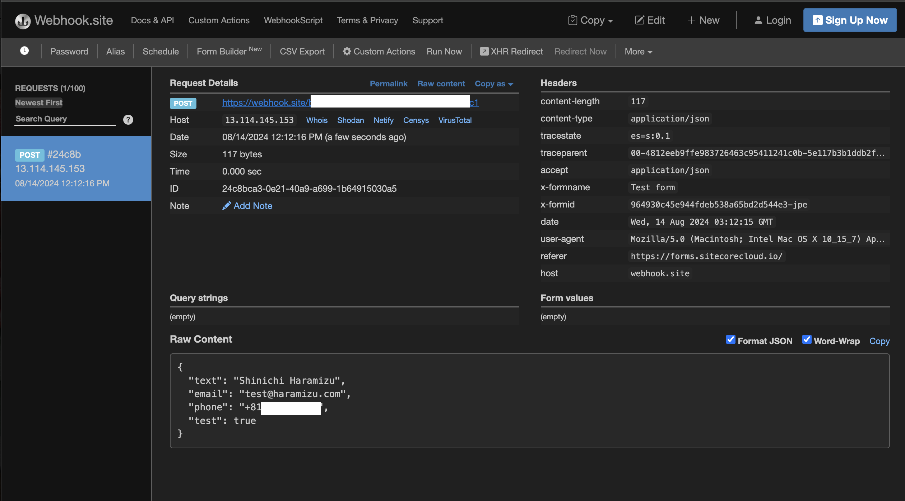

import { Steps, LinkCard } from '@astrojs/starlight/components';

{/* https://blog.haramizu.com/ja-JP/blog/2024/08/26/webhook-site */}

Sitecore products support webhooks in various areas, allowing data exchange using Sitecore Connect. The web service introduced here can be used to supplement testing.

## About Webhook.site

You can check the details of the site on the following page.

<LinkCard title="About Webhook.site" href="https://docs.webhook.site/index.html" target="_blank" />

This site offers services related to post-processing of data received via webhooks. It is a very convenient service that allows you to check webhook processing without setting up a server.

Simply accessing the site will display all the information needed to use it.

### About Plans

In the free plan, the URL provided by Webhook.site is only valid for 7 days. To continue using the same URL, you need to subscribe to a paid plan. The free plan is mainly for trial purposes, but it is sufficient for checking webhook data.

## Operation Check

Here, we will check the operation by combining Sitecore Forms and Webhook.site. Sitecore Forms provides webhook functionality after receiving data, so we will use this to check the operation.

<Steps>

1. Use the template provided by Sitecore Forms to create a form as shown below.

   

2. Add a webhook. At this time, add the URL published on the website without authentication.

   

3. Link the created webhook with Sitecore Forms.

   

4. Run the test with Test webhook.

   

</Steps>

When executed, a success message for webhook transmission will appear. When you move to the webhook.site site, the screen will switch as shown below because the data has been received.

## Summary

This time, we checked up to the point of receiving data with webhook.site. If you want to process the received data and link it with another service, you need to subscribe to a paid plan or contract with services such as Sitecore Connect or Workato, but for data checking, this is sufficient.

