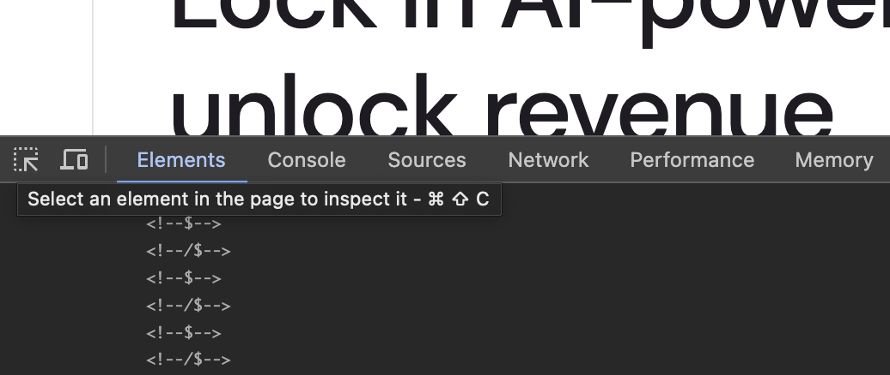
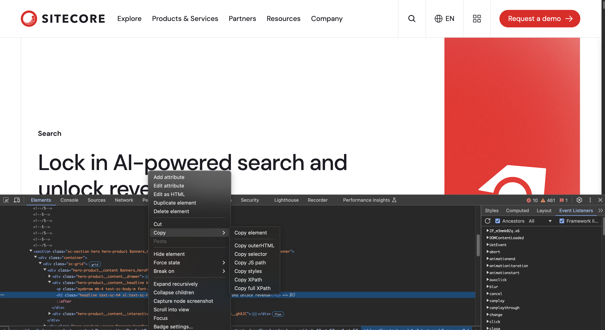
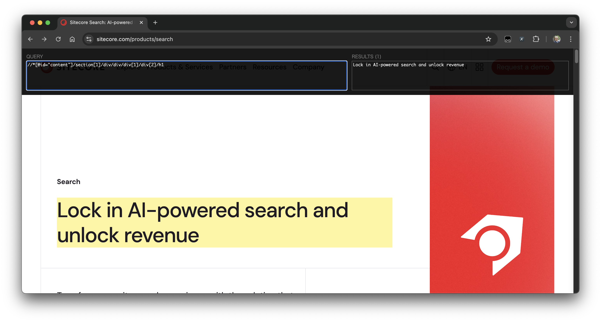

By using the structure of a web page's HTML and XPath (XML Path Language), you can retrieve elements and attribute values from XML/HTML documents that have a tree structure. This time, we will introduce an add-in that can be easily checked on the browser.

XPath is a concise syntax (language) for specifying and extracting specific parts from XML documents. It also supports HTML documents. While CSS uses selectors to extract specific parts of an HTML document, XPath is considered to be more concise and flexible.

The HTML data of a typical website should be displayed in the same structure for each page template. By utilizing this, you can retrieve elements from the page.

## Utilizing Developer Tools

Browsers generally provide developer tools, which can be used to obtain XPath data.

For example, access the Sitecore Search product site, open the browser's developer tools, and select the Elements tab. Then click the icon on the far left, which displays `Select an element in the page to inspect it` when hovered over, and click the part of the page you want to check.



The source code will then point to the corresponding HTML code. Next, right-click on the indicated HTML code, and a menu will appear allowing you to check various data. This time, select `Copy XPath`.



Clicking it will copy the XPath value to the clipboard. The result of the XPath this time is as follows:

```
//*[@id="content"]/section[1]/div/div/div[1]/div[2]/h1
```

In this way, we have confirmed how to obtain the XPath value.

## XPath Helper

### Installation

As a browser extension, there is a tool called XPath Helper, so we will use this tool to check the data on this site. First, please install the following tool in your browser.

- [XPath Helper](https://chrome.google.com/webstore/detail/xpath-helper/hgimnogjllphhhkhlmebbmlgjoejdpjl?hl=ja)

After installing and enabling this extension, turning on the display of this tool will show two text boxes at the top of the browser.


This completes the installation.

### Usage

Let's quickly check the data using XPath Helper. First, enter the XPath obtained at the beginning of this topic into the left text box. As a result, the title part is obtained and displayed in the right text box as follows.



Even if you move to another page with the same XPath, such as the XM Cloud page, you can obtain the page title because it has the same page structure.


In this way, when using XPath to obtain text from pages with the same structure, it is convenient to check the operation in advance.

In addition to the data displayed on the page, it is also possible to obtain values set as Meta data. For example, to obtain the value of `og:description`, you can use the following description.

```
//meta[@property='og:description']/@content
```

The result is displayed as follows.


## Summary

By using XPath Helper, you can conveniently check how to set rules for obtaining data from page elements. While developer tools alone are sufficient for checking the structure of a page, using this tool allows you to efficiently proceed with work by confirming whether the same data can be obtained on other pages.

