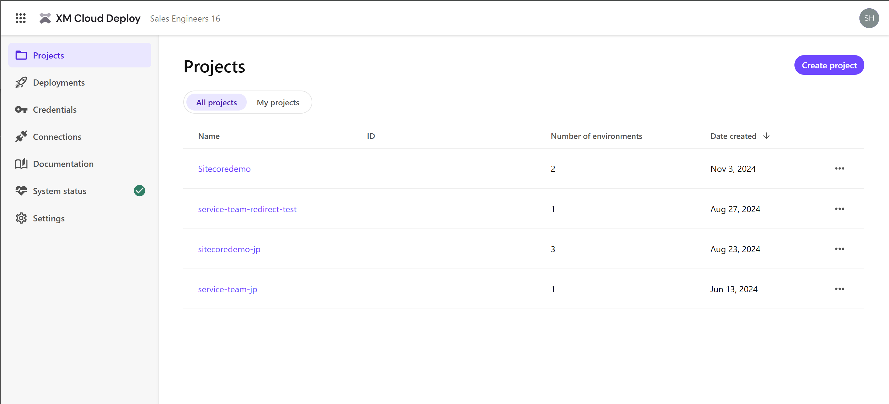
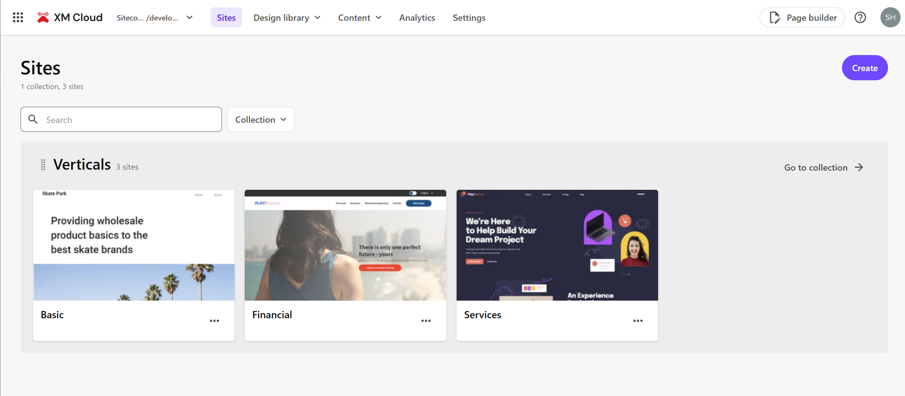

import { LinkCard } from '@astrojs/starlight/components';

This document introduces an overview of Sitecore XM Cloud, the SaaS version of the CMS provided by Sitecore. It introduces the terminology related to Sitecore products on this page, while various topics are introduced on separate pages.

## Tools Provided by Sitecore XM Cloud

Sitecore XM Cloud provides a powerful toolset for managing digital experiences. These tools include basic features such as content management, analytics, personalization, and A/B/n testing tools.

## Content Management System (CMS)

By leveraging the tools provided by Sitecore XM Cloud, companies can efficiently manage website content. Sitecore XM Cloud offers a fundamental solution to meet the needs of modern digital marketing.

You can continue to use the following features provided by Sitecore's traditional CMS:

- Content Editor
- Experience Editor
- Media Library
- Access management tools

## About the Management Interface

The XM Cloud Deploy and CMS management interface tools, which are used only by system administrators and developers, are introduced here.

### XM Cloud Deploy

This tool is provided for deploying XM Cloud servers.

The main features include:

- Creating projects
- Viewing project details
- Checking deployed environments
- Managing credentials for integration with XM Cloud
- Checking systems integrated with XM Cloud

### Sites

This is the first tool to access when referring to the Sitecore XM Cloud server.

From the above screen, you can access the following tools:

- Design Library
  - Components
  - Forms
- Content
  - Explorer
  - Content editor
  - Media Library
  - Analytics
  - Settings
  - Page Builder

In addition to links to the above tools, there is also a menu for switching environments (e.g., production, non-production).

In XM Cloud, if there is a possibility of sharing content between sites, you can create a Collection to manage multiple sites within it. You can create multiple Collections, but content cannot be shared across Collections, so if you want to manage them completely separately, you will have multiple Collections.

## Various Tools

The overview of various tools provided by Sitecore XM Cloud is as follows.

### XM Cloud Deploy

XM Cloud Deploy is a tool for launching the CMS provided by Sitecore XM Cloud, allowing access to various functions of the CMS. From XM Cloud Deploy, you can create XM Cloud projects using either a basic template or existing code, and manage projects, environments, and deployments.

In XM Cloud Deploy, you can manage the following:

- Project
  - Environment
- Credentials: Create and manage certificates for accessing the Organization and Environment APIs.
- Connections: Register services such as GitHub and Hosting.
- System Status: View the status of various services of Sitecore XM Cloud.

### Components

XM Cloud Components is a front-end-as-a-service application that allows you to create a brand-specific style guide and build visual components with a WYSIWYG (What You See Is What You Get) editor.

### Page Builder

Sitecore's CMS makes it easy to create, edit, and publish content through an intuitive interface. Page Builder allows you to easily manage web pages and digital assets using drag-and-drop functionality.

### Forms

This tool allows you to create forms available in Sitecore XM Cloud. It provides drag-and-drop editing capabilities and also offers integration with external systems using Webhooks.

### Analytics

Sitecore Analytics provides tools for tracking website behavior history. By configuring this feature, you can review the history of the website for the past 30 days.

### Personalize

Sitecore XM Cloud offers the ability to personalize content based on user behavior data. This allows you to provide optimized experiences for each visitor, enhancing engagement.

### A/B/n Testing

You can check the A/B/n testing functionality based on the components used on the page. The results are also displayed in Analytics, making it usable as a marketing feature similar to Personalize.

## XM Cloud Terminology

To explain Sitecore XM Cloud, several terms are introduced here. Understanding these terms will help you quickly determine the role of the CMS and what to do when multiple CMSs are needed.

### Project

A project can deploy multiple CMS servers, with one production environment and two non-production environments provided by default. When you first launch XM Cloud Deploy, you create a Project.

<LinkCard
  title="Manage a project"
  href="https://doc.sitecore.com/xmc/en/developers/xm-cloud/manage-a-project.html"
  target="_blank"
/>

### Environment

An environment is the name of an environment that can be created within a Project, and one CMS instance is provided for this Environment. You can also obtain necessary environment variables and endpoint information for using the CMS, which are used when integrating with services like Vercel.

<LinkCard
  title="Manage an environment"
  href="https://doc.sitecore.com/xmc/en/developers/xm-cloud/manage-an-environment.html"
  target="_blank"
/>

## Sitecore CLI

Sitecore CLI is a convenient command-line tool that can be used when developing websites with Sitecore XM Cloud. This tool is also available for Sitecore Experience Manager (Sitecore CMS) and can be used for the SaaS environment of XM Cloud.

