import { Steps, LinkCard } from '@astrojs/starlight/components';

Once you have access to the Sitecore XM Cloud environment, the next step is to use XM Cloud Deploy to set up a new server. This guide will walk you through the steps to deploy a server using XM Cloud Deploy.

## Creating a New Project

First, to access XM Cloud Deploy, go to the Sitecore Cloud Portal and click on the XM Cloud Deploy menu at the top right. If you are logging into XM Cloud Deploy for the first time, you will see a screen with no projects as shown below.

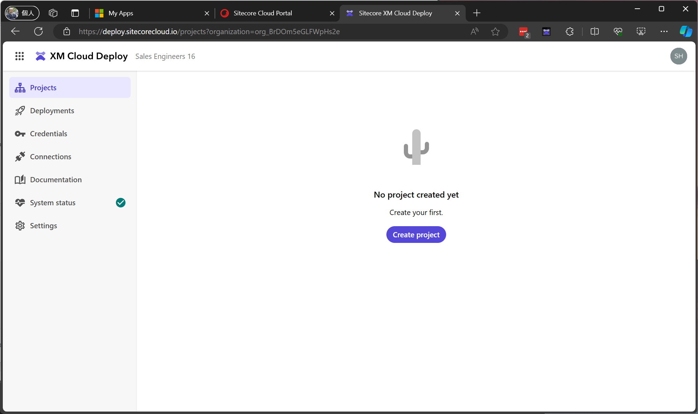

Let's create a new project.

<Steps>

1. Click on `Create project` displayed on the screen (if a project already exists, it will be displayed at the top right). Clicking the `Create Project` button will switch to the following screen.

   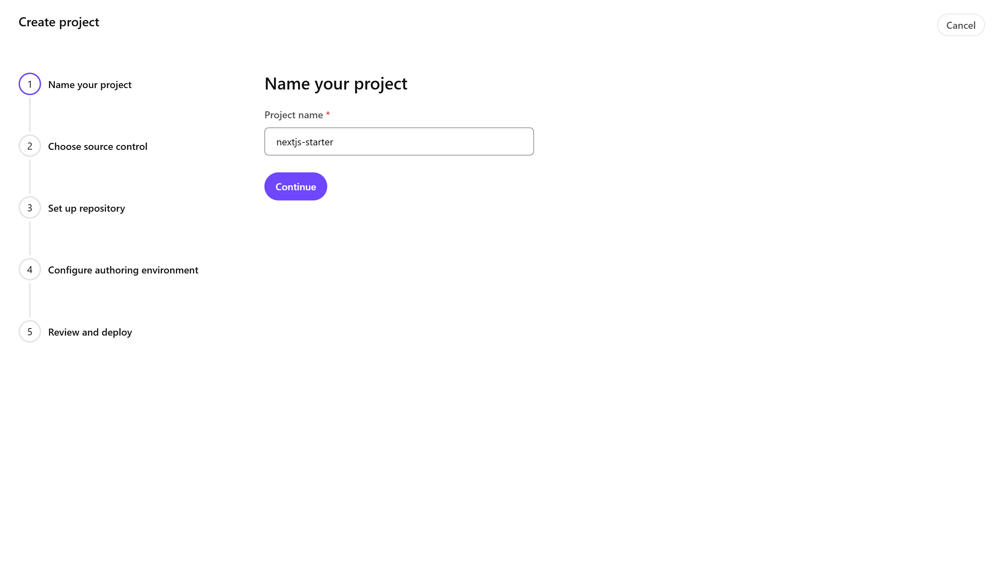

2. Set the project name to `nextjs-starter` and click `Continue` to proceed.

   

3. On the above screen, you can choose between GitHub or Azure DevOps for source control. For this guide, select GitHub by clicking the `Connect` button and then click Continue.

4. The repository setup screen will appear.

   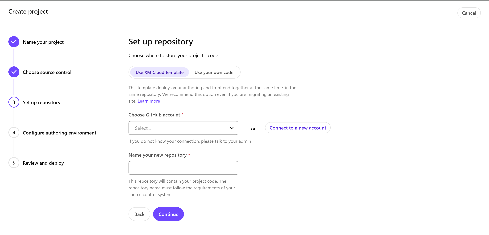

   You can choose between two types of setups for the repository:

   - **Use XM Cloud template**: This uses the XM Cloud template provided by Sitecore. If linked with GitHub, a private repository will be created.
   - **Use your own code**: If you already have code in development, you can specify that repository.

5. If the account you want to use is not listed, click `Connect to a new account` to display the linking screen. Clicking it will switch to the GitHub login screen. For this guide, to link to an organization, the Sitecore Deploy Prod screen will be displayed as shown below.

   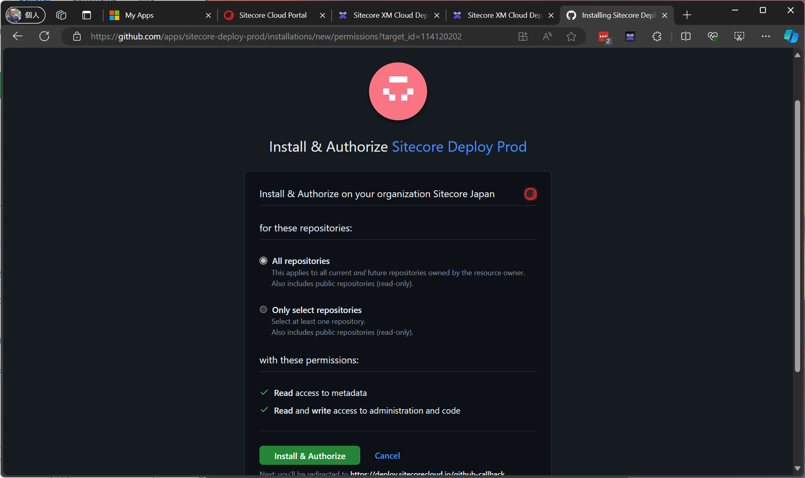

   Click Install & Authorize to enable linking, and the account will be selectable from the list.

6. When creating a new project, select the target account and set the repository name. Click `Continue` to proceed.

   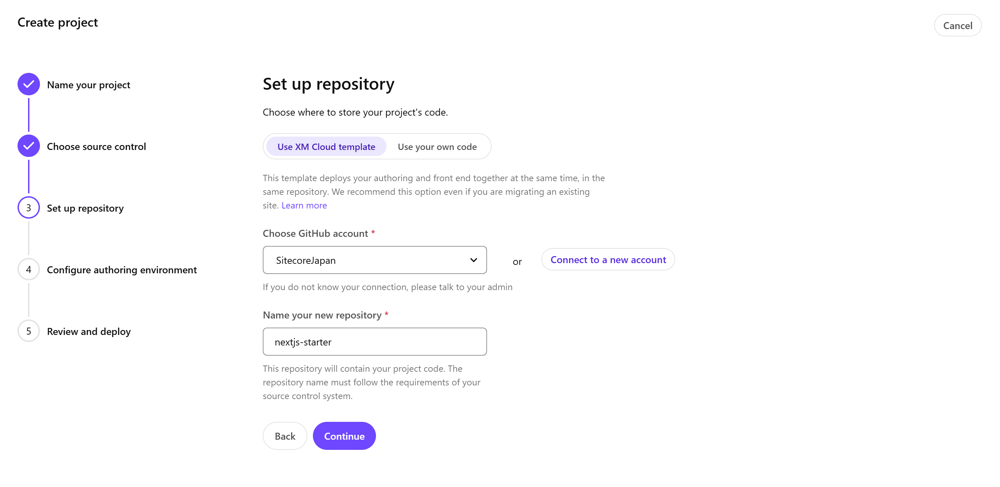

7. A confirmation screen for configuring the CMS environment will be displayed.

   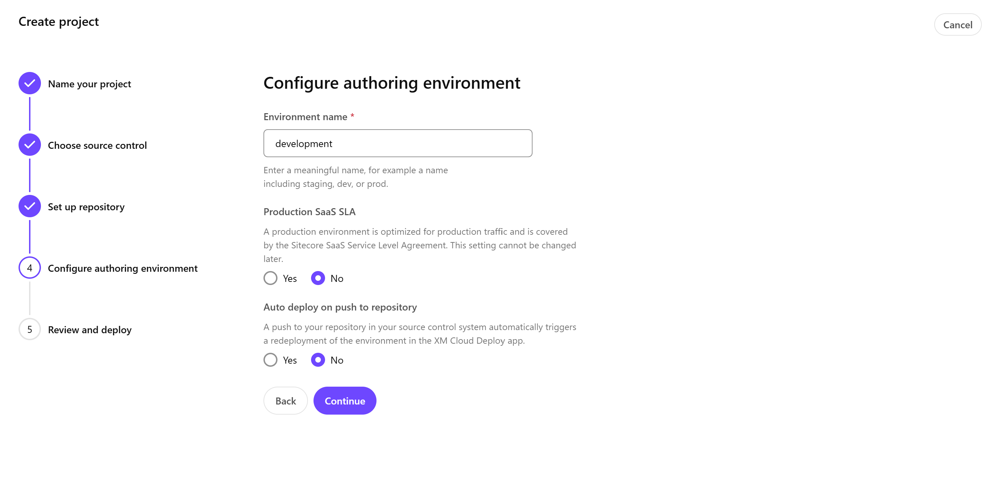

   Note that the `Production SaaS SLA` setting cannot be changed later. Initially, create a non-production environment and switch to a production environment when needed.

8. A final confirmation screen will be displayed.

   

   If everything is correct, click the Start Deployment button to begin the deployment.

</Steps>

This will create a new project and prepare a new environment.

You can create one production server and two non-production servers for the project.

Once the deployment is complete, you can access the XM Cloud management screen.

## Adding a New Site

Let's add a sample site provided by default to the new Sitecore instance. The steps involve creating a Collection and then adding a Site.

### Creating a Collection

Create a Collection to manage the group of sites.

<Steps>

1. In the new environment, click `Create` at the top right of the screen. The options for Site and Collection will be displayed.

   

   Select Collection.

2. A dialog to set the Collection name will be displayed.

   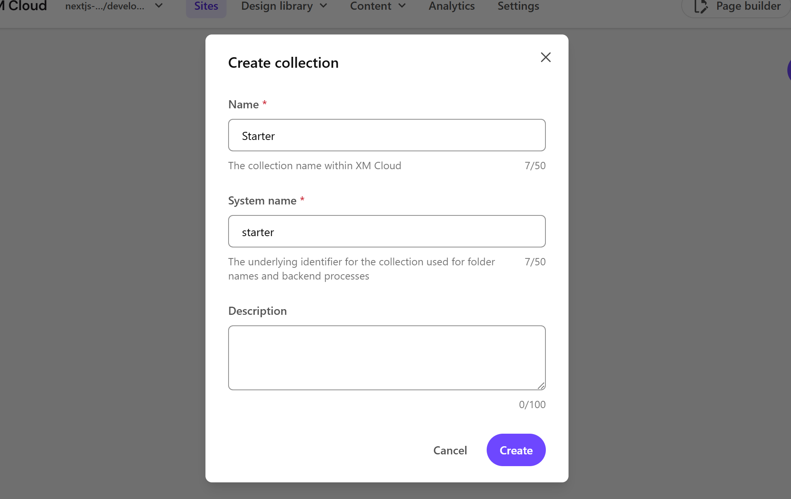

3. Click the Create button to create a new Collection.

   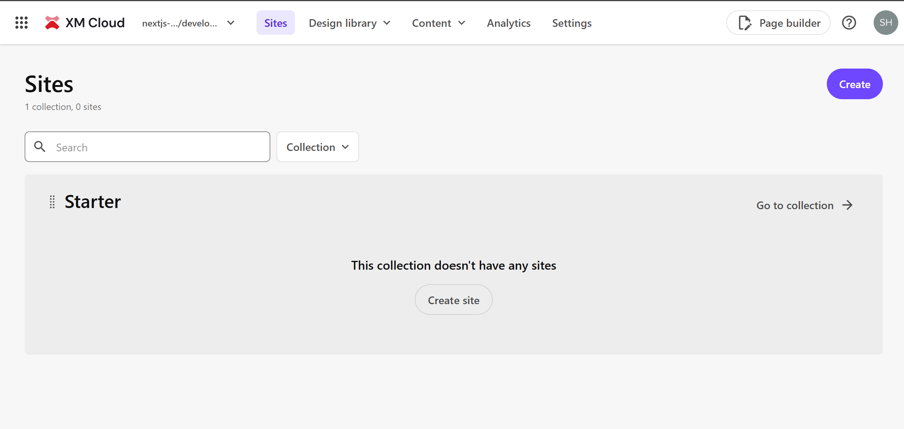

</Steps>

### Creating a Site

Follow these steps to create a site within the Collection.

<Steps>

1. Click Create site in the area of the created Collection.

   

2. The site template screen will be displayed. Select Basic for this guide.

   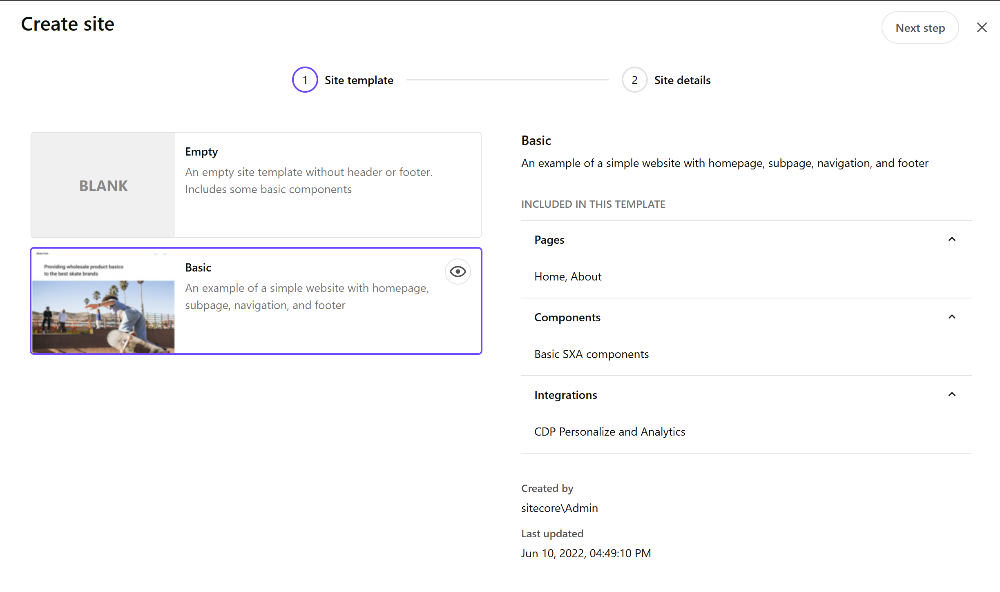

   The following information will be displayed for this template:

   - Pages: Home and About items are prepared
   - Components: Standard SXA components
   - Integration: Sitecore CDP + Personalize

3. Add the site information in the next step.

   

4. Click the Create button to start adding the new site.

   

</Steps>

After completing the above steps, you can confirm that the new site has been added.

## Adding an Environment

With the new server and site ready, let's add another server by following the steps to add an Environment.

<Steps>

1. Add a Staging branch to the GitHub repository.

   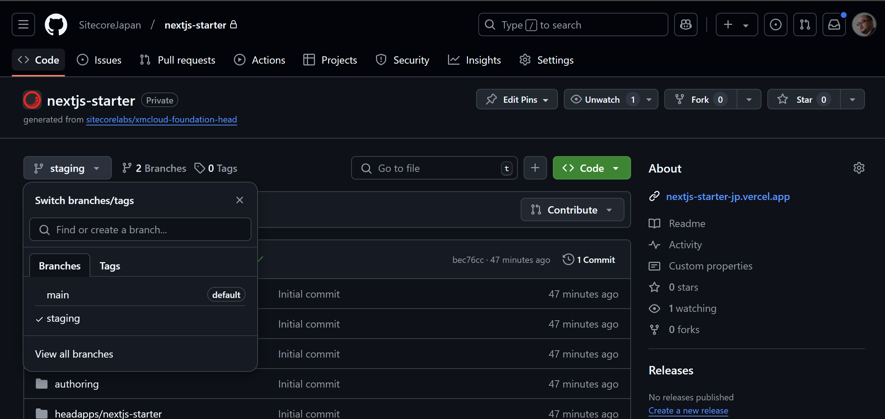

2. Move to the XM Cloud Deploy management screen. If the CMS is already running, you can access the XM Cloud Deploy management screen by clicking `Manage environments` from the environment list.

   

3. Open the environment list screen for the project you are using.

   

4. Specify the branch name of the repository for the new environment.

   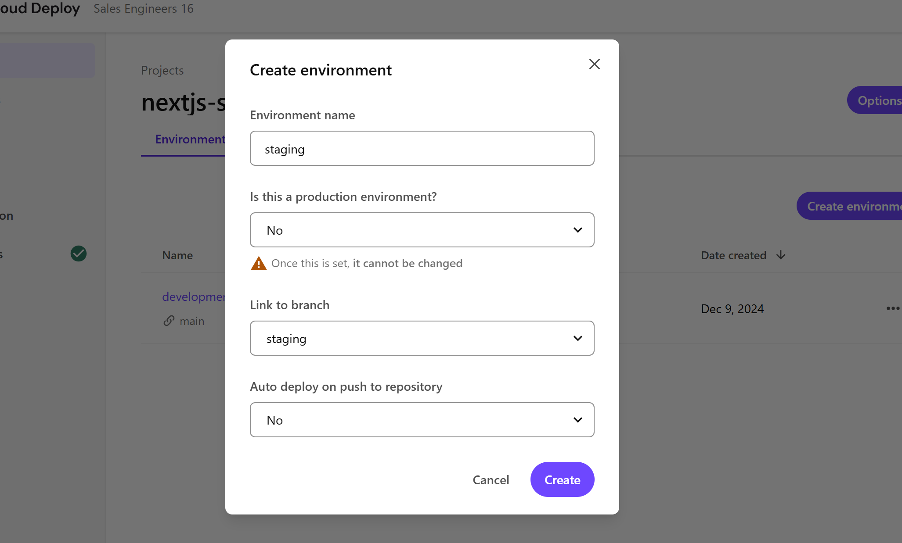

</Steps>

After completing the above settings, a new server will be set up in a similar manner to the initial environment setup.

## Environment Details

From the XM Cloud Deploy management screen, you can obtain various values related to the environment.

- Deployments: Information about server deployments
- Sites: Check the websites set up in the target environments
  - You can execute a full publish
  - Deploy sites to Vercel
- Details
  - Obtain the deployment destination of the website and the Context ID used during development
  - Check the Environment ID
  - Check the data center and instance type
  - Obtain URLs and Client Keys for use with GraphQL, etc.
- Logs
  - View various logs held by the instance
- Variables
  - Check the environment variables used by the CMS
- Developer Settings
  - A screen to obtain values frequently used by developers

These values are used by infrastructure engineers and developers and are not used by general users.

## About Environment Variables

The Variables tab is used to set environment variable values for the CMS.

The following items are set by default.

| Name                              | Value | Secret | Target | Description                                                                              |
| --------------------------------- | ----- | ------ | ------ | ---------------------------------------------------------------------------------------- |
| Sitecore_GraphQL_ExposePlayground | false | No     | CM     | Enable/disable access to the Sitecore Authoring and Management GraphQL API playground.   |
| SITECORE_SPE_ELEVATION            | Block | No     | CM     | Specify user account control actions for the Sitecore PowerShell Extension (SPE) module. |
| PUBLISHING_LOG_LEVEL_VALUE        | INFO  | No     | CM     | Set the log level for the publishing process.                                            |
| LOG_LEVEL_VALUE                   | INFO  | No     | CM     | Set the log level for general logs.                                                      |

Additional information is summarized on the following page.

<LinkCard
  title="Environment variables"
  href="https://doc.sitecore.com/xmc/en/developers/xm-cloud/environment-variables.html"
  description="Modifying environment variables requires a rebuild/redeploy of your environment for the changes to take effect."
  target="_blank"
/>

### RichText Editor

In the Pages management screen, you can switch the input method of the rich text editor using environment variables. Use the `PAGES_ENABLE_NEW_RTE_EDITOR` environment variable to enable it in JSS v21.5.2 or later. Note that this setting will be enabled by default on May 8, 2025.

<LinkCard
  title="The legacy rich text editor in Pages will be deprecated on May 8th, 2025"
  href="https://developers.sitecore.com/changelog/xm-cloud/13112024/the-legacy-rich-text-editor-in-pages-will-be-deprecated-on-may-8th%2c-2025"
  description="On May 8, 2025, Sitecore will deprecate the legacy Pages rich text editor previously accessible from the right-hand side panel. The newer CKEditor rich text editor will become the default. "
  target="_blank"
/>

Previously, the rich text editing screen allowed you to specify attributes on the right side of the screen when selecting rich text, as shown below.

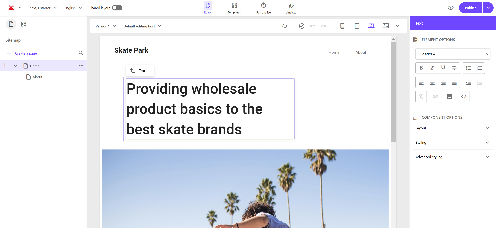

Now, add the `PAGES_ENABLE_NEW_RTE_EDITOR` item to the environment.

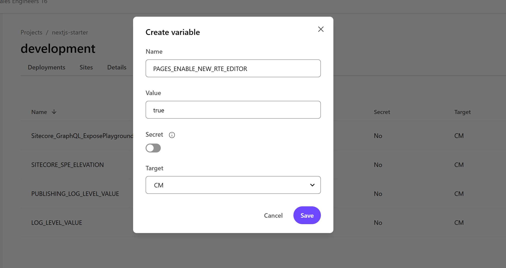

After setting it, manually deploy to enable the environment variable. After a while, when the new instance starts, access Pages to see the new rich text editor format.

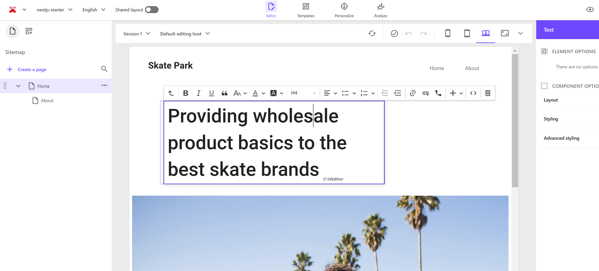

Since this setting will change in 2025, it is recommended to enable and use it now.

### Sitecore Connect for Content Hub

To link Sitecore XM Cloud with Sitecore Content Hub, use the Environment Variables item. The steps for this are introduced on the following page.

- [Sitecore Connect for Content Hub](/en/ch/connect-for-content-hub/)

## Reference Information

<LinkCard
  title="Environment variables"
  href="https://doc.sitecore.com/xmc/en/developers/xm-cloud/environment-variables.html"
  description="Modifying environment variables requires a rebuild/redeploy of your environment for the changes to take effect."
  target="_blank"
/>

<LinkCard
  title="The legacy rich text editor in Pages will be deprecated on May 8th, 2025"
  href="https://developers.sitecore.com/changelog/xm-cloud/13112024/the-legacy-rich-text-editor-in-pages-will-be-deprecated-on-may-8th%2c-2025"
  description="On May 8, 2025, Sitecore will deprecate the legacy Pages rich text editor previously accessible from the right-hand side panel. The newer CKEditor rich text editor will become the default. "
  target="_blank"
/>

