import { Steps, LinkCard } from '@astrojs/starlight/components';

Google は 2024年5月21日に、Google Maps Platform 向けの React ライブラリをリリースしました。

<LinkCard
  title="Google Maps Platform が React インテグレーション ライブラリ 1.0 を発表"
  href="https://cloud.google.com/blog/ja/products/maps-platform/google-maps-platform-graduates-react-integration-library-to-1-0"
  target="_blank"
/>

この react-google-maps を利用することで、Web サイトに対して Google Maps を利用するのが簡単にできるようになります。今回は、このライブラリを Next.js で利用する方法を確認していきます。

## Google Maps API キー の取得

Google Maps を利用するに当たって、API キーを取得する必要があります。基本的には Google Maps の API キーを利用する場合は有料のプランに契約をする必要がありますが、毎月 $200 までは無料で利用できるようになっています。検証、テストであれば十分カバーできる金額となっています。

<LinkCard
  title="Google Maps 料金"
  href="https://mapsplatform.google.com/intl/ja/pricing/"
  target="_blank"
/>

API キーを取得する際の前提条件として、Google Cloud の開発者向けアカウントをすでに持っている必要があります。開発者向けサイトにアクセスができる状況にしてから、以下の手続きへと入ってください。

管理者権限を持っている状態で、以下のサイトにアクセスをしてください。

<LinkCard
  title="Google Maps Platform"
  href="https://console.cloud.google.com/google/maps-apis/home"
  target="_blank"
/>

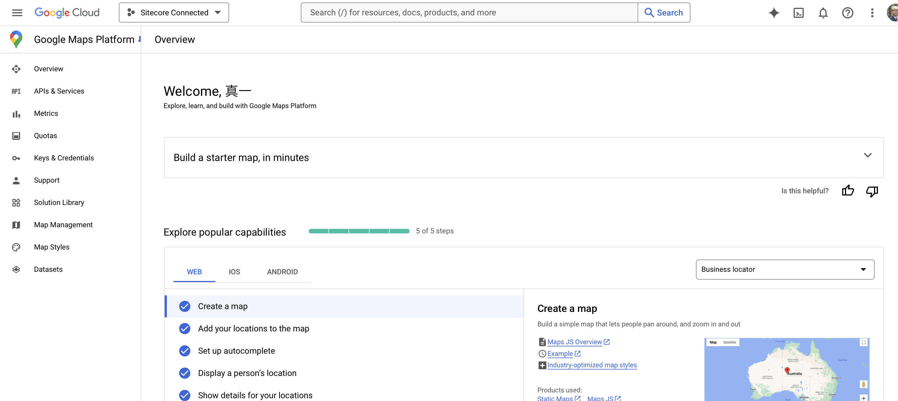

新しいプロジェクトを作成します。

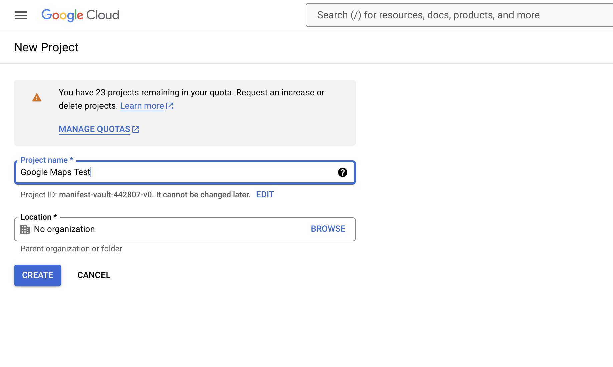

作成したプロジェクトに切り替えると、以下のように API キーが表示されます。このキーを今回は利用していきます。

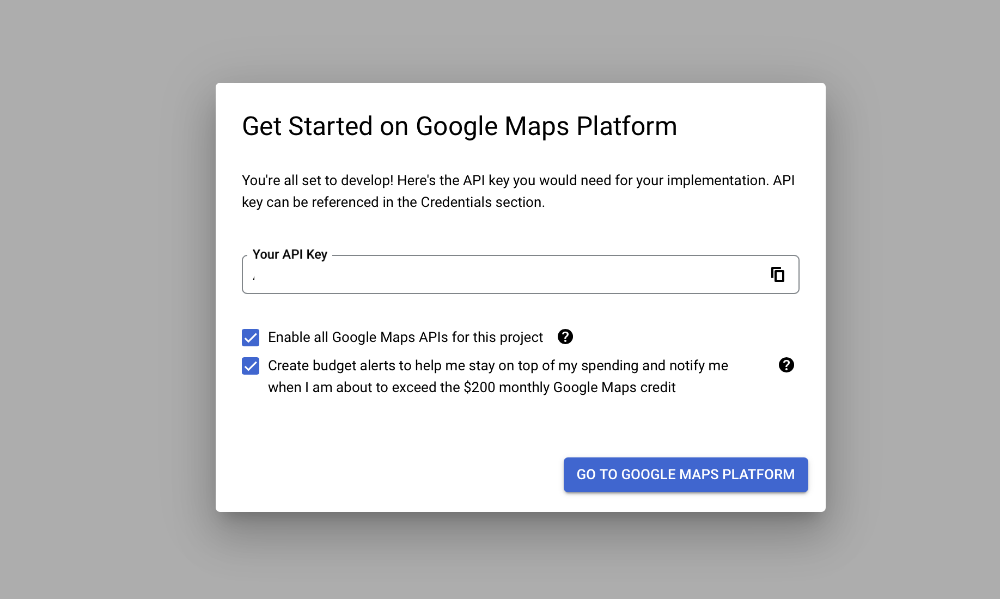

続いてこの API キーを利用する用途に関して確認のダイアログが表示されます。今回は `Website` を選択し、続いて表示される Refferer に関しては自分の持っているドメインを対象とします。

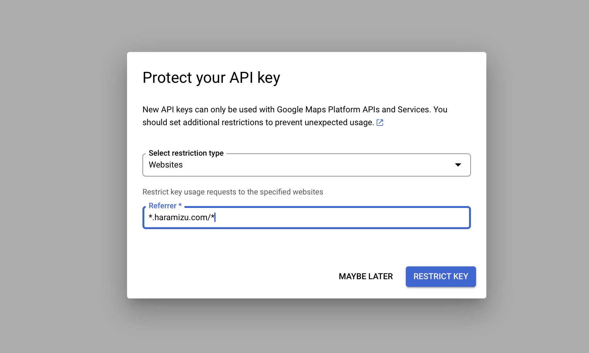

画面が切り替わりますが、今回は右上にある Skip now をクリックして残りの手順は省略します。画面は以下のように変わります。

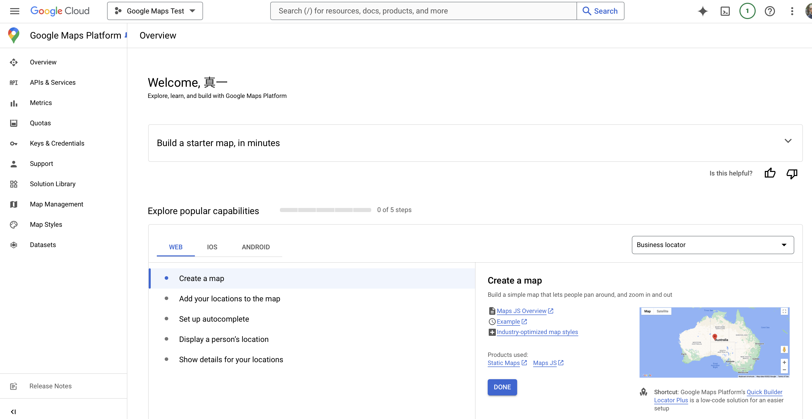

キーに関しては、この画面の左側にある `Keys & Credentials` のメニューをクリックすると、改めて取得することができます。

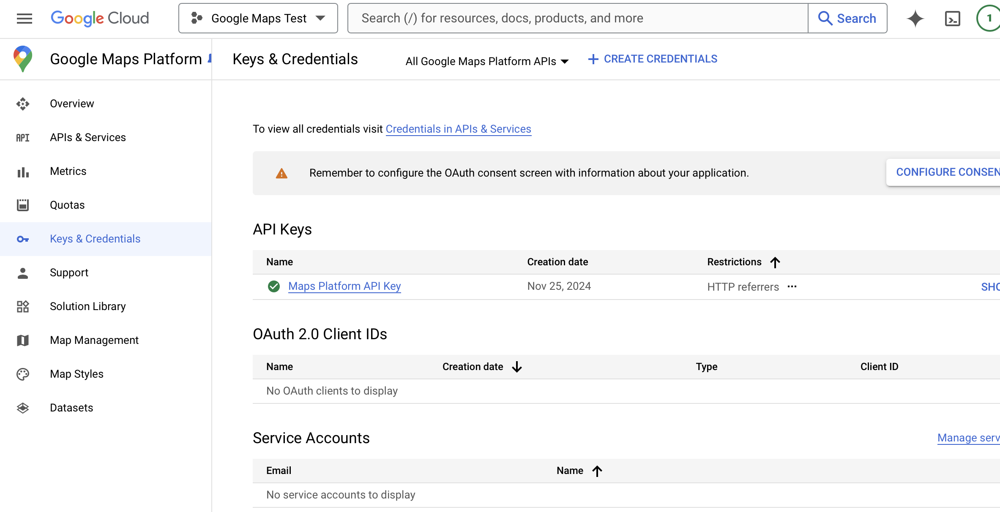

該当するキーの一番右側に用意されているメニューの Edit API Key をクリックすると、API キーの設定が表示されます。今回はローカルでも動作させる必要があるため、`Website restrictions` に対して http://localhost:3000/\* を追加します。

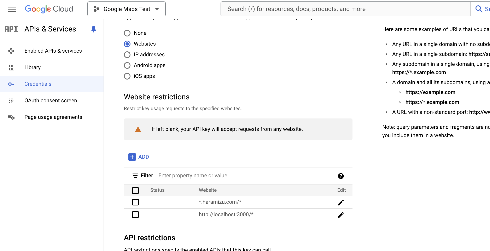

これで準備が整いました。

## Pages Router

Next.js の Pages Router のプロジェクトに対して Google mapsの利用をできるようにしていきます。

### サンプルを動作させる

<Steps>

1. Next.js のプロジェクトを作成

   まずベースとなる Next.js のプロジェクトを作成します。

   ```bash
   npx create-next-app@14.2.18
   ```

   - **Typescript**: Yes
   - **ESLint**: Yes
   - **Tailwind CSS**: Yes
   - **src/ directory**: Yes
   - **App Router**: No
   - **Import alias**: No

   以下のようになります。

   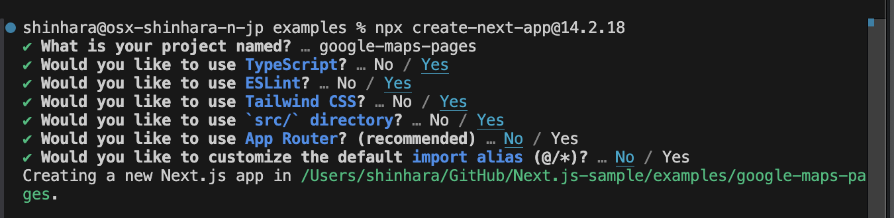

   これで新しい Next.js のプロジェクトの作成ができました。

2. Google mapsパッケージのインストール

   React Google Maps のパッケージをプロジェクトに追加します。

   ```bash
   npm install @vis.gl/react-google-maps
   ```

3. API を設定する

   Google Maps の API キーはすでに準備がでいているので、環境変数と持つために、以下のように `.env` ファイルを準備します。

   ```txt Title=".env"
   NEXT_PUBLIC_GOOGLE_MAPS_API_KEY=<your API key here>
   ```

4. サンプルコードに変更する

   トップページのコードを以下のように書き換えます。

   ```tsx
   // src/pages/index.tsx
   import { APIProvider, Map } from '@vis.gl/react-google-maps';

   export default function Home() {
     return (
       <APIProvider apiKey={process.env.NEXT_PUBLIC_GOOGLE_MAPS_API_KEY as string}>
         <Map
           style={{ width: '100vw', height: '100vh' }}
           defaultCenter={{ lat: 35.682839, lng: 139.759455 }}
           defaultZoom={10}
           gestureHandling={'greedy'}
           disableDefaultUI={true}
         />
       </APIProvider>
     );
   }
   ```

5. 実行

   以下のコマンドでサンプルを起動します。

   ```bash
   npm run dev
   ```

</Steps>

結果、以下のように地図を表示することができました。

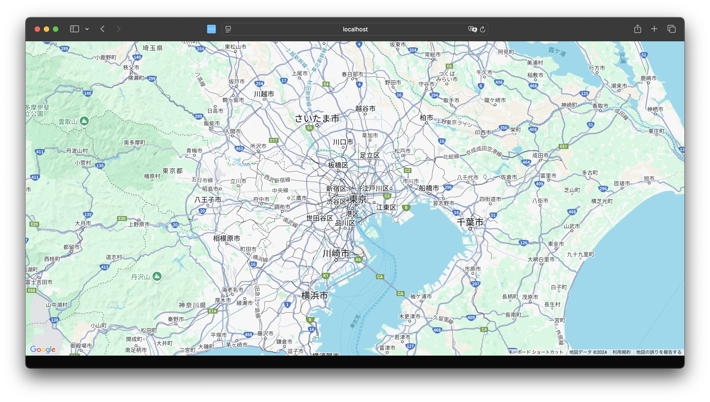

### エラー処理

上記のコードで実行をした際に、実は以下のようなエラーが表示されています。

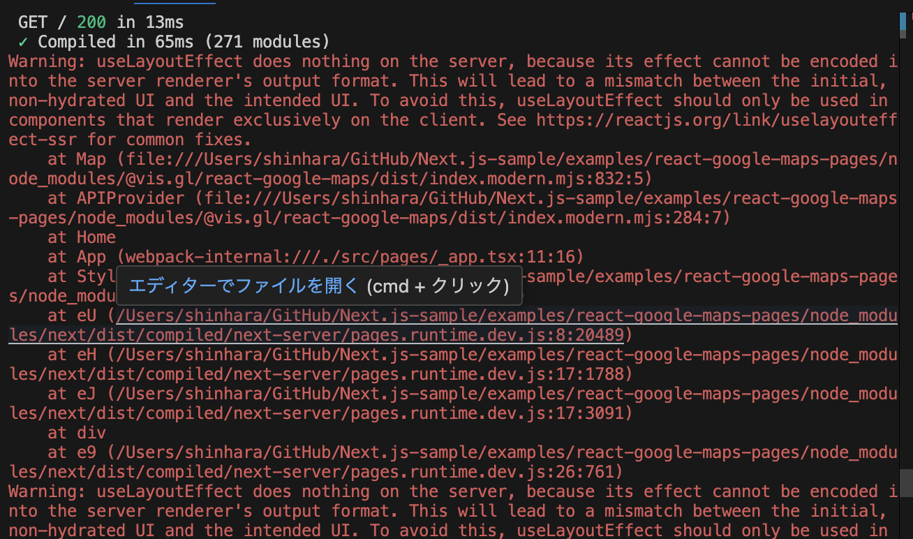

このエラーは、useLayoutEffect がサーバーサイドレンダリング（SSR）環境で使用されているために発生しています。useLayoutEffect はクライアントサイドでのみ動作するフックであり、サーバーサイドでは効果を発揮しません。

そこで、以下のコードを追加します。

```diff lang="tsx"
// src/pages/index.tsx
+import { useEffect, useState } from "react";
import { APIProvider, Map } from "@vis.gl/react-google-maps";

export default function Home() {
+  const [isClient, setIsClient] = useState(false);
+
+  useEffect(() => {
+    setIsClient(true);
+  }, []);

+  if (!isClient) {
+    return null;
+  }

  return (
    <APIProvider apiKey={process.env.NEXT_PUBLIC_GOOGLE_MAPS_API_KEY as string}>
      <Map
        style={{ width: "100vw", height: "100vh" }}
        defaultCenter={{ lat: 35.682839, lng: 139.759455 }}
        defaultZoom={10}
        gestureHandling={"greedy"}
        disableDefaultUI={true}
      />
    </APIProvider>
  );
}
```

これで、エラーが表示されない形となりました。

サンプルのコードは以下から参照できます。

<LinkCard
  title="haramizu / Next.js-sample - React Google Maps Pages Router"
  href="https://github.com/haramizu/Next.js-sample/tree/main/examples/react-google-maps-pages"
  target="_blank"
/>

## App Router

Next.js の App Router のプロジェクトに対して Google mapsの利用をできるようにしていきます。

### サンプルを動作させる

<Steps>

1. Next.js のプロジェクトを作成

   まずベースとなる Next.js のプロジェクトを作成します。

   ```bash
   npx create-next-app@14.2.18
   ```

   - **Typescript**: Yes
   - **ESLint**: Yes
   - **Tailwind CSS**: Yes
   - **src/ directory**: Yes
   - **App Router**: Yes
   - **Import alias**: No

   以下のようになります。

   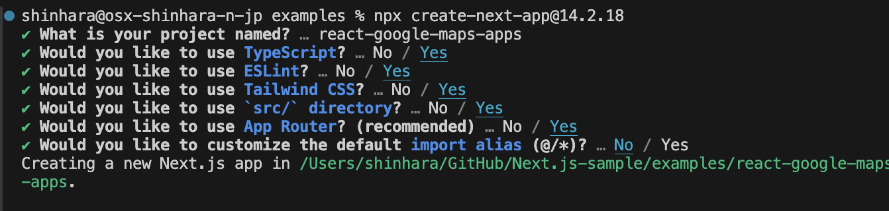

   これで新しい Next.js のプロジェクトの作成ができました。

2. Google mapsパッケージのインストール

   React Google Maps のパッケージをプロジェクトに追加します。

   ```bash
   npm install @vis.gl/react-google-maps
   ```

3. API を設定する

   Google Maps の API キーはすでに準備がでいているので、環境変数と持つために、以下のように `.env` ファイルを準備します。

   ```txt Title=".env"
   NEXT_PUBLIC_GOOGLE_MAPS_API_KEY=<your API key here>
   ```

4. サンプルコードに変更する

   トップページのコードを以下のように書き換えます。

   ```tsx
   // src/app/page.tsx
   import { APIProvider, Map } from '@vis.gl/react-google-maps';

   export default function Home() {
     return (
       <APIProvider apiKey={process.env.NEXT_PUBLIC_GOOGLE_MAPS_API_KEY as string}>
         <Map
           style={{ width: '100vw', height: '100vh' }}
           defaultCenter={{ lat: 35.682839, lng: 139.759455 }}
           defaultZoom={10}
           gestureHandling={'greedy'}
           disableDefaultUI={true}
         />
       </APIProvider>
     );
   }
   ```

5. 今回はエラーが表示されます。以下のような画面となります。

   

   Pages Router の時と同様に、クライアント側で動作するように以下のコードを追加します。

   ```diff lang="tsx"
   // src/app/page.tsx
   +"use client";

   import { APIProvider, Map } from "@vis.gl/react-google-maps";

   export default function Home() {
     return (
       <APIProvider apiKey={process.env.NEXT_PUBLIC_GOOGLE_MAPS_API_KEY as string}>
         <Map
           style={{ width: "100vw", height: "100vh" }}
           defaultCenter={{ lat: 35.682839, lng: 139.759455 }}
           defaultZoom={10}
           gestureHandling={"greedy"}
           disableDefaultUI={true}
         />
       </APIProvider>
     );
   }
   ```

</Steps>

Pages Router と同様の結果が表示されます。


サンプルのコードは以下から参照できます。

<LinkCard
  title="haramizu / Next.js-sample - React Google Maps App Router"
  href="https://github.com/haramizu/Next.js-sample/tree/main/examples/react-google-maps-app"
  target="_blank"
/>

## まとめ

今回は、新しい React Google Maps のライブラリを Next.js で利用するためのサンプルを作成してみました。純粋な Next.js での動作確認という形となりますが、動作する環境を用意するという点で便利だと思います。

## 参考情報

<LinkCard
  title="Get Started"
  href="https://visgl.github.io/react-google-maps/docs/get-started"
  target="_blank"
/>
<LinkCard
  title="haramizu / Next.js-sample - React Google Maps Pages Router"
  href="https://github.com/haramizu/Next.js-sample/tree/main/examples/react-google-maps-pages"
  target="_blank"
/>
<LinkCard
  title="haramizu / Next.js-sample - React Google Maps App Router"
  href="https://github.com/haramizu/Next.js-sample/tree/main/examples/react-google-maps-app"
  target="_blank"
/>

