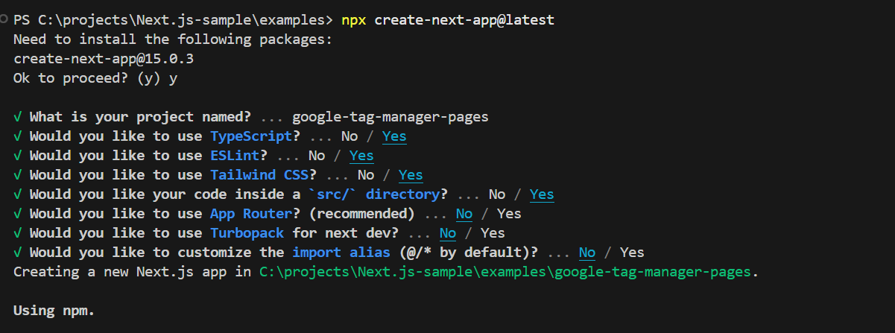
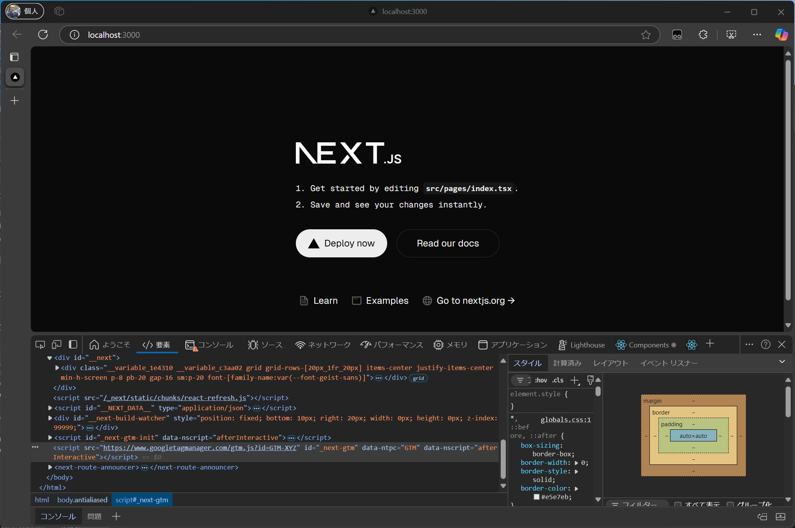
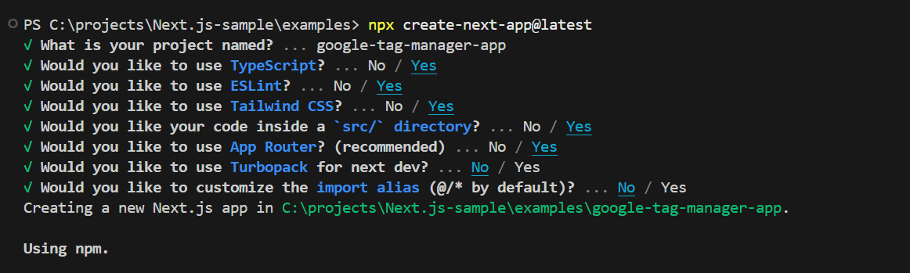

import { Steps, LinkCard } from '@astrojs/starlight/components';

Web サイトを運営する際には、様々なツールを活用することが求められます。これらのツールを利用する際には、Meta データや JavaScript をサイトに適用する必要が生じることがあります。もちろん、CMS を使用して管理することも可能ですが、Google Tag Manager のような汎用的なツールを利用することで、より柔軟かつ効率的な運用が実現できます。

このドキュメントでは、Google Tag Manager を Next.js のプロジェクトに適用する際の手順を紹介します。

## Next.js Pages Router

ここでは Next.js Page Router を利用する際のサンプルを紹介します。なお、公式サイトでも同様の手順が紹介されていますので、最新情報は Next.js のサイトをご覧ください。

<LinkCard
  title="Third Party Libraries - Google Tag Manager - Pages Router"
  href="https://nextjs.org/docs/pages/building-your-application/optimizing/third-party-libraries#google-tag-manager"
  target="_blank"
/>

それでは、サンプルのプロジェクトを作成していきます。

<Steps>

1. Next.js のプロジェクトを作成します。

   ```bash
   npx create-next-app@latest
   ```

   いくつかの選択肢に関しては、以下のように回答をして Pages Router のプロジェクトを作成しました。

   

2. 続いて、今回利用するパッケージ `@next/third-parties@latest` をインストールします。

   ```bash
   npm install @next/third-parties@latest
   ```

3. 全体で利用できるようにするために、`/pages/_app.tsx` にコードを追加します。

   ```tsx {4,7-10}
   // /pages/_app.tsx
   import '@/styles/globals.css';
   import type { AppProps } from 'next/app';
   import { GoogleTagManager } from '@next/third-parties/google';

   export default function App({ Component, pageProps }: AppProps) {
     return (
       <>
         <Component {...pageProps} />
         <GoogleTagManager gtmId="GTM-XYZ" />
       </>
     );
   }
   ```

4. 実際に起動すると、 Google Tag Manager のコードが追加されていることを確認することができました。

   

5. GTM のキーに関して環境変数で管理をするために、 `.env.local` のファイルを作成して以下のように記述します。

   ```txt
   // /.env.local
   NEXT_PUBLIC_GOOGLE_TAG_MANAGER=<your API key here>
   ```

6. .env.local に記述したキーを読み込むために、以下のファイルを書き換えます。

   ```tsx {5}
   // /pages/_app.tsx
   export default function App({ Component, pageProps }: AppProps) {
     return <>
       <Component {...pageProps} />
       <GoogleTagManager gtmId={process.env.NEXT_PUBLIC_GOOGLE_TAG_MANAGER || ""} />
     </>
   ```

</Steps>

上記で紹介をしたサンプルのコードは、以下のリポジトリから参照することができます。

<LinkCard
  title="haramizu / Next.js-sample - google-tag-manager-pages"
  href="https://github.com/haramizu/Next.js-sample/tree/main/examples/google-tag-manager-pages"
  target="_blank"
/>

## Next.js App Router

ここでは Next.js App Router を利用する際のサンプルを紹介します。なお、公式サイトでも同様の手順が紹介されていますので、最新情報は Next.js のサイトをご覧ください。

<LinkCard
  title="Third Party Libraries - Google Tag Manager - App Router"
  href="https://nextjs.org/docs/app/building-your-application/optimizing/third-party-libraries#google-tag-manager"
  target="_blank"
/>

<Steps>

1. Next.js のプロジェクトを作成します。

   ```bash
   npx create-next-app@latest
   ```

   いくつかの選択肢に関しては、以下のように回答をして Pages Router のプロジェクトを作成しました。

   

2. 続いて、今回利用するパッケージ `@next/third-parties@latest` をインストールします。

   ```bash
   npm install @next/third-parties@latest
   ```

3. 全体で利用できるようにするために、`/app/layout.tsx` にコードを追加します。

   ```tsx {2,30}
   // /app/layout.tsx
   import { GoogleTagManager } from '@next/third-parties/google';
   import type { Metadata } from 'next';
   import localFont from 'next/font/local';
   import './globals.css';

   const geistSans = localFont({
     src: './fonts/GeistVF.woff',
     variable: '--font-geist-sans',
     weight: '100 900',
   });
   const geistMono = localFont({
     src: './fonts/GeistMonoVF.woff',
     variable: '--font-geist-mono',
     weight: '100 900',
   });

   export const metadata: Metadata = {
     title: 'Create Next App',
     description: 'Generated by create next app',
   };

   export default function RootLayout({
     children,
   }: Readonly<{
     children: React.ReactNode;
   }>) {
     return (
       <html lang="en">
         <GoogleTagManager gtmId="GTM-XYZ" />
         <body className={`${geistSans.variable} ${geistMono.variable} antialiased`}>
           {children}
         </body>
       </html>
     );
   }
   ```

4. 実際に起動すると、 Google Tag Manager のコードが追加されていることを確認することができました。

   

5. GTM のキーに関して環境変数で管理をするために、 `.env.local` のファイルを作成して以下のように記述します。

   ```txt
   // /.env.local
   NEXT_PUBLIC_GOOGLE_TAG_MANAGER=<your API key here>
   ```

6. .env.local に記述したキーを読み込むために、以下のファイルを書き換えます。

   ```tsx {4}
   // /app/layout.tsx
   return (
     <html lang="en">
       <GoogleTagManager gtmId={process.env.NEXT_PUBLIC_GOOGLE_TAG_MANAGER || ""} />
       <body
         className={`${geistSans.variable} ${geistMono.variable} antialiased`}
       >
         {children}
   ```

</Steps>

上記で紹介をしたサンプルのコードは、以下のリポジトリから参照することができます。

<LinkCard
  title="haramizu / Next.js-sample - google-tag-manager-app"
  href="https://github.com/haramizu/Next.js-sample/tree/main/examples/google-tag-manager-app"
  target="_blank"
/>

## その他の実装

以前にブログで紹介をしていた Next.js での GTM の実装ですが、`react-gtm-module` というパッケージを利用していました。

<LinkCard
  title="react-gtm-module"
  href="https://www.npmjs.com/package/react-gtm-module"
  target="_blank"
/>

上記以外にも GTM と連携させるためのパッケージが提供されていますが、今は Next.js が提供している手順が一番シンプルですので、この実装に関しては省略させていただきます。

## まとめ

Google Tag Manager の実装に関しては、すでに Next.js での実装手順が公式ドキュメントで提供されている形です。このドキュメントだけではなく、公式の手順を参照していただければと思います。

## 参考情報

<LinkCard
  title="Third Party Libraries - Google Tag Manager - Pages Router"
  href="https://nextjs.org/docs/pages/building-your-application/optimizing/third-party-libraries#google-tag-manager"
  target="_blank"
/>
<LinkCard
  title="Third Party Libraries - Google Tag Manager - App Router"
  href="https://nextjs.org/docs/app/building-your-application/optimizing/third-party-libraries#google-tag-manager"
  target="_blank"
/>

