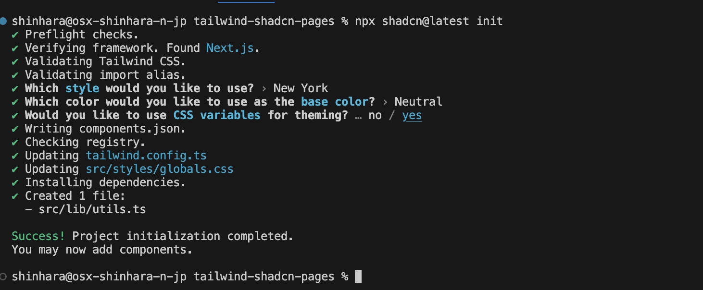

import { Steps, LinkCard } from '@astrojs/starlight/components';

最近話題の、UI コンポーネントの shadcn/ui をこのドキュメントでは評価していきます。shadcn/ui は、UI コンポーネントライブラリとして提供されており、npm パッケージとして提供する形ではないため、使いやすく、カスタマイズ可能なコンポーネントが豊富に揃っています。

主なメリットは以下のようになります。

- **開発速度の向上**: 既存のコンポーネントを利用することで、UIの開発時間を短縮できます。
- **一貫性のあるデザイン**: 統一されたデザインガイドラインに従うことで、アプリケーション全体のデザインの一貫性を保てます。
- **メンテナンスの容易さ**: コンポーネントベースのアーキテクチャにより、コードの再利用性が高まり、メンテナンスが容易になります。

このドキュメントでは、 Next.js のプロジェクトをベースに、 Pages Router としての利用を評価していきます。

## プロジェクトを作成

まず最初に、Next.js のプロジェクトの作成をします。手順に関しては以下のページを参考にして進めて行きます。

<LinkCard
  title="shadcn/ui - Instrations Next.js"
  href="https://ui.shadcn.com/docs/installation/next"
  target="_blank"
/>

それでは早速、プロジェクトを作成して行きます

<Steps>

1. 新しい Next.js のプロジェクトを作成します。

   - **Next.js**: 14.2.18
   - **TypeScript**: Yes
   - **Tailwind CSS**: Yes
   - **App Router**: No

   作成されたプロジェクトは以下の通りです。

   

2. shadcn を利用するための初期化を行います

   ```bash
   npx shadcn@latest init
   ```

   初期化の際に、以下の質問が表示されます。今回はほぼデフォルトで回答をしていきます。

   - **Style**: New York
   - **base color**: Neutral
   - **CSS variables**: yes

   

</Steps>

初期化後に変わっているファイルを確認します。

- 新しく **components.json** および `src/lib/utils.ts` のファイルを追加
- **package.json** に複数の新しいパッケージを追加
  ```tsx {3-6,9-10}
  // package.json
    "dependencies": {
      "class-variance-authority": "^0.7.1",
      "clsx": "^2.1.1",
      "lucide-react": "^0.464.0",
      "next": "14.2.18",
      "react": "^18",
      "react-dom": "^18",
      "tailwind-merge": "^2.5.5",
      "tailwindcss-animate": "^1.0.7"
    },
  ```
- `tailwind.config.ts` の更新
  - Darkmode の追加
  - Color の更新
  - plugin ( tailwindcss-animate ) の追加
- `globals.css` の更新

これで準備が整いました。

## コンポーネントの追加

早速コンポーネントをいくつか追加して行きます。

### Button

インストール手順に記載されているボタンを追加します。

```bash
npx shadcn@latest add button
```

プロジェクトの更新を確認すると以下のようになります。

- コンポーネントファイル `src/components/ui/button.tsx` の追加
- パッケージ `@radix-ui/react-slot` の追加

これで利用できるコンポーネントが追加されました。トップページを以下のように変更しました。

```tsx
// src/pages/index.tsx
import { Button } from '@/components/ui/button';

export default function Home() {
  return (
    <div className="m-10">
      <main>
        <Button>Click me</Button>
      </main>
    </div>
  );
}
```

ボタンが表示されるようになりました。


Button に関しては以下のページでより詳細な利用方法が記載されています。

<LinkCard
  title="shadcn/ui Button"
  href="https://ui.shadcn.com/docs/components/button"
  target="_blank"
/>

### Carousel

続いて Web サイトを作る時の練習によく使われる Carousel を追加します。

```bash
npx shadcn@latest add carousel
```

button.tsx があるが上書きするか？という質問が表示されます。


上書きを選択して、プロジェクトの更新が完了となります。変更点を確認すると以下のようになります。

- コンポーネントファイル `src/components/ui/carousel.tsx` の追加
- パッケージ `embla-carousel-react` の追加

shadcn/ui の Carousel は `embla-carousel-react` を利用していることになります。このパッケージの公式サイトは以下の通りです。

<LinkCard
  title="Embla Carousel - React"
  href="https://www.embla-carousel.com/get-started/react/"
  target="_blank"
/>

作成されたコンポーネントを先ほどと同様にトップページに配置します。

```tsx
// src/pages/index.tsx
import { Button } from '@/components/ui/button';
import {
  Carousel,
  CarouselContent,
  CarouselItem,
  CarouselNext,
  CarouselPrevious,
} from '@/components/ui/carousel';

export default function Home() {
  return (
    <div>
      <main>
        <div className="m-20">
          <Carousel>
            <CarouselContent>
              <CarouselItem>Item 1</CarouselItem>
              <CarouselItem>Item 2</CarouselItem>
              <CarouselItem>Item 3</CarouselItem>
            </CarouselContent>
            <CarouselPrevious />
            <CarouselNext />
          </Carousel>
        </div>
        <div className="m-10">
          <Button>Click me</Button>
        </div>
      </main>
    </div>
  );
}
```

実際の動作している模様は、以下のようになります。


Carousel に関しては以下のページでより詳細な利用方法が記載されています。

<LinkCard
  title="shadcn/ui Carousel"
  href="https://ui.shadcn.com/docs/components/carousel"
  target="_blank"
/>

## まとめ

今回は Button と Carousel のみを紹介しましたが、さまざまな UI が用意されており、これを利用することでより簡単にサイトで利用するコンポーネントを利用することが可能となります。

今回、ここで紹介をした Next.js のプロジェクトは以下のリポジトリで公開をしています。

<LinkCard
  title="haramizu / Next.js sample - tailwind-shadcn-pages"
  href="https://github.com/haramizu/Next.js-sample/tree/main/examples/tailwind-shadcn-pages"
  target="_blank"
/>

## 参考情報

<LinkCard title="chadcn/ui" href="https://ui.shadcn.com/" target="_blank" />

<LinkCard
  title="shadcn/ui - Instrations Next.js"
  href="https://ui.shadcn.com/docs/installation/next"
  target="_blank"
/>

<LinkCard
  title="shadcn/ui Button"
  href="https://ui.shadcn.com/docs/components/button"
  target="_blank"
/>

<LinkCard
  title="shadcn/ui Carousel"
  href="https://ui.shadcn.com/docs/components/carousel"
  target="_blank"
/>

