import { FileTree, Steps, LinkCard } from '@astrojs/starlight/components';

ここでは、Sitecore Search のサンプルを Next.js の初期設定から作り上げていきます。なお、XM Cloud の Headless SXA が Next.js Pages Router をベースとして現在は提供していることもあり、ここでのサンプルも同じように Pages router を利用して作成していきます。

今回は日本語と英語のコンテンツに対する検索サイトを作るのを前提とします。

## Next.js のプロジェクトを作成する

今回は XM Cloud の Next.js のバージョンになるべく近いバージョンということで、このドキュメント作成時では 14.2.18 のバージョンを選択して作成をします。

```bash
npx create-next-app@14.2.18
```

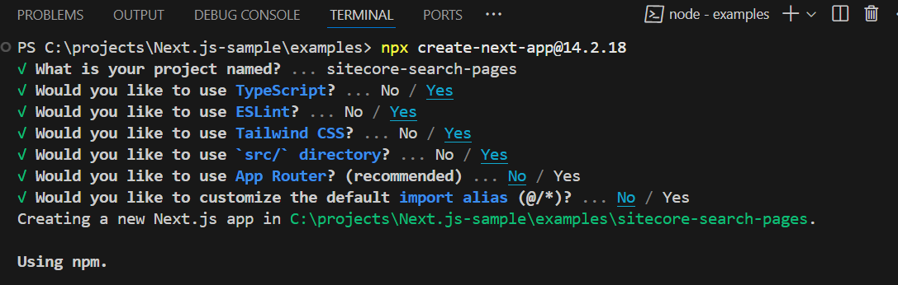

## パッケージを追加する

Sitecore Search の SDK で提供されているパッケージをインストールします。これの手順に関しては、以下のページで提供されています。

<LinkCard
  title="Getting Started"
  href="https://developers.sitecorecloud.io/search-sdk/react/latest/storybook/index.html?path=/docs/introduction-getting-started--page"
  target="_blank"
/>
<LinkCard
  title="Install JS SDK and UI Components for React"
  href="https://doc.sitecore.com/search/en/developers/search-js-sdk-for-react/walkthrough--setting-up-the-react-project.html#install-js-sdk-and-ui-components-for-react"
  target="_blank"
/>
<LinkCard
  title="The basic preview search widget template"
  href="https://doc.sitecore.com/search/en/developers/search-js-sdk-for-react/the-basic-preview-search-widget-template.html"
  target="_blank"
/>

ドキュメントを参考にしながら以下のように進めていきます。

<Steps>

1. React パッケージのインストール

   ```bash
   npm install --save @sitecore-search/react
   ```

2. UI コンポーネントパッケージのインストール

   ```bash
   npm install --save @sitecore-search/ui
   ```

3. Widget コンポーネントを作成するためのパッケージを追加します

   ```bash
   npm install --D @sitecore-search/cli
   ```

4. Widget の作成先となるフォルダを .sc-search-settings.json のファイルを作成して定義する

   ```json
   {
     "widgets-path": "src/widgets"
   }
   ```

5. package.json ファイルの scripts に対して、以下のコマンドを追加します。

   ```json {6}
   "scripts": {
     "dev": "next dev",
     "build": "next build",
     "start": "next start",
     "lint": "next lint",
     "create-widget": "sc-search new-widget"
   },
   ```

</Steps>

これで、Sitecore Search で必要となるパッケージの設定が完了しました。

## 言語切替の実装

### 言語切替コンポーネントの作成

このサンプルは英語、日本語のコンテンツを対象とした検索サービスを作成していきます。

まず、サイトで利用する言語に関する定義を、`src/data/locales.ts` のファイルにて定義します。

```ts
// src/data/locales.ts
export type Language = 'en' | 'ja';

export interface LanguageInfo {
  country: string;
  language: Language;
  label: string;
}

const languages: Record<Language, LanguageInfo> = {
  en: { country: 'us', language: 'en', label: 'English' },
  ja: { country: 'jp', language: 'ja', label: '日本語' },
};

export default languages;
```

続いて、アプリケーション全体で言語設定を共有することができるように、`src/contexts/languageContext.ts` のファイルを作成してコンテキストを共有できるようにします。

```ts
// src/contexts/languageContext.ts
import { createContext } from 'react';
import type { Language } from '@/data/locales';

export const LanguageContext = createContext({
  language: '',
  setLanguage: (l: Language) => {
    console.log(`Language set to: ${l}`);
  },
});

export interface ILanguageContext {
  language: string;
  setLanguage: (t: Language) => void;
}
```

また、言語に関する情報をブラウザのローカルストレージを利用して保持するために、`src/lib/useLocalStorage.ts` のファイルを作成します。

```ts
// src/lib/useLocalStorage.ts
import { useState } from 'react';

export default function useLocalStorage<T>(
  key: string,
  initialValue: T | (() => T)
): [T, (value: T | ((val: T) => T)) => void] {
  const [storedValue, setStoredValue] = useState<T>(() => {
    try {
      const item = typeof window !== 'undefined' && window.localStorage.getItem(key);
      return item
        ? JSON.parse(item)
        : typeof initialValue === 'function'
          ? (initialValue as () => T)()
          : initialValue;
    } catch {
      return typeof initialValue === 'function' ? (initialValue as () => T)() : initialValue;
    }
  });

  const setValue = (value: T | ((val: T) => T)) => {
    try {
      const valueToStore =
        value instanceof Function ? (value as (val: T) => T)(storedValue) : value;
      setStoredValue(valueToStore);
      window.localStorage.setItem(key, JSON.stringify(valueToStore));
    } catch (error) {
      console.error(error);
    }
  };
  return [storedValue, setValue];
}
```

最後に、言語切替コンポーネントとして `src/components/LocaleSelector.tsx` のファイルを以下のように作成します。

```tsx
import { useEffect, useContext } from 'react';
import languages, { Language } from '@/data/locales';
import { LanguageContext, ILanguageContext } from '@/contexts/languageContext';

export default function LocaleSelector() {
  const { language, setLanguage } = useContext<ILanguageContext>(LanguageContext);

  useEffect(() => {
    const savedLanguage = window.localStorage.getItem('lang') as Language | null;
    if (savedLanguage && languages[savedLanguage]) {
      setLanguage(savedLanguage);
    }
  }, [setLanguage]);

  const handleLanguageChange = (event: React.ChangeEvent<HTMLSelectElement>) => {
    const newLanguage = event.target.value as Language;
    setLanguage(newLanguage);

    window.localStorage.setItem('lang', newLanguage);
  };

  return (
    <div>
      <select onChange={handleLanguageChange} value={language || ''}>
        <option value="">Select a language</option>
        {Object.keys(languages).map((key) => (
          <option key={key} value={key}>
            {languages[key as Language].label}
          </option>
        ))}
      </select>
      <p></p>
    </div>
  );
}
```

これでコンポーネントの準備ができました。

### コンポーネントを実装する

作成をした言語切替コンポーネントを、実際に動くように実装をしていきます。まず、作成をした各種コンポーネントを src/pages/\_app.tsx に対して実装をしていきます。以下が変更後のコードとなります。

```tsx
// src/pages/_app.tsx
import '@/styles/globals.css';
import { useEffect, useState } from 'react';
import type { AppProps } from 'next/app';
import { LanguageContext } from '@/contexts/languageContext';
import useStorage from '@/lib/useLocalStorage';
import { Language } from '@/data/locales';
import LocaleSelector from '@/components/LocaleSelector';

export default function App({ Component, pageProps }: AppProps) {
  const [storageLanguage, setStorageLanguage] = useStorage('lang', 'en' as Language);
  const [language, setLanguage] = useState<Language>(storageLanguage);

  useEffect(() => {
    setStorageLanguage(language);
  }, [language, setStorageLanguage]);
  return (
    <LanguageContext.Provider value={{ language, setLanguage }}>
      <LocaleSelector />
      <Component {...pageProps} />
    </LanguageContext.Provider>
  );
}
```

実際のページに表示するために、トップページのコンテンツを以下のコードに変更します。

```tsx
// src/pages/index.tsx
import Head from 'next/head';

export default function Home() {
  return (
    <>
      <Head>
        <title>Create Next App</title>
        <meta name="description" content="Generated by create next app" />
        <meta name="viewport" content="width=device-width, initial-scale=1" />
        <link rel="icon" href="/favicon.ico" />
      </Head>
      <main>
        <h1>Hello Sitecore Search</h1>
      </main>
    </>
  );
}
```

実行結果は以下のようになり、言語の切替を実行すると、ローカルストレージの lang に対して選択した言語の情報が保存されます。


## 最初の Widgets を追加

Next.js 側の準備が完了した状況ですので、今度は Widget を利用して検索ができるように作成をしていきます。

### PreviewSearch の追加

まず最初に、`PreviewSearch` の Widget をトップページに実装していきます。

<Steps>

1. Widget を作成するために、以下のコマンドを実行します。

   ```bash
   npm run create-widget
   ```

   以下のように回答していきます。

   - **What language do you want to support?**: Typescript
   - **What entity do you want to implement?**: Content
   - **What kind of template do you want to create?**: PreviewSearchBasic
   - **What version do you want?**: Tailwind
   - **.sc-search-settings.json で指定したフォルダに保存するか？**: Yes
   - **Please enter the name of the component to create**: 何も入力せずに Enter

   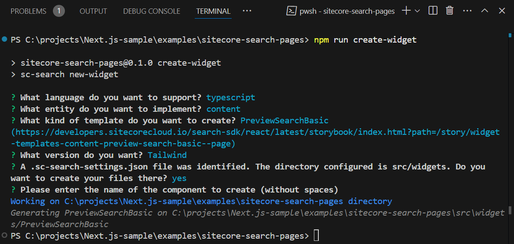

2. 以下のファイルが作成されます

   <FileTree>

   - src
     - widgets
       - components
         - Spinner
           - index.tsx
     - PreviewSearchBasic
       - index.tsx

   </FileTree>

3. 上記の追加されるウィジットに対して、Tailwind CSS が有効になるように、tailwind.config.ts に以下の１行を追加します。

   ```diff lang="tsx"
   import type { Config } from "tailwindcss";

   const config: Config = {
     content: [
       "./src/pages/**/*.{js,ts,jsx,tsx,mdx}",
      "./src/components/**/*.{js,ts,jsx,tsx,mdx}",
       "./src/app/**/*.{js,ts,jsx,tsx,mdx}",
   +    "./src/widgets/**/*.{js,ts,jsx,tsx,mdx}",
     ],
   ```

</Steps>

これで PreviewSearch の Widget の準備ができました

### Widget に関する設定を追加する

作成をした Widget を Next.js で利用できるようにするために、以下のコードの変更を進めていきます。

Sitecore Search に接続するための環境変数として、 `.env.local` ファイルを作成して値を設定します。

```txt
// .env.local
NEXT_PUBLIC_SEARCH_ENV=
NEXT_PUBLIC_SEARCH_CUSTOMER_KEY=
NEXT_PUBLIC_SEARCH_API_KEY=
NEXT_PUBLIC_SEARCH_PATH=/
```

上記のファイルが準備できたところで、 `src/pages/_app.tsx` に対して必要なコードを追加していきます。

- Widget が必要とする `WidgetsProvider`、 `PageController` と `Environment` をインポート
- `PageController` が利用する言語として `Locales` を追加
- `WidgetsProvider` が利用する環境変数を、 `@/data/search` からインポート
- `PageController` の処理を追加
- `WidgetsProvider` を `LanguageContext` と利用できるように追加

結果は以下の通りです。

```diff lang="tsx" ins=/(locales,)/
//src/pages/_app.tsx
import '@/styles/globals.css';
import { useEffect, useState } from 'react';
import type { AppProps } from 'next/app';
import { LanguageContext } from '@/contexts/languageContext';
import useStorage from '@/lib/useLocalStorage';
import locales, { Language } from '@/data/locales';
import LocaleSelector from '@/components/LocaleSelector';
+import { PageController, WidgetsProvider } from '@sitecore-search/react';
+import { SEARCH_ENV, SEARCH_CUSTOMER_KEY, SEARCH_API_KEY } from '@/data/search';
+import type { Environment } from '@sitecore-search/data';

export default function App({ Component, pageProps }: AppProps) {
  const [storageLanguage, setStorageLanguage] = useStorage('lang', 'en' as Language);
  const [language, setLanguage] = useState<Language>(storageLanguage);

+  PageController.getContext().setLocaleLanguage(language);
+  PageController.getContext().setLocaleCountry(locales[language].country);

  useEffect(() => {
+    PageController.getContext().setLocaleLanguage(language);
+    PageController.getContext().setLocaleCountry(locales[language].country);
    setStorageLanguage(language);
  }, [language, setStorageLanguage]);
  return (
    <LanguageContext.Provider value={{ language, setLanguage }}>
+      <WidgetsProvider
+        env={SEARCH_ENV as Environment}
+        customerKey={SEARCH_CUSTOMER_KEY}
+        apiKey={SEARCH_API_KEY}
+      >
        <LocaleSelector />
        <Component {...pageProps} />
+      </WidgetsProvider>
    </LanguageContext.Provider>
  );
}
```

これでウィジットを配置する準備ができました。まず、 `src/pages/index.tsx` にウィジットを配置します。

```diff lang="tsx"
// src/pages/index.tsx
import Head from "next/head";
+import PreviewSearch from "@/widgets/PreviewSearchBasic";

export default function Home() {
  return (
    <>
      <Head>
        <title>Create Next App</title>
        <meta name="description" content="Generated by create next app" />
        <meta name="viewport" content="width=device-width, initial-scale=1" />
        <link rel="icon" href="/favicon.ico" />
      </Head>
      <main>
        <h1>Hello Sitecore Search</h1>
+        <div>{<PreviewSearch rfkId="rfkid_6"></PreviewSearch>}</div>
      </main>
    </>
  );
}
```

実行結果は以下のようになります。スタイルシートなど何も未調整のため、縦に検索結果が並んでいますが、正しく動作しています。

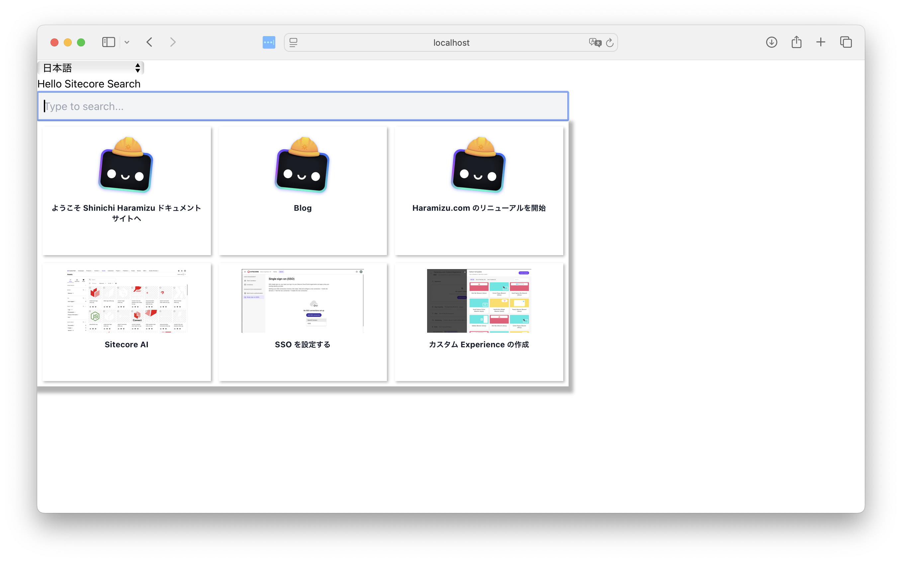

## Header の作成

このサンプルサイトの Header を作成するにあたって、左上にロゴ、中央に検索ボックス、右側に言語切り替えを配置したヘッダーを作成していきます。

### Header コンポーネントの追加

まず Header に関しては以下のコンポーネントを配置します。

```tsx
// src/components/Header.tsx
import LocaleSelector from '@/components/LocaleSelector';
import PreviewSearch from '@/widgets/PreviewSearchBasic';
import Image from 'next/image';

export default function Header() {
  return (
    <>
      <header className="m-6 flex flex-wrap">
        <div className="w-6/12 md:w-3/12">
          <Image
            src="/search-horizontal-color-black-txt.svg"
            alt="Search Logo"
            width="120"
            height="40"
          />
        </div>
        <div className="hidden md:flex md:w-6/12 md:justify-center">
          <div className="w-full">
            <PreviewSearch rfkId="rfkid_6"></PreviewSearch>
          </div>
        </div>
        <div className="flex w-6/12 justify-end md:w-3/12">
          <LocaleSelector />
        </div>
      </header>
    </>
  );
}
```

上記のヘッダーの追加に合わせて、Next.js のファイルを変更します。まず、 `src/pages/_app.tsx` で `Header` を読み込む形に変更をします。

```diff lang="tsx"
// src/pages/_app.tsx
import '@/styles/globals.css';
import { useEffect, useState } from 'react';
import type { AppProps } from 'next/app';
import { LanguageContext } from '@/contexts/languageContext';
import useStorage from '@/lib/useLocalStorage';
import locales, { Language } from '@/data/locales';
-import LocaleSelector from '@/components/LocaleSelector';
import { PageController, WidgetsProvider } from '@sitecore-search/react';
import { SEARCH_ENV, SEARCH_CUSTOMER_KEY, SEARCH_API_KEY } from '@/data/search';
import type { Environment } from '@sitecore-search/data';
+import Header from "@/components/Header";

export default function App({ Component, pageProps }: AppProps) {
  const [storageLanguage, setStorageLanguage] = useStorage('lang', 'en' as Language);
  const [language, setLanguage] = useState<Language>(storageLanguage);

  PageController.getContext().setLocaleLanguage(language);
  PageController.getContext().setLocaleCountry(locales[language].country);

  useEffect(() => {
    PageController.getContext().setLocaleLanguage(language);
    PageController.getContext().setLocaleCountry(locales[language].country);
    setStorageLanguage(language);
  }, [language, setStorageLanguage]);
  return (
    <LanguageContext.Provider value={{ language, setLanguage }}>
      <WidgetsProvider
        env={SEARCH_ENV as Environment}
        customerKey={SEARCH_CUSTOMER_KEY}
        apiKey={SEARCH_API_KEY}
      >
-        <LocaleSelector />
+        <Header />
        <Component {...pageProps} />
      </WidgetsProvider>
    </LanguageContext.Provider>
  );
}
```

続いて `src/pages/index.tsx` のページに追加していた `PreviewSearch` を削除します。

```diff lang="tsx"
// src/pages/index.tsx
import Head from "next/head";
-import PreviewSearch from "@/widgets/PreviewSearchBasic";

export default function Home() {
  return (
    <>
      <Head>
        <title>Create Next App</title>
        <meta name="description" content="Generated by create next app" />
        <meta name="viewport" content="width=device-width, initial-scale=1" />
        <link rel="icon" href="/favicon.ico" />
      </Head>
      <main>
        <h1>Hello Sitecore Search</h1>
-        <div>{<PreviewSearch rfkId="rfkid_6"></PreviewSearch>}</div>
      </main>
    </>
  );
}
```

最後に、`PreviewSearch` の横幅が 800 で固定されているため、このサイズを変更します。

```diff lang="tsx" ins=/(w-full)/
// src/widgets/PreviewSearchBasic/index.tsx
  return (
    <PreviewSearch.Root>
      <PreviewSearch.Input
        className="w-full box-border py-2 px-2 focus:outline-solid focus:outline-1 focus:outline-gray-500 border-2 bg-gray-100 dark:bg-gray-700 dark:text-gray-100"

```

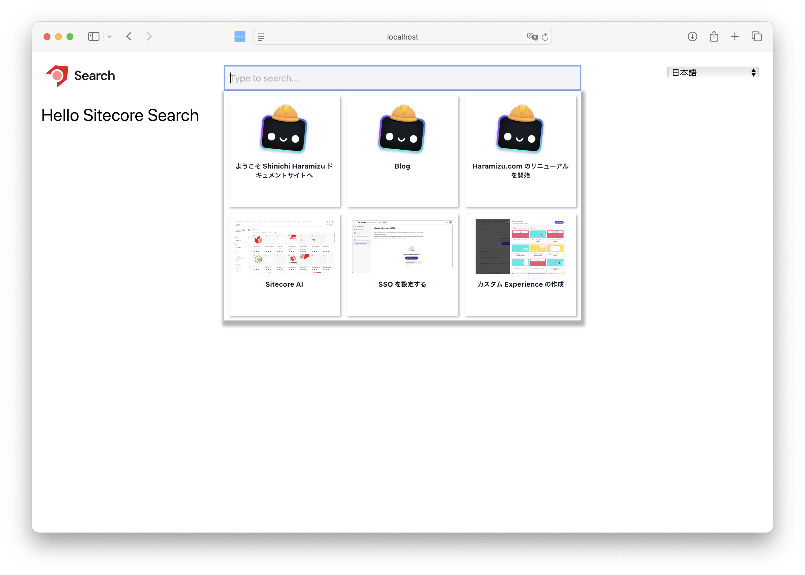

### ダークモードの追加

Sitecore Search の Widget はダークモードにも対応しています。そこで、この Next.js のサンプルもダークモードに対応していきます。

<Steps>

1. next-themes のパッケージをインストールします。

   ```bash
   npm install next-themes
   ```

2. Tailwind CSS の設定ファイルとなる `tailwind.config.ts` にダークモードの１行を追加します。

   ```diff lang="ts"
   // tailwind.config.ts
   import type { Config } from "tailwindcss";

   const config: Config = {
     content: [
       "./src/pages/**/*.{js,ts,jsx,tsx,mdx}",
       "./src/components/**/*.{js,ts,jsx,tsx,mdx}",
       "./src/app/**/*.{js,ts,jsx,tsx,mdx}",
       "./src/widgets/**/*.{js,ts,jsx,tsx,mdx}",
     ],
   +  darkMode: 'class',
     plugins: [],
   };
   export default config;
   ```

3. Next.js 全体でダークモードの切り替えに関して有効になるように、 `src/pages/_app.tsx` を変更します。なお、追加する行がわかりやすいようにしており、下記のコードは省略されている部分があります。

   ```diff lang="tsx"
   // src/pages/_app.tsx
   import type { Environment } from "@sitecore-search/data";
   import Header from "@/components/Header";
   + import { ThemeProvider } from "next-themes";

   export default function App({ Component, pageProps }: AppProps) {

     return (
   +    <ThemeProvider attribute="class" defaultTheme="system" enableSystem>
         <LanguageContext.Provider value={{ language, setLanguage }}>
           <WidgetsProvider
             env={SEARCH_ENV as Environment}
             customerKey={SEARCH_CUSTOMER_KEY}
             apiKey={SEARCH_API_KEY}
           >
             <Header />
             <Component {...pageProps} />
           </WidgetsProvider>
         </LanguageContext.Provider>
   +    </ThemeProvider>
     );
   }
   ```

4. モード切り替え用のコンポーネントとして `src/components/mode.tsx` を作成する。

   ```tsx
   // src/components/mode.tsx
   import { useState, useEffect } from 'react';

   export default function DarkModeToggle() {
     const [isDarkMode, setIsDarkMode] = useState(false);

     useEffect(() => {
       const darkModeClass = 'dark';
       const element = document.documentElement;

       if (isDarkMode) {
         element.classList.add(darkModeClass);
         element.style.colorScheme = 'dark';
       } else {
         element.classList.remove(darkModeClass);
         element.style.colorScheme = 'light';
       }
     }, [isDarkMode]);

     const toggleDarkMode = () => {
       setIsDarkMode(!isDarkMode);
     };

     return (
       <button
         onClick={toggleDarkMode}
         className="mr-4 bg-gray-200 p-2 text-black dark:bg-gray-800 dark:text-white"
       >
         Mode
       </button>
     );
   }
   ```

5. ヘッダーに関して、言語切り替えのコンポーネントの前に上記のコンポーネントを配置します。合わせて、高さを揃えるように書き換えます。

   ```diff lang="tsx" ins=/(items-center)/
   // src/components/Header.tsx
   import Image from "next/image";
   +import DarkModeToggle from "./mode";

   export default function Header() {
     return (
       <>
         <header className="flex flex-wrap m-6">

           <div className="w-6/12 md:w-3/12 flex justify-end items-center">
             <DarkModeToggle />
   +          <LocaleSelector />
           </div>
         </header>
       </>
     );
   }
   ```

</Steps>

以下のようにボタンをクリックするとモードが切り替わるようになりました。


## 検索結果のページ作成

PreviewSearch の検索ボックスではなく、検索結果をページとして表示をするためのページを追加します。今回は、`src/pages/index.tsx` のファイルをコピーして、`src/pages/search/index.tsx` を作成します。

### PreviewSearch の変更

上記まで実装していた PreviewSearch のウィジットは、Input ボックスに文字を入力すると、その中のキーワードを利用して検索結果を表示する仕組みとなっていました。これを変更して、Form のタグを組み合わせて次のページに遷移するようにしていきます。

まず、Form のタグを追加します。

```diff lang="tsx"
// src/widgets/PreviewSearchBasic/index.tsx
  return (
    <PreviewSearch.Root>
+      <form onSubmit={handleSubmit}>
        <PreviewSearch.Input
          className="w-full box-border py-2 px-2 focus:outline-solid focus:outline-1 focus:outline-gray-500 border-2 bg-gray-100 dark:bg-gray-700 dark:text-gray-100"
          onChange={keyphraseHandler}
          autoComplete="off"
          placeholder="Type to search..."
        />
+      </form>
      <PreviewSearch.Content
```

続いて Form に Submit した場合の handleSubmit を以下のように実装します。なお、いくつかインポートで追加しているため、その部分も表示すると以下のような形です。

```diff lang="tsx" ins=/(SyntheticEvent)/
// src/widgets/PreviewSearchBasic/index.tsx
import type { ChangeEvent, SyntheticEvent } from "react";
+import { useRouter } from "next/router";

//

export const PreviewSearchBasicComponent = ({ defaultItemsPerPage = 6 }) => {
+  const router = useRouter();

  //

+  const handleSubmit = (e: SyntheticEvent): void => {
+    e.preventDefault();
+    const target = (e.target as HTMLFormElement).querySelector(
+      "input"
+    ) as HTMLInputElement;
+    router.push(`/search?q=${target.value}`);
+    target.value = "";
+  };

  return (
```

上記の変更をすることで、キーワードを検索結果のページに渡せるようになりました。検索キーワードの確認をするために、コピーをして用意したファイル `src/pages/search/index.tsx` を変更します。

```tsx
// src/pages/search/index.tsx
import Head from 'next/head';
import { useRouter } from 'next/router';
import { useEffect, useState } from 'react';

export default function Home() {
  const router = useRouter();
  const [keyword, setKeyword] = useState('');

  useEffect(() => {
    if (router.isReady) {
      const query = router.query.q as string;
      setKeyword(query || '');
    }
  }, [router.isReady, router.query.q]);

  return (
    <>
      <Head>
        <title>Sitecore Search: Results</title>
        <meta name="description" content="Generated by create next app" />
        <meta name="viewport" content="width=device-width, initial-scale=1" />
        <link rel="icon" href="/favicon.ico" />
      </Head>
      <main>
        <h1 className="m-4 text-3xl">Search Results</h1>
        <p className="m-4 text-xl">Keyword: {keyword}</p>
      </main>
    </>
  );
}
```

キーワードを /search のページで取得することができました。

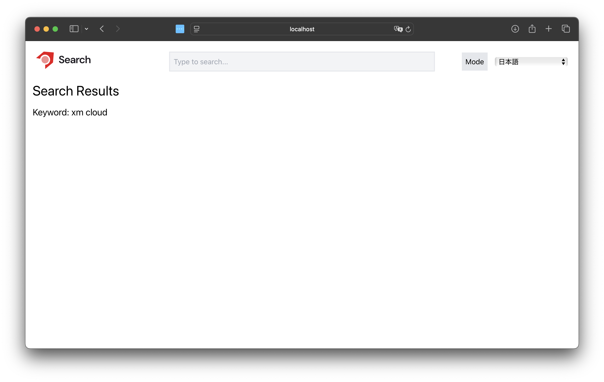

### SearchResult の追加

今回のサンプルページでは、SDK が提供しているウィジットの `Basic Search Results` を追加します。

<LinkCard
  title="Basic Search Results"
  href="https://developers.sitecorecloud.io/search-sdk/react/latest/storybook/index.html?path=/docs/widget-templates-content-search-results-basic--page"
  target="_blank"
  description="A search results widget allows visitors to run keyword searches. The response is displayed in a paginated grid or list."
/>

ウィジットの追加は、コマンドを実行します。

```bash
npm run create-widget
```

今回、選択をするウィジットは `SearchResults` を選択します。

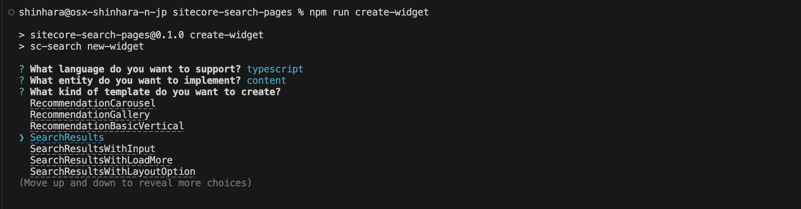

ウィジットと合わせて、ウィジットが利用する必要なファイルが追加されます。

<FileTree>

- src
  - widgets
    - components
      - ArticleHorizontalCard
        - index.tsx
      - Filter
        - index.tsx
      - QueryResultsSummary
        - index.tsx
      - ResultsPerPage
        - index.tsx
      - SearchFacets
        - index.tsx
      - SearchPagination
        - index.tsx
      - SortOrder
        - index.tsx
  - SearchResults
    - index.tsx

</FileTree>

追加されたウィジットを Search のページで利用するために、コードを以下のように変更をします。

```diff lang="tsx"
// src/pages/search/index.tsx
import Head from 'next/head';
import { useRouter } from 'next/router';
import { useEffect, useState } from 'react';
+import SearchResults from '@/widgets/SearchResults';

export default function Home() {
  const router = useRouter();
  const [keyword, setKeyword] = useState('');

  useEffect(() => {
    if (router.isReady) {
      const query = router.query.q as string;
      setKeyword(query || '');
    }
  }, [router.isReady, router.query.q]);

  return (
    <>
      <Head>
        <title>Sitecore Search: Results</title>
        <meta name="description" content="Generated by create next app" />
        <meta name="viewport" content="width=device-width, initial-scale=1" />
        <link rel="icon" href="/favicon.ico" />
      </Head>
      <main>
        <h1 className="m-4 text-3xl">Search Results</h1>
        <p className="m-4 text-xl">Keyword: {keyword}</p>
+        <SearchResults key={`${keyword}-search`} rfkId="rfkid_7" defaultKeyphrase={keyword} />
      </main>
    </>
  );
}
```

実際にキーワードを入力して実行をします。この段階では、結果が 0 件となっています。エラー画面として表示されているのは、`sorting option 'featured_desc' not configured` というメッセージになります。

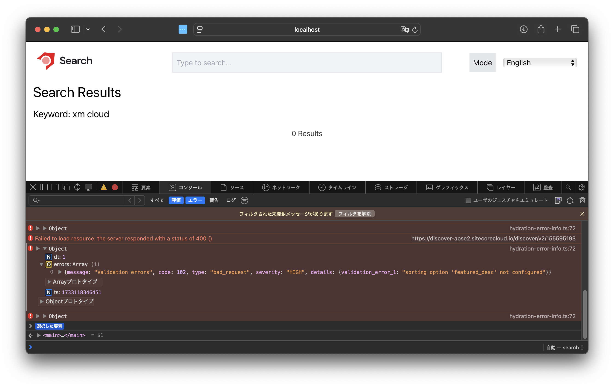

この原因は、 Sitecore Search の表示順に、この `おすすめ順` となる設定が含まれていないため、結果を取得できていない形となります。

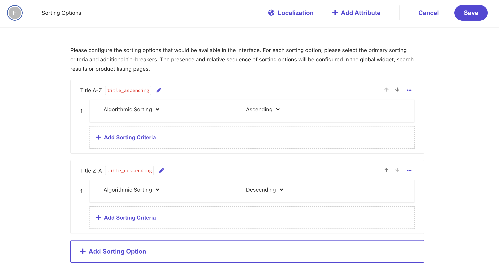

今回は新しく作成する前に、動作させるのが目的となっているので、並び順を `title_ascending` に変更をします。

```diff lang="tsx" ins=/(title_ascending)/
// src/widgets/SearchResults/index.tsx
export const SearchResultsComponent = ({
  defaultSortType = "title_ascending",
  defaultPage = 1,
  defaultKeyphrase = "",
  defaultItemsPerPage = 24,
}: ArticleSearchResultsProps) => {
  const {
```

変更したあと、あらためて実行をすると検索結果が表示されました。

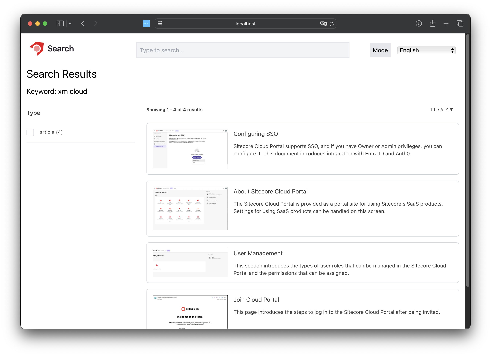

### Build エラーの修正

上記のように検索が動作するようになりましたが、build を実行するとエラーが表示されます。

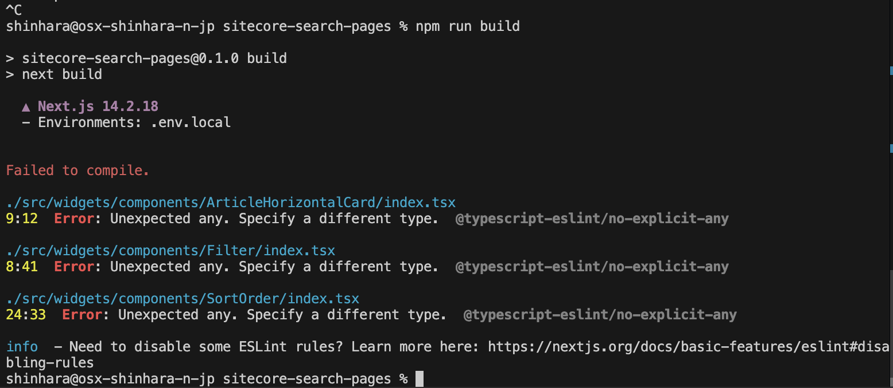

これは標準で提供されるウィジットのインターフェイスで `any` を利用しているためです。以下のファイルを修正していきます。

```diff lang="tsx"
// src/widgets/components/ArticleHorizontalCard/index.tsx
type ArticleCardItemCardProps = {
  className?: string;
  displayText?: boolean;
-  article: any;
+  article: {
+    id: string;
+    image_url?: string;
+    url: string;
+    name?: string;
+    title?: string;
+    author?: string;
+    description?: string;
+    source_id: string;
+  };
  onItemClick: ActionProp<ItemClickedAction>;
  index: number;
};
```

```diff lang="tsx" ins=/(SelectedFacet)/ del=/(any)/
// src/widgets/components/Filter/index.tsx
const buildRangeLabel = (min: number | undefined, max: number | undefined): string => {
  return typeof min === 'undefined' ? `< $${max}` : typeof max === 'undefined' ? ` > $${min}` : `$${min} - $${max}`;
};

+interface SelectedFacet {
+  facetId: string;
+  facetLabel?: string;
+  valueLabel?: string | undefined;
+  min?: number;
+  max?: number;
+}

const buildFacetLabel = (selectedFacet: any SelectedFacet) => {
  if ('min' in selectedFacet || 'max' in selectedFacet) {
    return `${buildRangeLabel(selectedFacet.min, selectedFacet.max)}`;
  }
  return `${selectedFacet.valueLabel}`;
};
```

```diff lang="tsx"
// examples/sitecore-search-pages/src/widgets/components/SortOrder/index.tsx
      <SortSelect.Content className="bg-gray-100 dark:bg-gray-700 shadow-[2px_2px_4px_#CFCFCF] z-[100] absolute top-8 focus-within:border-gray-700 min-w-[150px] rounded-md">
        <SortSelect.Viewport className="p-1 z-[50000]">
-          {options.map((option: any) => (
+          {options.map((option: SearchResponseSortChoice) => (
            <SortSelect.Option
```

上記の変更をしたあと、あらためて build を実行すると今度は SearchResults のウィジットでエラーが発生します。これに関しては、url と source_id を必須の値とすることで build を完了させることができます。

```diff lang="tsx"
// src/widgets/SearchResults/index.tsx
type ArticleModel = {
  id: string;
  type?: string;
  title?: string;
  name?: string;
  subtitle?: string;
-  url?: string;
+  url: string;
  description?: string;
  content_text?: string;
  image_url?: string;
-  source_id?: string;
+  source_id: string;
};
```

エラーをこれで解消することができ、無事 build が完了します。

## コンテンツページの作成

検索サイトでは、検索結果をクリックすると対象のページを表示するように構成をしますが、今回のサンプルサイトでは対象となるページについて Sitecore Search が持っている情報を確認できるページを用意します。

### 検索結果のページの準備

ID を利用してページを表示するように構成をするため、まず以下のページを作成しました。

```tsx
// src/pages/detail/[id]/index.tsx
import { useRouter } from 'next/router';

export default function Detail() {
  const router = useRouter();
  const { id } = router.query;

  return (
    <div>
      <h1>Detail Page</h1>
      <p>ID: {id}</p>
    </div>
  );
}
```

実際に、`http://localhost:3000/detail/test` という URL でアクセスをした際には、以下のような結果が表示されています。

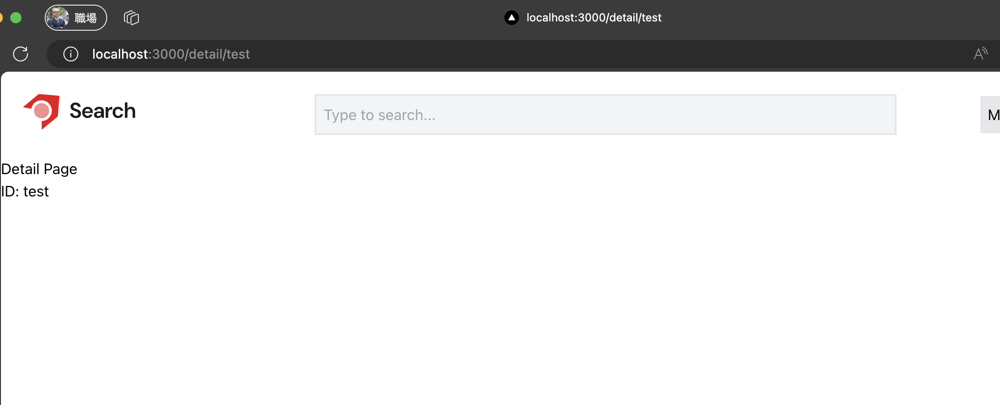

### 検索結果を取得する

今回は Sitecore Search SDK のコードを参考にして詳細ページを作成していきます。サンプルは以下のコードが Widget のコードになります。

<LinkCard
  title="Article Detail"
  href="https://github.com/Sitecore/Sitecore-Search-TS-SDK-Starter-Kit/blob/main/src/widgets/ArticleDetail/index.tsx"
  target="_brank"
/>

今回はページ自体を以下のように書き換えています。

```tsx
// src/pages/detail/[id]/index.tsx
import { useRouter } from 'next/router';
import Image from 'next/image';
import type { ArticleModel } from '@/widgets/SearchResults';
import type { SearchResultsInitialState } from '@sitecore-search/react';
import { FilterEqual, WidgetDataType, useSearchResults, widget } from '@sitecore-search/react';
import Link from 'next/link';

type ArticleDetailProps = {
  id: string;
};

type InitialState = SearchResultsInitialState<'itemsPerPage'>;

const ArticleDetailComponent = ({ id }: ArticleDetailProps): JSX.Element => {
  const {
    queryResult: { data: { content: articles = [] } = {} },
  } = useSearchResults<ArticleModel, InitialState>({
    query: (query) => {
      const equalFilter = new FilterEqual('id', id);
      query.getRequest().setSearchFilter(equalFilter);
    },
    state: {
      itemsPerPage: 1,
    },
  });

  useEffect(() => {
    refetch();
  }, [id, refetch]);

  let mainArticle: ArticleModel = {
    id: '',
    title: '',
    url: '',
    source_id: '',
  };
  if (articles.length > 0) {
    mainArticle = articles[0];
  }

  return (
    <div className="m-7 flex">
      <div className="flex-shrink-0">
        <Image
          className="max-w-[300px]"
          src={mainArticle.image_url || '/search-horizontal-color-black-txt.svg'}
          alt={mainArticle.title || 'Article Image'}
          width={500}
          height={300}
        />
      </div>
      <div className="ml-4">
        <h1 className="mb-5 w-full text-xl font-bold text-gray-700 dark:text-gray-100">
          Title: {mainArticle.name}
        </h1>
        <div className="mb-5 text-left text-gray-700 dark:text-gray-100">
          Description: {mainArticle?.description}
        </div>
        <div>
          <Link href={mainArticle?.url || '/'} target="_blank">
            <button className="float-right rounded bg-blue-500 px-4 py-2 text-white hover:bg-blue-700">
              More detail
            </button>
          </Link>
        </div>
      </div>
    </div>
  );
};

const ArticleDetailWidget = widget(
  ArticleDetailComponent,
  WidgetDataType.SEARCH_RESULTS,
  'content'
);

export default function Detail() {
  const router = useRouter();
  const { id } = router.query;

  if (!id) {
    return <div>Loading...</div>;
  }

  return (
    <div>
      <h1 className="m-4 text-3xl font-bold">Detail Page</h1>
      <p className="m-4">ID: {id}</p>
      <ArticleDetailWidget id={id as string} rfkId="rfkid_7" />
    </div>
  );
}
```

また、このページで利用する検索結果のインターフェイスとして利用するために、`ArticleModel` に export を追加しました。

```diff lang="tsx" ins=/(export)/
// src/widgets/SearchResults/index.tsx
export type ArticleModel = {
  id: string;
  type?: string;
  title?: string;
  name?: string;
  subtitle?: string;
  url: string;
  description?: string;
  content_text?: string;
  image_url?: string;
  source_id: string;
};
```

また、検索結果の画像を Next.js で利用できるようにするために、 next.config.mjs のファイルに以下のコードを追加しています。

```diff lang="json"
// next.config.mjs
const nextConfig = {
  reactStrictMode: true,
+  images: {
+    remotePatterns: [
+      {
+        protocol: "https",
+        hostname: "doc.haramizu.com",
+        port: "",
+        pathname: "/**",
+      },
+    ],
+  },
};
```

上記の作業の結果、ID を利用して結果を表示することが可能となりました。

### リンクの調整

結果のページに対してアクセスをすることができるように、`PreviewSearch` で表示された項目をクリックしたときのページの遷移、そして `SearchResults` の結果で表示されている `ArticleHorizontalCard` にも同様にクリックをしたときの動作を追加します。

```diff lang="tsx"
// src/widgets/PreviewSearchBasic/index.tsx
                      <PreviewSearch.Item key={article.id} asChild>
                        <PreviewSearch.ItemLink
                          href={article.url}
                          onClick={() => {
                            onItemClick({
                              id: article.id,
                              index,
                              sourceId: article.source_id,
                            });
+                            window.location.href = `/detail/${article.id}`;
                          }}
                          className="flex box-border no-underline w-full text-black focus:shadow-md"
                        >
```

```diff lang="tsx"
// src/widgets/components/ArticleHorizontalCard/index.tsx

+import { useRouter } from "next/router";

//

}: ArticleCardItemCardProps) => {
+  const router = useRouter();

  return (

//

        <a
          className="focus:outline-indigo-500"
          href={article.url}
          onClick={(event) => {
            event.preventDefault();
            onItemClick({
              id: article.id,
              index,
              sourceId: article.source_id,
            });
+            router.push(`/detail/${article.id}`);
          }}
        >
```

これで、検索結果を表示するページにリンクを貼ることができました。

## まとめ

今回は、バニラな Next.js + Tailwind CSS の環境に対して、Sitecore Search の検索結果を表示するための手順を確認しました。ウィジットを追加して、Next.js で表示できるようにする、という手順を進めていった形です。

ここで紹介をしたコードに関して、フッターを追加したりしている部分もありますが、以下のサイトで全てのコードを共有しています。

<LinkCard
  title="GitHub Sample"
  href="https://github.com/haramizu/Next.js-sample/tree/main/examples/sitecore-search-pages"
  target="_brank"
/>

また、体験できるように以下のサイトで今回のコードを利用して動かしています。

<LinkCard
  title="Sample site: https://search.haramizu.com/"
  href="https://search.haramizu.com/"
  target="_brank"
/>

## 参考情報

<LinkCard
  title="Getting Started"
  href="https://developers.sitecorecloud.io/search-sdk/react/latest/storybook/index.html?path=/docs/introduction-getting-started--page"
  target="_blank"
/>
<LinkCard
  title="Install JS SDK and UI Components for React"
  href="https://doc.sitecore.com/search/en/developers/search-js-sdk-for-react/walkthrough--setting-up-the-react-project.html#install-js-sdk-and-ui-components-for-react"
  target="_blank"
/>
<LinkCard
  title="The basic preview search widget template"
  href="https://doc.sitecore.com/search/en/developers/search-js-sdk-for-react/the-basic-preview-search-widget-template.html"
  target="_blank"
/>

<LinkCard
  title="Sitecore / Sitecore-Search-TS-SDK-Starter-Kit"
  href="https://github.com/Sitecore/Sitecore-Search-TS-SDK-Starter-Kit"
  target="_brank"
/>

