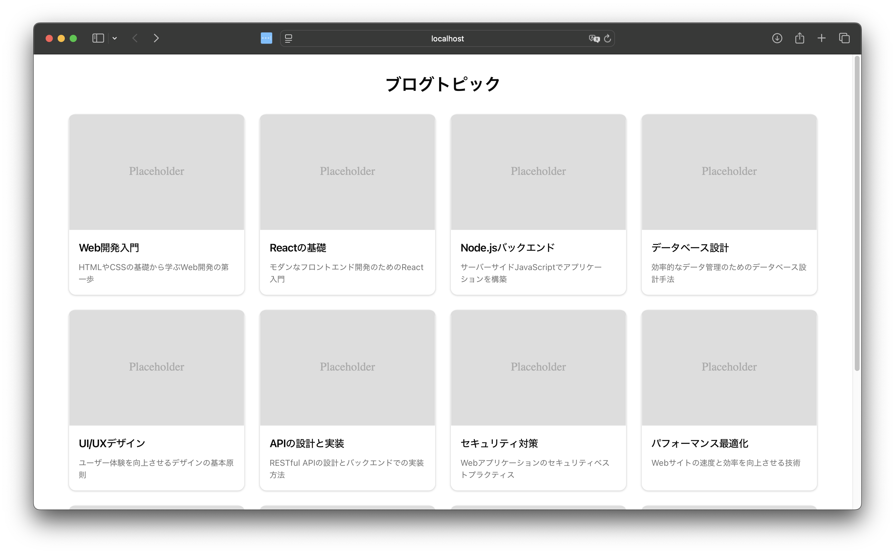

import { FileTree, Steps, LinkCard } from '@astrojs/starlight/components';

Vercel が提供している新しいサービスとして v0 というサービスがあります。このサービスを利用することで、簡単に Web のコンポーネント開発を生成 AI を利用して作っていくことができます。今回は、この v0 を利用する標準的な手続きを紹介していきます。

## v0 概要

Vercel は様々なアプリをホスティングすることができるサービスを提供している会社です。また、実際に Web サイト構築にあたって便利なツールとなる Next.js も提供しています。

今回取り上げる v0 は、生成 AI を利用して Web コンポーネントを作成してくれるサービスです。

### v0 by Vercel

サイトにアクセスをすると、以下のようにコマンドを入れるだけのシンプルなページが表示されます。


この画面にプロンプトを入力して、様々な UI を生成することが可能となります。なお、日本語の UI もプレビューで公開されています。


### 料金プランについて

v0 を利用する場合のプランとして、回数や機能に制限が設定されている無料プランから、サブスクリプションを購読して利用できるプランが用意されています。評価をするためであれば、無料プランを利用して検証をすることが可能です。

料金プランに関しては以下のページを参照してください。

<LinkCard title="Plans and Pricing" href="https://v0.dev/pricing" target="_blank" />

## コンポーネントを作成する

### Chat で生成する

今回は、チャットボックスに対して、以下のようなプロンプトを指定してみました。この部分は日本語で指定しています。

_ブログサイトのトップページとして 12個のトピックを大きい画面では横に４つ、小さい画面では横に２つ、スマートフォンでは縦に並ぶリストを作成してください。_

生成された結果の画面は以下のとおりです。


この生成したコンポーネントを保存するためのプロジェクトを追加します。左側に表示されているメニューの Project を選択、New Project で新しいプロジェクトを作成します。今回は Blog と名前をつけます。


プロジェクトを作成したあと、先ほど作成をしたコンポーネントに戻って、右上にある Deploy のボタンをクリックします。展開先となるプロジェクトが表示されますので、Blog を指定します。


しばらくすると、Vercel に作成をしたコンポーネントを展開します。


結果、以下のようにページの確認ができました。


### 生成をしたコードの確認

先ほどの画面から、コードの確認が可能となっています。右側のタブをクリックして確認します。


実際に生成されたコードは以下のようになります。

```tsx
// app/page.tsx
import { topics } from '@/lib/data';
import { TopicCard } from '@/components/TopicCard';

export default function Home() {
  return (
    <main className="container mx-auto px-4 py-8">
      <h1 className="mb-8 text-center text-3xl font-bold">ブログトピック</h1>
      <div className="grid grid-cols-1 gap-6 sm:grid-cols-2 lg:grid-cols-4">
        {topics.map((topic) => (
          <TopicCard key={topic.id} topic={topic} />
        ))}
      </div>
    </main>
  );
}
```

```tsx
// components/TopicCard.tsx
import Image from 'next/image';
import { Card, CardContent, CardHeader, CardTitle } from '@/components/ui/card';
import { Topic } from '@/lib/types';

export function TopicCard({ topic }: { topic: Topic }) {
  return (
    <Card className="h-full">
      <CardHeader className="p-0">
        <Image
          src={topic.imageUrl}
          alt={topic.title}
          width={300}
          height={200}
          className="h-48 w-full rounded-t-lg object-cover"
        />
      </CardHeader>
      <CardContent className="p-4">
        <CardTitle className="mb-2 text-lg">{topic.title}</CardTitle>
        <p className="text-muted-foreground text-sm">{topic.description}</p>
      </CardContent>
    </Card>
  );
}
```

```ts
// /lib/data.ts
import { Topic } from './types';

export const topics: Topic[] = [
  {
    id: 1,
    title: 'Web開発入門',
    description: 'HTMLやCSSの基礎から学ぶWeb開発の第一歩',
    imageUrl: '/placeholder.svg?height=200&width=300',
  },
  {
    id: 2,
    title: 'Reactの基礎',
    description: 'モダンなフロントエンド開発のためのReact入門',
    imageUrl: '/placeholder.svg?height=200&width=300',
  },
  {
    id: 3,
    title: 'Node.jsバックエンド',
    description: 'サーバーサイドJavaScriptでアプリケーションを構築',
    imageUrl: '/placeholder.svg?height=200&width=300',
  },
  {
    id: 4,
    title: 'データベース設計',
    description: '効率的なデータ管理のためのデータベース設計手法',
    imageUrl: '/placeholder.svg?height=200&width=300',
  },
  {
    id: 5,
    title: 'UI/UXデザイン',
    description: 'ユーザー体験を向上させるデザインの基本原則',
    imageUrl: '/placeholder.svg?height=200&width=300',
  },
  {
    id: 6,
    title: 'APIの設計と実装',
    description: 'RESTful APIの設計とバックエンドでの実装方法',
    imageUrl: '/placeholder.svg?height=200&width=300',
  },
  {
    id: 7,
    title: 'セキュリティ対策',
    description: 'Webアプリケーションのセキュリティベストプラクティス',
    imageUrl: '/placeholder.svg?height=200&width=300',
  },
  {
    id: 8,
    title: 'パフォーマンス最適化',
    description: 'Webサイトの速度と効率を向上させる技術',
    imageUrl: '/placeholder.svg?height=200&width=300',
  },
  {
    id: 9,
    title: 'クラウドコンピューティング',
    description: 'AWSやAzureを使用したクラウドサービスの活用',
    imageUrl: '/placeholder.svg?height=200&width=300',
  },
  {
    id: 10,
    title: '機械学習入門',
    description: 'プログラマーのための機械学習の基礎と応用',
    imageUrl: '/placeholder.svg?height=200&width=300',
  },
  {
    id: 11,
    title: 'モバイルアプリ開発',
    description: 'iOSとAndroidのクロスプラットフォーム開発',
    imageUrl: '/placeholder.svg?height=200&width=300',
  },
  {
    id: 12,
    title: 'DevOpsの実践',
    description: '継続的インテグレーションと継続的デリバリーの実現',
    imageUrl: '/placeholder.svg?height=200&width=300',
  },
];
```

```ts
// /lib/types.ts
export type Topic = {
  id: number;
  title: string;
  description: string;
  imageUrl: string;
};
```

## Next.js でコンポーネントの利用

### Next.js のプロジェクト作成

作成したコンポーネントを、そのまま Next.js で利用したいと思います。今回はバニラな Next.js を用意してコンポーネントを表示してみましょう。まず最初に Next.js を作成します。

```bash
npx create-next-app@14.2.18
```

今回は、以下のようにプロジェクトを作成します。


コンテンツが含まれない Next.js のプロジェクトにするために、サンプルのデータを削除します。変更点としては以下の２つのファイルからサンプルのコードを削除します。

```ts
// /src/app/page.tsx
export default function Home() {
  return (
    <main>
      <h1>Next.js Sample</h1>
    </main>
  );
}
```

```css
// /src/app/globals.css
@tailwind base;
@tailwind components;
@tailwind utilities;
```

これで Next.js の準備が整いました。

### 作成したコンポーネントの追加

v0 で作成をしたコンポーネントを利用しての管理画面の右上に、コードを追加するためのコマンドが用意されています。


ここで提供されるコマンドを、Next.js のプロジェクトのトップで実行してください。初回インストールでは、以下のような形で追加方法に関しての確認が動きます。

- shadcn@2.1.6 のインストール: Yes
- Components.json の作成: Yes
- Style: New York
- Base color: Neutral
- CSS Variables に関して: Yes
- page.tsx の上書き: Yes

上記の設定後、自動的にプロジェクトがアップデートされます。


上記のコマンドを実行すると、以下のファイルが追加、更新されます。追加されているファイルはハイライトで表示しています。

<FileTree>

- **components.json**
- package-lock.json
- package.json
- tailwind.config.ts
- src
  - app
    - globals.css
    - page.tsx
  - components
    - ui
      - **card.tsx**
    - **TopicCard.tsx**
  - lib
    - **data.ts**
    - **types.ts**
    - **utils.ts**

</FileTree>

### 動作確認

これで作成したコンポーネントがプロジェクトに追加されました。以下のコマンドで実行します。

```bash
npm run dev
```

実行結果は以下のように、v0 で作成した画面が表示されました。


実行すると、コンポーネントの生成には成功していますが、エラーも表示されています。


これは public に対して画像が用意されていないため発生しています。そこで、以下の SVG ファイルを作成します。

```xml
// /public/placeholder.svg
<svg width="300" height="200" xmlns="http://www.w3.org/2000/svg">
  <rect width="100%" height="100%" fill="#ddd" />
  <text x="50%" y="50%" dominant-baseline="middle" text-anchor="middle" fill="#aaa" font-size="20">
    Placeholder
  </text>
</svg>
```

上記のファイルを配置した後、以下のエラーメッセージが表示されます。

```bash
The requested resource "/placeholder.svg?height=200&width=300" has type "image/svg+xml" but dangerouslyAllowSVG is disabled
```

今度は SVG ファイルを利用するにあたって、 dangerouslyAllowSVG が無効になっているため、利用することができない形となっています。これを有効にするためには、以下の設定を next.config.js に適用します。

```js {3-15}
// next.config.msj
/** @type {import('next').NextConfig} */
const nextConfig = {
  images: {
    dangerouslyAllowSVG: true,
    remotePatterns: [
      {
        protocol: 'http',
        hostname: 'localhost',
        port: '',
        pathname: '/**',
      },
    ],
  },
};

export default nextConfig;
```

これで作成をした画像が表示されるようになりました。



ここまでのサンプルのコードは、以下の GitHub にて公開をしました。

<LinkCard
  title="haramizu / Next.js-sample - v0-sample-app"
  href="https://github.com/haramizu/Next.js-sample/tree/main/examples/v0-sample-app"
  target="_blank"
/>

## 画像から UI の生成

今回は Sitecore XM Cloud のドキュメントサイトのトップページにアクセスをして、そのスクリーンショットからコンポーネントの作成を進めていきます。

<Steps>

1. 画像の準備をします

   

2. v0 のプロンプトに対してアップロードします

   

3. コンポーネントの生成を実行します。しばらくすると、コンポーネントが生成されて、以下のようにコンポーネントに関する情報とプレビューを確認することができるようになります。

   

4. プレビューを開くと、ドロップダウンメニューなどの項目も生成されていることがわかります。

   

</Steps>

このように、画像を利用してコンポーネントの作成も可能です。

## まとめ

今回は v0 を利用して Next.js で利用するコンポーネントのサンプルを生成する手順を確認しました。プロンプトからの生成だけでなく、画像から生成することができるのは非常に便利です。

## 参考情報

<LinkCard title="v0 by Vercel" href="https://v0.dev/" target="_blank" />

<LinkCard
  title="haramizu / Next.js-sample - v0-sample-app"
  href="https://github.com/haramizu/Next.js-sample/tree/main/examples/v0-sample-app"
  target="_blank"
/>

