import { LinkCard } from '@astrojs/starlight/components';

Sitecore Personalize で様々なパーソナライズの体験を提供したい場合は、標準のテンプレート以外のパーソナライズのシナリオが出てくると思います。このドキュメントでは、テンプレートで作成しているコードの動作を確認しながら、最終的にはカスタムのテンプレートを作る手順を紹介しています。

## テンプレートを制御する

今回のサンプルは、このサイトの英語のトップページを対象に実装をしていきます。

- [Haramizu.com](https://doc.haramizu.com/en/)

### 新しいテンプレートを作成する

すでに新しい Experience を準備して、Variant に関しては空欄になっているものとします。`Create variant` のボタンをクリックすると、下の画面のようにテンプレート一覧が表示されます。

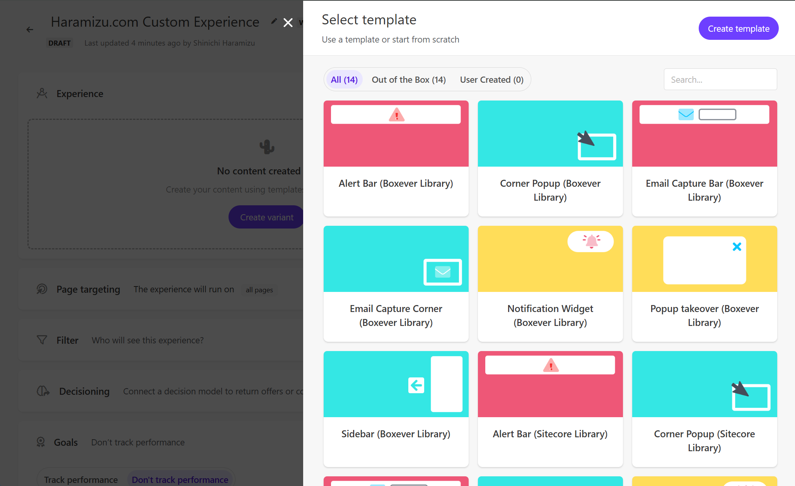

画面の右上の `Custom template` のボタンをクリックします。すると空っぽの Variant が作成されます。

今回はコードを記載していくため、画面に表示されている `Advanced Edit` のボタンをクリックして、それぞれのコードを参照してください。新規に作成された際に、それぞれ以下のコードがデフォルトで設定されています。

```html title="HTML"
<!-- define the structure and content of your Experience in HTML e.g.-->
<div>My Content</div>
<!-- Use dynamic Guest variables, type ctrl+space or guest to explore available entities.-->
<!-- Type 'd' to see decisioning helpers -->
```

```css title="CSS"
/** style your Experience with CSS */
```

```js title="JavaScript"
// You can choose how you want to add your HTML by using insertHTMLBefore, insertHTMLAfter, or replaceHTML methods
// e.g insertHTMLAfter('.someClassName'); or insertHTMLAfter('body'); or replaceHTML('#myPageId')

/*

(function () {
  // Add statements here
})();

*/
```

```js title="API"
<#-- Construct the API request body using Freemarker -->
<#-- For your Experience to run your API tab must have, at a minimum, open and closing brackets -->
{  <#-- Freemarker will go here -->   }
```

### コンテンツを入れ替える

まず最初にコンテンツを入れ替えるパターンを実装します。上記の JavaScript のコードで、`replaceHTML('#myPageId')` というコードが記載されていますが、これが実は HTML を入れ替えるためのメソッドとして用意されています。

今回入れ替える場所を指定するにあたって、ブラウザの開発者ツールを利用し対象のコンテンツのコードを指定、Copy selector を選択して、変更する場所を指定します。

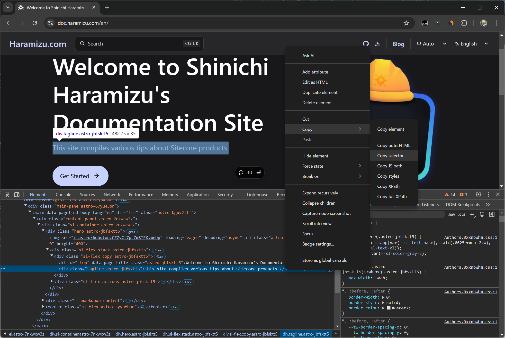

実際に以下の値がクリップボードにコピーされます。

```text title="Selector"
body > div > div > div > div > main > div > div > div.hero.astro-jbfsktt5 > div > div.sl-flex.copy.astro-jbfsktt5 > div
```

これを利用して、JavaScript に対して１行以下のコードを追加します。

```js title="replaceHTML"
replaceHTML(
  'body > div > div > div > div > main > div > div > div.hero.astro-jbfsktt5 > div > div.sl-flex.copy.astro-jbfsktt5 > div'
);
```

上記の設定が終わったところで、Preview のボタンをクリックしてパーソナライズの実行結果を確認します。

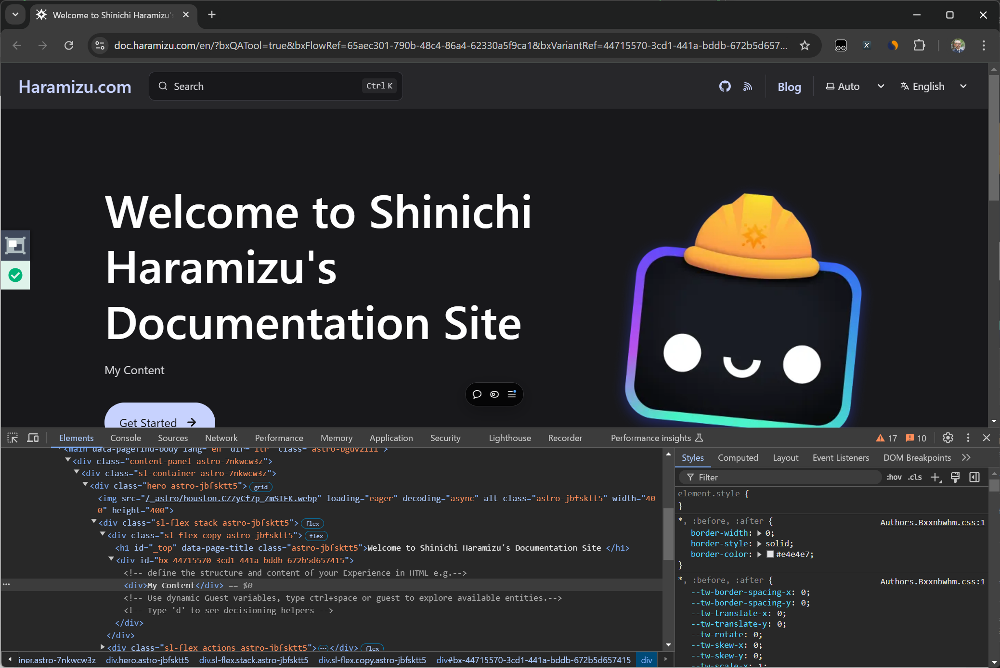

プレビューの画面では以下の点を確認することができます

- ページのコンテンツが変更されています
- 開発者ツールのコードを参照すると、Variant の HTML がそのまま表示されています
- QA Tool は緑色で問題なく動作しています

このように、コードの指定した範囲の HTML を入れ替える方法を確認しました。

### コンテンツを追加する

上記のサンプルでは、シンプルに HTML を入れ替えた形となっています。JavaScript の初期値で紹介されているメソッド、`insertHTMLAfter()` そして `insertHTMLBefore()` を同様に利用して検証をします。

上記のコードの関数を変更するのと、要素として入れ替えではないため最後の `div` に関しては削除して実行します。まずは `insertHTMLAfter()` に変更をします。

```js title="insertHTMLAfter"
insertHTMLAfter(
  'body > div > div > div > div > main > div > div > div.hero.astro-jbfsktt5 > div > div.sl-flex.copy.astro-jbfsktt5'
);
```

コードを変更したあと保存をして、改めて Preview で確認をすると以下のように変更されます。

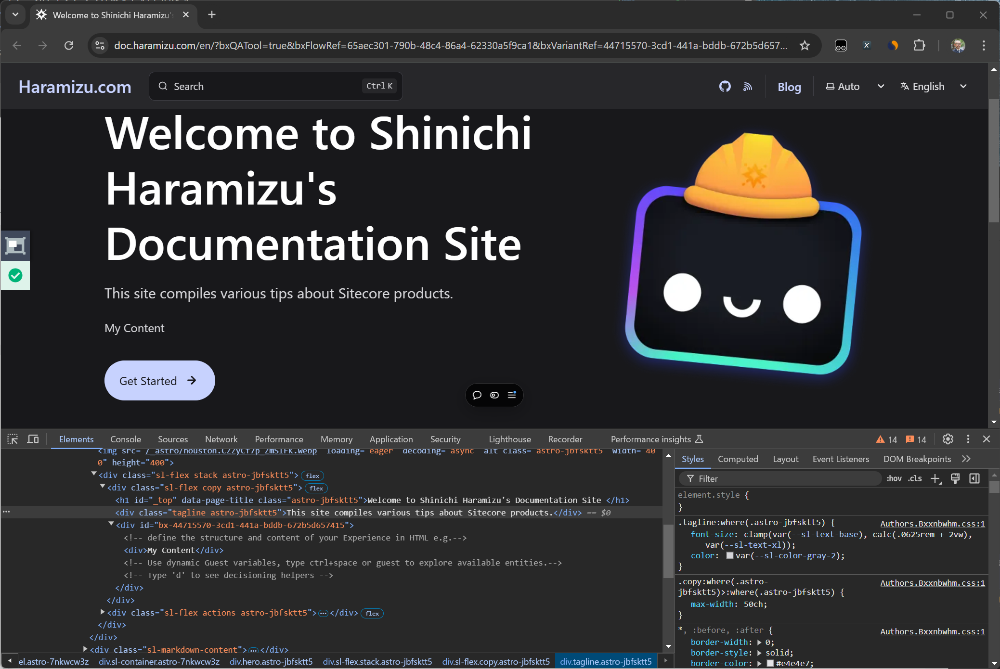

対象としたコンテンツの下に、この Variant で用意をしていた HTML が挿入されているのを確認することができました。それでは、同じ Selector のままメソッドを変更します。

```js title="insertHTMLBefore"
insertHTMLBefore(
  'body > div > div > div > div > main > div > div > div.hero.astro-jbfsktt5 > div > div.sl-flex.copy.astro-jbfsktt5'
);
```

コードを変換して保存、改めて Preview で確認をすると、以下のように指定した場所の上に表示されているのが分かります。

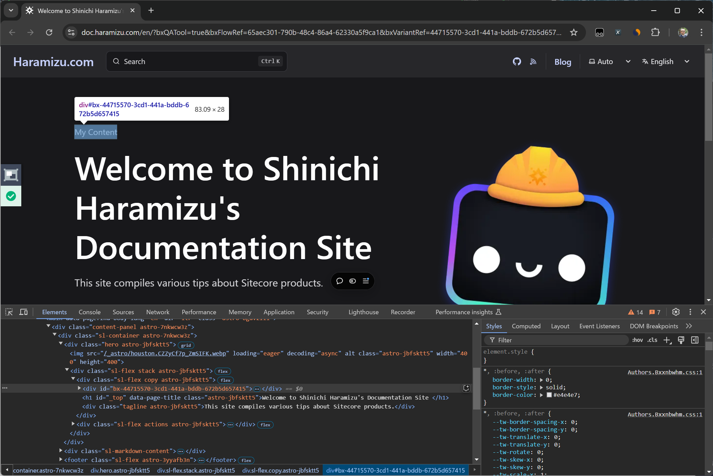

このように、Variant で指定している HTML をどの位置に挿入するのかに関しては、これらのメソッドを利用することで可能になるのを確認しました。

## HTML の制御

上記の段階では、HTML に入れたコードがそのまま JavaScript で挿入、入れ替えをするだけとなってしまいます。標準で提供されているコンポーネントは、コンポーネントを指定すると中に記載されている文字列などを変更することが可能です。使い勝手の良い形にするために、HTML に関して追加の作業を行います。

### テキストとして指定する

まず最初のコードを改めて確認をすると単に `div` タグで文字列が区切られているだけとなっています。

```html title="HTML"
<!-- define the structure and content of your Experience in HTML e.g.-->
<div>My Content</div>
<!-- Use dynamic Guest variables, type ctrl+space or guest to explore available entities.-->
<!-- Type 'd' to see decisioning helpers -->
```

この My Content のところをダイアログなどで変更できるようにしたいと思います。この部分は記述方法が決まっており、以下のように変更をします。

```diff lang="html"
<!-- define the structure and content of your Experience in HTML e.g.-->
- <div>My Content</div>
+ <div>
+   [[Title Text | string | Title | {required:true, group: General, groupOrder: 2, order: 1}]]
+ </div>
<!-- Use dynamic Guest variables, type ctrl+space or guest to explore available entities.-->
<!-- Type 'd' to see decisioning helpers -->
```

変更をして保存をしたタイミングで、画面が更新されて Configrue Template の下に Title が追加されます。

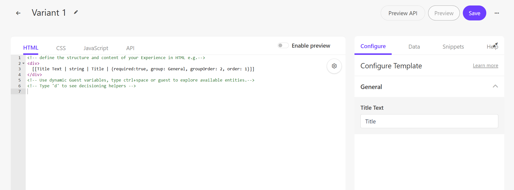

追加された Title Text のテキストボックスに Sitecore Personalize という文字を入力して、Preview で実行します。

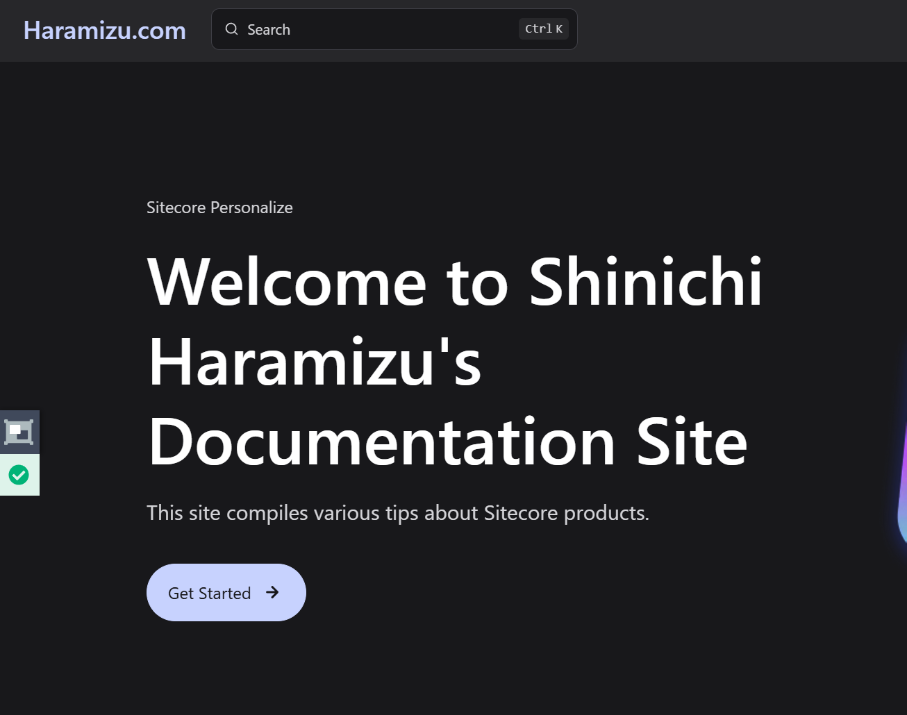

指定した文字が表示されれるようになりました。これにより、すでに実装済のテンプレートのように、文字を変更する部分を指定することができました。

### スタイルを指定する

HTML のコードの制御に続いて CSS の制御をしたいと思います。まず、標準で提供されているテンプレートを見ると、JavaScript のコードで以下のコードを必ず実行しています。

```js
// Adds a unique variant identifier to CSS when deployed to ensure CSS does not impact styling of other elements.
var compiledCSS = Engage.templating.compile(variant.assets.css)(variant);
var styleTag = document.getElementById('style-' + variant.ref);
if (styleTag) {
  styleTag.innerHTML = compiledCSS;
}
// End Adds a unique variant identifier to CSS when deployed to ensure CSS does not impact styling of other elements.
```

この `variant.assets.css` で何を取得しているのかを確認するために、以下の１行を追加して実行してみたいと思います。

```diff lang="js"
// Adds a unique variant identifier to CSS when deployed to ensure CSS does not impact styling of other elements.
var compiledCSS = Engage.templating.compile(variant.assets.css)(variant);
+ console.log("Variant Assets CSS:", variant.assets.css);
var styleTag = document.getElementById('style-' + variant.ref);
if (styleTag) {
    styleTag.innerHTML = compiledCSS;
}
// End Adds a unique variant identifier to CSS when deployed to ensure CSS does not impact styling of other elements.
```

実行結果を見ると、コンソールには以下の行が出力されています。

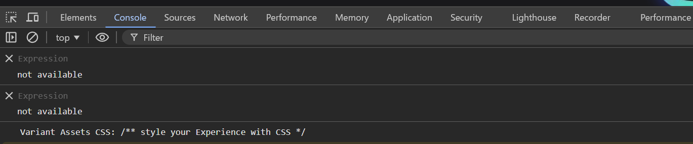

このコードは、CSS に定義されているデータが表示されている状況です。

```css title="CSS"
/** style your Experience with CSS */
```

この部分では、変数 variant の CSS をコンパイルし、特定の style タグに適用するように動作しています。続いて `document.getElementById('style-' + variant.ref)` で指定された ID を持つ style タグを取得して、コンパイルされた CSS を取得した style タグに適用します。

今回は指定したタイトルを表示する HTML を以下のように書き換えました。

```html title="HTML"
<div id="pers-custom">
  <div class="pers-custom__body">
    <p>
      [[Title Text | string | Title | {required:true, group: General, groupOrder: 2, order: 1}]]
    </p>
  </div>
</div>
```

続いて、 スタイルシートは以下のように書き換えます。

```css title="CSS"
/** style your Experience with CSS */
#pers-{{ref}} #pers-custom {
  border: 2px solid #808080;
  margin: 20px;
}
#pers-{{ref}} #pers-custom p {
    font-weight: 400;
    line-height: 1.2;
}
#pers-{{ref}} #pers-custom .pers-custom__body {
    padding: 20px 20px;
}
```

上記のコードの `ref` の役割は、特定の要素やコンポーネントに一意の識別子を付けることで、他の要素と区別することができるようになります。これは、特定のバリエーションやインスタンスごとに異なるスタイルを適用したり、JavaScript で動的に操作したりするために使用されます。

最後に、JavaScript で呼び出している insertHTMLBefore に対して、２つ目の変数として `pers-` を追加します。

```diff lang="js" ins=/, ('pers-')/
insertHTMLBefore('body > omission .sl-flex.copy.astro-jbfsktt5', 'pers-');
```

これで準備が完了しました。実際にプレビューで参照をすると、スタイルシートが適用されているのが分かります。

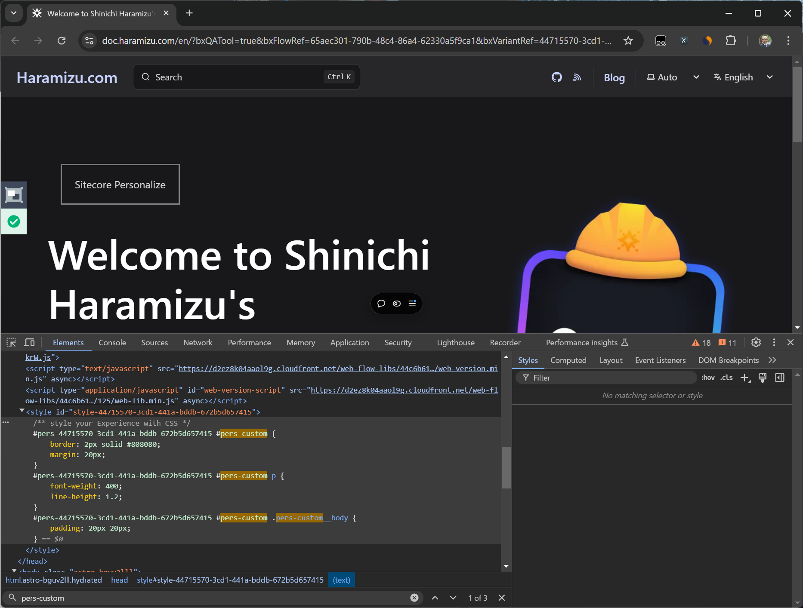

上記のブラウザの開発者ツールを通じてソースコードを確認すると、スタイルシートも挿入されています。

## プレビューを有効にする

３つの設定が完了したところで、作成をした Variant のプレビューを有効にします。これは `Advanced Edit` モードで表示されている `Enable preview` のボタンをクリックすれば有効になります。

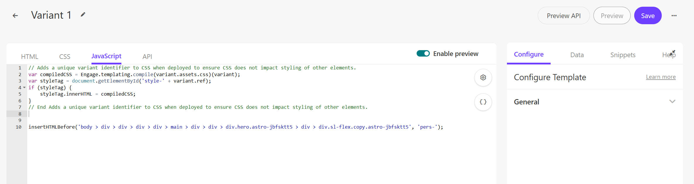

実際にプレビューで作成した Variant のプレビューができるようになりました。

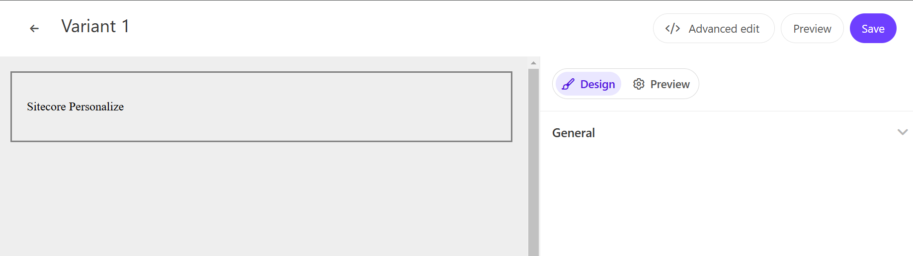

## テンプレートとして保存をする

作成をした Variant をテンプレートとして保存する場合は、Advanded Edit モードで一番右上にあるボタンをクリックすると、`Save as Template` のボタンが表示されます。

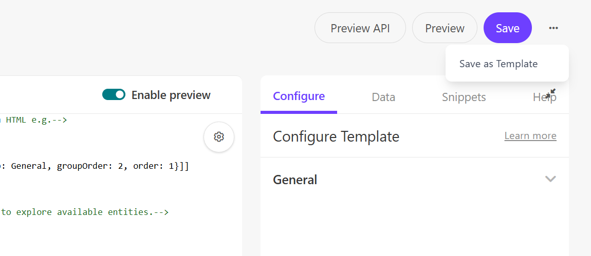

これをクリックすると、テンプレートの名前を指定して保存することができます。

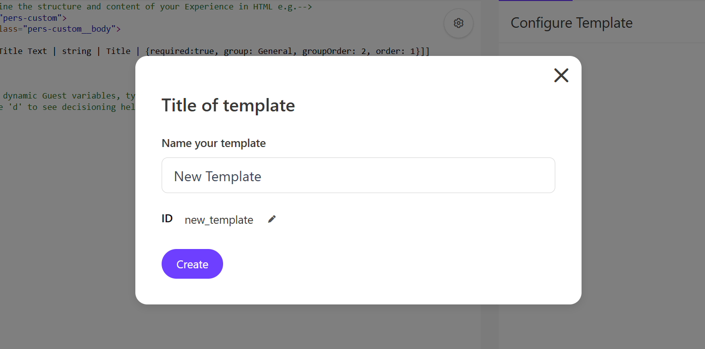

再利用することを想定している場合は、カスタムの Variant をテンプレートとして保存することができるため、うまく活用していただくといいと思います。

## 参考資料

<LinkCard
  title="Inserting a web experience in your HTML"
  href="https://doc.sitecore.com/personalize/en/users/sitecore-personalize/inserting-a-web-experience-in-your-html.html"
  target="_blank"
/>

