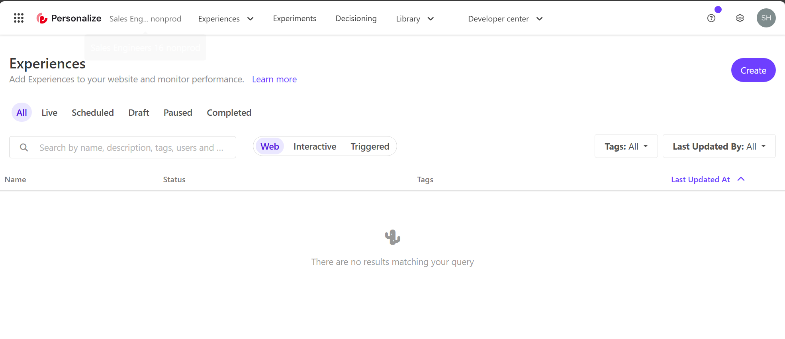
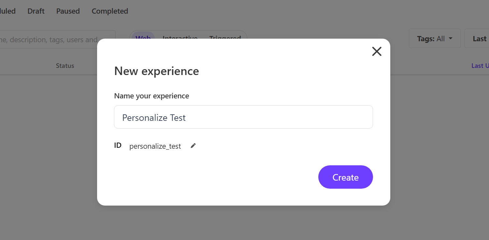

これまで説明しているときに、サンプルとなる Experience を作る方法を紹介していました。このドキュメントにおいて改めて、Sitecore Personalize で新しいパーソナライズの設定を、既存のテンプレートを利用して作成する手順を紹介します。

## 新しい Experience を作成する

今回は新しい Experience を作成する過程でこの内容を確認していきます。まず、Sitecore Personalize にログインをして、Experiences の画面に遷移すると、作成している Experience 一覧が表示されます。今回は新しい環境のため、まだ何も提供されていない状況です。

新しい Experience を作成する際には、右上の `Create` のボタンをクリックします。すると 3 つのタイプの Experience のどれを選択するのかが表示されます。

- **Web**: Web サイトで実施する Personalize を作成
- **Interactive**: API ベースでのコンテンツの配信、アプリ連携など
- **Triggerd**: メールやテキストのための特定のイベントとして

このサイトでは基本的には Web のサンプルを紹介していく予定です。そこで、Web を選択して、Experience の名前は Personalize Test とします。

新しく作成された Experience は以下のようになります。

それぞれの項目で設定する項目を確認していきます。

### Experience (必須)

この項目には、表示をする Personalize のための関連コードを記述します。実際に利用する HTML、CSS および JavaScript 、必要に応じて API を設定します。標準で提供されているテンプレートの種類は以下の 7 種類です。

- Alert Bar
- Corner Popup
- Email Capture Bar
- Email Capture Corner
- Notification Widget
- Popup takeover
- Slidebar

上記のテンプレートを実際に動かしているサンプルは、以下のページから確認することができます。

- [サンプル](/cdp-personalize/sample/)

今回は、Sidebar (Sitecore Library) を選択します。主な設定項目は以下の通りです。

| 変数        | 形式   | 概要         |
| ----------- | ------ | ------------ |
| Image URL   | string | 画像         |
| Title Text  | string | タイトル     |
| Button Link | string | URL          |
| Button Text | string | ボタンラベル |

以下の画面が、今回作成をした Sidebar の設定です。

### Page Targeting

表示をするためのルールを設定します。この項目を拡張すると以下のように `All Pages` がデフォルトの値になっています。この設定の場合、Page Targeting 以外で設定をしている条件に合致した場合はすべてのページで表示されるようになります。

`Specific pages` をクリックした場合、この下に `+ Add conditions` が表示されて、対象となるページを指定することができます。クリックをすると右側から入力のためのサイドバーがポップアップで表示されます。

指定方法はいくつか用意されています。

- Contains
- Does not contain
- Does not end with
- Does not equal
- Does not match Regex(ignore Case)
- Does not match Regex
- Does not start with
- Ends with
- Equals
- Matches Regex (Ignore Case)
- Matches Regex
- Start with

上記の項目で利用したいルールを設定して、対象となるページを固定する形となります。

また条件は複数追加することが可能なため、単に複数のページで実行したい、という場合は `+ Add Page` をクリックして追加してください。

またクライアントサイドの JavaScript を入れることも可能です。詳しくは以下のページで紹介されています。

- [Target a webpage in a web experience](https://doc.sitecore.com/personalize/en/users/sitecore-personalize/target-a-webpage-in-a-web-experience.html)

### Filter

この項目は、何らかの条件を元にパーソナライズを実行するルールを追加することができます。このルールに関しては、ユーザーのコンディション、もしくはセグメントを利用することが可能です。

今回はコンディションに関して確認をしていきます。`+ Add Condition` のボタンをクリックすると用意されているルールが表示されます。

`Out of the box` のルールには以下のルールが用意されています。

- Country Region
- Date and time (organization time zone)
- Time of day (organization time zone)
- Point of sale
- Region
- Country
- Visit day of the month (organization time zone)
- Day of the week (organization time zone)
- Month of visit (organization time zone)
- First referrer
- UTM value
- Operating system
- Device
- Number of page views
- First page
- Page view
- New or returning visitor

利用したいルールを選択 ( + ボタンをクリック )して、必要な情報を追加していきます。以下の画面は、`Country` で `Japan` を指定している形です。

詳しくは以下のページを参照してください。

- [Apply a condition to a web experience](https://doc.sitecore.com/personalize/en/users/sitecore-personalize/apply-a-condition-to-a-web-experience.html)

### Decisioning

この Decisioning を利用することで、単なるフィルタ的なものではなく、表示をする際のモデルに関してルールを作成して、その結果に合わせてパーソナライズを実行することができます。

この Decisioning に関しては、別のドキュメントで紹介をしています。

- [Decisioning](/cdp-personalize/decisioning/)

### Goal（必須）

パーソナライズを実行したあとのコンバージョンに関して、ここでゴールの項目を設定します。ゴールの種類は、５つ用意されています。

- Order revenue
- Page views
- Bounce rate
- Exit rate
- Custom goal

Goal に関しては以下のページで詳細に紹介されています。

- [Introduction to experience goals](https://doc.sitecore.com/personalize/en/users/sitecore-personalize/introduction-to-experience-goals.html)

### Notifications

この項目は、上記のパーソナライズの設定とは少し異なる動きとなります。対象となる Experience の開始、終了、一時停止、再開などのステータス変更が発生した場合に、電子メールにてお知らせいたします。また、必須セッションに達した場合やセッションの失敗に関する問題が発生した場合など、重要なイベントが発生した際にも電子メールにてお知らせいたします。

## プレビュー

作成をした Experience を公開前にテストをするための機能として、Preview が用意されています。

Preview が動作する前提条件は、以下の２つのどちらかが必要となります。

- 対象となるサイトに対して Sitecore Engage SDK のコードが実装済で、 Sitecore Personalize が動作していること
- Tampermonkey を利用して、プレビューのドメインを開いたときにスクリプトが実行されること

上記のどちらかの条件でプレビューを利用することができます。

### プレビュー画面

プレビューを実行すると、以下のように設定をしたパーソナライズ（この場合は Sidebar ）が動作します。

ターゲットとなっているページで表示されるようになっているか、確認をすることができます。

### QA Tools

上記のプレビューが表示されている状況で、少し時間が経つと画面の左側に QA Tool が表示されます。左側のアイコンをクリックすると、動作している環境を確認することができます。

例えばターゲットのページの指定が間違っている場合は、Page Targeting が正しく設定されていないことを確認することができます。

この QA Tool に関しては、ユーザーを指定した場合の結果など、様々なテストで利用することが可能となっています。今回は、エラーが無く表示されるようになっていれば問題ありません。

## 参考情報

- [Target a webpage in a web experience](https://doc.sitecore.com/personalize/en/users/sitecore-personalize/target-a-webpage-in-a-web-experience.html)
- [Apply a condition to a web experience](https://doc.sitecore.com/personalize/en/users/sitecore-personalize/apply-a-condition-to-a-web-experience.html)
- [Use a decision model in a web experience](https://doc.sitecore.com/personalize/en/users/sitecore-personalize/use-a-decision-model-in-a-web-experience.html)
- [Preview a web experience](https://doc.sitecore.com/personalize/en/users/sitecore-personalize/preview-a-web-experience.html)
- [Introduction to experience goals](https://doc.sitecore.com/personalize/en/users/sitecore-personalize/introduction-to-experience-goals.html)

