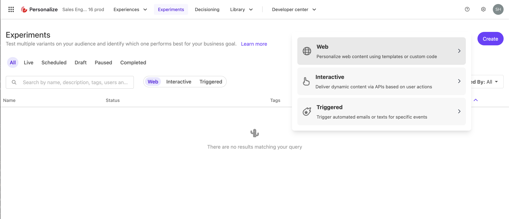
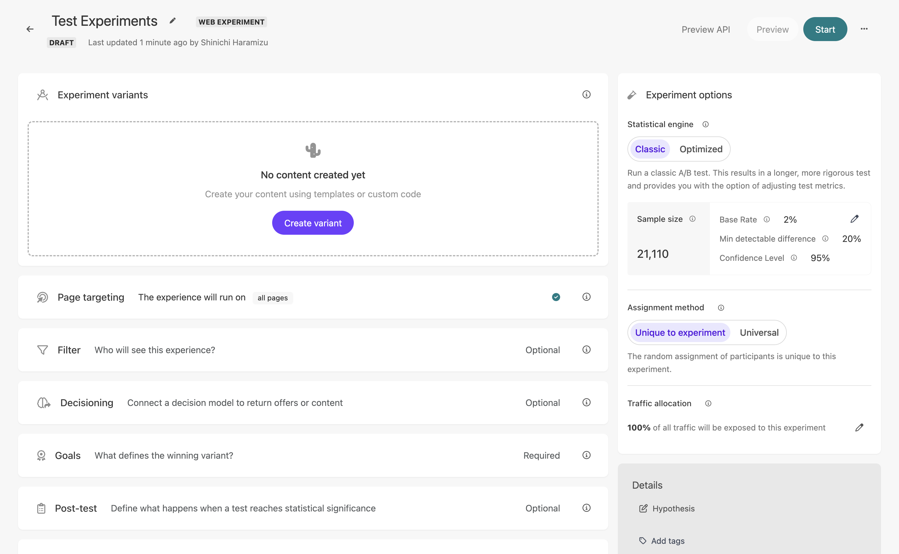
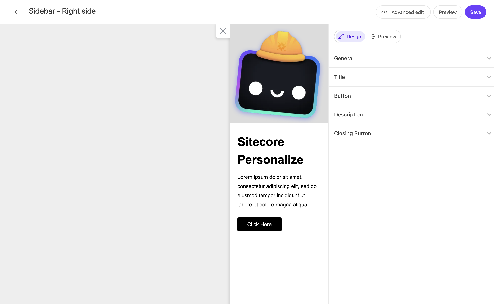
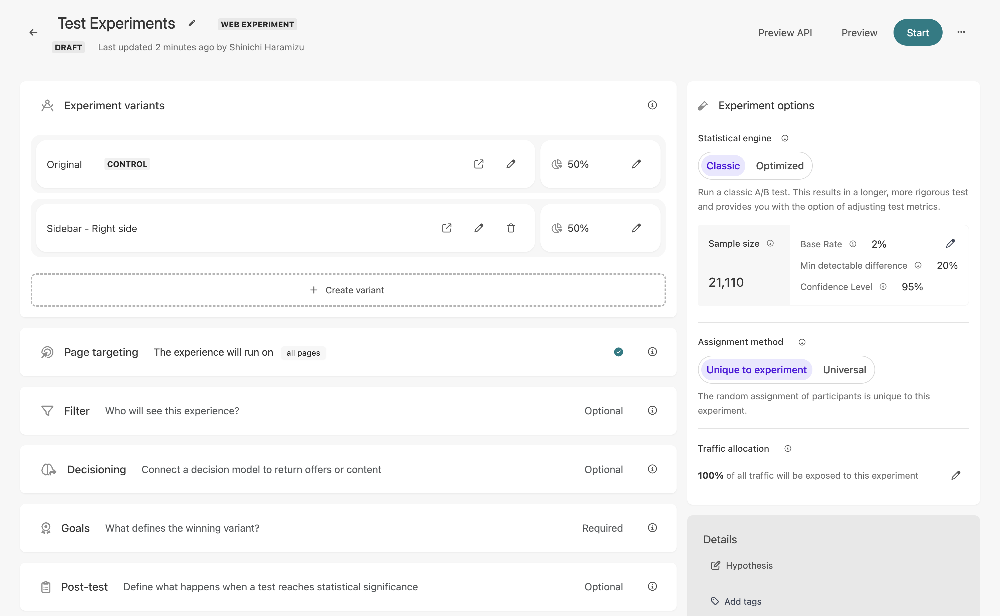
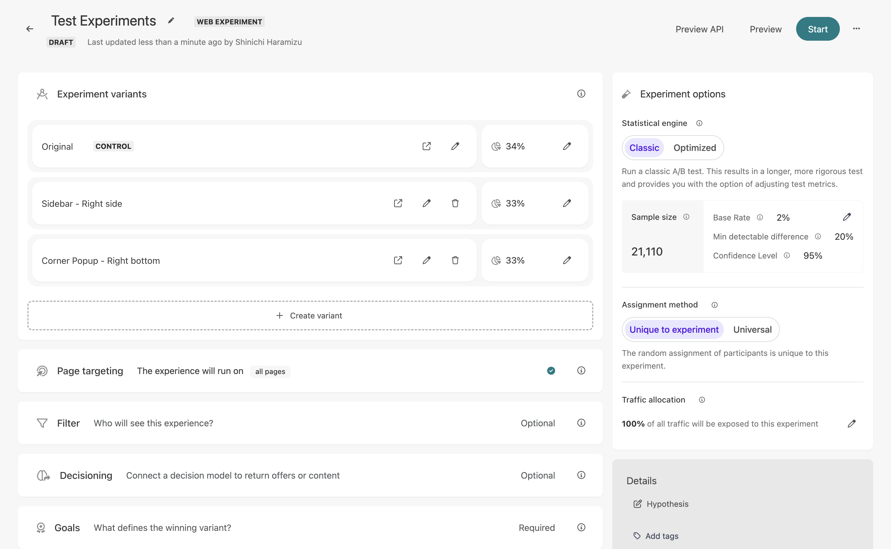
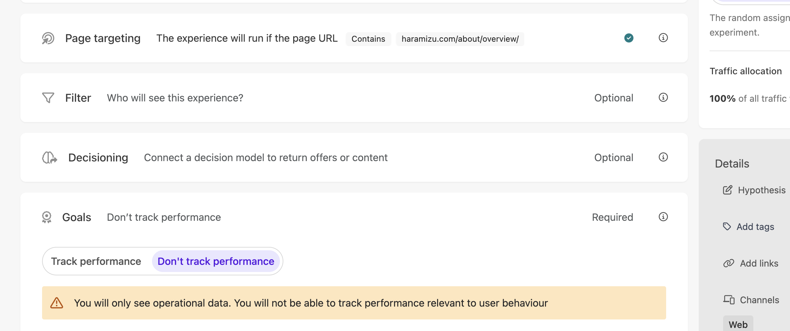
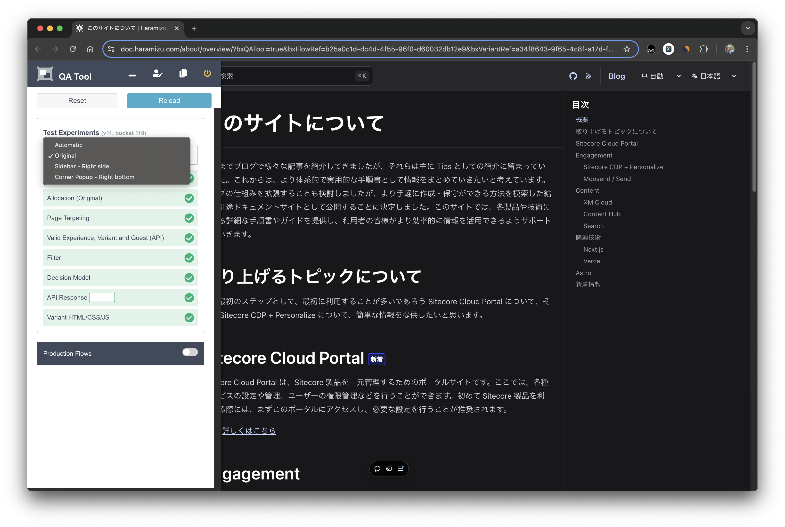
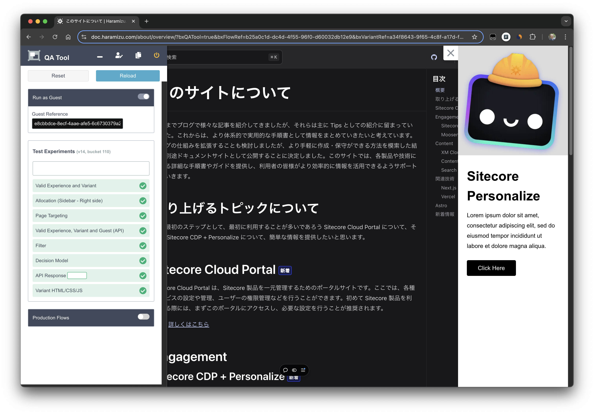
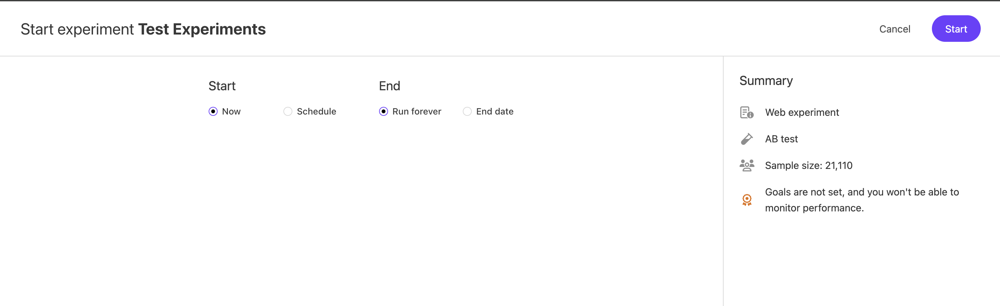

このドキュメントでは、A/B テストを実施する場合の Sitecore Personalize の機能、Experiments について紹介をします。利用することができる Web テンプレートは Experience 同じ手順で作成することが可能です。このページでは、いくつかのテンプレートを１つのページに張り付けて、その結果がどのように出るのかを確認していきます。

## Experiments を作成

今回は新しい Experiments を作成して、その動作確認を行います。Sitecore Personalize にログインをしたあと、Experiments にアクセスをしてください。初めてアクセスをする際には、何も表示されていません。右上にある Create のボタンをクリックすると、何を作成するのか選択が可能です。ここでは Web を選択します。

今回は `Test Experiments` を作成します。作成する項目は、通常の Experience の作成と似た画面が表示されます。

### Variant の追加

Experience の時と同様に Variant の作成をします。今回は Slidebar (Sitecore Library)を選択します。作成をしたスライドバーの画面は以下のような形です。Variant の名前に `Sidebar - Right side` とします。

作成をした後保存をして Experiments の設定の画面に戻ると、２つの Variant が設定されていることがわかります。

`Original` に関しては作成をしていませんが、これは元のページのままでパーソナライズを実行しない表示という形になります。ここではもう一つ作成をして、Corner Popup ( Sitecore Library ) を利用して、右下に表示される `Corner Popup - Right bottom` も追加します。その後、それぞれの表示を 33% とします（ original を 34% と設定）。以下が設定完了の画面です。

### ターゲットとゴールの設定

プレビューを実行するにあたって、ターゲットとなるページおよびゴールの設定をしておきます。ターゲットに関しては URL で指定をして、該当するページが表示された時に動くようにします。

ゴールに関しては今回は A/B テストの表示の確認のため設定を省略するために、Don't track performance を選択します。本来であれば、A/B テストにおいてはゴールを設定しておくことで、そのテストの結果を取得することができるため、この項目は必ず設定していただく必要があります。

## プレビュー

作成をした Experiment を実際に公開する前に確認をします。プレビューで該当するページを表示したあと、しばらくすると左側から QA Tool のアイコンが表示さます。これを開いた画面で、現在どの Variant が表示されているのか？に関しては確認をすることができます。

QA Toolbox の選択肢を `Sidebar - Right side` に切り替えて Reload を実行します。ページが再度読み込まれて、Sidebar が表示されます。QA Toolbox でもエラーは表示されてません。

このように、A/B/n テストを Experiments を利用することで実現ができるようになっています。

## 実行する

作成をした Experiments を本番環境に反映させる場合は、Start ボタンをクリックします。開始日と終了日を指定することも可能です。

## サンプルページ

今回作成をした A/B テストに関しては以下のページで実際にサンプルとして動作させています。

- [A/B テストサンプル](/sample/test-experiment/)

## 参考情報

- [Getting started with web experiments](https://doc.sitecore.com/personalize/en/users/sitecore-personalize/getting-started-with-web-experiments.html)
- [Create a web experiment](https://doc.sitecore.com/personalize/en/users/sitecore-personalize/create-a-web-experiment.html)
- [Create a variant for a web experiment using a web template](https://doc.sitecore.com/personalize/en/users/sitecore-personalize/create-a-variant-for-a-web-experiment-using-a-web-template.html)
