import { Steps } from '@astrojs/starlight/components';

Tampermonkey を利用してサイトにタグを埋め込まずに動作させる方法は確認できました。今回は、実際のサイトで利用するために、Google Tag Manager を利用して JavaScript を適用して動作するように設定を進めていきます。

## 前提条件

この記事を掲載している今の段階では、２つのドメインで情報提供をしています。

- [ブログサイト - blog.haramizu.com](https://blog.haramizu.com/ja-JP/)
- [ドキュメントサイト - doc.haramizu.com](https://doc.haramizu.com/)

どちらのサイトも日本語と英語（機械翻訳）でドキュメントを投稿していますが、URL の構造が異なります。

- blog.haramizu.com
  - /ja-JP : 日本語コンテンツ
  - /en-US : 英語コンテンツ
- doc.haramizu.com
  - /en: 英語コンテンツ
  - / : 日本語コンテンツ（root は日本語）

ここで Sitecore CDP + Personalize の Point of sale に関しては２つ用意したいと思います。

- haramizu.com - 英語コンテンツ
- ja.haramizu.com - 日本語コンテンツ

このため、Google Tag Manager で用意をするタグは Point of sale と言語の違いがあるため、２つ用意をして、トリガーに関してはサイトによって切り替える形で実装をしていきます。：

## Google Tag Mananger と連携

実は CDP + Personalize を利用する上で Google Tag Manager と連携するための手順を紹介しているページがあります。

- [Integrate using the Engage SDK script and Google Tag Manager](https://doc.sitecore.com/personalize/en/developers/api/integrate-engage-sdk-and-google-tag-manager.html)

このページで紹介されているコードは Engage SDK を利用しており、以下のようになっています。

```js {16-19,23,31-33} title="JavaScript"
<script>
    // Initialize the engage variable
    var engage = undefined;

    // Create and inject the <script> tag into the HTML
    var s = document.createElement("script");
    s.type = "text/javascript";
    s.async = true;
    s.src = "https://d1mj578wat5n4o.cloudfront.net/sitecore-engage-v.1.4.3.min.js";
    var x = document.querySelector("script");
    x.parentNode.insertBefore(s, x);

    // Initialize the Engage SDK
    s.addEventListener("load", function () {
      var settings = {
        clientKey: "<client_key_PLACEHOLDER>",
        targetURL: "<stream_api_target_endpoint_PLACEHOLDER>",
        pointOfSale: "<point_of_sale_PLACEHOLDER>",
        cookieDomain: "<cookie_domain_PLACEHOLDER>",
        cookieExpiryDays: 365,
        forceServerCookieMode: false,
        includeUTMParameters: true,
        webPersonalization:  { baseURLOverride: 'https://d2ez8k04aaol9g.cloudfront.net' }
    };

    window.Engage.init(settings).then(function (result) {
      engage = result;

      // Send a VIEW event
      var event = {
        channel: "<channel_PLACEHOLDER>",
        language: "<language_PLACEHOLDER>",
        currency: "<currency_PLACEHOLDER>",
        page: "{{Page Path}}"
      };
     engage.pageView(event);
    });
  });
</script>
```

上記のコードでハイライトをしている部分を変更して、Google Tag Manager に登録する形となります。

- **client_key_PLACEHOLDER**: Sitecore Personalize の Company Information から取得できます
- **stream_api_target_endpoint_PLACEHOLDER**: 利用しているインスタンスのリージョンに合わせて設定します
- **point_of_sale_PLACEHOLDER**: Sitecore Personalize で設定している Point of sale を指定します
  - 今回は日本語の場合は `ja.haramizu.com`、それ以外は `haramizu.com` とします
- **cookie_domain_PLACEHOLDER**: 今回はどちらも `.haramizu.com` を設定
- **channel_PLACEHOLDER**: `WEB` を設定します
- **language_PLACEHOLDER**: 言語の設定をします
  - 今回は日本語の場合は `JA`、それ以外は `EN` とします
- **currency_PLACEHOLDER**: `JPY` を設定します

エンドポイントに関しては以下のページを参照してください。

- [Collect required details - Stream API target endpoint](https://doc.sitecore.com/personalize/en/developers/api/collect-required-details.html#stream-api-target-endpoint)

:::caution
上記のサンプルは日本のデータセンターを利用する場合のサンプルとなっています。日本以外のデータセンターを利用する場合は、webPersonalization の値を true と設定するだけで動作します。

```js
webPersonalization: true;
```

:::

### タグを登録する

まず Google Tag Manager にログインをして、対象となる Workspace を指定してください。

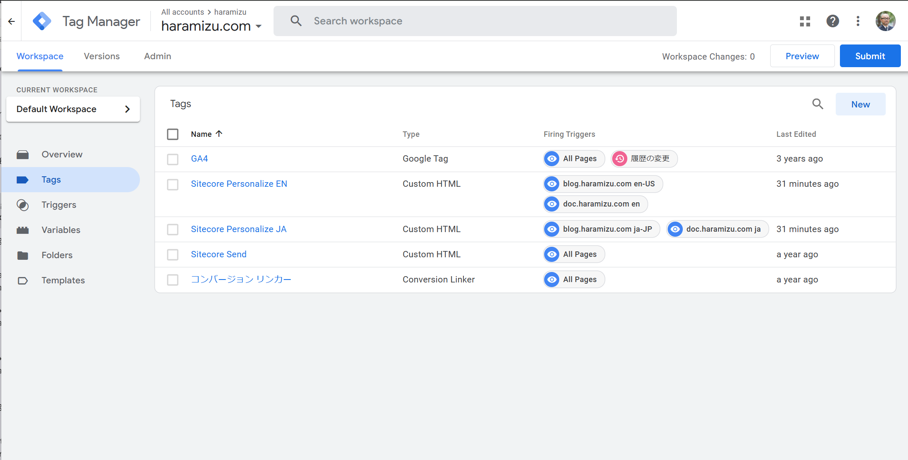

上記の画面はすでに Sitecore Personalize に関して設定が含まれている状況です。作成をする際には以下の手順となります。

<Steps>

1. Tags の一覧で New をクリックする

2. Tag Configuration をクリック

3. Custom HTML を選択

</Steps>

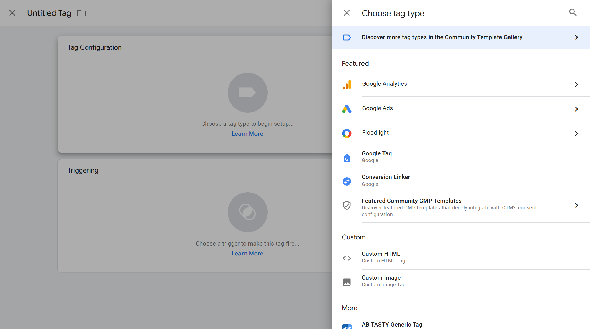

この Custom HTML のエリアに、上記のコードをベースにパラメーターを変更したコードを追加した形です。２つの Tag に関しては最初の段階ではトリガーは設定せずに、Custom HTML のみを保存して、トリガーの作成に入ります。

### トリガーを作成する

サイトにアクセスをして Google Tag Manager のタグが該当した場合に、Tag を追加することができます。これがトリガーとなっています。トリガーの画面に関しては、以下のような形となります。

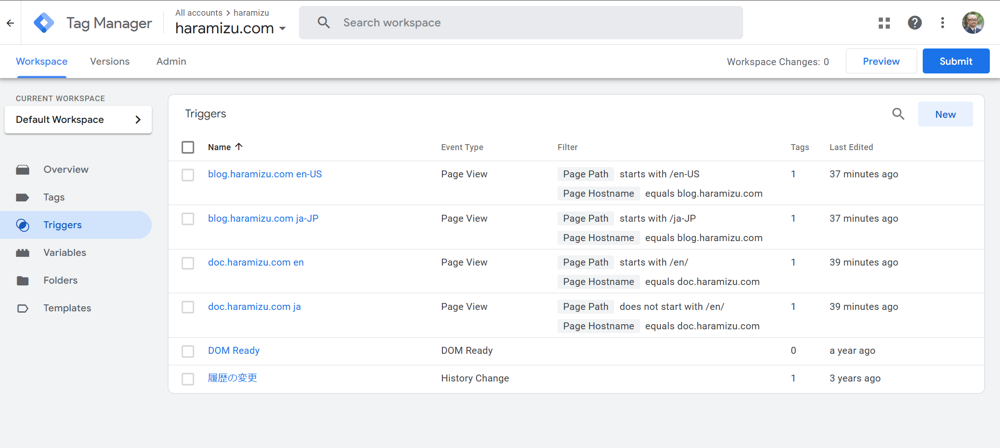

上記の画面はすでに複数のトリガーが用意されている形です。そのうち１つを参照すると以下のようになっています。

- **Page Hostname**: doc.haramizu.com
- **Page Path**: /en/ で始まらない

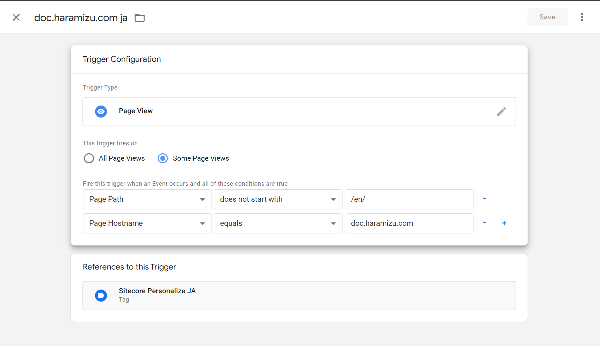

これにより、doc.haramizu.com/en に関しては別のトリガーで処理をして、それ以外は日本語と判別するルールにしています。blog.haramizu.com に関しては、ja-JP と en-US のどちらかで必ず表示するようにしています。今回は２つのドメインに対して２言語、ということで合計４つのトリガーを用意しました。

あとは事前に作成しておいたタグに対して、それぞれのトリガーを割り当てます。今回は、言語ごとのトリガーが設定されていれば問題ありません。

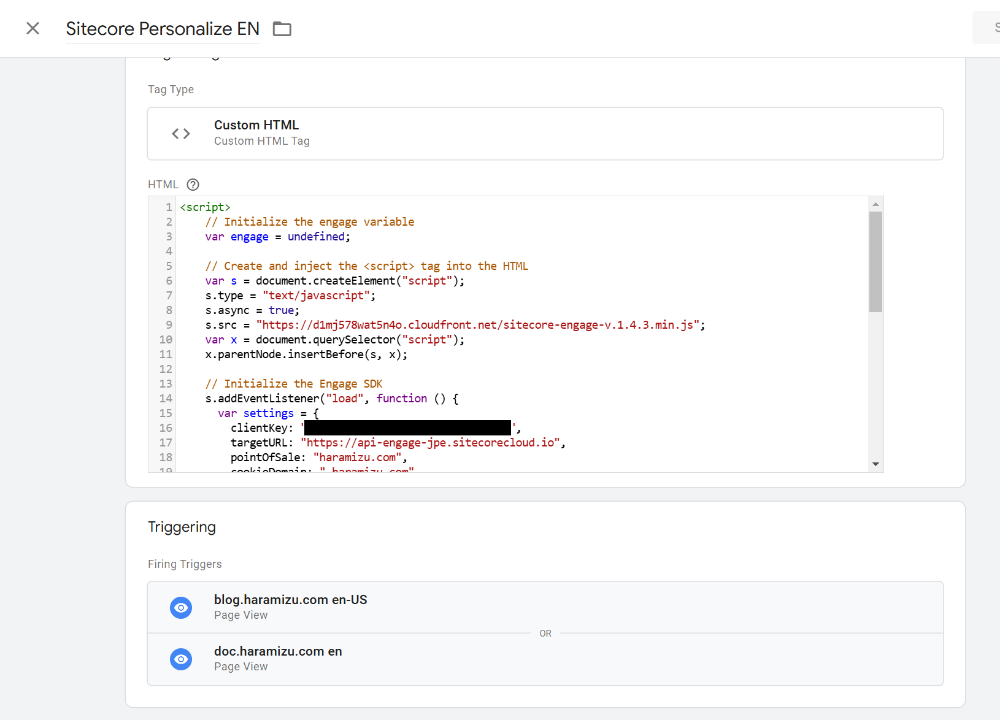

### 動作確認

実際に設定をしたタグが正しく動作するのか、Google Tag Manager の管理画面の Preview からチェックすることができます。画面の上に表示されている `Preview` をクリックしてください。


クリックをすると Tag Assistant が起動してどの URL でテストをするのかのダイアログが表示されます。初回は、 `https://doc.haramizu.com/cdp-personalize/overview/` を設定して実行しましょう。

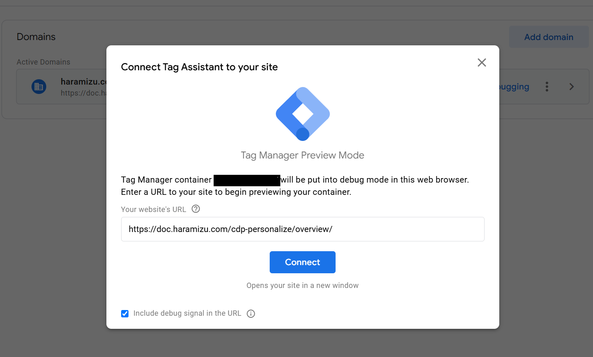

ブラウザが起動して、Tag Assistang がつながっていることを確認することができます。

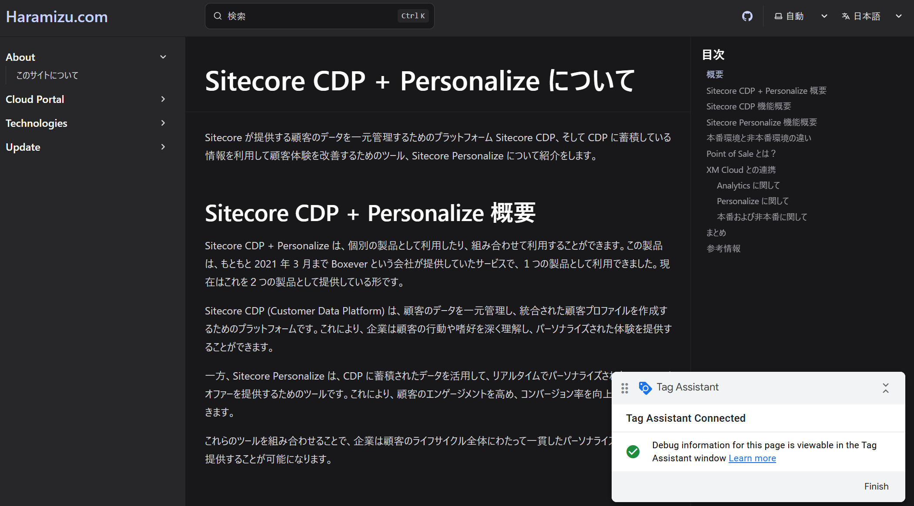

開発者ツールを利用して出力されているタグを参照すると、pointOfSale に `ja.haramizu.com` が設定されており、また language に関しても `JA` が設定されているのを確認できました。

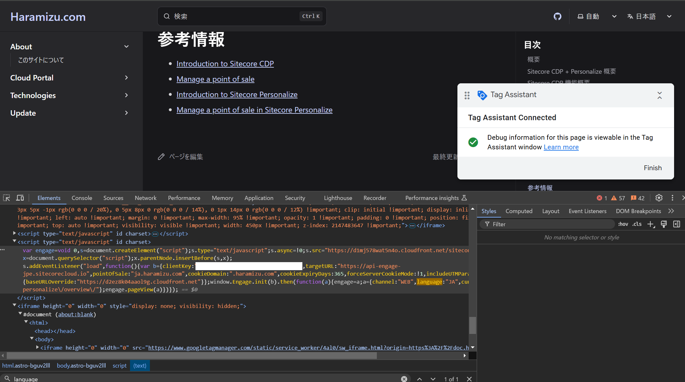

続いて `https://doc.haramizu.com/en/cdp-personalize/overview/` と同じページですが /en/ から始まる英語のページに関して参照する形で Tag Assistant を再度起動します。開いたページのコードを開発者ツールで確認をすると、pointOfSale が `haramizu.com` に、言語は `EN` になっていることを確認できました。

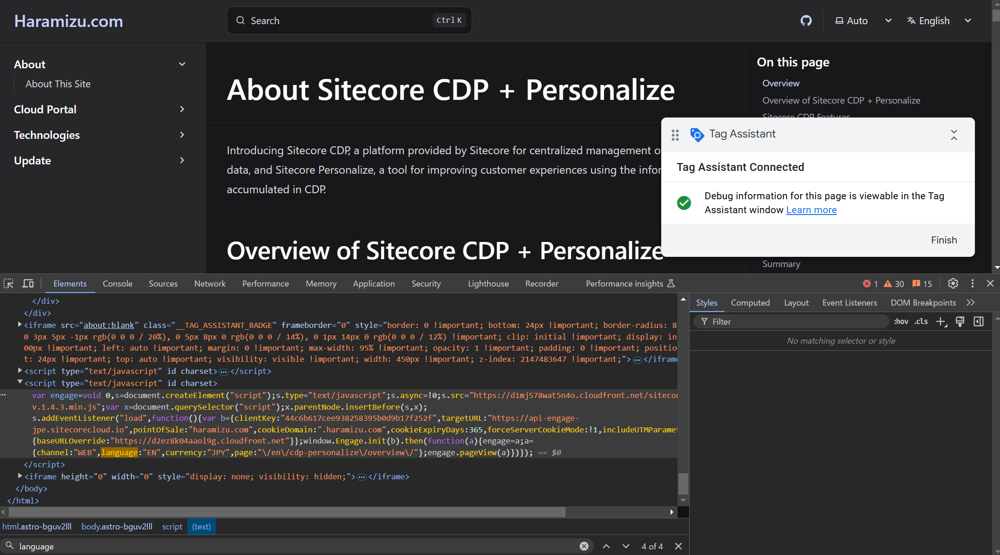

実際に動作している状況を見ると、英語のトリガーが実行されていることが分かります。

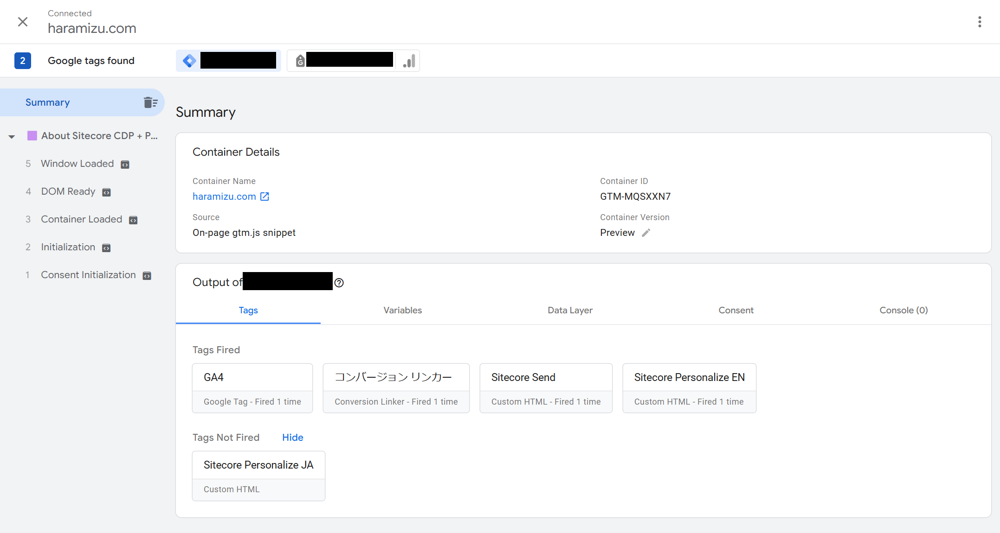

正しく動作しているのを確認したあと、公開をして Google Tag Manager の手続きは完了です。

## Experience を公開する

今回は新しく Alert Bar のテンプレートを利用して Experience を作成します。作成の手順は、以下のページを参照してください。作成をした後、Experience に関しては Start をクリックをして既に公開されているものとします。

- [Alert Bar](/sample/alert-bar/)

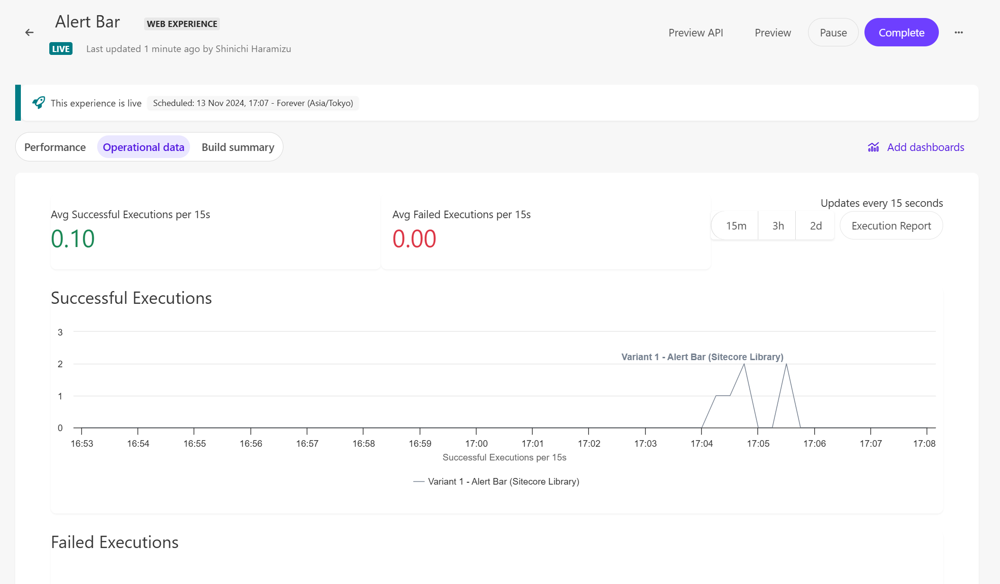

Tampermonkey をオフにして、実際に上記のページを表示してもパーソナライズされた Alert Bar が表示されるのを確認できました。

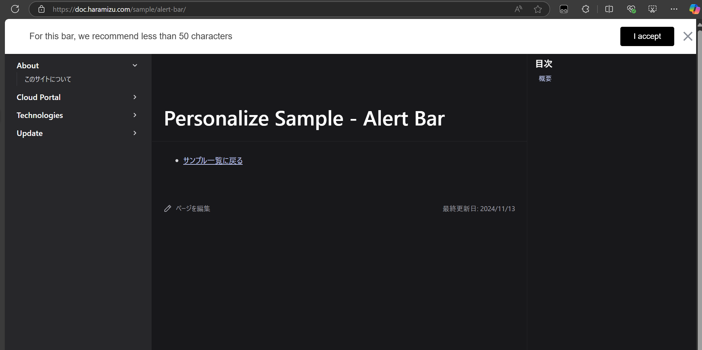

## まとめ

今回は Google Tag Manager を利用して JavaScript をサイトに対して適用し、その JavaScript のコードを利用して Web サイトにアラートを表示するところまで紹介をしました。テストやデモに関してはローカルでのテストは Tampermonkey を利用して、そして非本番環境で JavaScript を適用して動作確認をしたあと、本番環境での動作という形になります。

この Google Tag Manager でタグの配布を入れておけば、あとは Personalize を作成して展開する、ということができます。

様々なテンプレートを利用した設定、公開情報は [テンプレート一覧](/cdp-personalize/sample/) を参考にしていただければと思います。

## 参考情報

- [Integrate using the Engage SDK script and Google Tag Manager](https://doc.sitecore.com/personalize/en/developers/api/integrate-engage-sdk-and-google-tag-manager.html)
