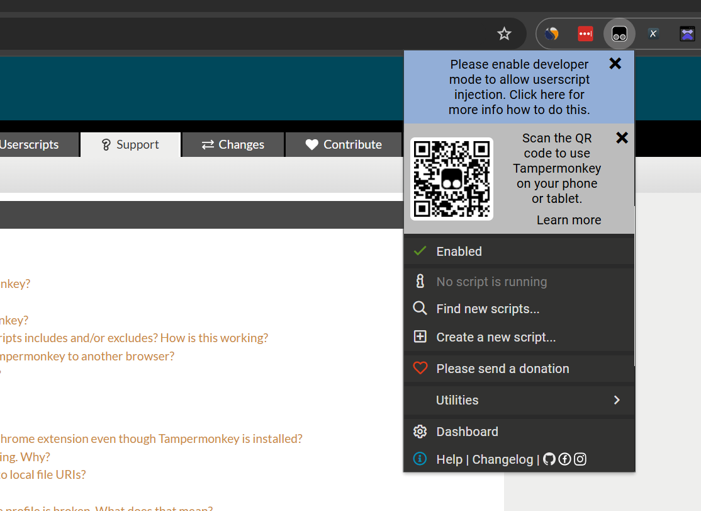
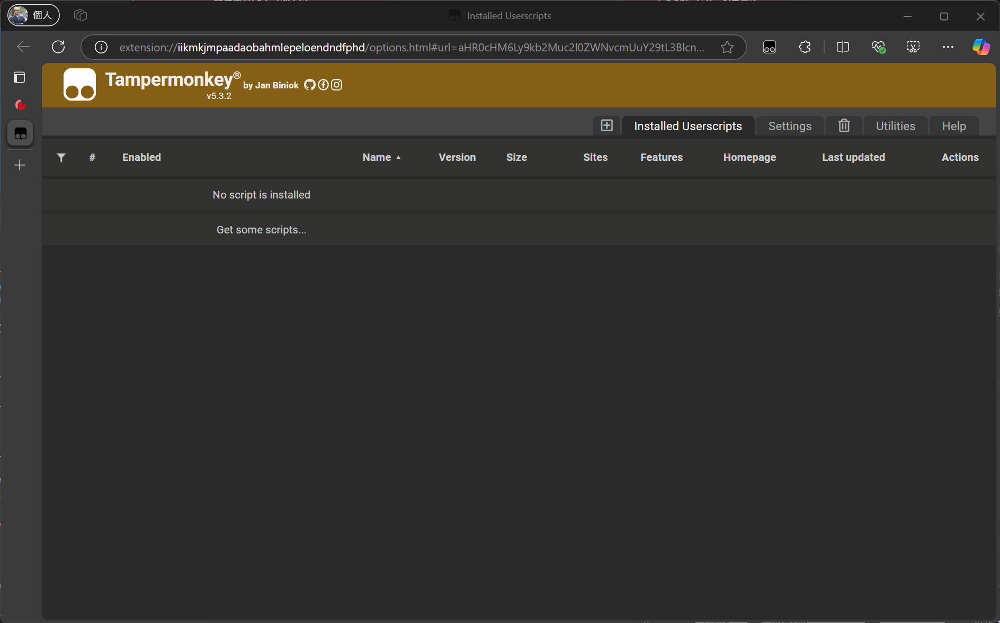
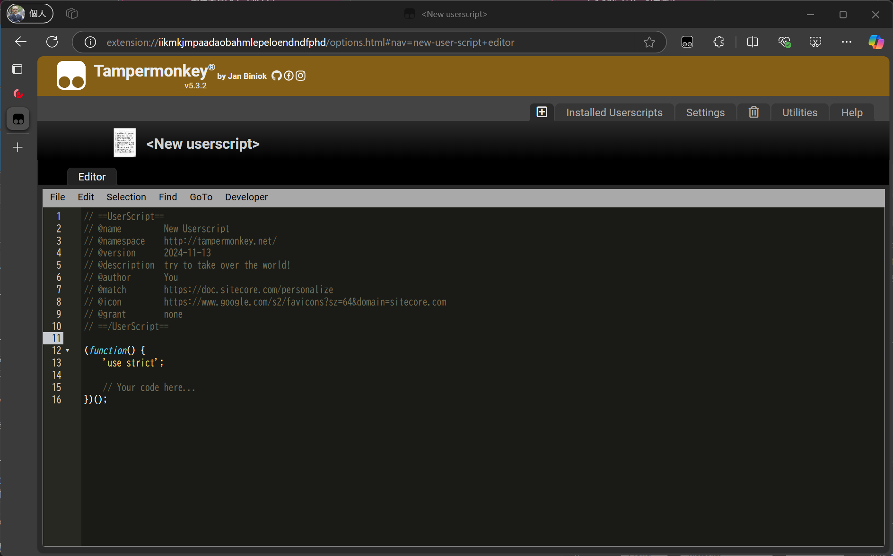
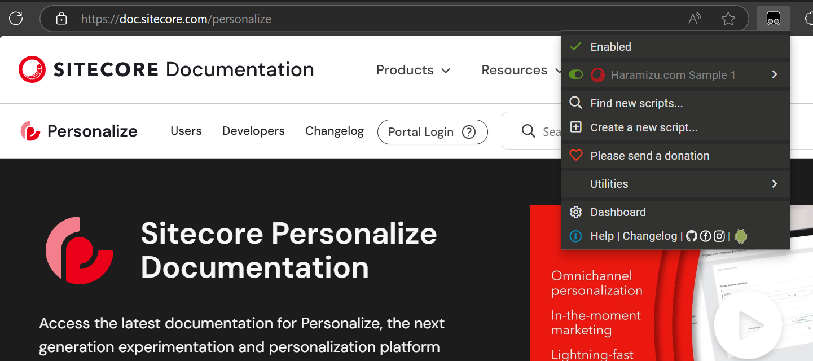
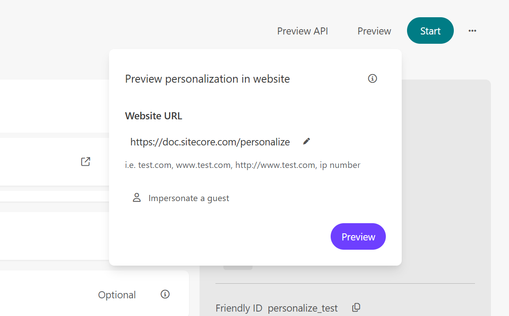
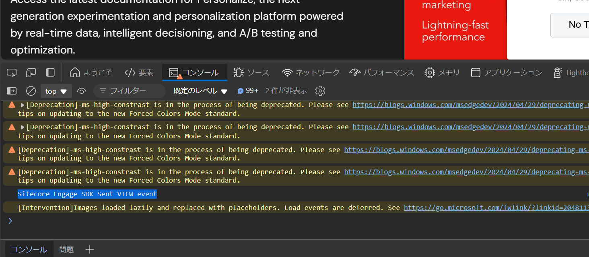
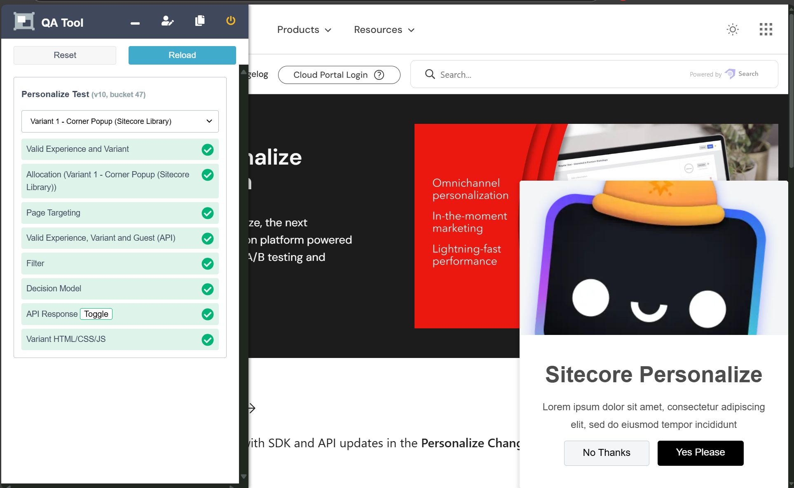

import { Steps } from '@astrojs/starlight/components';

本ドキュメントでは、まだ Sitecore Personalize のタグを埋め込んでいないウェブサイトに対して、ブラウザの拡張機能を利用して実装する JavaScript のコードに関するテストを行う方法を紹介します。この方法を使用することで、開発中のサイトや非本番環境でのパーソナライズの動作確認が容易になります。

## Tampermonkey について

Tampermonkey は、ユーザースクリプトを管理および実行するためのブラウザ拡張機能です。これにより、ユーザーはウェブページの動作をカスタマイズしたり、自動化したりすることができます。以下に、Tampermonkey の主な特徴を紹介します。

### 対応ブラウザ

Tampermonkey は、以下の主要なブラウザで利用できます。

- Google Chrome
- Microsoft Edge
- Firefox
- Safari
- Opera

### インストール方法

Tampermonkey のインストールは非常に簡単です。以下のリンクから、使用しているブラウザに対応するバージョンをダウンロードしてインストールしてください。

- [Tampermonkey 公式サイト](https://www.tampermonkey.net/)

本ドキュメントでは、Google Chrome もしくは Microsoft Edge に対して機能拡張をインストール、動作検証を進めていきます。

### 開発者モードを有効にする

拡張機能をインストールしただけでは、Tampermonkey の機能を利用することはできません。拡張機能として利用できるようにするためには、ブラウザの開発者モードを有効にする必要があります。これに関しては、実際に機能拡張をインストールした後、以下のように警告が表示されていれば、必要な手続きとなります。



この手順は以下のページで紹介されています。

- [Q209: ユーザースクリプトを実行するための開発者モード](https://www.tampermonkey.net/faq.php?locale=ja#Q209)

さっそく手順を確認しながれあ、開発者モードを有効にしていきます。まず、機能拡張の設定を参照するために、メニューから `Extensions` - `Manage Extensions` をクリックしてください。


画面を開くと、開発者モードのためのトグルが表示されています。これをチェックすることで、開発者モードが有効になります。


## Experience を作成する

今回はテストという形で動作させるため、テンプレートを利用してポップアップを表示していきます。このため、まずは Sitecore Personalize の画面でテストを作成します。

<Steps>

1. Experience 一覧のページに移動をします

2. Create ボタンをクリックして、Web の Experience を作成します

3. Personalize Test という名前の Experience を作成します

4. 作成した Experience は以下のように設定します

   - Goal は `Don't track perfomance` を設定
   - Page Targeting は標準の `all pages`

5. Create variant をクリックします

6. Corner Popup (Sitecore Library) を選択します

</Steps>

Corner Popup の設定に関しては、以下の項目を設定しました。

- **General - Image URL**: `https://doc.haramizu.com/_astro/houston.CZZyCf7p_ZmSIFK.webp`
- **Title - Title**: Sitecore Personalize
- **CTA Button - CTA destination URL**: https://doc.haramizu.com/

下記のように、テストで利用する Experience が完成しました。


## Tampermonkey でテストを実行

テストで利用する Experience が完成しました。今回はこのテストで利用する Experience に関して、Sitecore のドキュメントサイトにて Tampermonkey を利用して実行します。

- https://doc.sitecore.com/personalize

すでに機能拡張をインストールしている状態で上記のサイトにアクセスをして、Tampermonky のアイコンをクリックすると、以下のようなメニューが表示されます。まずは Dashboard をクリックしてください。


今回は新規の環境となるため、何もスクリプトが設定されていない状況です。



現在は **Installed Userscripts** のタブが開いている状況です。この左側にある **+** のボタンをクリックして、新しいスクリプトを作成します。



デフォルトで生成されるスクリプトが表示されます。少しだけコードを書き換えてみます。

| Name  | Description                               |
| ----- | ----------------------------------------- |
| name  | スクリプトの名前                          |
| match | スクリプトが有効になる条件、\* を利用可能 |
| icon  | 一覧で利用するアイコン                    |

実際に用意をしたコードは、以下のようになります。

```js {2,,6-7} title="JavaScript"
// ==UserScript==
// @name         Haramizu.com Sample 1
// @namespace    http://tampermonkey.net/
// @version      2024-11-14
// @description  try to take over the world!
// @author       You
// @match        https://doc.sitecore.com/*
// @icon         https://www.google.com/s2/favicons?sz=64&domain=www.sitecore.com
// @grant        none
// ==/UserScript==

(function () {
  'use strict';

  // Your code here...
})();
```

上記の設定で保存をしたあとにサイトに改めて訪問をすると、以下の画面のように有効になっているのが分かります。



### Engage SDK のスクリプトを追加する

今回は Sitecore Engage SDK を利用して動作確認をしていきます。先ほど作成をしたコードは何も含まれておらず、Tampermonkey にて有効になっているかどうかのチェックのみでした。そこで、標準的な JavaScript のコードを追加します。以下が、全てのコードになります。

```js {20,23,25-26,57} title="JavaScript"
// ==UserScript==
// @name         Haramizu.com Sample 1
// @namespace    http://tampermonkey.net/
// @version      2024-11-14
// @description  try to take over the world!
// @author       You
// @match        https://doc.sitecore.com/*
// @icon         https://www.google.com/s2/favicons?sz=64&domain=www.sitecore.com
// @grant        none
// ==/UserScript==

(function () {
  'use strict';

  // edit the {{cookieDomain}}, {{clientKey}}, {{pointOfSale}} and {{SiteName}} with your CDP/P enviorment values and website name
  // see https://doc.sitecore.com/cdp/en/developers/api/collect-required-details.html for where and how to get these values

  // Choose the API_TARGET that matches your API region (Europe,USA,or Asia)
  // https://doc.sitecore.com/personalize/en/developers/api/collect-required-details.html#stream-api-target-endpoint
  const API_TARGET = 'https://api-engage-jpe.sitecorecloud.io';

  //Engage SDK settings
  const ENGAGE_COOKIE_DOMAIN = '.sitecore.com'; // e.g. ".myretailsite.com"
  const ENGAGE_API_TARGET = API_TARGET;
  const ENGAGE_CLIENT_KEY = '{{YOUR-CLIENT-KEY}}';
  const ENGAGE_POINT_OF_SALE = '{{YOUR-POINT-OF-SALE}}';

  const CURRENCY = 'USD';
  const CHANNEL = 'WEB';
  const LANG = 'EN';

  main();

  var engage = undefined;

  function main(engage) {
    console.log('Loading Sitecore Engage SDK...');

    // Create and inject the <script> tag into the HTML
    var s = document.createElement('script');
    s.type = 'text/javascript';
    s.async = true;
    s.src = 'https://d1mj578wat5n4o.cloudfront.net/sitecore-engage-v.1.4.3.min.js';
    var x = document.querySelector('script');
    x.parentNode.insertBefore(s, x);

    // Initialize the Engage SDK & send a VIEW event on each page load
    s.addEventListener('load', async () => {
      var settings = {
        clientKey: ENGAGE_CLIENT_KEY,
        targetURL: ENGAGE_API_TARGET,
        pointOfSale: ENGAGE_POINT_OF_SALE,
        cookieDomain: ENGAGE_COOKIE_DOMAIN,
        cookieExpiryDays: 365,
        forceServerCookieMode: false,
        includeUTMParameters: true,
        webPersonalization: { baseURLOverride: 'https://d2ez8k04aaol9g.cloudfront.net' },
      };
      window.engage = await window.Engage.init(settings);

      var event = {
        channel: CHANNEL,
        language: LANG,
        currency: CURRENCY,
        page: window.location.pathname + window.location.search,
      };
      // Send VIEW event
      window.engage.pageView(event);
      console.log('Sitecore Engage SDK Sent VIEW event');

      //temp solution for demobars as the Engage.settings object does not expose the cookieDomain
      localStorage.setItem('scDemoBar_cookieDomain', settings.cookieDomain);
    });
  }
})();
```

上記のコードに関して、実際に連携をする Sitecore Personalize の設定を追加する必要があります。

### Sitecore Personalize と繋げる

上記のサンプルは、日本のデータセンターのエンドポイントを利用する形になっています。他のデータセンターを利用する場合は、以下のページから必要なエンドポイントの URL を取得して変更をしてください。

- [Collect required details - Stream API target endpoint](https://doc.sitecore.com/personalize/en/developers/api/collect-required-details.html#stream-api-target-endpoint)

:::caution
上記のサンプルは日本のデータセンターを利用する場合のサンプルとなっています。日本以外のデータセンターを利用する場合は、webPersonalization の値を true と設定するだけで動作します。

```js
webPersonalization: true;
```

:::

続いて Sitecore Personalize の管理画面から YOUR-CLIENT-KEY および YOUR-POINT-OF-SALE の値を取得する必要があります。

YOUR-CLIENT-KEY は Sitecore Personalize の Company Information の画面で、一番下に表示されているキーが対象となります。


また YOUR-POINT-OF-SALE に関しては同様に一覧から利用する Point of sale を選択してください。


これで tampermonkey 側の設定が完了しました。

### Sitecore Personalize でプレビュー

改めて Sitecore Personalize の画面に移動をして、事前に作成をしたテストの Experience を開きます。


右上のメニューにて、`Preview` のボタンが用意されています。これをクリックして、`https://doc.sitecore.com/personalize` の URL を指定します。



Preview のボタンをクリックすると、右下から Popup が出てくるのを確認することができました。


開発者ツールを開くと、Sitecore Engage SDK Sent VIEW event のイベントが発生していることも確認できます。



Sitecore Personalize の Preview を利用している場合は、QA Tool のボタンが準備されています。このツールを開くと、正しく動作しているのかどうかを確認することができます。



## まとめ

今回は Tampermoneky を利用して、ブラウザ側のスクリプトを利用してパーソナライズを実行することができるかの確認をしました。実際にこの Tampermoneky で動作するのを確認したうえで、Web サイトには適用していくのがスムーズに進む形となります。

## 参考情報

- [Collect required details - Stream API target endpoint](https://doc.sitecore.com/personalize/en/developers/api/collect-required-details.html#stream-api-target-endpoint)
- [SitecoreNA / Sitecore-CDP-Scripts](https://github.com/SitecoreNA/Sitecore-CDP-Scripts)
