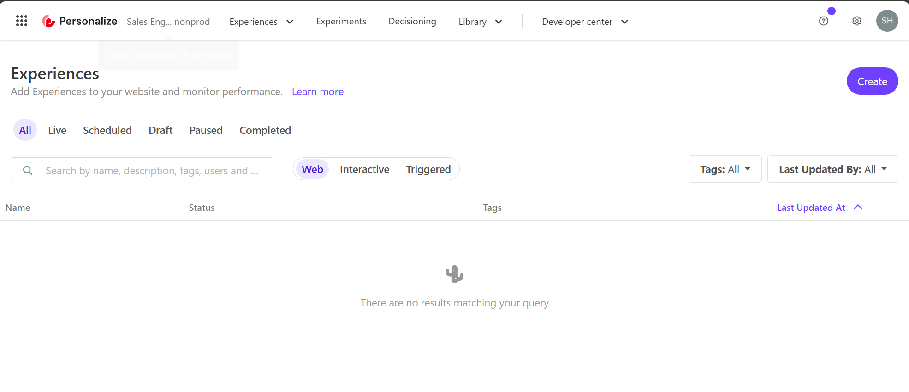
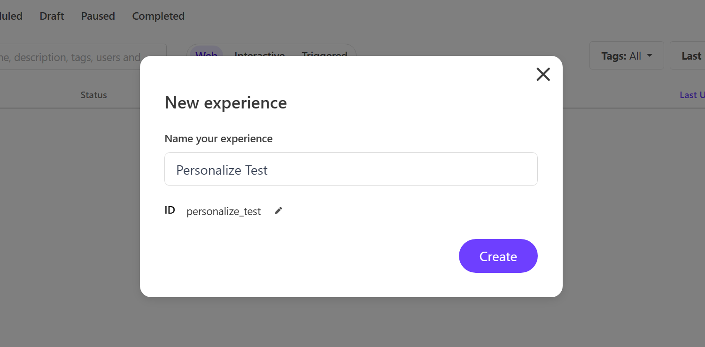
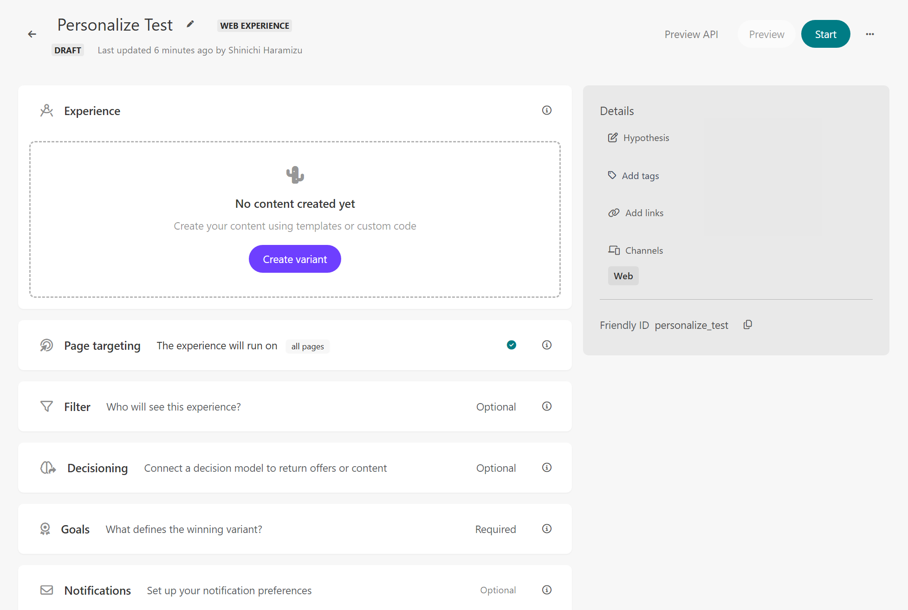
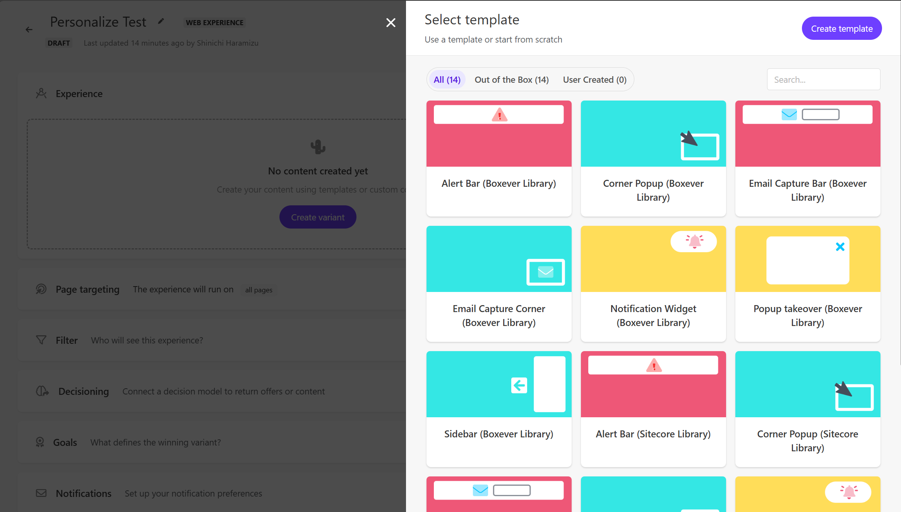

Sitecore Personalize の管理画面では、複数のテンプレートが選択可能です。これらのテンプレートには、Boxever Library と Sitecore Library の２つのタイプが提供されています。それぞれのテンプレートには異なる特徴があり、HTML コードや CSS の記述に違いがあります。本記事では、これらのテンプレートの違いについて詳しく解説し、どのように使い分けるべきかを説明します。

## 新しい Experience の作成

今回は新しい Experience を作成する過程でこの内容を確認していきます。まず、Sitecore Personalize にログインをして、Experiences の画面に遷移すると、作成している Experience 一覧が表示されます。今回は新しい環境のため、まだ何も提供されていない状況です。



新しい Experience を作成する際には、右上の `Create` のボタンをクリックします。すると 3 つのタイプの Experience のどれを選択するのかが表示されます。

- **Web**: Web サイトで実施する Personalize を作成
- **Interactive**: API ベースでのコンテンツの配信、アプリ連携など
- **Triggerd**: メールやテキストのための特定のイベントとして

このサイトでは基本的には Web のサンプルを紹介していく予定です。そこで、Web を選択して、Experience の名前は Personalize Test とします。



Web の Experience を作成する上で設定項目は以下のようになります。

- **Experience** (必須): 表示をする Web パーツになります。今回はここのライブラリを確認します。
- **Page Targeting**: 表示をするためのルールを設定します。標準で `all pages` と設定されています。
- **Filter**: 対象になるルールに関して記載します
- **Decisioning**: Personalize で提供されている Decisioning と連携する場合に利用
- **Goal**（必須）: 何をコンバージョンゴールとして設定をするかを定義。
- **Notifications**: 通知に関する設定



## 新しい Variant の作成

新しく作成された Experience には何も定義されていない状況のため、今回は `Create variant` のボタンをクリックして表示方法を追加します。クリックをすると以下のようにテンプレートを選択する画面が表示されます。



### テンプレートの種類の確認

標準で提供されているテンプレートの種類としては、以下のサンプルが提供されています。

- Alert Bar
- Corner Popup
- Email Capture Bar
- Email Capture Corner
- Notification Widget
- Popup takeover
- Slidebar

上記のテンプレートのデザインに関しては、別途紹介をします。

### ライブラリの種類の確認

上記のテンプレートに対して、２つの種類のライブラリが提供されています。

- Boxever Library
- Sitecore Library

もともと Sitecore Personalize で動作するテンプレートとして提供されていたのは Boxever Library でしたが、現在は Sitecore Library を利用する形となっています。

## 違いを確認する

実際にそれぞれの違いを確認していきます。テンプレートのコードの違いの確認、そして利用方法の違いの確認です。

### ライブラリのコード

テンプレートとして、２つのタイプのライブラリが設定されているところを紹介しましたが、中身を確認してみたいと思います。まず、

HTML のコードの違いを見るとわかります。コードが以下のように異なります。Corner Popup の Boxever Library のコードは以下のようになっています。Corner Popup のコードを確認していきます。まず、Boxever Library の HTML のコードは以下の通りです。

```html title="HTML"
<!-- Use dynamic Guest variables, type ctrl+space or guest to explore available entities.-->
<!-- Type "d" to see decisioning helpers -->
<div id="bx-transition-card">
  <div class="img-container">
    <div class="img-container__image"></div>
  </div>
  <div class="bx-transition-card__body">
    <h3>[[Title | string | Title | {required:true, group: Title, order: 1}]]</h3>
    <p>
      [[Description | text | Lorem ipsum dolor sit amet, consectetur adipiscing elit, sed do eiusmod
      tempor incididunt | {required:true, group: Description, order: 1}]]
    </p>
    <div class="options-container">
      <a id="bx-transition-card--secondary" class="options-container__secondary"
        >[[Dismiss Text | string | No Thanks | {required:true, group: Secondary Button, order:
        1}]]</a
      >
      <a id="bx-transition-card--primary" class="options-container__primary"
        >[[CTA Text | string | Yes Please | {required:true, group: CTA Button, order: 1}]]</a
      >
    </div>
  </div>
</div>
```

続いて同じタイプのテンプレートの、Sitecore Library のコードを確認します。

```html {3,7,11-12} title="HTML"
<!-- Use dynamic Guest variables, type ctrl+space or guest to explore available entities.-->
<!-- Type "d" to see decisioning helpers -->
<div id="pers-transition-card">
  <div class="img-container">
    <div class="img-container__image"></div>
  </div>
  <div class="pers-transition-card__body">
    <h3>[[Title | string | Title | {required:true, group: Title, order: 1}]]</h3>
    <p>
      [[Description | text | Lorem ipsum dolor sit amet, consectetur adipiscing elit, sed do eiusmod
      tempor incididunt | {required:true, group: Description, order: 1}]]
    </p>
    <div class="options-container">
      <a id="pers-transition-card--secondary" class="options-container__secondary"
        >[[Dismiss Text | string | No Thanks | {required:true, group: Secondary Button, order:
        1}]]</a
      >
      <a id="pers-transition-card--primary" class="options-container__primary"
        >[[CTA Text | string | Yes Please | {required:true, group: CTA Button, order: 1}]]</a
      >
    </div>
  </div>
</div>
```

id のタグに関して、Boxever library に対しては bx- で始まるように記載をしていますが、Sitecore Library では pers- で始まるように記述をしています。これは HTML に限らず CSS などでも異なる実装となっています。

### 利用する JavaScript

Boxever library および Sitecore Library を利用する場合の大きな違いとして、サイトで利用する JavaScript のファイルが異なる形となります。例えば、Boxever library を利用する際には、`https://d1mj578wat5n4o.cloudfront.net/boxever-1.4.1.min.js` を利用しますが、Sitecore Library を利用する際には `https://d1mj578wat5n4o.cloudfront.net/sitecore-engage-v.1.4.3.min.js` を呼び出す形となります。後者は、Sitecore Engage SDK で利用する形となっています。

## どちらを利用するのが良いか？

現実的な回答としては、これから Sitecore Personalize を新規に導入するのであれば Sitecore Library を利用するのが良いということになります。この理由としては、次に取り上げる SDK との兼ね合いがあります。

Sitecore Personalize を利用しやすいように、ということで Sitecore では 2 つの SDK を提供しています。この２つの SDK に対応している Experience の構造が Sitecore Library です。 実は JavaScript を実装する際にも、Boxever Library と Sitecore Library を利用する際には異なる実装となります。

本ドキュメントサイトでは、Sitecore Library を利用することを前提に、進めていきます。

## まとめ

今回は用意されているテンプレートの２つのタイプの違いに関して紹介をしました。次のトピックとしては、Web サイトに実装する際の SDK に関して紹介をします。

## 参考情報

- [サンプル](/cdp-personalize/sample/)

