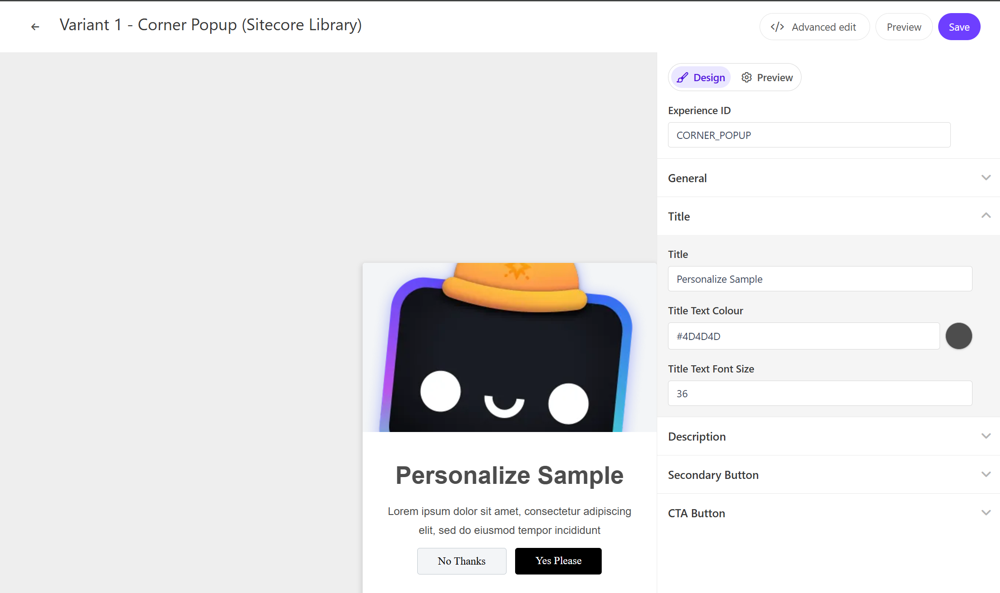

このページでは、Sitecore Personalize で提供している標準テンプレートの Corner Popup のデモを確認することができます。



## 設定項目

### 画像

Corner Popup は画像を一つ設定することができます。この項目は `General` - `Image URL` で変更できます。

### 概要

ポップアップで利用する文章を指定することができます。この項目は、`Description` - `Description` で変更できます。

### Secondary Button

ポップアップを閉じるだけの動作をするボタンのラベルを変更できます。 `Secondary Button` - `Dismiss Text` で変更できます。

### CTA Button

ポップアップのメッセージに対してアクションをするときのラベルを変更できます。 `CTA Button` - `CTA Text` で変更できます。

## コードの確認

HTML の中に含まれる変数は以下の通りです

| 変数         | 形式   | 概要                                   |
| ------------ | ------ | -------------------------------------- |
| Title        | string | タイトル                               |
| Description  | string | 概要                                   |
| Dismiss Text | string | 実行しない場合のボタンラベル           |
| CTA Text     | string | コンバージョンをするときのボタンラベル |

### HTML コード

Alert Bar の HTML は以下のように設定されています。

```html
// CornerPopup.html
<!-- Use dynamic Guest variables, type ctrl+space or guest to explore available entities.-->
<!-- Type "d" to see decisioning helpers -->
<div id="pers-transition-card">
  <div class="img-container">
    <div class="img-container__image"></div>
  </div>
  <div class="pers-transition-card__body">
    <h3>[[Title | string | Title | {required:true, group: Title, order: 1}]]</h3>
    <p>
      [[Description | text | Lorem ipsum dolor sit amet, consectetur adipiscing elit, sed do eiusmod
      tempor incididunt | {required:true, group: Description, order: 1}]]
    </p>
    <div class="options-container">
      <a id="pers-transition-card--secondary" class="options-container__secondary"
        >[[Dismiss Text | string | No Thanks | {required:true, group: Secondary Button, order:
        1}]]</a
      >
      <a id="pers-transition-card--primary" class="options-container__primary"
        >[[CTA Text | string | Yes Please | {required:true, group: CTA Button, order: 1}]]</a
      >
    </div>
  </div>
</div>
```

### JavaScript コード

Alert Bar の JavaScript は以下のように設定されています。

```js
// CornerPopup.js
// Adds a unique variant identifier to CSS when deployed to ensure CSS does not impact styling of other elements.
var compiledCSS = Engage.templating.compile(variant.assets.css)(variant);
var styleTag = document.getElementById('style-' + variant.ref);
if (styleTag) {
  styleTag.innerHTML = compiledCSS;
}
// End Adds a unique variant identifier to CSS when deployed to ensure CSS does not impact styling of other elements.

// make space in the body for the experience
insertHTMLAfter('body', 'pers-');
var persContent = document.querySelector('#pers-' + variant.ref + ' #pers-transition-card');

setTimeout(function () {
  persContent.classList.add('open');
  sendInteractionToPersonalize('VIEWED');
});

var persCardClose = document.body.querySelector(
  '#pers-' + variant.ref + ' #pers-transition-card--secondary'
);
persCardClose.onclick = function () {
  sendInteractionToPersonalize('DISMISSED');
  persContent.classList.remove('open');
};

var persCardCta = persContent.querySelector(
  '#pers-' + variant.ref + ' #pers-transition-card--primary'
);
persCardCta.onclick = function () {
  sendInteractionToPersonalize('CLICKED');
  window.location.href = '[[CTA destination URL | string || {required:true, group: CTA Button}]]';
};

function sendInteractionToPersonalize(interactionType) {
  const type = '[[ Experience ID | String | CORNER_POPUP | {required: true}]]_INTERACTION';
  const eventData = {
    channel: 'WEB',
    pointOfSale: Engage.settings.pointOfSale,
    interactionID: 'PERS_CORNER_POPUP',
    interactionType: interactionType,
  };

  window.engage.event(type, eventData);
}
```

- [サンプル一覧に戻る](/personalize/sample/)
