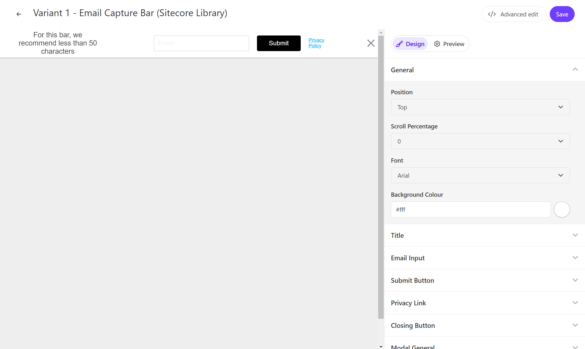
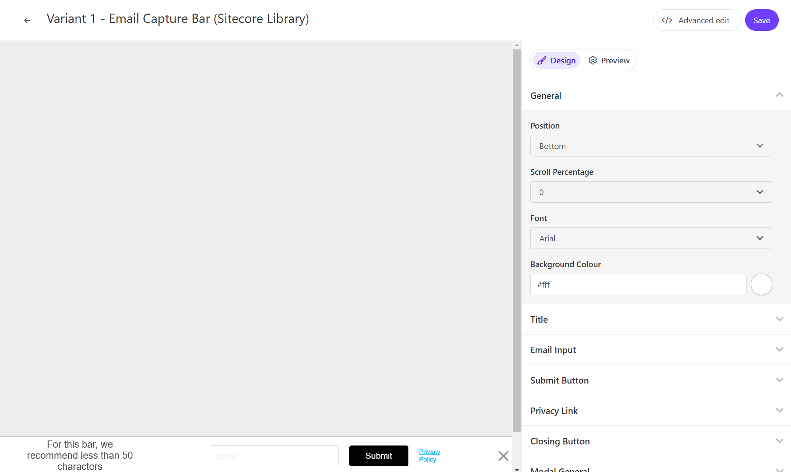

このページでは、Sitecore Personalize で提供している標準テンプレートの Email Capture Bar のデモを確認することができます。

## 設定項目

### 表示位置

Email Capture Bar はページの上、もしくは下に表示することができます。





### タイトル

Email Capture Bar で利用するテキストを設定できます。この項目は `Title` - `Title Text` で変更できます。

### 入力例

Email Capture Bar の入力ボックスで表示する文字列を設定できます。この項目は `Email Input` - `Input Ghost Text` で変更できます。

### Submit ボタン

Email Capture Bar のボタンのラベルを設定できます。この項目は `Submit Button` - `Button Text` で変更できます。

### Privacy リンク

Privacy に関するリンクの表示、およびリンクの設定ができます。`Privacy Link` - `Privacy Text` にリンクのテキスト、`Privacy Link` でリンク先の設定ができます。

### 入力後のレスポンスとして

入力後の結果を表示する際のテキストを設定ができます。 `Modal Title` - `Modal Title Text` にメッセージを、`Modal Description` の `Modal Description Text` を変更できます。

## コードの確認

HTML の中に含まれる変数は以下の通りです

| 変数                   | 形式   | 概要                                    |
| ---------------------- | ------ | --------------------------------------- |
| Title Text             | string | Bar に表示をするテキスト                |
| Input Ghost Text       | string | 入力ボックスに表示する文字              |
| Button Text            | string | ボタンラベル                            |
| Privacy Text           | string | プライバシーの表示テキスト              |
| Privacy Link           | string | プライバシーのリンク先の URL を設定する |
| Modal Title Text       | string | 入力後のテキストを設定します            |
| Modal Description Text | string | 入力後の概要を設定します                |

### HTML コード

Email Capture Bar の HTML は以下のように設定されています。

```html
// EmailCaptureBar.html
<!-- Use dynamic Guest variables, type ctrl+space or guest to explore available entities.-->
<!-- Type "d" to see decisioning helpers -->
<div id="pers_TopBanner">
  <div class="pers_TopBanner__banner">
    <div class="pers-banner_content_container">
      <div class="pers-text_section">
        <p>
          [[Title Text | string | For this bar, we recommend less than 50 characters | { max: 50,
          group: Title, groupOrder: 2, order: 1 }]]
        </p>
      </div>
      <div class="pers-email_section">
        <input
          type="email"
          name="pers-email_input"
          class="pers-email_input input-box"
          id="pers-email_input"
          placeholder="[[ Input Ghost Text | string | Email | { required: true, group: Email Input, groupOrder: 3, order: 1 } ]]"
        />
        <div class="pers-modal_button-wrapper">
          <a class="pers-modal_button__primary" id="pers-modal_button"
            >[[ Button Text | string | Submit | { required: true, group: Submit Button, groupOrder:
            4, order: 1 } ]]</a
          >
          <a
            class="pers-modal_button__privacy-link"
            href="[[ Privacy Link | string | https://www.example.com/ | { required: true, group: Privacy Link, groupOrder: 5, order: 2 } ]]"
            >[[ Privacy Text | string | Privacy Policy | { required: true, group: Privacy Link,
            order: 1 }]]</a
          >
        </div>
      </div>
    </div>

    <div class="pers__btn-close" id="pers_TopBanner-close"></div>
  </div>
</div>

<div id="pers-thank_you_modal">
  <div class="pers-modal_backdrop" id="pers-thank_you_backdrop"></div>
  <div class="pers-modal_content">
    <h3>
      [[ Modal Title Text | string | Thank You! | { required: true, group: Modal Title, groupOrder:
      8, order: 1 } ]]
    </h3>
    <p>
      [[ Modal Description Text | text | You're all signed up. | { required: true, group: Modal
      Description, groupOrder: 9, order: 1 } ]]
    </p>

    <div class="pers__btn-close" id="pers-thank_you_close"></div>
  </div>
</div>
```

### JavaScript コード

Email Capture Bar の JavaScript は以下のように設定されています。動作に関してはコメントで紹介を入れています。

```js
// EmailCaptureBar.js
// バリアントごとに固有のCSSを適用して、他の要素のスタイリングに影響を与えないようにしています。
var compiledCSS = Engage.templating.compile(variant.assets.css)(variant);
var styleTag = document.getElementById('style-' + variant.ref);
if (styleTag) {
    styleTag.innerHTML = compiledCSS;
}
// End Adds a unique variant identifier to CSS when deployed to ensure CSS does not impact styling of other elements.

// bodyタグの前にHTMLを挿入することで、メールキャプチャバーのためのスペースを作ります。
insertHTMLBefore('body', 'pers-');

// バナーの初期状態を非表示に設定
document.querySelector("#pers-"+variant.ref+ " #pers_TopBanner").style.display = "none";

// スクロールイベントの設定
// スクロールパーセンテージの入力を取得:
const scrollPercentageInput = [[Scroll Percentage | enum(0,25,50,100)| 0 |{group: General, groupOrder: 1, order: 2}]]
if (scrollPercentageInput > 0) {
    window.addEventListener('scroll', currentScrollPercentage);
} else {
    showBar();
}

// 現在のスクロールパーセンテージを計算し、バーを表示
function currentScrollPercentage()
{
    const scrollPercentage = Math.round((document.documentElement.scrollTop + document.body.scrollTop) / (document.documentElement.scrollHeight - document.documentElement.clientHeight) * 100);
    if (scrollPercentage > scrollPercentageInput){
        showBar();
        window.removeEventListener('scroll', currentScrollPercentage);
    }
}

// バーを表示
function showBar() {
    document.querySelector("#pers-"+variant.ref+ " #pers_TopBanner").style.display = "block";
    document.body.classList.add("show-TopBanner");
}

// バーを非表示
function dismissBar() {
    document.querySelector("#pers-"+variant.ref+ " #pers_TopBanner").style.display = "none";
    document.body.classList.remove("show-TopBanner");
}

// サンキューモーダルを表示
function showThankYou() {
    document.querySelector("#pers-"+variant.ref+ " #pers-thank_you_modal").style.display = "flex";
}

// ボタンのクリックイベント
function dismissThankYou() {
    document.querySelector("#pers-"+variant.ref+ " #pers-thank_you_modal").style.display = "none";
}

const persSubmitPress = document.querySelector("#pers-"+variant.ref+ " #pers-modal_button");
const persThankYouClose = document.querySelector("#pers-"+variant.ref+ " #pers-thank_you_close");
const persThankYouBackdrop = document.querySelector("#pers-"+variant.ref+ " #pers-thank_you_backdrop");
const persCloseButtonPress = document.querySelector("#pers-"+variant.ref+ " #pers_TopBanner-close");
const persThankYou = document.querySelector("#pers-"+variant.ref+ " #pers-thank_you_modal");

// インタラクションイベントの送信
function sendInteractionToPersonalize(eventType) {
    const eventData = {
        "channel": "WEB",
        "pointOfSale": Engage.settings.pointOfSale,
        "interactionID": "OOB_EXP",
        "interactionName": "EMAIL_BAR_SCROLL"
    };
    window.engage.event(eventType, eventData);
}

// アイデンティティイベントの送信
function sendIdentityEvent() {
    let eventData = {
      "channel": "WEB",
      "pointOfSale": Engage.settings.pointOfSale,
      "email": document.getElementById("pers-email_input").value,
      "identifiers": [{
          "id": document.getElementById("pers-email_input").value,
          "provider": "email"
      }]
  };
  window.engage.identity(eventData);
}

persSubmitPress.onclick = function() {
    if (document.getElementById("pers-email_input").value.length > 0) {
        sendIdentityEvent();
        sendInteractionToPersonalize("INTERACTION_IDENTITY");
        showThankYou();
        dismissBar();
    }
};

persCloseButtonPress.onclick = function() {
   sendInteractionToPersonalize("INTERACTION_DISMISSED");
   dismissBar();
};

persThankYouClose.onclick = function() {
  dismissThankYou();
}

persThankYouBackdrop.onclick = function() {
  dismissThankYou();
};
```

- [サンプル一覧に戻る](/personalize/sample/)
