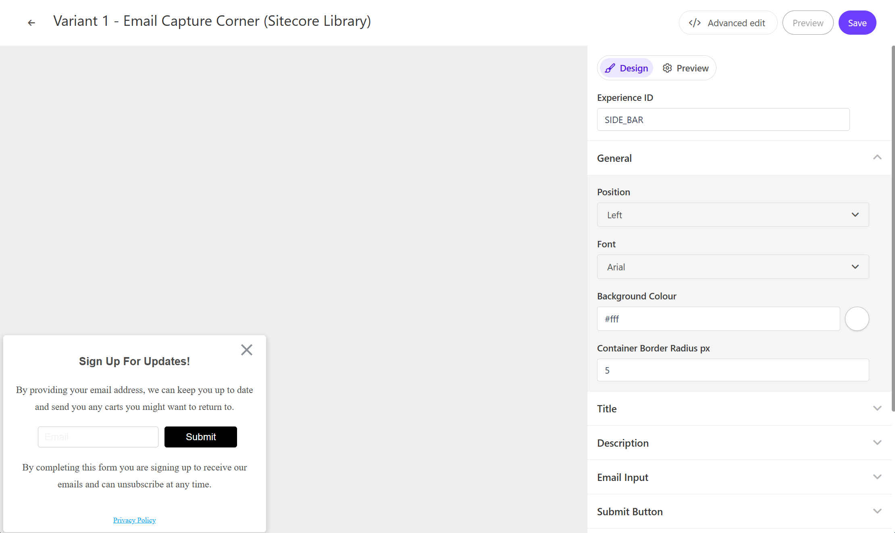

このページでは、Sitecore Personalize で提供している標準テンプレートの Email Capture Corner のデモを確認することができます。

## 設定項目

### 表示位置

Email Capture Corner はページの右、もしくは左に表示することができます。`General` - `Position` の項目で変更することができます。




### タイトルテキスト

Email Capture Corner のポップアップのタイトルの文字列を設定できます。この項目は `Title` - `Title Text` で変更できます。

### 概要に関して

ポップアップで利用する文章を設定することができます。 `Description` の項目に `Description Top` には入力ボックスの上の文章を、 `Descrition Bottom` には入力ボックスの下の文章を変更できます。

### 入力例

Email Capture Corner の入力ボックスで表示する文字列を設定できます。この項目は `Email Input` - `Input Ghost Text` で変更できます。

### Submit ボタン

Email Capture Corner のボタンのラベルを設定できます。この項目は `Submit Button` - `Button Text` で変更できます。

### Privacy リンク

Privacy に関するリンクの表示、およびリンクの設定ができます。`Privacy Link` - `Privacy Text` にリンクのテキスト、`Privacy Link` でリンク先の設定ができます。

### 入力後のレスポンスとして

入力後の結果を表示する際のテキストを設定ができます。 `Modal Title` - `Modal Title Text` にメッセージを、`Modal Description` の `Modal Description Text` を変更できます。

## コードの確認

HTML の中に含まれる変数は以下の通りです

| 変数                   | 形式   | 概要                                    |
| ---------------------- | ------ | --------------------------------------- |
| Title Text             | string | ポップアップのタイトルテキスト          |
| Description Top        | string | 入力ボックスの前の概要                  |
| Input Ghost Text       | string | 入力ボックスに表示する文字              |
| Button Text            | string | ボタンラベル                            |
| Description Bottom     | string | 入力ボックスの後の概要                  |
| Privacy Text           | string | プライバシーの表示テキスト              |
| Privacy Link           | string | プライバシーのリンク先の URL を設定する |
| Modal Title Text       | string | 入力後のテキストを設定します            |
| Modal Description Text | string | 入力後の概要を設定します                |

### HTML コード

Email Capture Corner の HTML は以下のように設定されています。

```html
// EmailCaptureCorner.html
<!-- Use dynamic Guest variables, type ctrl+space or guest to explore available entities.-->
<!-- Type "d" to see decisioning helpers -->
<div id="pers-transition-card">
  <div class="pers-transition-card__body">
    <div class="pers__btn-close"></div>
    <div class="pers-email_capture_container" id="pers-email_capture_container">
      <h3>
        [[ Title Text | string | Sign Up For Updates! | { required: true, group: Title, groupOrder:
        2, order: 1 } ]]
      </h3>
      <p>
        [[ Description Top | text | By providing your email address, we can keep you up to date and
        send you any carts you might want to return to.| { required: true ,group: Description,
        groupOrder: 3, order: 1 }]]
      </p>

      <div class="options-container">
        <input
          type="email"
          name="pers-email_input"
          class="pers-email_input input-box"
          id="pers-email_input"
          placeholder="[[ Input Ghost Text | string | Email | { required: true , group: Email Input, groupOrder: 4, order: 1 } ]]"
        />
        <a id="pers-transition-card--primary" class="options-container__primary"
          >[[ Button Text | string | Submit | {required: true,max: 15, group: Submit Button, order:
          1 } ]]</a
        >
      </div>
      <p>
        [[ Description Bottom | text |By completing this form you are signing up to receive our
        emails and can unsubscribe at any time.|{ required: true, group: Description, order: 2 }]]
      </p>
      <p>
        <a
          class="options-container__privacy-link"
          href="[[ Privacy Link | string | https://www.example.com/ | { required: true, group: Privacy Link, groupOrder: 5, order: 2 } ]]"
          >[[ Privacy Text | string | Privacy Policy | { required: true, group: Privacy Link, order:
          1 }]]</a
        >
      </p>
    </div>
  </div>
</div>

<div class="pers-thank_you_container" id="pers-thank_you_modal">
  <div class="pers-modal_backdrop" id="pers-thank_you_backdrop"></div>
  <div class="pers-modal_content">
    <h3>
      [[ Modal Title Text | string | Thank You! | { required: true, group: Modal Title, groupOrder:
      8, order: 1 } ]]
    </h3>
    <p>
      [[ Modal Description Text | text | You're all signed up. | { required: true, group: Modal
      Description, groupOrder: 9, order: 1 } ]]
    </p>

    <div class="pers__btn-close" id="pers-thank_you_close"></div>
  </div>
</div>
```

### JavaScript コード

Email Capture Corner の JavaScript は以下のように設定されています。

```js
// EmailCaptureCorner.js
// 変数variantに基づいてCSSをコンパイルし、既存の<style>タグに適用することでスタイルが他の要素に影響を与えないようにしています。
var compiledCSS = Engage.templating.compile(variant.assets.css)(variant);
var styleTag = document.getElementById('style-' + variant.ref);
if (styleTag) {
  styleTag.innerHTML = compiledCSS;
}
//End

// bodyタグの後にHTMLを挿入します。これにより、新しいコンテンツ（メールキャプチャバー）がページに追加されます。
insertHTMLAfter('body', 'pers-');

// ポップアップの表示
let persContent = document.querySelector('#pers-transition-card');
persContent.style.display = 'flex';

// モーダルの表示と非表示
function showThankYou() {
  document.querySelector('#pers-' + variant.ref + ' #pers-thank_you_modal').style.display = 'flex';
}

function dismissThankYou() {
  document.querySelector('#pers-' + variant.ref + ' #pers-thank_you_modal').style.display = 'none';
}

// 変数の宣言
const persEmailCaptureContainer = document.getElementById('pers-email_capture_container');
const persThankYouClose = document.querySelector('#pers-' + variant.ref + ' #pers-thank_you_close');
const persThankYouBackdrop = document.querySelector(
  '#pers-' + variant.ref + ' #pers-thank_you_backdrop'
);
const persThankYouContainer = document.querySelector(
  '#pers-' + variant.ref + ' #pers-thank_you_modal'
);
const persClose = persContent.querySelector('.pers__btn-close');
const persCTA = document.getElementById('pers-transition-card--primary');

// イベントリスナーの設定
persCTA.onclick = function () {
  let persEmail = document.getElementById('pers-email_input').value;
  let emailVerified = validateEmail(persEmail);
  emailVerified
    ? onSuccessValidation(persEmail)
    : //friendly error
      (document.getElementById('pers-email_input').style.backgroundColor = 'rgba(200,0,0,0.1)');
};

// バーナーのクローズボタンの処理
persClose.onclick = function () {
  persContent.style.display = 'none';
  sendInteractionToPersonalize('DISMISSED');
};

// モーダルのクローズボタンの処理
persThankYouClose.onclick = function () {
  dismissThankYou();
};

persThankYouBackdrop.onclick = function () {
  dismissThankYou();
};

// インタラクションの送信関数
const sendInteractionToPersonalize = function (interactionType) {
  const type = '[[ Experience ID | String | SIDE_BAR | {required: true}]]_' + interactionType;
  const eventData = {
    channel: 'WEB',
    pointOfSale: Engage.settings.pointOfSale,
  };
  window.engage.event(type, eventData);
};

// メールアドレス検証成功時の処理
const onSuccessValidation = function (email) {
  sendInteractionToPersonalize('IDENTITY');

  const eventData = {
    channel: 'WEB',
    pointOfSale: Engage.settings.pointOfSale,
    email: email,
    identifiers: [
      {
        id: email,
        provider: 'email',
      },
    ],
  };
  window.engage.identity(eventData);

  persEmailCaptureContainer.style.display = 'none';
  let X = document.querySelector('.pers__btn-close');
  X.style.display = 'none';
  showThankYou();
  // flash thank you message
  setTimeout(function () {
    document.querySelector('#pers-transition-card').style.display = 'none';
  }, 100);
};

// メールアドレスの検証関数
const validateEmail = function (persEmail) {
  let validation = false;
  let mailformat = /^[a-zA-Z0-9.!#$%&'*+/=?^_`{|}~-]+@[a-zA-Z0-9-]+(?:.[a-zA-Z0-9-]+)*$/.test(
    persEmail
  );
  mailformat ? (validation = true) : (validation = false);
  return validation;
};
```

- [サンプル一覧に戻る](/personalize/sample/)
