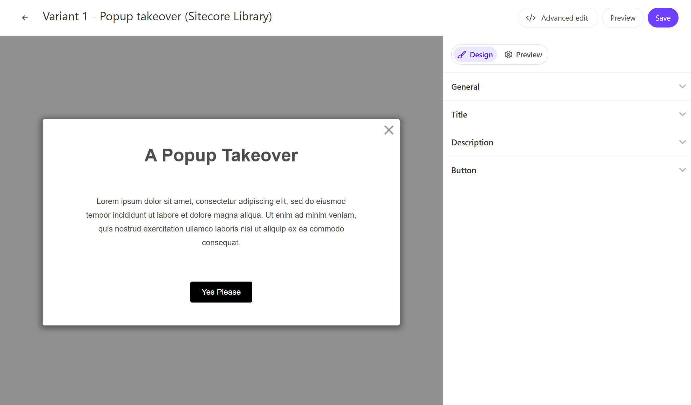

このページでは、Sitecore Personalize で提供している標準テンプレートの Popup takeover のデモを確認することができます。



## 設定項目

### タイトルテキスト

Popup takeover のタイトルのテキストを設定することができます。この項目は `Title` - `Title Text` で変更できます。

### 概要テキスト

Popup takeover で表示する文章の設定ができます。この項目は、`Description` - `Description Text` で変更できます。

### ボタンラベル

Popup takeover で表示するボタンのラベルを設定ができます。この項目は、`Button` - `Button title` で変更できます。

## コードの確認

HTML の中に含まれる変数は以下の通りです

| 変数             | 形式   | 概要                             |
| ---------------- | ------ | -------------------------------- |
| Title Text       | string | タイトル                         |
| Description Text | string | ポップアップに表示をするテキスト |
| Button title     | string | ボタンのラベル                   |

### HTML コード

Popup takeover の HTML は以下のように設定されています。

```html
// Popuptakeover.html
<!-- Use dynamic Guest variables, type ctrl+space or guest to explore available entities.-->
<!-- Type "d" to see decisioning helpers -->
<div id="pers-modal_overlay">
  <div class="pers-modal_content">
    <h3>
      [[ Title Text | string | A Popup Takeover | { required: true, group: Title, groupOrder: 2,
      order: 1 } ]]
    </h3>
    <p>
      [[ Description Text | text | Lorem ipsum dolor sit amet, consectetur adipiscing elit, sed do
      eiusmod tempor incididunt ut labore et dolore magna aliqua. Ut enim ad minim veniam, quis
      nostrud exercitation ullamco laboris nisi ut aliquip ex ea commodo consequat. | {required:
      true, group: Description, groupOrder: 3, order: 1 }]]
    </p>
    <div class="pers-modal_button-wrapper">
      <a target="_blank" href="https://www.sitecore.com" class="pers-modal_button">
        [[ Button title | string | Yes Please | {required:true, group: Button, groupOrder: 4, order:
        1 }]]
      </a>
    </div>
    <div class="pers-modal__btn-close-icon"></div>
  </div>
</div>
```

### JavaScript コード

Popup takeover の JavaScript は以下のように設定されています。

```js
// Popuptakeover.js
// Adds a unique variant identifier to CSS when deployed to ensure CSS does not impact styling of other elements.
var compiledCSS = Engage.templating.compile(variant.assets.css)(variant);
var styleTag = document.getElementById('style-' + variant.ref);
if (styleTag) {
  styleTag.innerHTML = compiledCSS;
}
// End Adds a unique variant identifier to CSS when deployed to ensure CSS does not impact styling of other elements.

// make space in the body for the experience
insertHTMLBefore('body', 'pers-');
document.querySelector('#pers-modal_overlay').style.display = 'flex';
document.body.classList.add('pers-modal_content');
var persCardClose = document.querySelector('.pers-modal__btn-close-icon');
persCardClose.onclick = function () {
  document.querySelector('#pers-modal_overlay').style.display = 'none';
};
```

- [サンプル一覧に戻る](/personalize/sample/)

