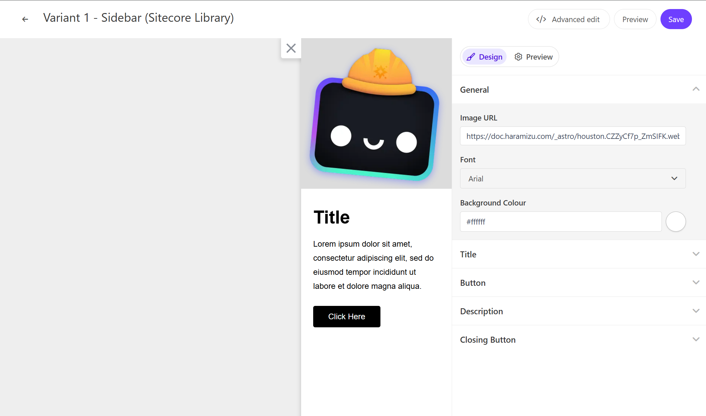

このページでは、Sitecore Personalize で提供している標準テンプレートの Slidebar のデモを確認することができます。



## 設定項目

### 画像

Slidebar は画像を一つ設定することができます。この項目は `General` - `Image URL` で変更できます。

## コードの確認

HTML の中に含まれる変数は以下の通りです

| 変数        | 形式   | 概要         |
| ----------- | ------ | ------------ |
| Title Text  | string | タイトル     |
| Button Link | string | URL          |
| Button Text | string | ボタンラベル |

### HTML コード

Slidebar の HTML は以下のように設定されています。

```html
// sidebar.html
<div id="pers-sidebar">
  <div class="pers-sidebar__close">
    <div class="close__btn-close-icon"></div>
  </div>
  <div class="pers-sidebar__img-container">
    <div class="img-container__image"></div>
  </div>
  <div class="pers-sidebar__body">
    <h3>
      [[Title Text | string | Title | {required:true, group: Title, groupOrder: 2, order: 1}]]
    </h3>
    <p>
      [[Description Text | text | Lorem ipsum dolor sit amet, consectetur adipiscing elit, sed do
      eiusmod tempor incididunt ut labore et dolore magna aliqua. | {required:true, group:
      Description, groupOrder: 3, order: 1}]]
    </p>
    <a id="pers-sidebar__primary-action" class="body__button">
      [[Button Text | string | Click Here | {required: true, group: Button, groupOrder: 4, order:
      1}]]
    </a>
  </div>
</div>
```

### JavaScript コード

Slidebar の JavaScript は以下のように設定されています。

```js
// sidebar.js
// Adds a unique variant identifier to CSS when deployed to ensure CSS does not impact styling of other elements.
var compiledCSS = Engage.templating.compile(variant.assets.css)(variant);
var styleTag = document.getElementById('style-' + variant.ref);
if (styleTag) {
  styleTag.innerHTML = compiledCSS;
}
// End Adds a unique variant identifier to CSS when deployed to ensure CSS does not impact styling of other elements.

// make space in the body for the experience
insertHTMLAfter('body', 'pers-');

var persContent = document.getElementById('pers-sidebar');
setTimeout(function () {
  persContent.classList.add('open');
  sendInteractionToPersonalize('VIEWED');
});

var persSidebarClose = persContent.querySelector('.close__btn-close-icon');
persSidebarClose.onclick = function () {
  persContent.classList.remove('open');
  sendInteractionToPersonalize('DISMISSED');
};

var persSidebarCta = persContent.querySelector('#pers-sidebar__primary-action');
persSidebarCta.onclick = function () {
  sendInteractionToPersonalize('CLICKED');
  window.location.href =
    '[[Button Destination URL | string || {required:true, group: Button, groupOrder: 3}]]';
};

function sendInteractionToPersonalize(interactionType) {
  const type = 'INTERACTION';
  const eventData = {
    channel: 'WEB',
    pointOfSale: Engage.settings.pointOfSale,
    interactionID: 'PERS_SIDEBAR',
    interactionType: interactionType,
  };
  window.engage.event(type, eventData);
}
```

- [サンプル一覧に戻る](/personalize/sample/)
