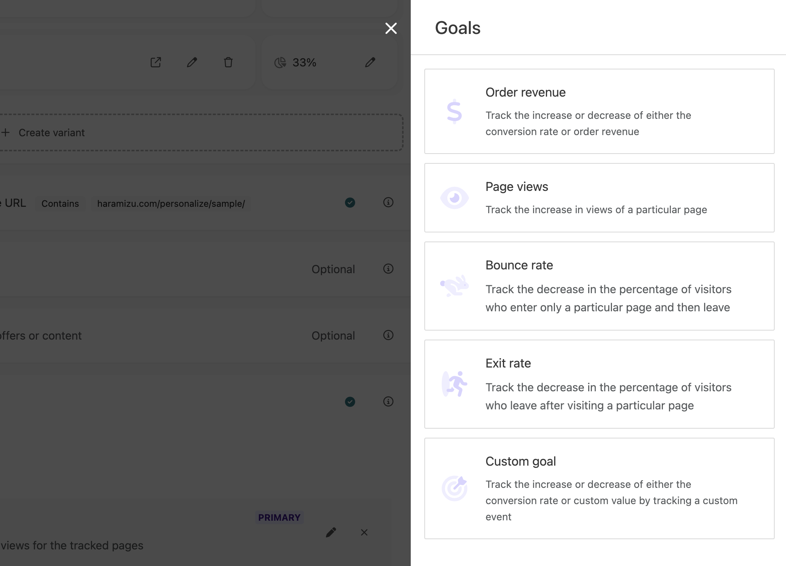
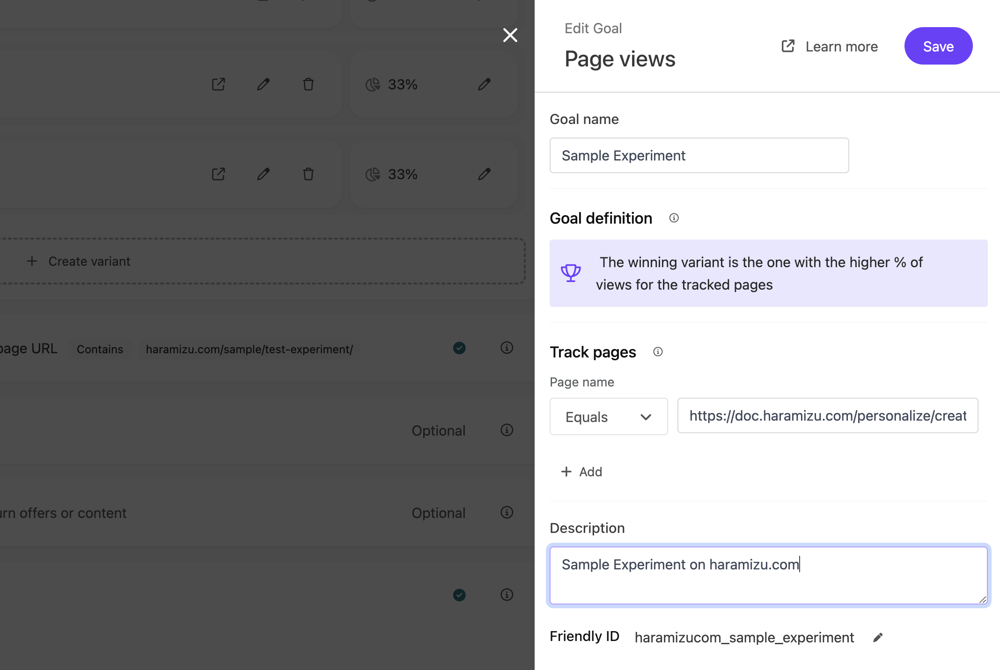

このページは Sitecore Personalize で作成をした Experiment のサンプルを動かしているページになります。作り方に関しては、以下のページに戻って確認をしてください。

- [Experients の作成](/personalize/create-experiments/)

## A/B テストを体験する

異なるパターンを参照する場合、以下のどれかのアクションを実行してください。

- ブラウザのプライベートモードで改めてアクセス
- 別のブラウザを利用してアクセス
- 対象となる Cookie を削除して改めてアクセス

上から順に、手軽に体験できる形です。ぜひ、表示が切り替わることがあるのを体験してみてください。

このページで体験できる内容としては、２つの Variant を追加して Original と合わせて３つの表示があります。

- **Original**: このページが普通に表示されます
- **Sidebar - Right side**: 右側からサイドバーが開きます
- **Corner popup - Right bottom**: 右下にポップアップが開きます

どれもがこのページの上に用意している [Experients の作成](/personalize/create-experiments/) への誘導となっています。

## Goal の設定

このサンプルでは Goal として以下の設定を追加しています。

Goal の設定は以下の通りです。

## レポート

公開後、実際に動作している情報をここで紹介をします（近日更新予定）。

