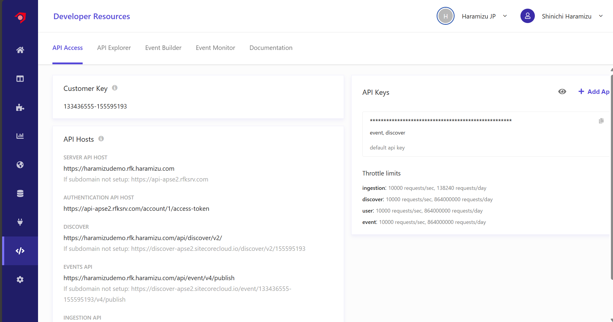
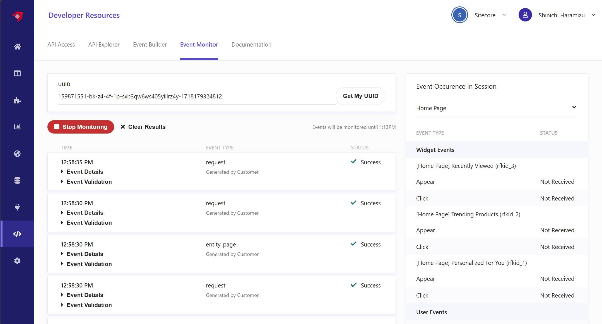
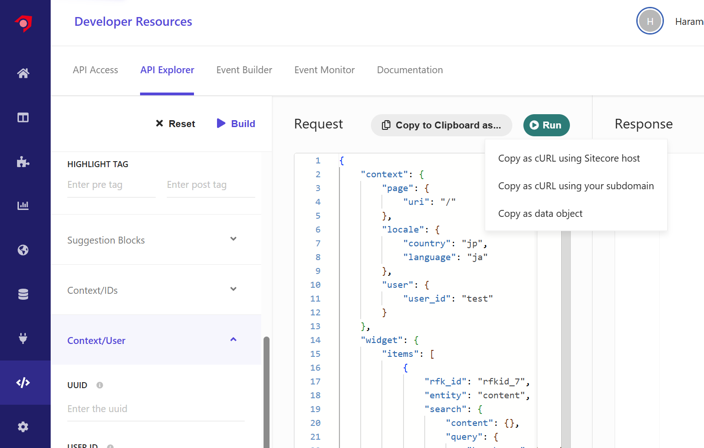
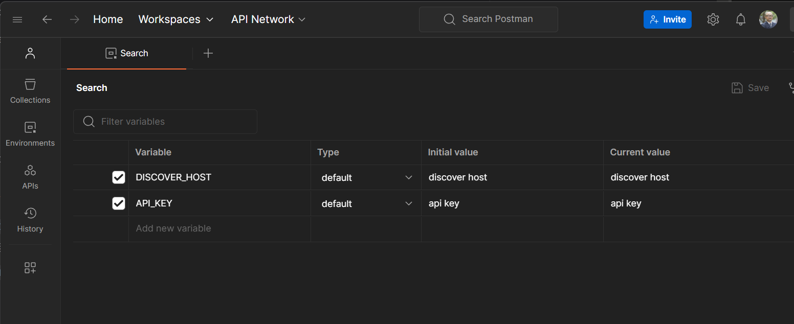
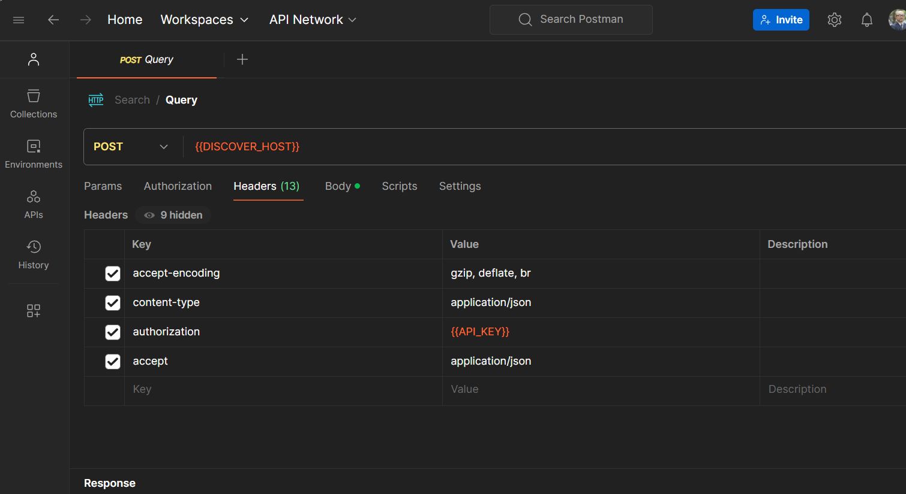
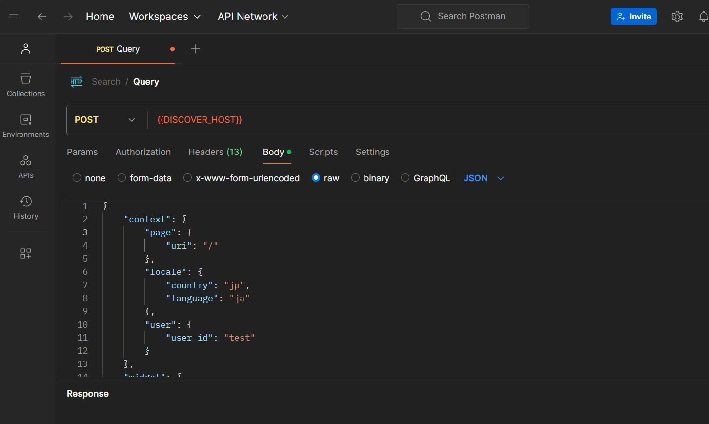

Sitecore Search に関して、基本的なクロールの仕組みまで紹介をしてきました。このドキュメントでは、取得しているデータを利用してサイト内検索を立ち上げる際に便利な、開発者向けリソースについて紹介します。

## Developer Resource

Sitecore Search の管理画面の Developer Resource を開くと以下のような管理画面に切り替わります。ここで表示されている情報を利用して、サイトと連携する検索サービスを構築する形となります。



ここではタブを切り替えて確認をしていきます。

### API Access

この画面（上図）では、API を利用する上で必要なデータが表示されています。

- **Customer Key**: 検索サービスが利用するためのキーです
- **API Hosts**: ここでは利用用途のことなる API ホストの URL が記載されています
- **API Key**: サービスを利用する際の API キーを管理しています。

上記に関しては、別のドキュメントで使い方の紹介をする予定です。

### API Explorer

画面の中で API を利用するためのパラメーターを用意すると、リクエストに必要となるデータが生成され、その結果を確認することができます。

今回の動作確認のために、まず一番右側にある項目を以下のように設定をします。

- **Page**: Search Results Page
- **URI**: /
- **Entity**: Content
- **Locale**: ja-JP
- **Keywords**: SSO
- **User ID**: test

Build ボタンをクリックすると、以下のようなクエリが生成されます。

```json
{
  "context": {
    "page": {
      "uri": "/"
    },
    "locale": {
      "country": "jp",
      "language": "ja"
    },
    "user": {
      "user_id": "test"
    }
  },
  "widget": {
    "items": [
      {
        "rfk_id": "rfkid_7",
        "entity": "content",
        "search": {
          "content": {},
          "query": {
            "keyphrase": "SSO"
          }
        }
      }
    ]
  }
}
```

このクエリを利用するために Run のボタンをクリックすると結果が返ってきます。

```json
{
  "widgets": [
    {
      "rfk_id": "rfkid_7",
      "type": "content_grid",
      "used_in": "page",
      "entity": "content",
      "content": [
        {
          "description": "Sitecore Cloud Portal は SSO に対応しており、Owner もしくは Admin の権限を持っていれば設定をすることが可能です。ここでは、Entra ID との連携、および Auth0 との連携に関して紹介をしています。",
          "id": "https___doc_haramizu_com_cloud-portal_sso_",
          "image_url": "https://doc.haramizu.com/_astro/sso01.BMOzDPiY_2klT7C.webp",
          "name": "SSO を設定する",
          "source_id": "1039337",
          "type": "article",
          "url": "https://doc.haramizu.com/cloud-portal/sso/"
        }
      ],
      "total_item": 1,
      "limit": 1,
      "offset": 0,
      "errors": [
        {
          "message": "widget not in page",
          "type": "widget_not_in_page",
          "severity": "low"
        }
      ]
    }
  ],
  "dt": 23,
  "ts": 1732765336741
}
```

画面では以下のように表示されます。


### Event Builder

検索をしているユーザーの行動によって、例えばウィジットをクリックしたり、ログインをしたり様々なインタラクションが発生します。この Event Builder を利用ｓるうことで、このイベントに関して管理画面上でテストをすることができます。

### Event Monitor

イベント モニターは、Web サイトのイベントが正しい形式で Sitecore Search に送信されていることを確認するのに役立つツールです。イベント監視は、検索アカウントが接続されている任意の環境で使用できます。

Sitecore Search が利用している Cookie の名前は `__ruid` になります。実際に動作している検索サイトで、UUID に入れてモニタリングをすると以下のようにイベントが記録されます。



イベントの詳細を確認すると、以下のようなデータを確認することができます（一部データはダミーに書き換えています）。

```json
{
  "action": "get",
  "ce": [
    {
      "entity": "content",
      "rfkid": "rfkid_7",
      "type": "content_grid",
      "wid": "730944",
      "wver": 56,
      "wvid": "730945",
      "wvver": 49
    },
    {
      "type": "global",
      "wid": "730893",
      "wver": 73,
      "wvid": "730894",
      "wvver": 54
    }
  ],
  "ckey": "159871551",
  "client_time_ms": 1732766311801,
  "name": "request",
  "request_id": "1461d5b9-cd58-4f8d-830b-7988781c3309",
  "server_time_ms": 1732766311803,
  "uid": "uid",
  "uuid": "uuid",
  "value": {
    "context": {
      "browser": {},
      "campaign": {},
      "geo": {
        "ip": "127.0.0.1"
      },
      "page": {
        "locale_country": "us",
        "locale_language": "en"
      }
    },
    "features": [
      {
        "entity_type": "content",
        "feature_type": "search",
        "request": {
          "keyword": "xm cloud",
          "num_requested": 20
        },
        "response": {
          "items": [
            {
              "id": "https___www_sitecore_com_products_xm-cloud",
              "source_id": "1029552"
            },
            {
              "id": "https___www_sitecore_com_resources_events-webinars_2023_06_xm-cloud-hands-on",
              "source_id": "1029552"
            },
            {
              "id": "https___developers_sitecore_com_products_xm-cloud",
              "source_id": "774111"
            },
            {
              "id": "https___www_sitecore_com_partners_solution-catalog_americaneaglemigrationaccelerator",
              "source_id": "1029552"
            }
          ],
          "num_results": 20,
          "page_size": 20,
          "tqr": 138
        },
        "rfk_id": "rfkid_7",
        "widget_type": "content_grid"
      }
    ]
  }
}
```

ユーザーの情報としては、検索キーワードや履歴の情報がイベントとしてとれていることが分かります。なお、Sitecore Search は Cookie ベースでユーザーを追いかけていますが、個人情報と紐づけて追いかける仕組みではありません。

## Postman を利用する

上記の Developer Resource 以外にも、Postman を利用して API と通信をして同様のことができます。ここで紹介をした API Explorer で動作させたサンプルを利用して、Postman からアクセスできる環境を用意していきます。

### Query を取得する

API Explorer にアクセスをして、検索条件を設定して Build をした Query に対して、アクセスをするためのコードを `Copy to Clipboard as...` をクリックして取得することができます。



選択肢は以下の通りです。

- Copy as cURL using Sitecore host
- Copy as cURL using your subdomain
- Copy as data object

例えば Sitecore host を利用した cURL を指定すると、以下のコマンドを取得することができます。

```bash
curl 'https://discover-apse2.sitecorecloud.io/discover/v2/key' -H 'accept-encoding: gzip, deflate, br' -H 'content-type: application/json' -H 'authorization: accesskey' -H 'accept: application/json' --data-binary $'{"context":{"page":{"uri":"/"},"locale":{"country":"jp","language":"ja"},"user":{"user_id":"test"}},"widget":{"items":[{"rfk_id":"rfkid_7","entity":"content","search":{"content":{},"query":{"keyphrase":"SSO"}}}]}}' --compressed
```

Copy as data object を指定した場合は、純粋にクエリの部分を取得します。

```json
{
  "context": {
    "page": { "uri": "/" },
    "locale": { "country": "jp", "language": "ja" },
    "user": { "user_id": "test" }
  },
  "widget": {
    "items": [
      {
        "rfk_id": "rfkid_7",
        "entity": "content",
        "search": { "content": {}, "query": { "keyphrase": "SSO" } }
      }
    ]
  }
}
```

特に curl で利用している値をそのまま Postman で利用すれば、問い合わせをして回答を得るということが可能となります。

### 環境を作成する

実際に Postman にアクセスをして、Workspace を作成し、作業を進めていきます。まず最初に、環境を作成していきます。curl で利用している各種値を確認すると以下のようになっています。

- API Host としては Discover の URL を利用しています
- Header は以下の通りです
  - **accept-encoding**: gzip, deflate, br
  - **content-type**: application/json
  - **authorization**: your API Key
  - **accept**: application/json
- body には Copy as data object の Json を送信

これだけの情報があれば、Postman を簡単に利用することができます。まずは Environment に対して2つの項目を追加します。

- **DISCOVER_HOST**: Developer Resource の API Hosts で提供されている Discover の URL を設定します
- **API_KEY**: API Key を設定します



続いて新しいリクエストを作成します。HTTP リクエストを利用して、POST のリクエストを以下のように作成します。



最後に、この Request の Body に対して、`Copy as data object` で取得をした Json のデータを設定します。これで、準備が完了となります。



実行をすると、Postman の中でも同じ結果を確認することができました。


## まとめ

今回は簡単ですが、管理画面の Developer Resource において、検索結果を表示する方法を確認しました。また、Postman を利用して同じように問い合わせをして、結果を取得することも確認をしました。

## 参考情報

- [The API Access tab](https://doc.sitecore.com/search/en/developers/search-developer-guide/the-api-access-tab.html)
- [The API Explorer tab](https://doc.sitecore.com/search/en/developers/search-developer-guide/the-api-explorer-tab.html)
- [Using the Event Monitor](https://doc.sitecore.com/search/en/developers/search-developer-guide/using-the-event-monitor.html)

