import { Steps } from '@astrojs/starlight/components';

Document Extractor (ドキュメントエクストラクター) は、文書やファイルから特定の情報やデータを抽出するツールやプロセスを指します。この技術は、手動でデータを抽出する手間を省き、効率的に情報を取得するために使用されます。

## ３つの Extractor について

Sitecore Search ではクローラーの設定に対して Document Extractor、Locale Extractor そして Request Extractor の３つの種類の抽出ツールが提供されています。

### Document Extractor

Document Extractor は、Web サイトのコンテンツのURLまたはドキュメントからインデックスドキュメントを作成します。主な役割は以下のとおりです。

1. テキスト抽出
   文書内のテキストデータを読み取り、構造化された形式（例: JSONやCSV）で出力します。
2. キーワードの抽出
   指定したキーワードや重要なフレーズを文書から抽出します。
3. 構造化データの抽出
   領収書や請求書など、特定のフォーマットを持つ文書から、項目ごとのデータ（例: 金額、日付、名前など）を抽出します。
4. 多言語対応
   日本語を含む複数の言語に対応し、正確に抽出を行います。

Document Extractor の設定としては、XPath、JavaScript、JSONPath そして PDF コンテンツの４つのパターンが用意されています。

このドキュメントでは、 XPath を利用して Document Extractor を動作させました。

### Locale Extractor

一部の Sitecore Search ソースを使用して、ローカライズされたコンテンツをインデックス化することができます。ローカライズされたコンテンツをインデックス化するには、コンテンツアイテムのロケール 英語-米国 (en-US) や日本語 (ja-JP) などを抽出し、同じコンテンツのローカライズ版に共通のIDを生成します。

Locale Extractor に関しては、別のドキュメントで紹介をします。

### Request Extractor

クローラがクロールするための追加の URL リストを作成します。クローラが、最初のトリガーからたどったインデックス化が必要なすべてのコンテンツに到達していない場合は、Request Extractor を使用します。

## Haramizu.com

今回はこのサイトのコンテンツを対象として、クローラーでデータを取得していきます。このクロールをするデータに関しては、 Source という形で管理をする形となります。Sources は管理画面の左側、下から３つ目のアイコンをクリックします。最初の状況では、以下のように何もソースが含まれない形となります。

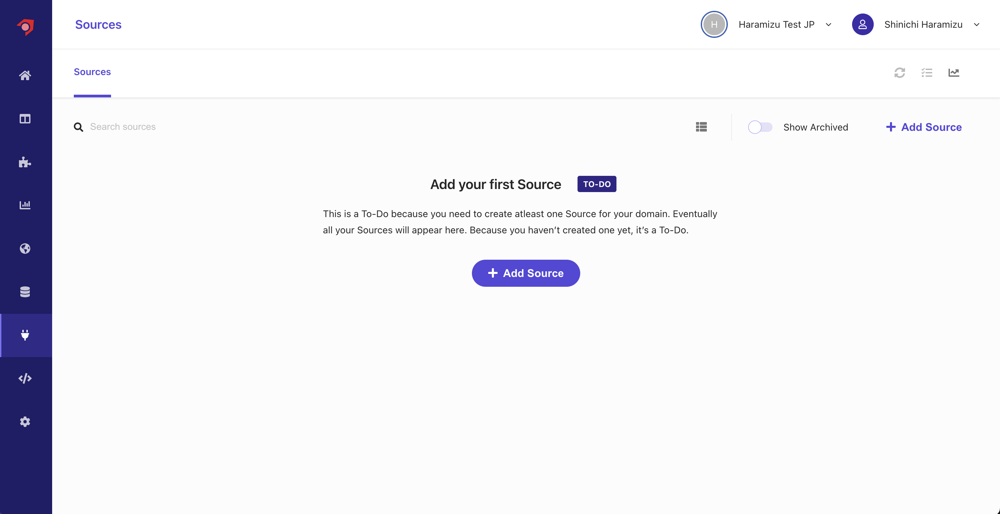

### Source の作成

ここでは、新しくデータを取得するために、新規の Source を作成します。

<Steps>

1. `+ Add Source` のボタンをクリックして、新しいソースを追加します。

2. `Source name`、 `Description` を入力、 Connector に対しては `Web Crawler (Advanced)` を指定します。

   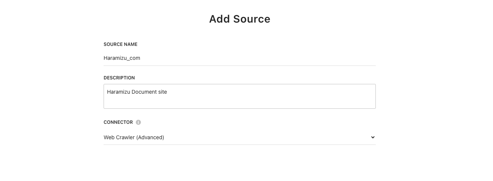

   設定完了後に、 `Save` ボタンをクリックします。

3. 新しい Source の設定画面が表示されます。

   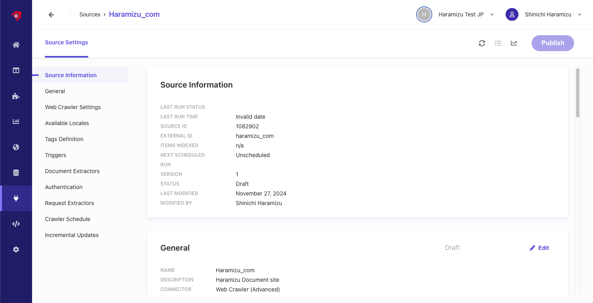

4. `Web Crawler Settings` の項目にて、以下の設定をします。

   - **Allowd domains**: 対象となるドメインを指定します
   - **Max depth**: リンクを辿ってクロールをする場合の深さを指定します
   - **Max URLs**: クロールをしてインデックスをする URL の最大値を指定
   - **Exclusion Patters**: 対象外となる URL を指定
   - **Headers**: クローラーに対する Header の指定ができます。

   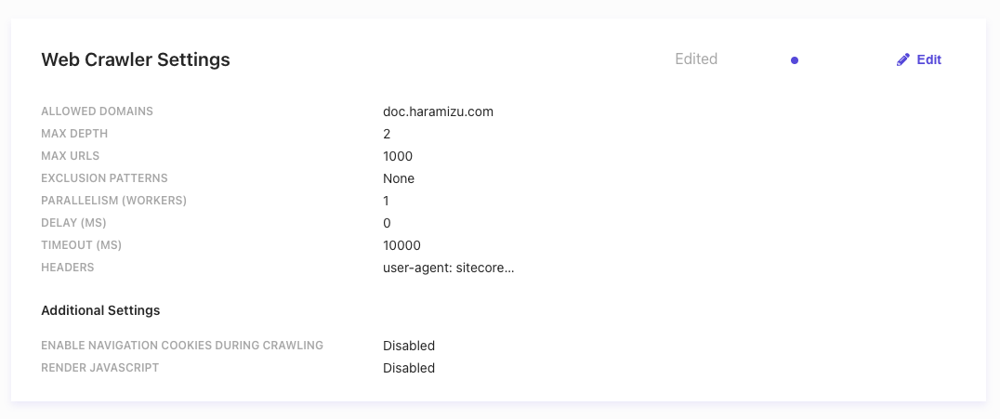

5. `Triggers` を追加します。ここでは、JS、RSS、Request、Sitemap、Sitemap Index を指定することができます。ここでは、Sitemap Index を指定しました。

   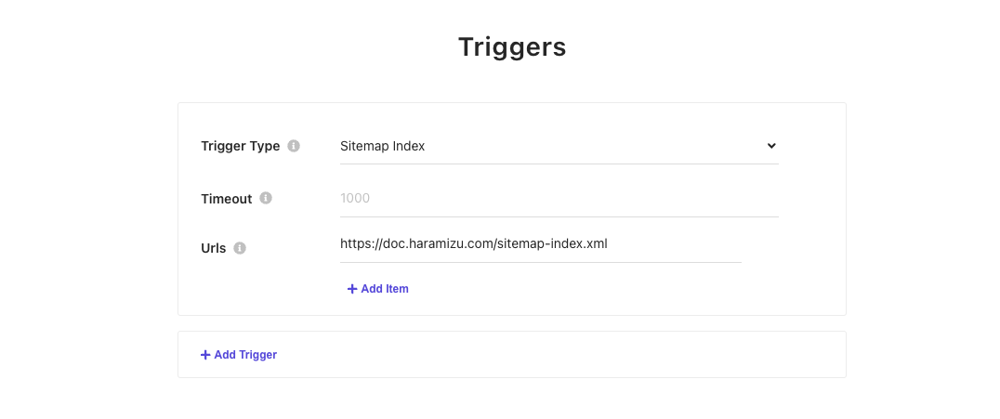

</Steps>

上記の設定で、Document Extractor 以外の設定が完了しました。

### Document Extractor を作成

Web サイトのコンテンツをクロールするにあたって、取得したデータを分析、インデックスしていくための重要な設定が Document Extractor になります。デフォルトでは、 XPath を利用した Extractor が設定されています。

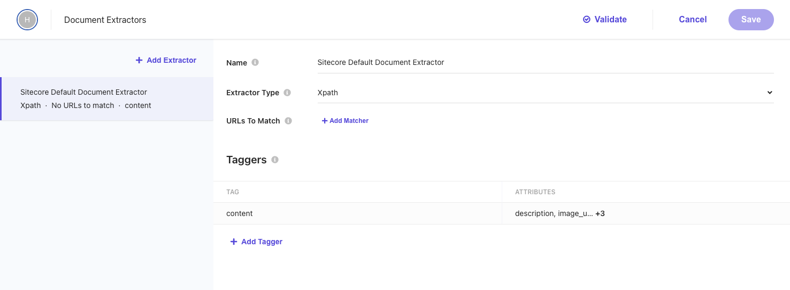

ソースに対して複数の Extractor を指定することが可能となっています。上の画面の設定項目は以下のような役割を持っています。

- **Name**: Extractor に対する名前を指定します
- **Extractor Type**: Extractor として、 `CSS`、`XPath`、`JS` のどれかを選択できます。今回は `XPath` のままで進めます。
- **URLs to Match**: どの URL に対して Extractor が有効になるのかを指定します。ここのルールは、`Regular Expression`、`Glob Expression` および `JS` を指定できます。今回は指定しません。

Taggers で実際にコンテンツを分析してどのように Index していくのかについて、設定するのが Taggers になります。

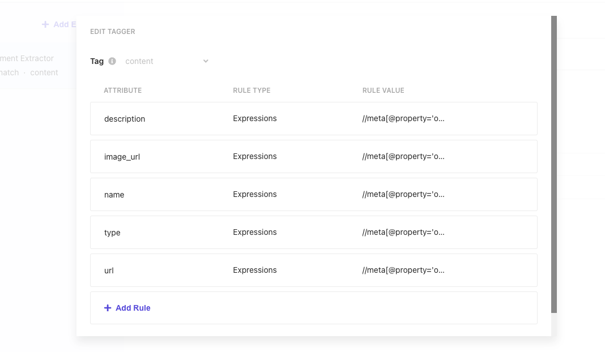

サンプルは以下のようになっています。

| Attribute   | Rule type   | Rule Value                                    |
| ----------- | ----------- | --------------------------------------------- |
| description | Expressions | `//meta[@property='og:description']/@content` |
| image_url   | Expressions | `//meta[@property='og:image']/@content`       |
| name        | Expressions | `//meta[@property='og:title']/@content`       |
| type        | Expressions | `//meta[@property='og:type']/@content`        |
| type        | Expressions | `//meta[@property='og:url']/@content`         |

この設定で、実際にサイトをクロールした場合に値を取得できるかを確認するために、画面の上にある `Validate` のボタンをクリックしてください。URL として `https://doc.haramizu.com/about/overview/` を指定すると、以下のように実行結果が表示されます。

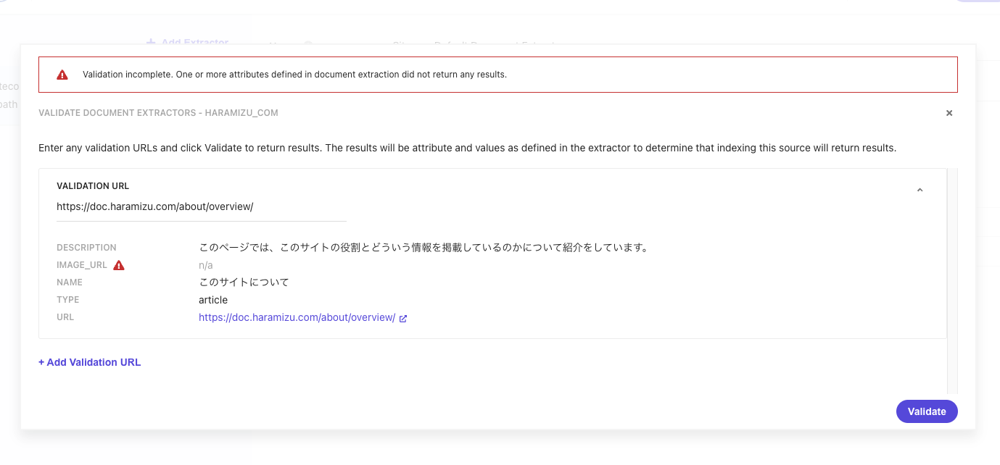

このサイトでは、この記事を紹介しているタイミングでは og:image を設定していないため、空欄として表示される状況です。そこで、 `image_url` の Selectors に対して、ページで最初に表示される画像を指定するために、 `//img[1]/@src` を Rank 2 に追加します。

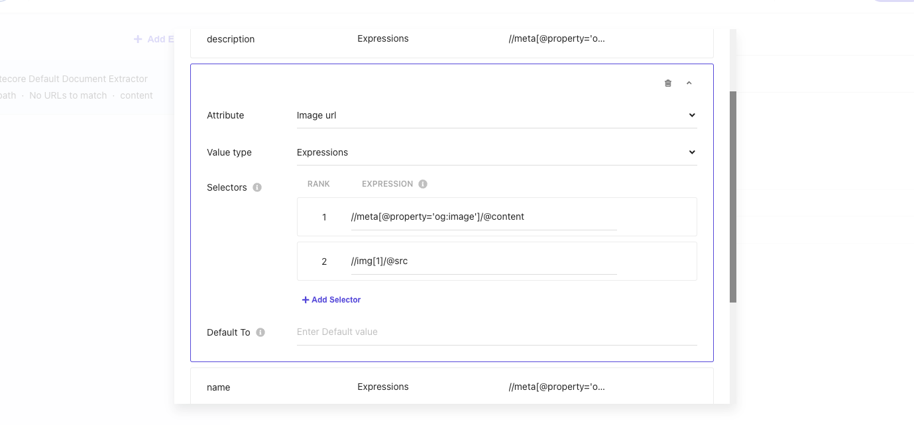

あらためて Validate のボタンをクリックして、今度は画像のある URL となる `https://doc.haramizu.com/en/cloud-portal/overview/` を指定します。結果として、ページの最初の画像のパスを取得することができました。

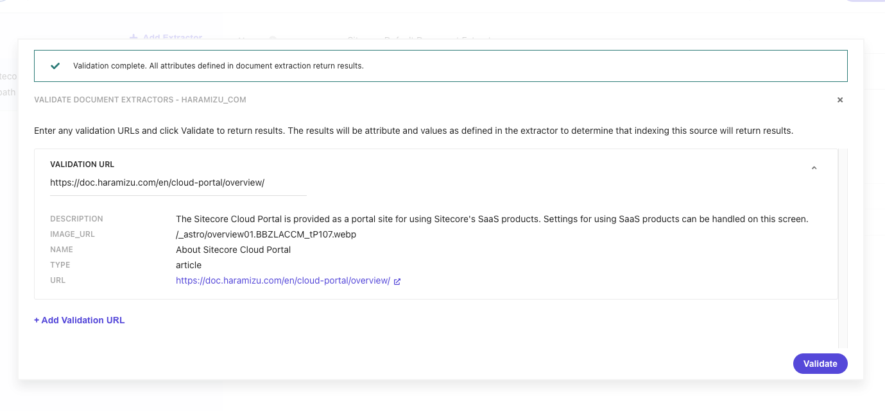

Document Extractor の基本設定が完了となります。

### クロールを実行する

上記の設定が完了したところで、Publish のボタンをクリックしてクロールを実行していきます。

<Steps>

1. ダイアログが表示されるので、 `Trigger Source Scan After Publishing The Source` のチェックボックスをチェックして、クローラーを動作させます。

   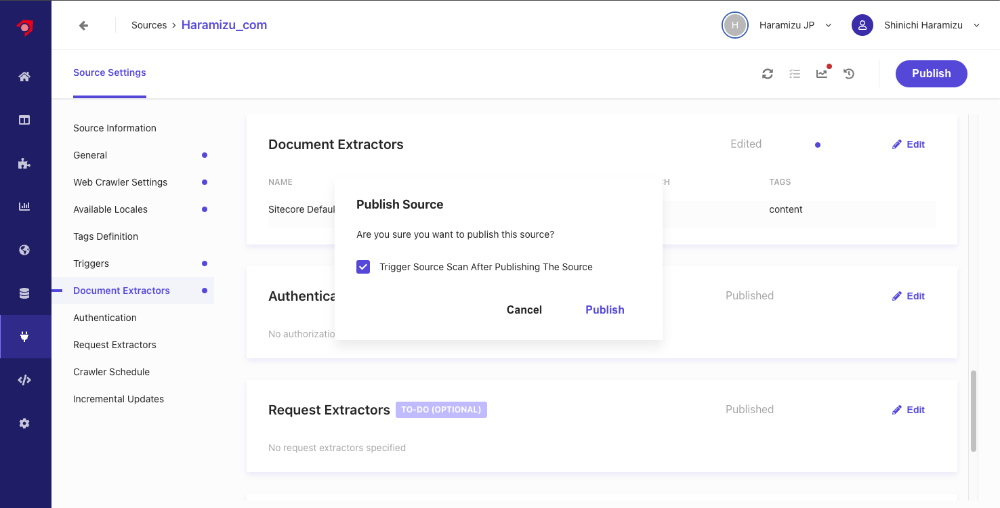

2. ソースの一覧のページを参照しにいくと、Queued になっていることが確認できます。

   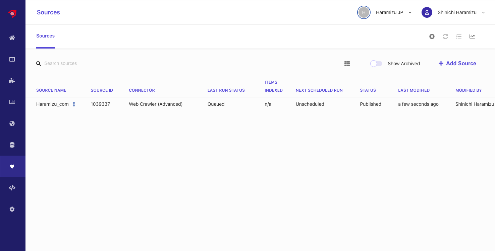

3. しばらくすると Running のステータスとなり、クロールしてコンテンツを Index していきます

4. Finish になると、クロールが完了する形となります。

   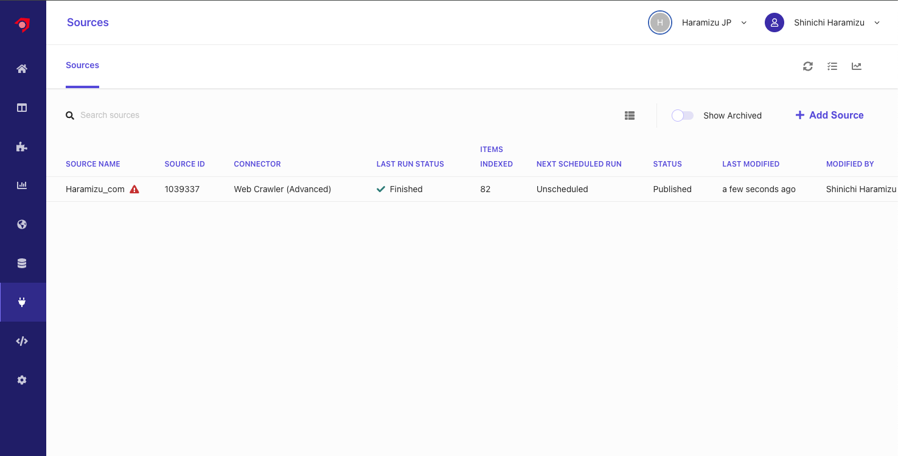

</Steps>

クロールをして、インデックスが完了した形となりますが、いくつかのページにおいて必須項目がなく、エラーになっていることがわかります。

### エラーの内容を確認する

クローラーのエラーを確認する場合は、管理画面の `Analytics` の画面を開き、 `Source` - `Overview` を開くソース一覧が表示されます。今回は `Haramizu_com` を指定すると、クロールの結果レポートを参照することができます。

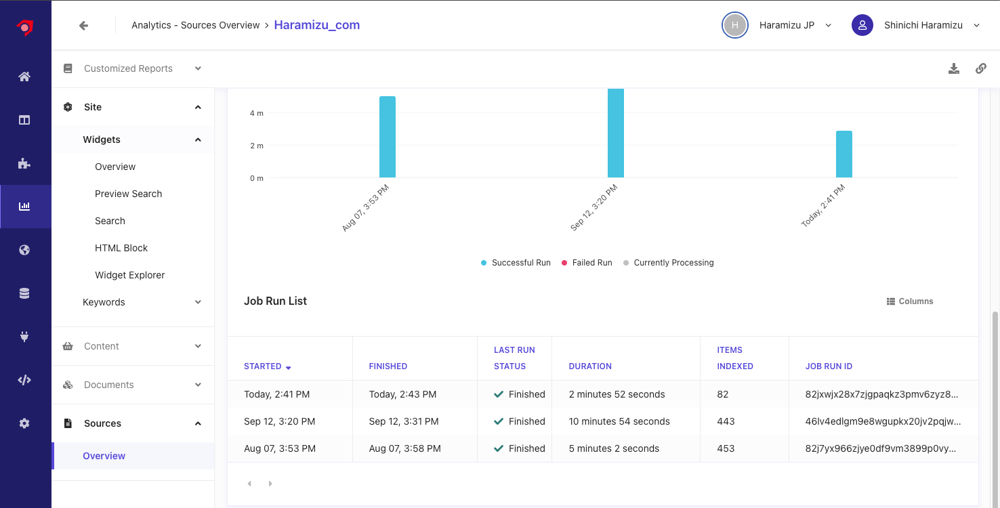

最新のクロールのレポートを参照すると、3 つの項目がエラーになっていることがわかります。

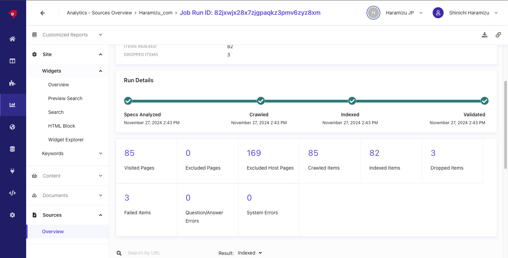

詳細に関しては、 Result の項目を Dropped で確認することができます。

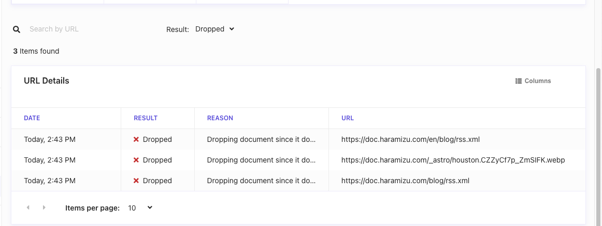

エラーとしては、画像および RSS の URL が含まれていることがわかります。

この画像に関しては、ページの中で説明文として記載していた文字列が URL として判別してされてしまい、クロールをして失敗していることがわかりました。これに関しては、ページの記述を少し変更します。

また、RSS に関しては、 **.xml** で終わる URL に関しては対象外として設定をします。この設定は、`Web Crawler Settings` にある `Exclusion Patters` に対して、正規表現で `.xml` で終わる場合は例外として、 `.*\.xml$` を追加しました。

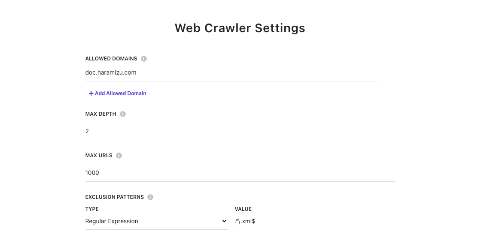

設定を反映させて、あらためて Publish を実行してクロールを再度実行します。今回はエラーが表示されない形となりました。

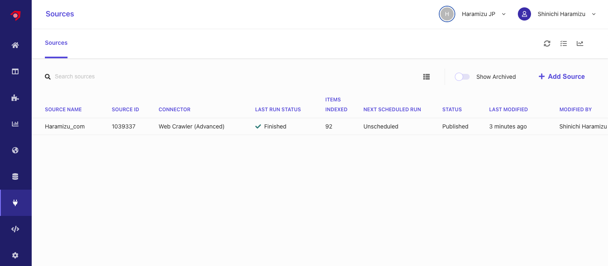

## コンテンツの確認

クロールをしたコンテンツに関して、Content Collection から確認をすることができます。以下が、現在利用している Sitecore Search が取得しているコンテンツ一覧を確認している画面となります。

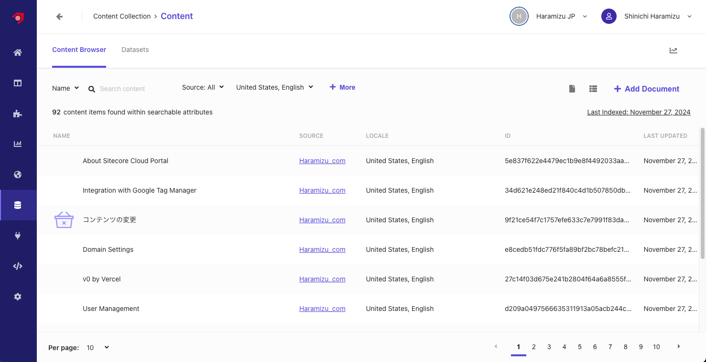

特定のコンテンツをクリックすると、Attribute に対して保存されているデータなどを確認することができます。

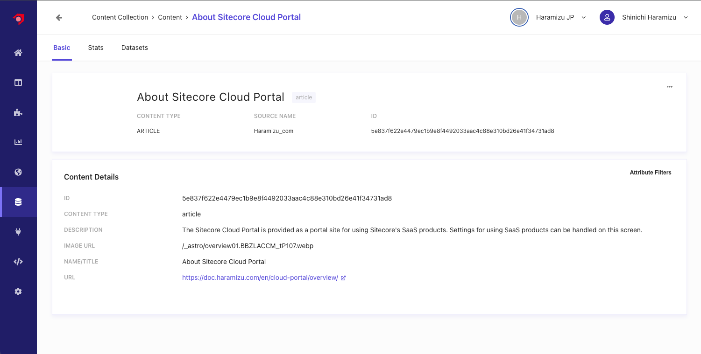

## まとめ

検索をするためのデータの取得として、Web Crawler (Advanced) を利用してサイトのコンテンツを取得、その際の Document Extractor としては XPath を利用してコンテンツとして管理する形までできました。また、エラーが出た際の対処方法もここでは確認をして、確実にクローラーが動く形を確認しました。

## 参考情報

- [Configure document extractors](https://doc.sitecore.com/search/en/users/search-user-guide/configure-document-extractors.html)
- [Use locale extractors for localized content](https://doc.sitecore.com/search/en/users/search-user-guide/use-locale-extractors-for-localized-content.html)
- [Request extractors](https://doc.sitecore.com/search/en/users/search-user-guide/request-extractors.html)

