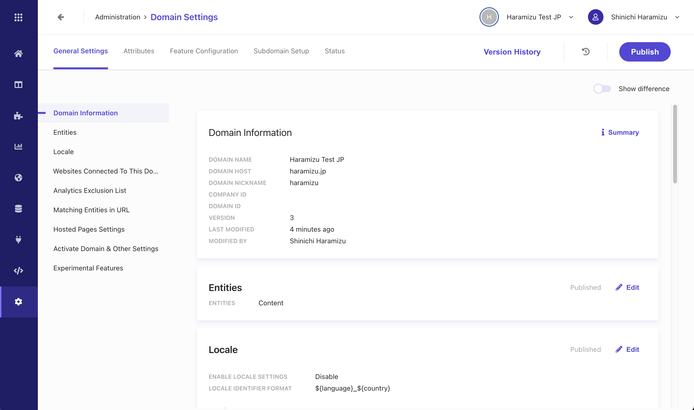
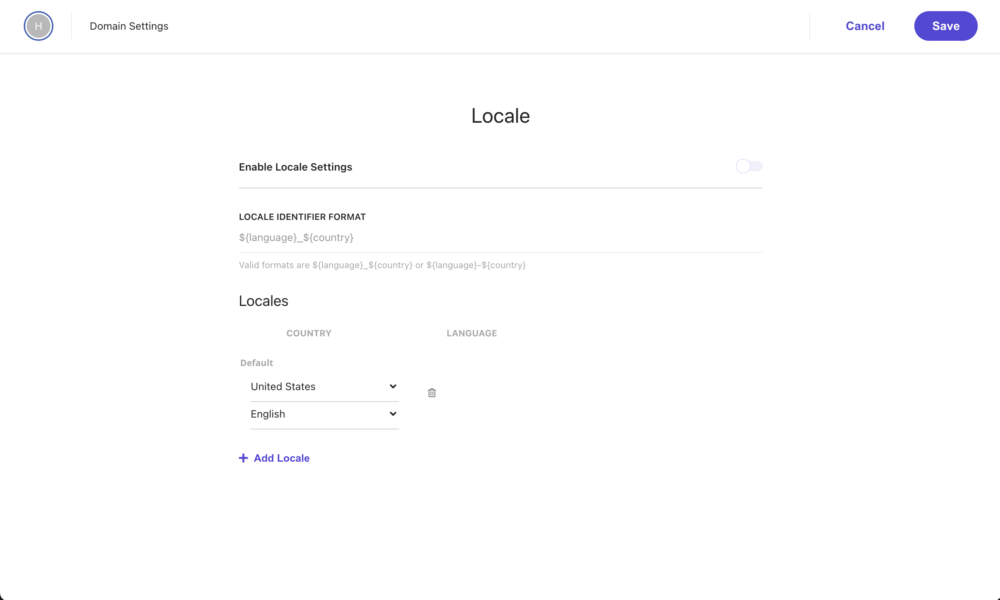
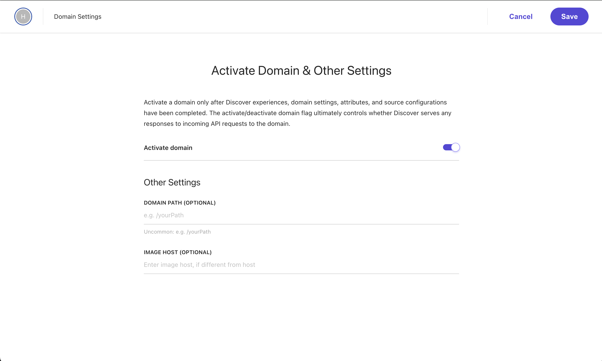
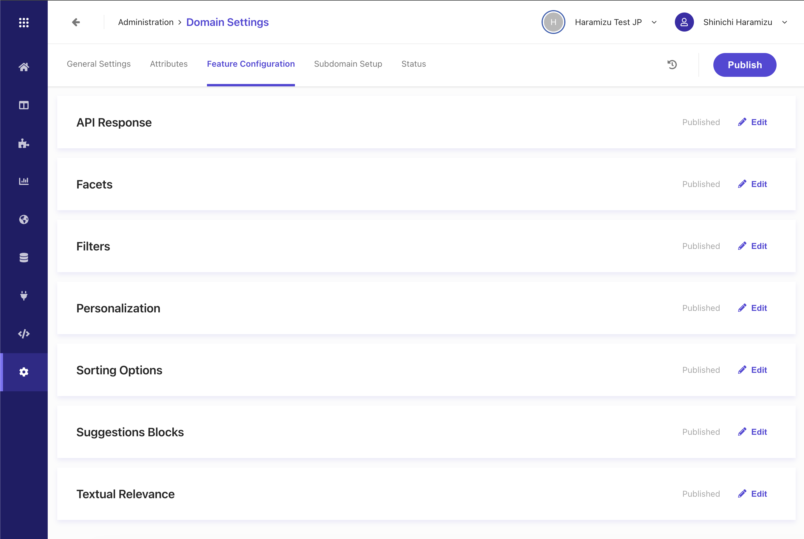
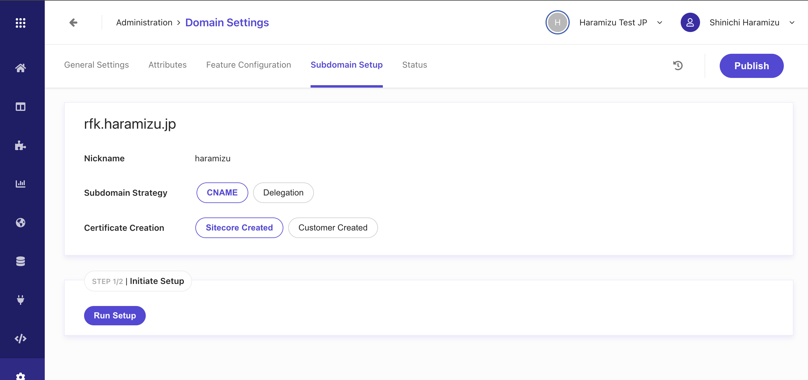
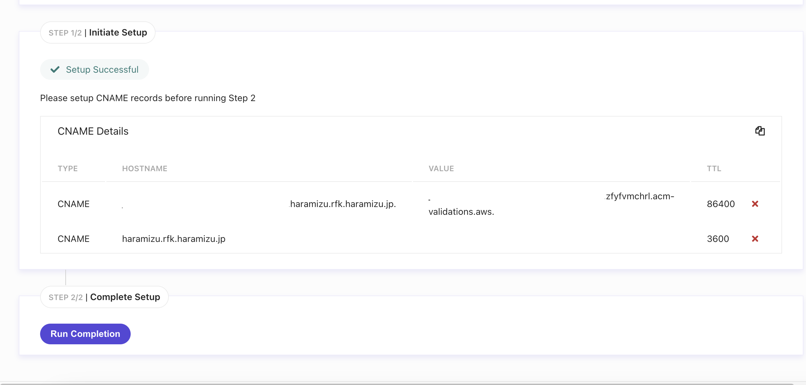

新しく作成された Sitecore Search の Sandbox を利用して、基本設定となるドメイン設定の内容を確認していきます。このドキュメントでは全体概要までの紹介となり、個別の設定に関しては別途提供します。

## Domain Settings

最初にドメイン設定の画面を開くと、以下のタブと合わせて設定画面が表示されます。

- General Settings
- Attributes
- Feature Configuration
- Subdomain Setup

ここではそれぞれの役割について紹介をしていきます。

## General Settings

Sitecore Search で利用するドメインに関しての基本設定をする画面となります。左側に表示されている項目をクリックすると、右側のエリアがスクロールで移動をして、トップに表示される構成となっています。

### Domain Information

この項目はドメインに関する基本設定となっています。このエリアに関して変更をする場合は、別のドメイン一覧からする形となるため、この画面では変更することはできません。

### Entities

Sitecore Search で扱うデータの構成に関して設定をする画面となります。デフォルトでは `Content` が設定されています。Entity に関しての詳細は、 [Data Type と Entity](/search/entity/) で紹介しています。

### Locale

このサイトで取り扱う検索対象となる言語の設定を変更することができます。標準では `en-US` が１つの言語として用意されていますが、複数言語を利用する際には、ローケールを追加した後、 `Enable Locale Settings` の項目をチェックしてください。

### Website Connect to This Domain

この項目では、どのサイトと連携をするのかについての設定が可能です。利用している環境が Non-Production として動作するのか、Production として動作するのかもここの画面で変更することが可能です。

### Matching Entities in URL

正規表現を利用して URL に含まれるコンテキスト（製品名、SKU など）があれば、URL の情報を特定することが可能です。この項目はこのドキュメントでは紹介しませんが、QueryString などを利用している場合に、便利な機能です。

### Activate domain & Other Settings

このドメインに関して、アクティブに設定する際に利用します。下記の画面はすでに `Activate domain` が有効になっています。

### オプション項目

以下の項目は必須ではありませんが、オプションとして提供されています。ここではそれぞれの内容の紹介は省略します。

- Analytics Exclusion List
- Hosted Pages Settings
- Experimental Features

## Attributes

ここでは、ドメインで利用可能な Attribute の一覧を確認することができます。デフォルトでは `Content` で設定されている Attribute 一覧が表示されています。ここに表示される項目に関しては、 [Data Type と Entity](/search/entity/) を参考にしてください。

## Feature configuration

この項目では、Domain Settings で作成している Entities に含まれる Attribute に対して、検索サービスとしてどの機能と連携するのかについて設定することが可能です。

- **API Response**: API からアクセスをした際に、データをレスポンスとして返す
- **Facets**: 検索結果でファセットとして利用
- **Filters**: 結果の絞り込みをする際に利用
- **Personalization**: 選択した属性の値に類似したコンテンツアイテムとして利用するパーソナライズの Attribute を指定
- **Sorting Options**: 検索結果に関する並べ替えに関する設定
- **Suggestions Blocks**: おすすめのコンテンツとして表示するための設定を管理
- **Textural Relivance**: コンテンツアイテム内のどの部分で一致する用語を検索する必要があるか、また、異なるコンテンツ領域に相対的な重要性を与える必要があるかを設定します

## Subdomain Setup

Sitecore Search は SaaS 形式の検索エンジンとなるため、検索を実行する際には API にアクセスをして結果を取得する必要があります。この際、Sitecore Search のサブドメインの機能を利用することで、異なるドメインとの通信という動作ではなく、同じドメインでの JavaScript との連携という動きを設定することが可能です。

### Run Setup

サブドメインの設定をする際には、設定をするオプションは２つ用意されています。

- **Subdomain Strategy**: CNAME もしくは Delegation
- **証明書作成**: Sitecore もしくは 顧客が作成

今回は、 CNAME でのサブドメインの指定、そして証明書は Sitecore Created を選択した形で、 `Run Setup` を実行します。

しばらくすると、Sitecore Search 側の設定が完了して、該当するドメインの DNS に設定するべき情報が共有されます。

### Run Completion

実際に指定された CNAME の項目を DNS に対して設定をして、Compolete Setup を実行します。以下の画面は、設定が完了した画面となり、Sitecore Search の API として自社のドメインで動作する形となりました。

## まとめ

今回は、Sitecore Search の基本設定となる Domain Settings に関する項目について紹介をしました。Domain Settings では、言語の追加など幅広く影響を与える項目や、検索対象となるコンテンツの属性の追加、ファセットなどの機能の設定をするため、構築していく際にあらためて追加設定をすることがあります。どういう項目があるのか、わからなくなった場合はこのドキュメントをあらためて参照してください。

## 参考情報

- [Localize implementation](https://doc.sitecore.com/search/en/users/search-user-guide/localize-implementation.html)
- [CNAME records and subdomain delegation](https://doc.sitecore.com/search/en/users/search-user-guide/cname-records-and-subdomain-delegation.html)

