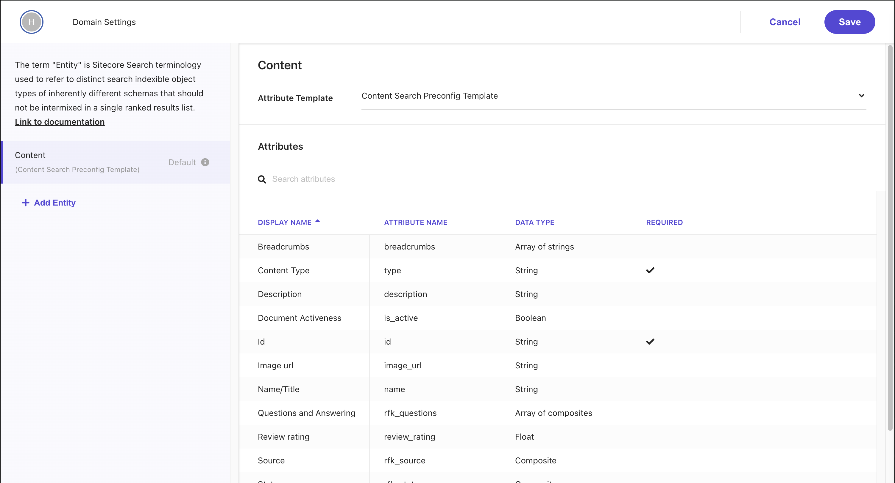

このドキュメントでは、Sitecore Search で検索対象として管理するデータ構造に関して、Data Type および Entity について紹介をします。この構造について学ぶことで、標準でどのようなデータを取り扱うことができるのか、またそれを拡張して利用できるのかを理解することができます。

## Data Type とは？

Sitecore Search のクローラーもしくは API 連携でデータとして保存するときの、データの構造に関して定義しているものです。Data Type は以下の項目が提供されています。

- Integer
- Double
- Array of Integer
- Float
- Array of Float
- Boolean
- String
- Array of strings
- GEO
- Object
- Array of objects
- Timestamp

Data Type は、この属性がどの機能に使用できるかに影響します。例えば、整数型の属性はパーソナライズに使用できません。同様に、オブジェクト型の属性はファセット、フィルタ、パーソナライズ、または並べ替えに使用できません。使用できないオプションは、`Use For Features` においてグレー表示されます。

## Entity とは？

Entity は、Sitecore Search が検索をするコンテンツに関する構造を決める対象となっています。Entity の構成は、データの属性（ Attribute ）のリストとなっており、それぞれの Data Type でが決まる形となっています。

Entity を追加する場合は、Domain Settings - General Settings を開き、Entities の項目をクリックすると以下のような画面になります。

## Entity Template

Sitecore Search ではいくつかの Entity のテンプレートを用意しており、また Entity に関してはカスタマイズをすることも可能です。ここでは、Sitecore Search が提供している標準の Entity のテンプレートを確認していきます。

### Content

Sitecore Search が Web サイトのコンテンツのクロールなどで利用する、標準的なテンプレートになります。テンプレートの名前は `Content Search Preconfig Template` になります。この Content 作成をしたタイミングでは以下のような Attribute を用意しています。

| 表示名                  | 属性名        | Data Type           |
| ----------------------- | ------------- | ------------------- |
| Breadcrumbs             | breadcrumbs   | Array of strings    |
| Content Type            | type          | String              |
| Description             | description   | String              |
| Document Activeness     | is_active     | Boolean             |
| Id                      | id            | String              |
| Image url               | image_url     | String              |
| Name/Title              | name          | String              |
| Questions and Answering | rfk_questions | Array of composites |
| Review rating           | review_rating | Float               |
| Source                  | rfk_source    | Composite           |
| Stats                   | rfk_stats     | Composite           |
| Tags                    | tags          | Array of strings    |
| Url                     | url           | String              |

### Product

このテンプレートの名前は、 `Base Attributes Template for Product` になっています。EC サイト向けで利用できるような Attributes が追加されており、非常に多くのデータを取り扱うことが可能です。

| 表示名                        | 属性名                    | Data Type        |
| ----------------------------- | ------------------------- | ---------------- |
| Add to cart                   | add_to_cart               | String           |
| Additional image SKU urls     | additional_sku_image_urls | String           |
| Additional image urls         | additional_image_urls     | String           |
| All category names            | all_category_names        | Array of strings |
| Brand                         | brand                     | String           |
| Brand code                    | brand_code                | String           |
| Breadcrumbs                   | breadcrumbs               | String           |
| Bundle SKUs                   | bundle_skus               | String           |
| Category                      | all_category_ids          | Array of strings |
| Category breadcrumbs          | category_breadcrumbs      | String           |
| Category ids                  | category_ids              | Array of strings |
| Category names                | category_names            | Array of strings |
| Color                         | color                     | String           |
| Color display name            | color_display_name        | String           |
| Color rgb value               | color_rgb                 | String           |
| Customer Category Identifiers | ccids                     | Array of strings |
| Description                   | description               | String           |
| Document Activeness           | is_active                 | Boolean          |
| Expiration Date               | expiration_date           | String           |
| Final Price                   | final_price               | Float            |
| Hashed image url              | image_id                  | String           |
| Id                            | id                        | String           |
| Image url                     | image_url                 | String           |
| Is in stock                   | is_in_stock               | Boolean          |
| Margin                        | margin                    | Float            |
| Mobile SKU image url          | mobile_sku_image_url      | String           |
| Mobile SKU url                | mobile_sku_url            | String           |
| Mobile image url              | mobile_image_url          | String           |
| Mobile product url            | mobile_product_url        | String           |
| Name                          | name                      | String           |
| On sale                       | on_sale                   | Boolean          |
| Price                         | price                     | Float            |
| Product                       | product_group             | String           |
| Product lookup field          | prod_lookup               | Array of strings |
| Product type                  | product_type              | String           |
| Product url                   | product_url               | String           |
| Quick look                    | quick_look                | String           |
| Quick view                    | quick_view                | String           |
| RFK tags                      | rfk_tags                  | Object           |
| Rank By 1                     | rankby1                   | Float            |
| Rank By 2                     | rankby2                   | Float            |
| Release Date                  | release_date              | String           |
| Review Count                  | review_count              | Integer          |
| Review link                   | review_link               | String           |
| Review rating                 | review_rating             | Float            |
| SKU                           | sku                       | String           |
| SKU description               | sku_description           | String           |
| SKU name                      | sku_name                  | String           |
| Save off                      | save_off                  | Float            |
| Search keywords               | search_keywords           | String           |
| Set SKUs keywords             | set_skus                  | String           |
| Short_description             | short_description         | String           |
| Sku Lookup                    | sku_lookup                | Array of strings |
| Sku image url                 | sku_image_url             | String           |
| Sku sequence                  | sku_sequence              | Integer          |
| Sku url                       | sku_url                   | String           |
| Source                        | rfk_source                | Composite        |
| Stats                         | rfk_stats                 | Composite        |
| Stock quantity                | stock_quantity            | Integer          |
| Stock unit                    | stock_unit                | String           |
| prod_url_key                  | prod_url_key              | String           |
| sku_url_key                   | sku_url_key               | String           |
| swatch                        | swatch                    | Array of objects |

### Category

このテンプレートの名前は、 `Base Attributes Template for Category` になっています。カテゴリを利用する際の基本的な項目が Attributes として用意されています。

| 表示名                               | 属性名        | Data Type        |
| ------------------------------------ | ------------- | ---------------- |
| All Category Ids                     | all_ids       | Array of strings |
| All Category Names                   | all_names     | Array of strings |
| All Category URL Keys                | all_url_keys  | Array of strings |
| All Category URL Paths               | all_url_paths | Array of strings |
| All Customer Category Identifiers    | all_ccids     | Array of strings |
| Category Breadcrumbs                 | breadcrumb    | Array of strings |
| Category Name                        | name          | String           |
| Category Primary                     | is_primary    | Boolean          |
| Category Primary URL                 | url_path      | String           |
| Category Primary Url Key             | url_key       | String           |
| Customer Category Identifier         | ccid          | String           |
| Document Activeness                  | is_active     | Boolean          |
| Id                                   | id            | String           |
| Parent Category Ids                  | parent_ids    | Array of strings |
| Parent Customer Category Identifiers | parent_ccids  | Array of strings |
| Source                               | rfk_source    | Composite        |
| Stats                                | rfk_stats     | Composite        |

### Store

このテンプレートに対しては、 `Store` というテンプレートが用意されています。

| 表示名                            | 属性名                      | Data Type |
| --------------------------------- | --------------------------- | --------- |
| Citizenship required              | citizenship_required        | String    |
| Group Id                          | group_id                    | String    |
| Id                                | id                          | String    |
| Job number of positions available | job_number                  | String    |
| Job shift                         | job_shift                   | String    |
| Location in lat long coordinates  | location                    | GEO       |
| Security clearance required       | security_clearance_required | String    |
| Used for searching address        | address                     | String    |

## まとめ

今回は Data Type と Entity に関してフォーカスをしてまとめました。基本的なサイト検索であれば、 Content の Entity を拡張する形で十分対応することができます。

## 参考情報

- [Configure entities](https://doc.sitecore.com/search/en/users/search-user-guide/configure-entities.html)
- [Entity templates](https://doc.sitecore.com/search/en/users/search-user-guide/entity-templates.html)
- [Add or edit entities](https://doc.sitecore.com/search/en/users/search-user-guide/add-or-edit-entities.html)

