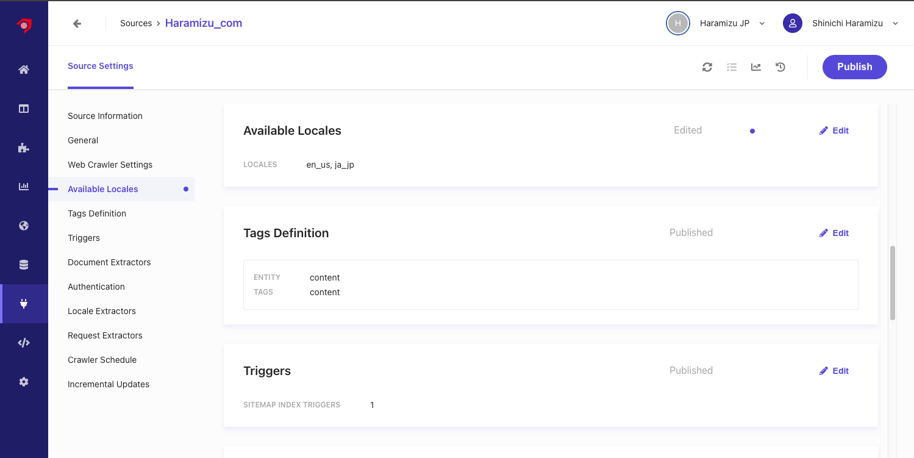
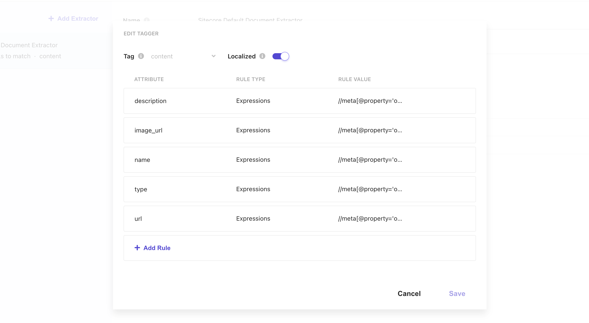
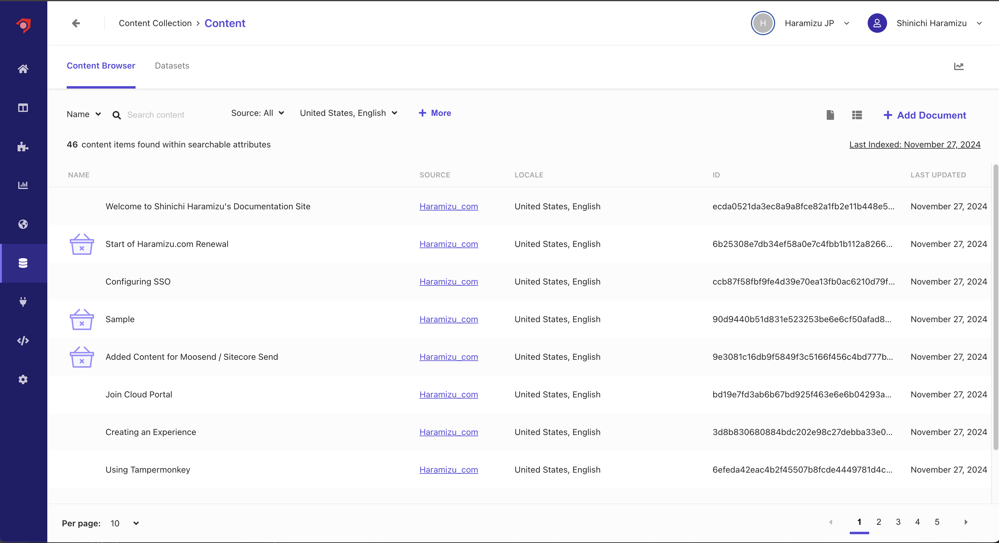
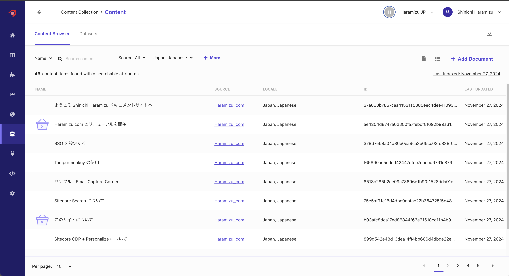
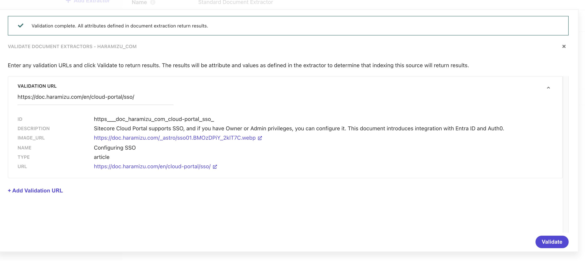

前回のドキュメントでは、 Document Extractor を XPath を利用してクロールする形を実現しました。このドキュメントでは、多言語で管理をしているコンテンツに対して、Locale Extractor と組み合わせて取得する手順を確認していきます。

## Locale を追加する

Sitecore Search は標準では en-us の言語のみを利用する形となっているため、最初にドメインの設定に対して、言語を追加していきます。今回は日本語を追加するため、`Japan - Japanese` を追加、 `Enable Locale Settings` を有効にします。


Locale を追加したあとは、ドメインの設定を有効にするために、 `Publish` のボタンをクリックします。クリックをすると以下のダイアログが表示されます。


## Source を更新

すでに [Document Extractor の利用](/search/document-extractor/) で設定をしているソースを変更していきます。変更の方針は以下の通りです。

- URL に対して /en/ が含まれる場合は英語のコンテンツとして、それ以外は日本語のコンテンツとする
- 英語と日本語のコンテンツに対して、同じ ID でクロールするために URL を利用した ID を作成します

例えば、 `https://doc.haramizu.com/cloud-portal/overview/` と `https://doc.haramizu.com/en/cloud-portal/overview/` に関して、同じ内容のコンテンツを提供しつつ、言語の違いが URL に反映されている形です。これを同じコンテンツとして扱うことができるように進めていきます。

### Locale を追加する

`Available Locales` に対して、 `ja_jp` を追加します。ここで Locale を追加すると、設定項目として Locale Extractors が追加されます。



### Locale Extractor の設定

新しく追加された Locale Extractor を開くと、以下のような設定が含まれています。


設定されている JavaScript のコードを確認します。

```js
function extract(request, response) {
  locales = ['ja-JP', 'en-US'];
  for (idx in locales) {
    locale = locales[idx];
    if (request.url.indexOf('/' + locale + '/') >= 0) {
      return locale.toLowerCase().replace('-', '_');
    }
  }
  return 'en_US';
}
```

このコードは以下のような形で設定されています。

1. サポートされているロケールの配列を設定
2. URL に `/ja-JP/` もしくは `/en-US/` が含まれているか確認、含まれている場合は、ロケールを小文字に変換、ハイフンを \_ に変更します。
3. どちらでもない場合は、 `en_US` を返す

このように JavaScript を利用して、ルールを作成してロケールを設定することができます。今回は、ドメイン名のすぐ後ろに `/en/` が含まれていれば `en_us` に、そうでない場合は `ja-jp` とする JavaScript を以下のように作成しました。

```js
function extract(request, response) {
  if (request.url.indexOf('haramizu.com/en/') >= 0) {
    return 'en_us';
  }

  return 'ja_jp';
}
```

上記のコードに書き換えたあと、Validate のボタンを押して、日本語および英語の URL を検証してみます。結果は以下のようになりました。


最後に、Document Extractor の Tagger の設定に、Localized の設定が追加されています。この Document Extractor は Locale Extractor と連携させるために、この項目をチェックしてください。



上記３つの設定が完了したあと、Publish ボタンを押してクロール、Reindex を実行します。

### コンテンツの確認

前回の Document Extractor の時と同様に、Content にアクセスをして取得しているコンテンツを確認します。まずアクセスをすると英語のコンテンツ一覧が表示されるため、以下のように英語のコンテンツが正しく取得できていることを確認できました。



言語を日本語に切り替えると、日本語のコンテンツがインデックスされていることがわかります。



Locale Extractor を利用していない場合、すべてのコンテンツが英語に入っていたため、Content で確認をすると 92 のコンテンツが表示されていましたが、今はそれぞれの言語で 46 のコンテンツが表示されるようになっています。

正しく、各言語のコンテンツに関してロケールを設定して、インデックスすることができました。

## Document Extractor を更新

コンテンツ一覧を見ると、同じコンテンツで言語が異なる場合も、ID が異なる状況となっています。例えば以下のような状況です。

| URL                                             | ID                                                       |
| ----------------------------------------------- | -------------------------------------------------------- |
| `https://doc.haramizu.com/cloud-portal/sso/`    | 37867e68a04a86e0ea9ca3e65cc03fc838f041123e73fb3e4b39accb |
| `https://doc.haramizu.com/en/cloud-portal/sso/` | ccb87f58fbf9fe4d39e70ea13fb0ac6210d79f96bf7fabab932d3668 |

このように、ID が異なる状況を改善していきます。これに伴い、 Document Extractor を XPath で構成するのではなく、JavaScript を利用して動作させるようにしていきます。

### JavaScript に変更する

まず、XPath の設定を JavaScript に変更をすると、デフォルトの Extractor として以下のコードが表示されます。

```txt
// Sample extractor function. Change the function to suit your individual needs
function extract(request, response) {
    $ = response.body;

    return [{
        'description': $('meta[name="description"]').attr('content') || $('meta[property="og:description"]').attr('content') || $('p').text(),
        'name': $('meta[name="searchtitle"]').attr('content') || $('title').text(),
        'type': $('meta[property="og:type"]').attr('content') || 'website_content',
        'url': $('meta[property="og:url"]').attr('content')
    }];
}
```

このコードに対して、以下の処理を追加しました。

- URL を取得して、ロケールを削除、コンテンツに対する ID を作成する
- image_url に対して、実際にホストしている URL を追加する

以下のように仕上げました。

```txt
// Sample extractor function. Change the function to suit your individual needs
function extract(request, response) {
    $ = response.body;

    const BASE_URL = 'https://doc.haramizu.com';

    let url = request.url;

    let locales = ['haramizu.com/en/'];
    for (idx in locales) url = url.replace(locales[idx], 'haramizu.com/');
    let id = url.replaceAll('/', '_').replaceAll(':', '_').replaceAll('.', '_');

    let image_url = $('meta[property="og:image"]').attr('content') ||
                 $('img').first().attr('src') || '/_astro/houston.CZZyCf7p_ZmSIFK.webp';

    return [{
        'id': id,
        'description': $('meta[name="description"]').attr('content') || $('meta[property="og:description"]').attr('content') || $('p').text(),
        'image_url': BASE_URL + image_url,
        'name': $('meta[property="og:title"]').attr('content') || $('title').text(),
        'type': $('meta[property="og:type"]').attr('content') || 'content',
        'url': $('meta[property="og:url"]').attr('content')
    }];
}
```


上記の設定後、 `Validate` を利用して幾つかのページで正しく動作することを確認します。



### コンテンツの確認

上記の変更後、Reindex なども実行してください。しばらくすると、データが反映されて、ID が URL を利用したものになります。また、今回の JavaScript の設定では、画像に関してドメイン名を追加しているため、コンテンツ一覧でも対象となるページの画像が表示されるようになりました。


これにより検索結果に対して、言語を切り替えた時にその言語の結果を表示する、というベースの部分ができました。

