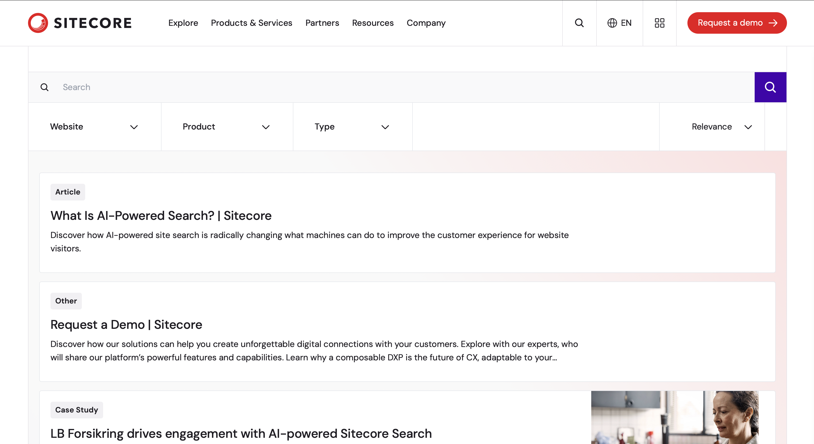
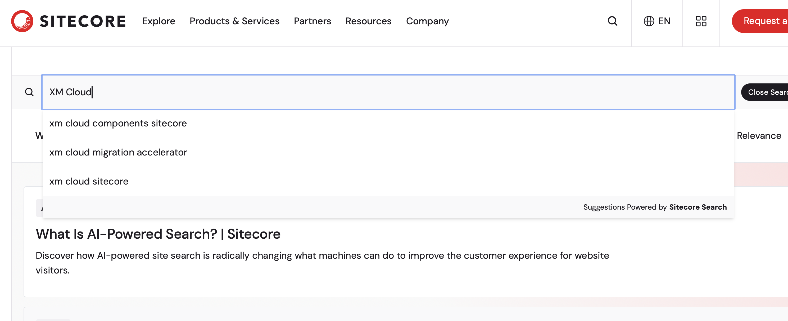
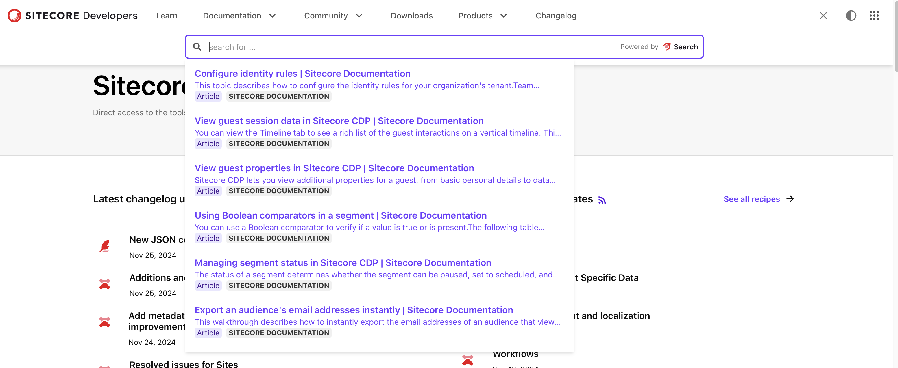
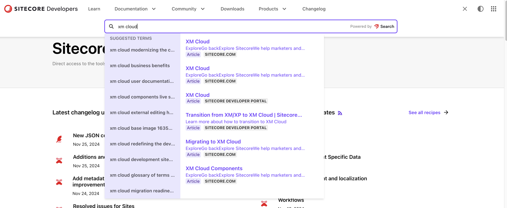
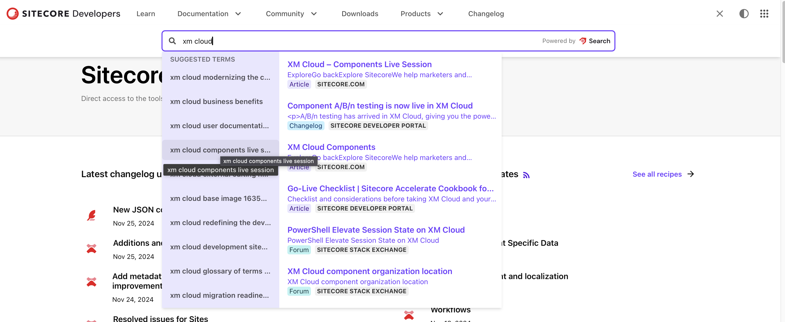
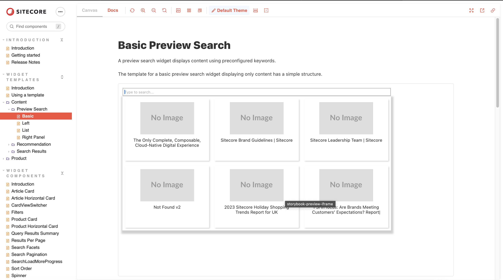

import { LinkCard } from '@astrojs/starlight/components';

Sitecore Search はサイトコアが提供する検索サービスとなっており、Web サイトにおけるサイト内検索を実装することが可能な SaaS のサービスとなります。今回は、実際に導入済みのサイトコアのサイト、サイトコアの開発者向けサイトをもとに、製品に関して紹介をしていきます。

## Sitecore Search とは？

この製品は、Sitecore が 2021年9月に買収した会社 Reflektion が提供していた E-Commerce 向け検索サービスを、より汎用的に使いやすく機能改善をして提供している製品となります。製品に含まれている主な機能は以下のとおりです。

- 管理画面
- クローラー
- API クローラー
- 開発者向けツール
- ウィジット管理
- パーソナライズの設定
- アナリティクス

それぞれの機能に関しては、別のドキュメントで紹介をします。

## サンプルサイト

それでは実際に、幾つかのサイト利用しながら紹介していきたいと思います。

### Sitecore.com

すでに自社での導入をしているため、まずはサイトでの動きを見ていきます。

<LinkCard
  title="Sitecore.com Search"
  href="https://www.sitecore.com/ja-jp/search?page=0"
  target="_blank"
/>

このページにある要素としては、検索ボックス、その下には Facet となる項目（ Website 、Product および Type ）が表示されており、この Facet を利用することで絞り込み検索をすることが可能です。

この検索ボックスに対して、 `XM Cloud` のキーワードを入力すると以下のようにおすすめのキーワードが表示されます

このように、検索キーワードを入力すると、おすすめのキーワードも表示するような形となっています。これにより、検索の作業をアシストをして、使いやすいサイト内検索のサービスを展開することが可能となります。

### Sitecore Developer

Sitecore の開発者向けの Web サイトとして、https://developers.sitecore.com/ というサイトを立ち上げています。サイトにアクセスをして右上にある検索に関するアイコンをクリックすると検索ボックスが表示され、そのタイミングでおすすめのコンテンツが表示されます。

キーワードを入力すると、おすすめのキーワードと合わせてそのコンテンツのプレビューが表示されます。

この Suggest しているキーワードに対してマウスカーソルを合わせると、該当するキーワードで検索をしたときのおすすめのコンテンツがプレビューで表示されます。

この検索ボックスに対するプレビューを提供することで、アクセスしたいコンテンツに対して素早くアプローチする、という手順をサイト内検索に対して実装することが可能となります。

## ウィジットの提供

上記の２つのサイトを参照すると、検索ボックス、ファセットなど検索サイトで必要となる要素が組み込まれていることがわかります。これらの機能を Web サイトに実装するためのウィジットを Sitecore Search では提供しています。

<LinkCard
  title="Sitecore Search JS SDK and UI Components"
  href="https://developers.sitecorecloud.io/search-sdk/react/latest/storybook/index.html?path=/story/introduction-introduction--page"
  target="_blank"
/>

上記のサイトで、`Widget Templates` - `Content` - `Preview Search` - `Basic` を選択すると、実際に提供されているウィジットのデモを確認することができます。

## まとめ

Sitecore Search に関して今回は Sitecore.com と開発者向けサイトの２つのパターンを紹介しました。また、これらのサイトを構築するためのウィジットも提供しており、これらを利用することでより少ない手順でサイト内検索を実装することが可能となります。

## 参考情報

<LinkCard
  title="Sitecore Search"
  href="https://www.sitecore.com/ja-jp/products/search"
  target="_blank"
/>

