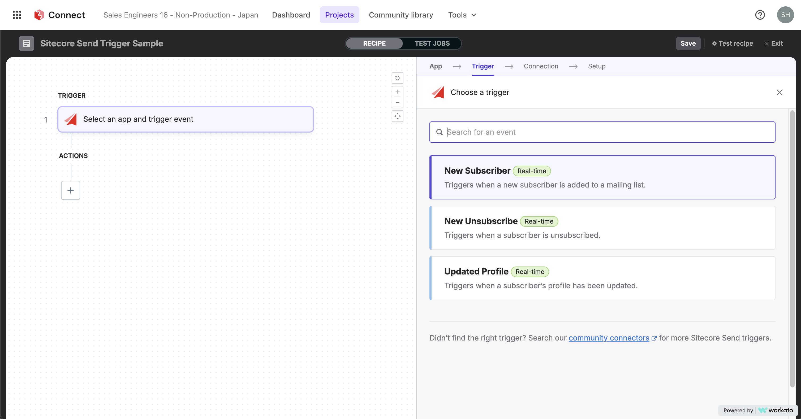
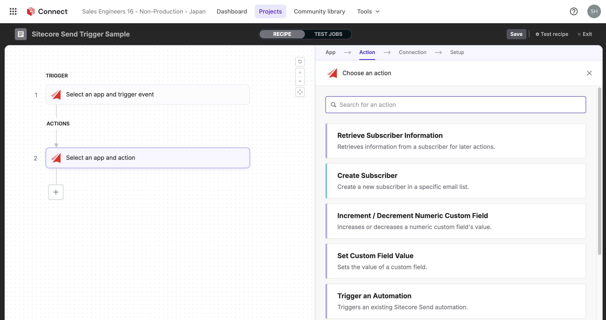

import { LinkCard } from '@astrojs/starlight/components';

Sitecore が提供しているメールマーケティングツールは２つの製品名となっており、中小規模で簡単に利用できる Moosend と企業での利用を想定した Sitecore Send の２つの利用形態があります。ここでは、この２つの違いと主な機能に関して紹介をします。

## Moosend　/ Sitecore Send の紹介

Moosend　/ Sitecore Send はメール配信サービスで、マーケティングオートメーションの機能を提供しています。以下に両方のサービスに関する主な特徴と機能を紹介します。

### 対象としているお客様

この両サービスはシンプルなメールマーケティングソリューションという位置付けとなっています。導入後すぐに利用できるようにテンプレートが用意されており、必要に応じて編集をすることができる見たまま編集ツールが非常に便利です。また、実際に運用するに当たっての既存のツールとのさまざまな統合もあります。

これらのサービスは以下のような業種のお客様に最適です。

- **コマース連携**: オンラインストアの運営者
- **マーケティングツールとして**: 潜在顧客とマーケティングの統合
- **エージェンシー**: マーケティングエージェンシー
- **旅行業界**: 旅行代理店やツアーオペレーター
- **出版社**: オンラインおよびオフラインの出版社
- **SaaS サービス提供者**: ソフトウェアをサービスとして提供する企業

定期的なメール配信以外にも、トランザクションメールなどにも対応しています。

### 主な特徴

- **使いやすいメール作成ツール**: 直感的なインターフェースで、誰でも簡単にメールを作成できます。
- **予約送信**: メールの配信に関して時間指定をすること可能です。
- **デザインテンプレート**: メールを作成するに当たって、数多くのテンプレートを用意しています。また、追加で新しいテンプレートを追加することも可能です。
- **ランディングページ**: 簡単にランディングページを作成できます。
- **購読フォーム機能**: サイトに埋め込む購読フォームを作成できます。
- **配信リストの管理**: メールを配信するリストの管理が可能です。
- **オプトイン・オプトアウト**: メールのオプトイン、オプトアウトに関して対応しています。
- **セグメンテーション**: 登録ユーザーの属性を利用したセグメンテーションが可能です。
- **詳細なレポート機能**: メールの開封率、クリック率、開封地域などの詳細なレポートを提供します。
- **メールのヒートマップ**: メール内のどの部分がクリックされたかを視覚的に確認できます。
- **A/B テスト**: 異なるバージョンのメールをテストして、最適なものを選択できます。
- **画像編集ツール**: 画像の切り取りやリサイズが可能です。
- **カウントダウンタイマー**: メール内にカウントダウンタイマーを追加できます。
- **メール購読者数ベースの料金体系**: メール配信数ではなく、メール購読者数を基にした料金体系を採用しています。
- **API 連携**: 他のシステムと簡単に連携できる API を提供しています。
- **多言語対応**: 管理画面は英語、日本語を含めて 7 言語に対応しています

### ２ つのサービスの違い

Moosend に関しては通常のサービスを Moosend Pro として提供しています。以下の表では無料版を Free、通常のサービスを Moosend 、Add-on に対応している Moosend+ および企業向け Sitecore Send という形で、主な違いを紹介しています。

| 主な機能                       | Free | Moosend | Moosend + | Sitecore Send |
| ------------------------------ | ---- | ------- | --------- | ------------- |
| キャンペーン                   | ✔️   | ✔️      | ✔️        | ✔️            |
| マーケティングオートメーション | ✔️   | ✔️      | ✔️        | ✔️            |
| トランザクションメール         | ✖️   | ✖️      | Add-on    | ✔️            |
| SMTP サーバー                  | ✖️   | ✔️      | ✔️        | ✔️            |
| WISYWIG エディター             | ✔️   | ✔️      | ✔️        | ✔️            |
| テンプレート                   | ✔️   | ✔️      | ✔️        | ✔️            |
| オートメーション               | ✔️   | ✔️      | ✔️        | ✔️            |
| ファイルのホスト               | ✖️   | ✖️      | Add-on    | ✔️            |
| メールサポート                 | ✔️   | ✔️      | ✔️        | ✔️            |
| チャットサポート               | ✔️   | ✔️      | ✔️        | ✔️            |
| API アクセス                   | ✔️   | ✔️      | ✔️        | ✔️            |
| SSO + SAML                     | ✖️   | ✖️      | Add-on    | ✔️            |
| SLA                            | ✖️   | ✖️      | ✖️        | ✔️            |
| Dedicated IP                   | ✖️   | ✖️      | Add-on    | Optional      |
| アカウントマネージャー         | ✖️   | ✖️      | Add-on    | ✔️            |

サービスの利用期間については、無料版は30日限定で利用することができます。Moosend および Moosend + はサブスクリプションとして提供しており、また Sitecore Send に関してはサブスクリプションを年間契約のみとなっています。

より詳細な違いは、[Pricing](https://moosend.com/pricing/) のページで紹介されています。

### 価格

Moosend に関してはオンラインで価格をしらべることができ、また支払いに関してはクレジットカードのみとなりますがオンラインで申し込みをすることができます。無料版の登録の際にクレジットカードを求めることはありませんので、気軽に申し込みをすることができます。

価格帯系としては、購読者数となっており配信数は制限がありません。最小の利用に関しては 500 登録アドレスまでとなっており、最大 100 万登録まで Moosend でご利用いただけます。これ以上の購読者数が必要となる場合は、Sitecore Send を利用していただく形と想定しています。

Sitecore Send の見積もりを取得したい場合は、[デモリクエスト](https://www.sitecore.com/ja-jp/request-a-demo) から Sitecore の担当者に問い合わせをしてください。

実際の価格を確認する際には、[Pricing](https://moosend.com/pricing/) のページで Subscribers の紹介されています。

## 主な連携ツール

連携ツールに関しては Moosend および Sitecore Send では若干異なる形となります。

### Moosend 連携ツール

サービスの申込後、数多くの連携ソリューションが提供されています。以下の画面は、実際に申し込みをした後表示されている連携ソリューション一覧となります。

主な機能として以下のような連携があります。

- **Wordpress**: WordPressサイト に Moosend を連携させて購読者データを簡単に転送できます。購読者情報を最新の状態に保ち、同期させるのも数回のクリックで完了します。
- **Mailchimp Synchronizer**: Mailchimp サービスのユーザー情報を Moosend と同期させる機能です。Mailchimp のユーザーが Moosend に移行する際に利用可能な便利なツールです。
- **Google Contacts**: Google Contacts で管理をしているユーザー情報をインポートすることができます
- **Salesforce CRM**: Web API を利用して Salesforce CRM に登録されている情報を Moosend と連携ができます

### Sitecore Send 連携ツール

Sitecore Send を利用する場合、より多くのサービスと連携できるように Sitecore Connect を利用することを想定しています。Sitecore の別の製品との連携はもちろん、Workato をベースとして提供している Sitecore Connect を利用することで、ノーコード、ローコードでシステム連携を実現できます。

Sitecore Send と連携させた場合、以下のトリガーが用意されています。

- **New Subscriber**: メーリングリストに追加された場合にトリガーとして動作します
- **New unsubscriber**: 購読停止をした際にトリガーとして動作します
- **Update Profile**: プロファイルが更新された場合にトリガーとして動作します

また、アクションとして以下の機能が用意されています。

- **Retrieve Subscriber Information**: 購読者の情報を取得して、後のアクションに利用します。
- **Create Subscriber**: 特定のメールリストに新しい購読者を作成します。
- **Increment / Decrement Numeric Custom Field**: 数値カスタムフィールドの値を増減します。
- **カスタムフィールド値の設定**: カスタムフィールドの値を設定します。
- **Trigger an Automation**: 既存の Sitecore Send オートメーションをトリガーします。
- **Unsubscribe Subscriber**: すべてのメールリストまたは特定のターゲットメールリストから購読者の購読を解除します。

### API 連携

上記の Moosend および Sitecore Send で連携に関しては、よくあるシナリオに対して Sitecore 側で提供しているシナリオとなっています。上記のすべての連携は、API を利用して実行することが可能となっており、ドキュメントは以下のサイトで公開されています。

<LinkCard
  title="Moosend API reference"
  href="https://docs.moosend.com/developers/api-documentation/en/index-en.html"
  target="_blank"
/>
<LinkCard
  title="Sitecore Send API reference"
  href="https://doc.sitecore.com/send/en/developers/api-documentation/api-reference.html"
  target="_blank"
/>

## 参考情報

<LinkCard
  title="Moosend API reference"
  href="https://docs.moosend.com/developers/api-documentation/en/index-en.html"
  target="_blank"
/>
<LinkCard
  title="Moosend API reference"
  href="https://docs.moosend.com/developers/api-documentation/en/index-en.html"
  target="_blank"
/>
<LinkCard
  title="Sitecore Send API reference"
  href="https://doc.sitecore.com/send/en/developers/api-documentation/api-reference.html"
  target="_blank"
/>

