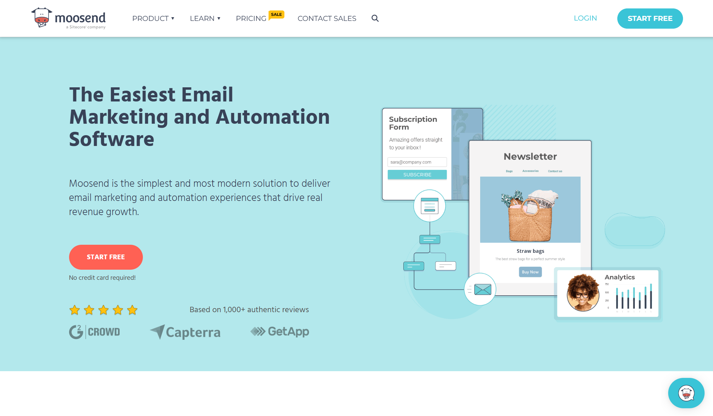
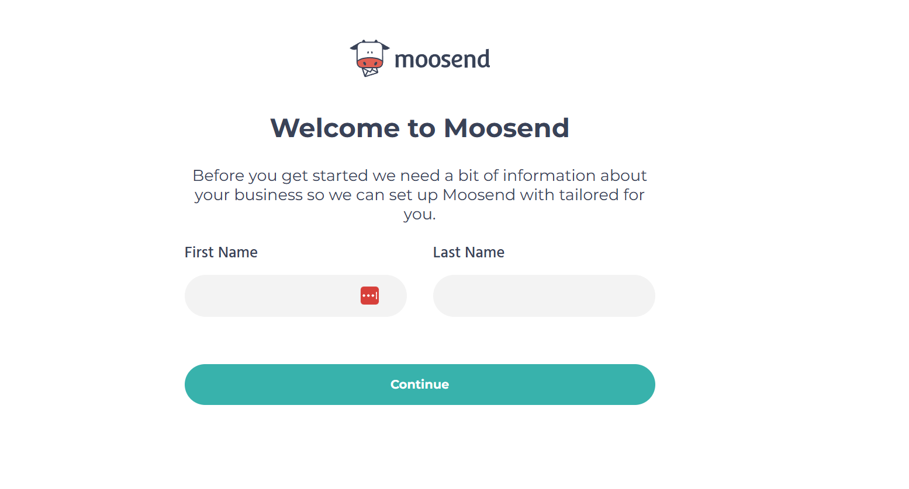
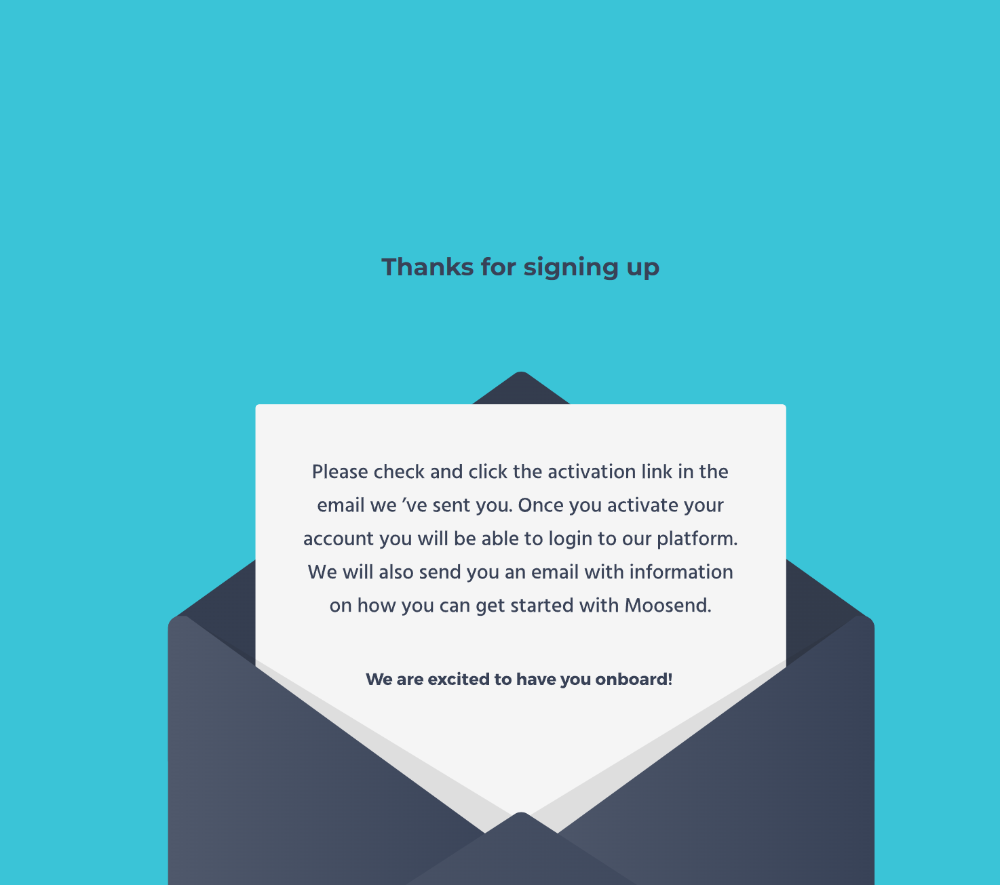
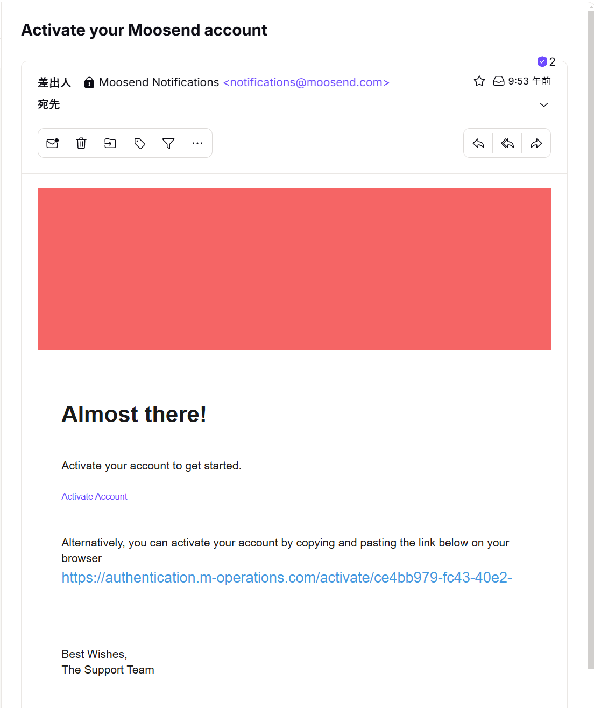
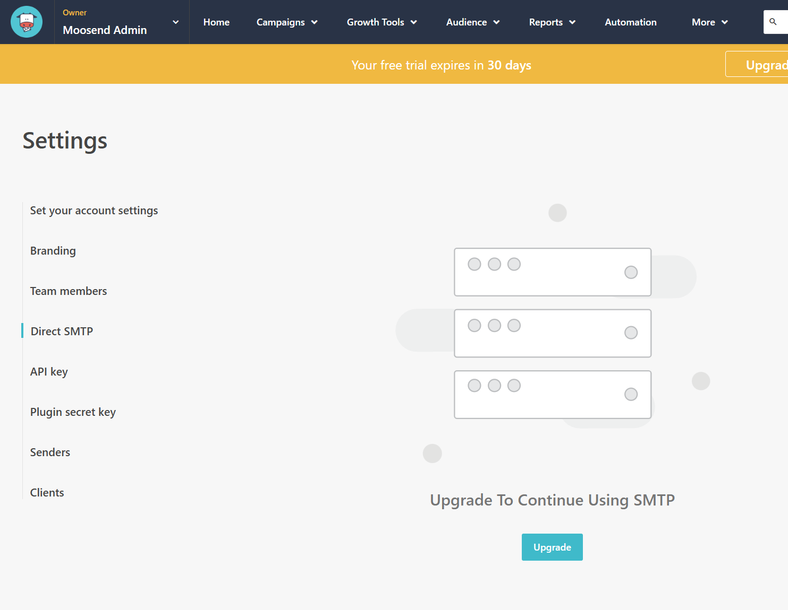

Sitecore Send は Moosend をベースとして、企業向けのサービスを充実させる形で構成されています。また Moosend は中小企業向けという形で展開されているサービスのため、お試し期間という形で 30 日の期間限定ではありますが無料で利用できるようになっています。このため、Sitecore Send を評価する場合にも、この無償期間が有効です。

また純粋にメールマーケティングを始めたいという会社にも Moosend はスモールスタートという点では非常に有用です。特にメールマーケティングを始めるに当たって、突然１万通のメールを配信する、ということは SPAM メール的な動きに見えるためサービスとして使えない形となります。いわゆるウォームアップという形で、大規模に使う場合でも少しづつ使って実績を積み上げることが大切です。これは正しい運用を新しいサービスで使う上でも重要な手順ですので、まず最初に小さくでもいいので使ってみることで、本番導入でのトラブルを回避できるようになります。

今回は、30 日期間限定の申し込みの手順を紹介します。なお、30日間期間限定のサービスを利用するに当たって、クレジットカードの登録は不要で、有効なメールアドレスが必要という形です。

## 申し込み

まず Moosend のサイトにアクセスをすると以下のようなページになっています。

- [Moosend Home](https://moosend.com)

### 基本設定

画面の右上に Start Free のボタンがあります。これをクリックしてください。

申し込みをするメールアドレスを入力します。このメールアドレスに最後に確認メールが届く形となっています。

続いてログインドメインとパスワードを入力する画面が表示されます。

ログインドメインとは、実際にサービスを利用する際のドメインを設定する形となります。このドメインに関しては、サービスを開始したあと自前で持っているドメイン名に変更することも可能です。自社のドメイン名を指定しておくことで、サービスを使う際に便利な名前にすることができます。今回は moosend.com のドメインに対してサブドメインを指定します。

続いてサービスを利用するユーザーの名前を設定します。あくまで管理画面で表示される名前ですので、普通に入力しましょう。

### 利用方法の確認

続いてサービスを利用する目的が表示されます。もちろん、会社名および住所などを入力する形となります。個人での利用も可能ですので、その際は会社名のところは Personal など記載しておくといいと思います。

続いてどういう業種、どのような組織でどのくらいの規模感で利用する予定か？というのが表示されます。

これで入力が完了となり、確認メールが最初に入力したメールアドレスに対して送信されます。

### ユーザー確認

確認メールは比較的早く届きます。メールボックスを参照すると、以下のように確認のメールが届いており、URL をクリックするだけで確認が完了するようになっています。

確認メールをクリックすると、初回ログインが完了して 利用期間が 30 日残っていることがwかある管理画面となります。

評価期間となる 30 日の間は Direct SMTP を利用することはできません。実際に有料サービスに切り替えることで、このサービスを利用することが可能となります。

これで Moosend を評価するための準備ができました。

