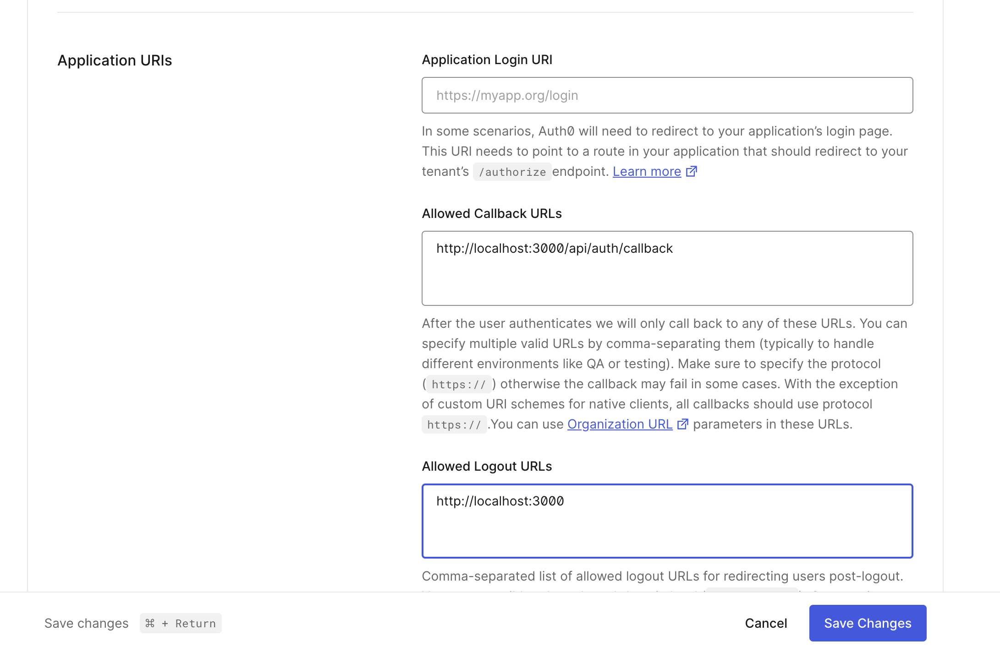
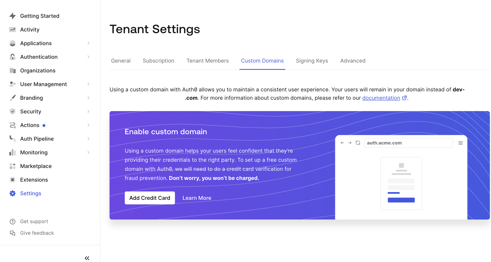
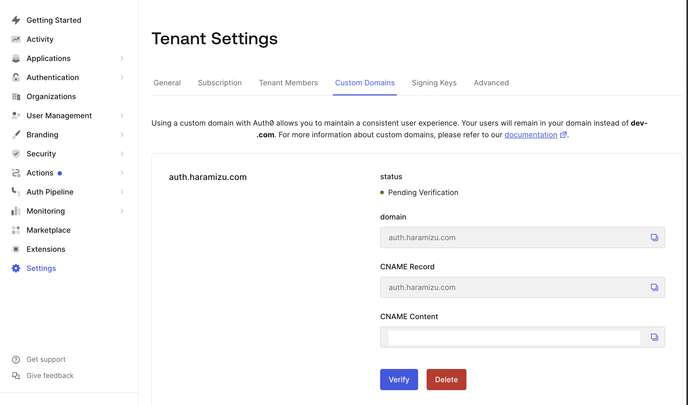

import { Steps, LinkCard } from '@astrojs/starlight/components';

実際の Web サイトにて会員向け情報提供などを展開するにあたって、ログイン認証の仕組みを組み合わせてサイトを運用していくことがあります。ここでは、Auth0 の利用方法に関して紹介をしていきます。

## Auth0 とは？

Auth0は、認証および認可のプロセスを簡素化するためのクラウドベースのサービスです。開発者がアプリケーションにシングルサインオン（SSO）、多要素認証（MFA）、ソーシャルログインなどの認証機能を迅速に統合できるように設計されています。Auth0 を使用することで、セキュリティを強化し、ユーザーエクスペリエンスを向上させることができます。

Auth0 の主な特徴は以下の通りです。

- **シングルサインオン（SSO）**: ユーザーが一度のログインで複数のアプリケーションにアクセスできるようにします。
- **多要素認証（MFA）**: 追加のセキュリティレイヤーを提供し、不正アクセスを防止します。
- **ソーシャルログイン**: Google、Facebook、Twitter などのソーシャルメディアアカウントを使用してログインできます。
- **カスタマイズ可能な認証フロー**: アプリケーションのニーズに合わせて認証フローをカスタマイズできます。
- **スケーラビリティ**: 小規模なプロジェクトから大規模なエンタープライズアプリケーションまで対応可能です。

Auth0 を利用することで、開発者は認証機能の実装にかかる時間と労力を削減し、アプリケーションのコア機能に集中することができます。

### 無料プランについて

Auth0 の無料プランが用意されています。この無料プランは 2024年9月24日に利用枠が拡大されました。

<LinkCard
  title="Auth0の無料プランが拡大。月間2万5000アクティブユーザーまで、独自ドメイン、パスキーによるパスワードレス対応も"
  href="https://www.publickey1.jp/blog/24/auth025000.html"
  target="_brank"
/>

<LinkCard
  title="Auth0 Takes “Free for Developers” to a New Level with More Users, More Security, Free MFA & Passwordless"
  href="https://www.okta.com/press-room/press-releases/auth0-takes-free-for-developers-to-a-new-level-with-more-users-more/"
  target="_brank"
/>

無料プランで利用できる範囲は以下の通りです。テストやデモという用途であれば、十分利用できる形となっています。

| Feature            | Free      |
| ------------------ | --------- |
| MAUs               | 25,000    |
| Social Connections | Unlimited |
| Okta Connections   | Unlimited |
| Organizations      | 5         |
| Actions + Forms    | 3         |
| Passwordless       | OK        |
| Custom Domain      | OK        |

今回はこの無料プランの申し込みをして、デモなどで使えるようにアカウントを作成していきます。

### 申し込みをする

アカウントを作成するにあたっては、Auth0 のサイトの価格を紹介するページにて、無料プランを申し込むことができる `Start building for free` というボタンがあります。

<LinkCard title="Pricing" href="https://auth0.com/pricing" target="_brank" />

上記のボタンをクリックすると、Sign-up の画面に切り替わります。


メールアドレスを入力すると、パスワードの設定画面が表示されます。


パスワードを設定すると、利用タイプに関して確認が入ります。


設定に関しての確認項目が表示されます。

> I need advanced settings
>
> We’ve assigned your data region to the United States and given you a tenant name. Check this box If you need to process your data in a different region to comply with privacy laws.

アメリカ以外で使いたい場合は、チェックをして変更する必要があります。今回は特に何もせずにそのまま進みます。


無事、Web サイトからはアカウントが作成されてログインをすることができました。

なお、ログイン用のメールアドレスに対して、メールアドレス認証のための URL が届いています。これを完了させることで、アカウント作成が完了となります。


## アプリケーションの作成

Auth0 の認証を利用する Web サイトを用意するにあたって、まず最初に Auth0 側でアプリケーションを作成する必要があります。ログインをしたあと、以下の画面で進めていきます。

<Steps>

1. 左上の `Getting Started` の項目を選択して、 `Create Application` のボタンをクリックします。

   

2. アプリケーション名を今回は `Sitecore Demo` とし、アプリケーションのタイプとして、`Regular Web Application` を選択します

   

3. どのテクノロジーとの連携か？が表示されます。ここに表示される Next.js は App Router のチュートリアルが表示されるだけですので、 `Skip Integration` をクリックしてください。

   

4. `Settings` を開くと、以下のようにアプリケーションの設定が表示されます。

   

5. `Settings` を下にスクロールして Application URIs の設定項目があります。以下の２つの値を設定してください。

   - **Allowed Callback URLs**: `http://localhost:3000/api/auth/callback`
   - **Allowed Logout URLs**: `http://localhost:3000`

   

6. `Save Changes` をクリックしてアプリケーションの作成を完了させます

</Steps>

これで Next.js で利用する環境変数が準備できたことになります。実際のサンプルとしては以下のような形となります。

```text
AUTH0_SECRET=KEY-VALUE
AUTH0_BASE_URL=http://localhost:3000
AUTH0_ISSUER_BASE_URL=Basic Information - domain
AUTH0_CLIENT_ID=Basic Information - Client ID
AUTH0_CLIENT_SECRET=Basic Information - Client Secret
```

なお、 AUTH0_SECRET に関して管理画面から取得する形ではなく、ユニークなキーを生成すれば良いため、以下のコマンドを実行指定生成してください。

```bash
node -e "console.log(crypto.randomBytes(32).toString('hex'))"
```

## Next.js App Router

今回は Auth0 を利用するフレームワークとして、ここでは Next.js を利用したいと思います。Next.js に関しては Pages Router および App Router と２つのパターンの実装を選択できますが、最初に App Router で実装していきます。Pages Router の実装を参考にしたい場合は、このパートはスキップしてください。

<LinkCard
  title="Next.js Authentication By Example: Using App Router"
  href="https://developer.auth0.com/resources/guides/web-app/nextjs/basic-authentication"
  target="_brank"
/>

### 前提条件

今回は、以下のバージョンで作業を進めていきます。

- Next.js: 14.2.18
- Typescript: Yes
- App Router: Yes

### 基本設定

<Steps>

1. パッケージのインストール

   ```bash
   npm install @auth0/nextjs-auth0
   ```

2. `.env.local` ファイルを作成してください。各種値は、管理画面とコマンドラインで作成します。

   ```text
   AUTH0_SECRET=KEY-VALUE
   AUTH0_BASE_URL=http://localhost:3000
   AUTH0_ISSUER_BASE_URL=Basic Information - domain
   AUTH0_CLIENT_ID=Basic Information - Client ID
   AUTH0_CLIENT_SECRET=Basic Information - Client Secret
   ```

3. `src/app/api/auth/[auth0]/route.ts` を作成します

   ```ts
   // src/app/api/auth/[auth0]/route.ts
   import { handleAuth, handleLogin } from '@auth0/nextjs-auth0';

   export const GET = handleAuth({
     login: handleLogin({
       returnTo: '/',
     }),
   });
   ```

4. src/app/layout.tsx のファイルにて `UserProvider` を追加します。

   ```diff lang="tsx" ins=/(UserProvider)/
   // src/app/layout.tsx
   import localFont from "next/font/local";
   +import { UserProvider } from "@auth0/nextjs-auth0/client";

   //

     return (
       <html lang="en">
         <body
           className={`${geistSans.variable} ${geistMono.variable} antialiased`}
         >
           <UserProvider>{children}</UserProvider>
         </body>
   ```

5. ログインボタン `src/components/buttons/login-button.tsx` を作成します。

   ```tsx
   // src/components/buttons/login-button.tsx
   export const LoginButton = () => {
     return <a href="/api/auth/login">Log In</a>;
   };
   ```

6. ログアウトボタン `src/components/buttons/logout-button.tsx` を作成します。

   ```tsx
   // src/components/buttons/logout-button.tsx
   import { Button } from '@chakra-ui/react';

   export const LogoutButton = () => {
     return (
       <Button as="a" href="/api/auth/logout" marginX={1}>
         Log Out
       </Button>
     );
   };
   ```

7. ログインボタン、ログアウトボタンのためのナビゲーションとして、 `src/components/navigation/nav-bar-buttons.tsx` を作成します。

   ```tsx
   // src/components/navigation/nav-bar-buttons.tsx
   'use client';

   import { useUser } from '@auth0/nextjs-auth0/client';
   import React from 'react';
   import { LoginButton } from '@/components/buttons/login-button';
   import { LogoutButton } from '@/components/buttons/logout-button';

   export const NavBarButtons = () => {
     const { user } = useUser();

     return (
       <>
         <div className="nav-bar__buttons">
           {!user && (
             <>
               <LoginButton />
             </>
           )}
           {user && (
             <>
               <LogoutButton />
             </>
           )}
         </div>
       </>
     );
   };
   ```

8. 最後に、サンプルページにナビゲーションを追加します。

   ```diff lang="tsx"
   // src/app/page.tsx
   +import { NavBarButtons } from "@/components/navigation/nav-bar-buttons";
   import Image from "next/image";

   export default function Home() {
     return (
       <div className="grid grid-rows-[20px_1fr_20px] items-center justify-items-center min-h-screen p-8 pb-20 gap-16 sm:p-20 font-[family-name:var(--font-geist-sans)]">
   +      <header>
   +        <NavBarButtons />
   +      </header>
         <main className="flex flex-col gap-8 row-start-2 items-center sm:items-start">
           <Image
   ```

</Steps>

これで準備が整いました。実際に実行すると以下のように動作します。


### サインアップ画面の追加

ログイン、ログアウトだけでなく、サインアップに関しても追加することが可能です。追加の手順は以下の通りです。

<Steps>

1. サインアップのボタンとして `src/components/buttons/signup-button.tsx` を作成します。

   ```tsx
   // src/components/buttons/signup-button.tsx
   export const SignupButton = () => {
     return <a href="/api/auth/signup">Sign Up</a>;
   };
   ```

2. サインアップの際の動作を `src/app/api/auth/[auth0]/route.ts` に追加します。

   ```diff lang="ts"
   // src/app/api/auth/[auth0]/route.ts
   import { handleAuth, handleLogin } from "@auth0/nextjs-auth0";

   export const GET = handleAuth({
     login: handleLogin({
       returnTo: "/",
     }),
   +  signup: handleLogin({
   +    authorizationParams: {
   +      screen_hint: "signup",
   +    },
   +    returnTo: "/",
   +  }),
   });
   ```

3. サインアップのボタンをナビゲーションに配置します。

   ```diff lang="tsx"
   import { LogoutButton } from "@/components/buttons/logout-button";
   +import { SignupButton } from "@/components/buttons/signup-button";

   export const NavBarButtons = () => {
     const { user } = useUser();

     return (
       <>
         <div className="nav-bar__buttons">
           {!user && (
             <>
   +            <SignupButton />
               <LoginButton />
             </>
           )}
   ```

4. Auth0 の管理画面から `Branding` - `Universal Login` を選択、設定画面の `Advanced Options` にて、Universal Login が有効になっていることを確認します。

   

</Steps>

これでボタンの配置ができました。実際に起動をすると、以下のように Sign-up が追加されています。


クリックをすると、サインアップの画面に切り替わります。


これで Next.js App Router に基本的な Auth0 の機能を実装することができました。

作成したサンプルは、以下のリポジトリで参照することができます。

<LinkCard
  title="haramizu / Next.js-sample"
  href="https://github.com/haramizu/Next.js-sample/tree/main/examples/auth0-app"
  target="_blank"
  description="Sample - Next.js App Router with Auth0"
/>

## Next.js Pages Router

Next.js Page Router において、App Router と混在させることができるため、App Router の作業をそのまま再現しつつも、Pages router 固有の作業を含めた手順で進めていきます。

### 前提条件

今回は、以下のバージョンで作業を進めていきます。

- Next.js: 14.2.18
- Typescript: Yes
- App Router: No

プロジェクトは以下のように作成しました。


### 基本設定

<Steps>

1. パッケージのインストール

   ```bash
   npm install @auth0/nextjs-auth0
   ```

2. `.env.local` ファイルを作成してください。各種値は、管理画面とコマンドラインで作成します。

   ```text
   AUTH0_SECRET=KEY-VALUE
   AUTH0_BASE_URL=http://localhost:3000
   AUTH0_ISSUER_BASE_URL=Basic Information - domain
   AUTH0_CLIENT_ID=Basic Information - Client ID
   AUTH0_CLIENT_SECRET=Basic Information - Client Secret
   ```

3. `src/app/api/auth/[auth0]/route.ts` を作成します

   ```ts
   // src/app/api/auth/[auth0]/route.ts
   import { handleAuth, handleLogin } from '@auth0/nextjs-auth0';

   export const GET = handleAuth({
     login: handleLogin({
       returnTo: '/',
     }),
   });
   ```

4. `src/pages/_app.tsx` のファイルにて `UserProvider` を追加します。

   ```diff lang="tsx" ins=/(UserProvider)/
   // src/pages/_app.tsx
   import "@/styles/globals.css";
   import type { AppProps } from "next/app";
   +import { UserProvider } from "@auth0/nextjs-auth0/client";

   export default function App({ Component, pageProps }: AppProps) {
     return (
   +    <UserProvider>
         <Component {...pageProps} />
   +    </UserProvider>
     );
   }
   ```

5. ログインボタン `src/components/buttons/login-button.tsx` を作成します。

   ```tsx
   // src/components/buttons/login-button.tsx
   export const LoginButton = () => {
     return <a href="/api/auth/login">Log In</a>;
   };
   ```

6. ログアウトボタン `src/components/buttons/logout-button.tsx` を作成します。

   ```tsx
   // src/components/buttons/logout-button.tsx
   import { Button } from '@chakra-ui/react';

   export const LogoutButton = () => {
     return (
       <Button as="a" href="/api/auth/logout" marginX={1}>
         Log Out
       </Button>
     );
   };
   ```

7. ログインボタン、ログアウトボタンのためのナビゲーションとして、 `src/components/navigation/nav-bar-buttons.tsx` を作成します。

   ```tsx
   // src/components/navigation/nav-bar-buttons.tsx
   import { useUser } from '@auth0/nextjs-auth0/client';
   import React from 'react';
   import { LoginButton } from '@/components/buttons/login-button';
   import { LogoutButton } from '@/components/buttons/logout-button';

   export const NavBarButtons = () => {
     const { user } = useUser();

     return (
       <>
         <div className="nav-bar__buttons">
           {!user && (
             <>
               <LoginButton />
             </>
           )}
           {user && (
             <>
               <LogoutButton />
             </>
           )}
         </div>
       </>
     );
   };
   ```

8. 最後に、サンプルページにナビゲーションを追加します。

   ```diff lang="tsx"
   // src/app/page.tsx
   +import { NavBarButtons } from "@/components/navigation/nav-bar-buttons";
   import Image from "next/image";

   export default function Home() {
     return (
       <div className="grid grid-rows-[20px_1fr_20px] items-center justify-items-center min-h-screen p-8 pb-20 gap-16 sm:p-20 font-[family-name:var(--font-geist-sans)]">
   +      <header>
   +        <NavBarButtons />
   +      </header>
         <main className="flex flex-col gap-8 row-start-2 items-center sm:items-start">
           <Image
   ```

</Steps>

これで準備が整いました。実際に実行すると以下のように動作します。


### サインアップ画面の追加

ログイン、ログアウトだけでなく、サインアップに関しても追加することが可能です。追加の手順は以下の通りです。

<Steps>

1. サインアップのボタンとして `src/components/buttons/signup-button.tsx` を作成します。

   ```tsx
   // src/components/buttons/signup-button.tsx
   export const SignupButton = () => {
     return <a href="/api/auth/signup">Sign Up</a>;
   };
   ```

2. サインアップの際の動作を `src/app/api/auth/[auth0]/route.ts` に追加します。

   ```diff lang="ts"
   // src/app/api/auth/[auth0]/route.ts
   import { handleAuth, handleLogin } from "@auth0/nextjs-auth0";

   export const GET = handleAuth({
     login: handleLogin({
       returnTo: "/",
     }),
   +  signup: handleLogin({
   +    authorizationParams: {
   +      screen_hint: "signup",
   +    },
   +    returnTo: "/",
   +  }),
   });
   ```

3. サインアップのボタンをナビゲーションに配置します。

   ```diff lang="tsx"
   import { LogoutButton } from "@/components/buttons/logout-button";
   +import { SignupButton } from "@/components/buttons/signup-button";

   export const NavBarButtons = () => {
     const { user } = useUser();

     return (
       <>
         <div className="nav-bar__buttons">
           {!user && (
             <>
   +            <SignupButton />
               <LoginButton />
             </>
           )}
   ```

4. Auth0 の管理画面から `Branding` - `Universal Login` を選択、設定画面の `Advanced Options` にて、Universal Login が有効になっていることを確認します。

   

</Steps>

これでボタンの配置ができました。実際に起動をすると、以下のように Sign-up が追加されています。


クリックをすると、サインアップの画面に切り替わります。


これで Next.js App Router に基本的な Auth0 の機能を実装することができました。

作成したサンプルは、以下のリポジトリで参照することができます。

<LinkCard
  title="haramizu / Next.js-sample"
  href="https://github.com/haramizu/Next.js-sample/tree/main/examples/auth0-pages"
  target="_blank"
  description="Sample - Next.js Pages Router with Auth0"
/>

## カスタムドメインについて

最近無料プランとして開放されたカスタムドメインの設定手順を確認します。この設定は、Settings のページの Custom Domain のタブを開くと設定ができます。

<Steps>

1. 最初は以下のような画面となっています。

   

2. カスタムドメインを利用するにあたって、無料プランでも設定可能ですが、個人の認証としてクレジットカードが必要となります。請求されることはありませんので、クレジットカードでの認証を進めていきます。

   クレジットカードの番号を入れて認証されると、画面は以下のように変わります。

   

3. ドメイン名を入力すると、以下のように DNS の設定画面が表示されます。

   

4. 提供された DNS のレコードを設定して、しばらくして Verify のボタンをクリックすると、DNS の設定が正しい場合は以下のように完了のダイアログが表示されます。

   

5. Custom Domain を追加することができました。

   

</Steps>

Custom Domain を設定すると、環境変数などで使うドメインをカスタムドメインとして使うことができるようになります。

## 参考情報

<LinkCard title="Pricing" href="https://auth0.com/pricing" target="_brank" />

<LinkCard
  title="Next.js/JavaScript Pages Router Code Sample: Basic Authentication"
  href="https://developer.auth0.com/resources/code-samples/web-app/nextjs/basic-authentication/javascript-pages-router"
  target="_brank"
/>

<LinkCard
  title="Next.js Authentication By Example: Using App Router"
  href="https://developer.auth0.com/resources/guides/web-app/nextjs/basic-authentication"
  target="_brank"
/>

