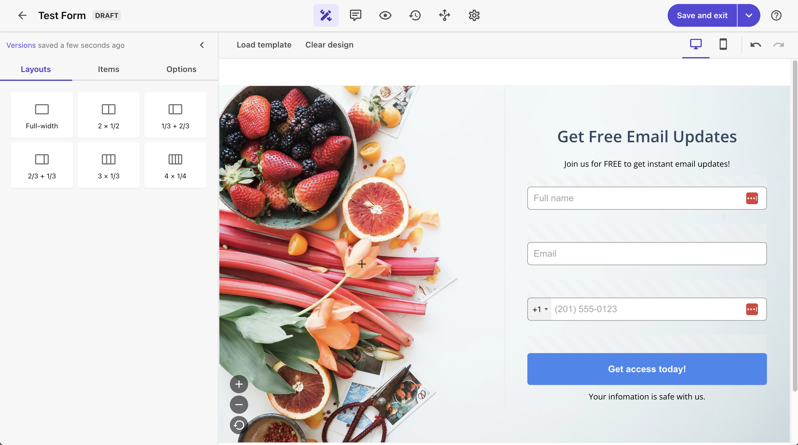

import { Steps, LinkCard } from '@astrojs/starlight/components';

{/* https://blog.haramizu.com/ja-JP/blog/2024/08/26/webhook-site */}

Sitecore の各種製品では様々なエリアで Webhook に対応しており、Sitecore Connect を利用してデータのやり取りができる仕組みとなっています。今回紹介をする Web サービスはテストなどで補完することができます。

## Webhook.site について

サイトの詳細は以下のページで確認可能です。

<LinkCard title="About Webhook.site" href="https://docs.webhook.site/index.html" target="_brank" />

このサイトのサービスとしては、Webhook で受け取ったデータに関しての後処理に関してのサービスを展開しています。サーバーを建てることなく、Webhook の処理に関して確認できる非常に便利なサービスです。

サイトにアクセスをするだけで、利用するための情報が一通り表示されるようになっています。

### プランに関して

フリープランでは Webhook.site で用意される URL は 7 日間のみ有効で、継続して同じ URL を利用するためには有償プランにはいる必要があります。無料プランはあくまで体験できるだけ、という形というサービスですが、Webhook のデータを確認するためであれば無料プランでも十分可能です。

## 動作確認

ここでは、Sitecore Forms + Webhook.site を組み合わせて動作を確認していきます。Sitecore Forms はデータを受け取ったあとの Webhook の機能を提供しているため、これを利用して動作確認をしたいと思います。

<Steps>

1. Sitecore Forms で用意されているテンプレートを利用して、以下のようにフォームを作成します。

   

2. webhook を追加します。この際、認証なしで Web サイトに掲載されている URL をそのまま追加します。

   

3. 作成をした Webhook を、Sitecore Forms と連携させます。

   

4. Test webhook でテストを実行します。

   

</Steps>

実行すると、webhook 送信の成功のメッセージが出ます。webhook.site のサイトに移動をすると、データを受け取っているため以下のように画面が切り替わっています。

## まとめ

今回は webhook.site でデータを受け取るところまで確認をしてみました。受け取ったデータを加工して別のサービスと連携して、という形となると別の個別の実装が必要となるため有料プラン、もしくは Sitecore Connect や Workato などのサービスを契約するひつようがありますが、データのチェックであればこれで十分、という形でもあります。

