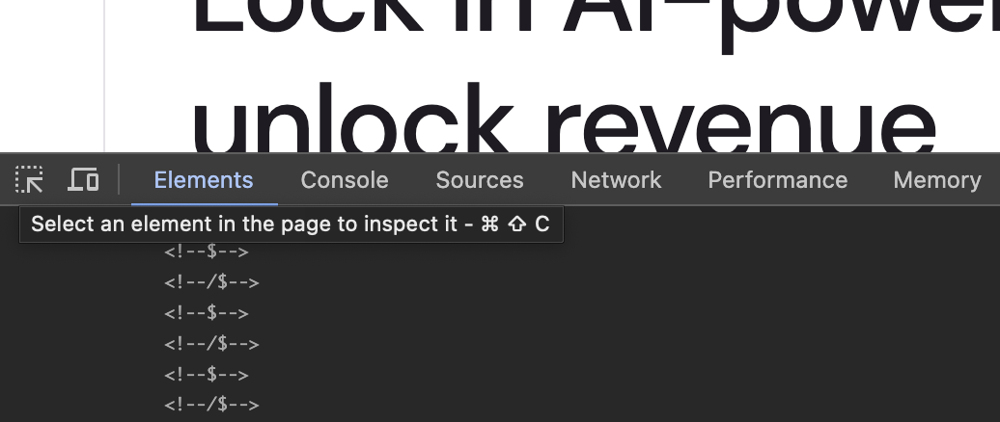

Web ページの HTML の構造を利用して、XPath (XML Path Language)を利用することでツリー構造となっているXML/HTMLドキュメントから要素や属性値などを取得することができます。今回はブラウザ上で簡単に確認することができるアドインを紹介します。

XPathとは、XML形式の文書から、特定の部分を指定して抽出するための簡潔な構文 (言語)です。HTML形式の文書にも対応します。CSSではセレクタを使ってHTML文書内の特定の部分を抽出しますが、XPathはより簡潔かつ柔軟に指定ができるとされています。

一般的な Web サイトの HTML のデータは、ページのテンプレートごとに同じ構造で表示されるはずです。これを利用して、ページの中から要素を取得することができます。

## 開発者ツールの活用

一般的に提供されているブラウザには、開発者ツールの機能が提供されており、これを利用することで XPath のデータを取得することが可能です。

例えば、Sitecore Search の製品サイトにアクセスをして、ブラウザの開発者ツールを開き、Elements の項目を選択します。続いて一番左側にあるアイコン、マイスオーバーをすると `Select an element in the page to inspect it` と表示されるアイコンをクリックして、ページの確認したい部分をクリックします。



するとソースコードは該当する HTML のコードを指し示します。続いて、この指し示された HTML のコードの部分を右クリックをして、メニューが表示されて幾つかのデータの確認が可能です。今回は、`Copy XPath` を選択します。


クリックをするとクリップボードに XPath の値がコピーされている状況です。今回の XPath の結果は以下のとおりです。

```
//*[@id="content"]/section[1]/div/div/div[1]/div[2]/h1
```

このように XPath の値を取得する方法を確認することができました。

## XPath Helper

### インストール

ブラウザの機能拡張として、XPath helper というツールがあるため、このサイトではこれを利用しながらデータの確認を進めていきます。まず、以下のツールをブラウザにインストールをしてください。

- [XPath Helper](https://chrome.google.com/webstore/detail/xpath-helper/hgimnogjllphhhkhlmebbmlgjoejdpjl?hl=ja)

この拡張機能をインストールをして有効にしたあと、このツールの表示をオンにすると、ブラウザの上に2つのテキストボックスが表示されます。


これでインストールが完了となります。

### 利用方法

それでは早速、XPath Helper を利用してデータの取得の確認をしていきます。まず、このトピックの最初で取得した XPath を左側のテキストボックスに入れてみます。結果、以下のようにタイトルの部分を取得して右側のテキストボックスに表示します。


同じ XPath を利用して別のページ、XM Cloud のページに移動した場合でも、同じページの構造となっているためページのタイトルを取得することができます。


このように、同じ構造のページのテキストを取得する際に XPath を利用する際に、事前に動作確認をする上で便利です。

またページの中に表示されているデータ以外にも、Meta データとして設定している値から値を取得することも可能です。例えば `og:description` の値を取得する場合は、以下のような記述で取得することができます。

```
//meta[@property='og:description']/@content
```

結果は以下のように表示されます。


## まとめ

XPath Helper を利用することで、ページの要素のデータを取得する際のルールをどのように設定するのが良いか、確認することができるので非常に便利です。ページの構造を確認する簡単な手順は開発者ツールがあるだけでも十分ですが、このツールを利用して他のページでも同様にデータを取得できるのかを確認して、効率よく作業を進めることができます。

