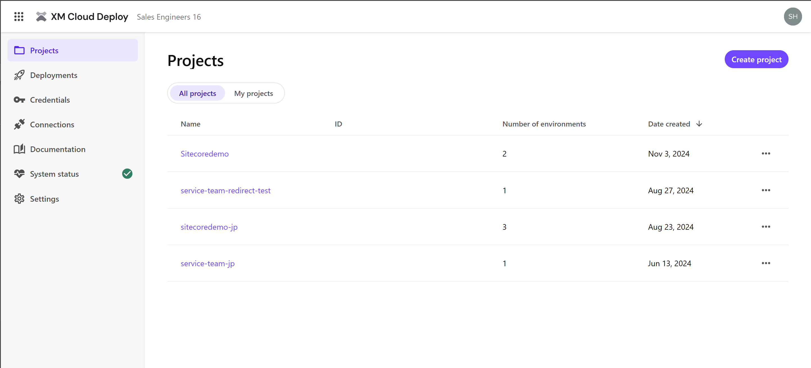

import { LinkCard } from '@astrojs/starlight/components';

このドキュメントでは、Sitecore が提供する CMS の SaaS 版の製品、Sitecore XM Cloud の概要を紹介しています。Sitecore の製品に関しての用語をこのページで紹介しつつ、各種トピックは別のページで紹介をしています。

## Sitecore XM Cloud が提供するツールに関して

Sitecore XM Cloud は、デジタルエクスペリエンスを管理するための強力なツールセットを提供します。これらのツールは、コンテンツ管理、アナリティクス、パーソナライゼーション、そして A/B/n テストツールが基本機能が含まれています。

## コンテンツ管理システム (CMS)

Sitecore XM Cloud で提供されているツールを活用することで、企業は Web サイトのコンテンツ管理を効率よく管理することが可能となります。Sitecore XM Cloud は、現代のデジタルマーケティングのニーズに応えるための基本的なソリューションを提供します。

そして従来から提供している Sitecore が提供している CMS と以下の機能をそのまま利用することが可能です。

- Content Editor
- Experience Editor
- Media Library
- アクセス管理などのツール

## 管理画面について

システム管理者・開発者のみが利用するツールとなる XM Cloud Deploy および CMS の管理画面から各種ツールにアクセスするための画面を紹介します。

### XM Cloud Deploy

XM Cloud のサーバーを展開するためのツールとして提供しています。

主に以下の機能を利用します。

- プロジェクトの作成
- プロジェクトの詳細を確認
- 展開している環境の確認
- XM Cloud と連携するための Credentials の管理
- XM Cloud とシステム連携しているシステムの確認

### Sites

Sitecore XM Cloud のサーバーにアクセスをして参照する最初のツールになります。

上記の画面からは、以下のツールへのアクセスが可能です。

- Design Library
  - Components
  - Forms
- Content
  - Explorer
  - Content editor
  - Media Library
  - Analytics
  - Settings
  - Page Builder

上記のツールへのリンク以外にも、環境を切り替える（本番、非本番など）メニューも用意しています。

XM Cloud ではサイト間でコンテンツの共有をする可能性がある場合は Collection を作成して、その中に複数のサイトを管理することが出来ます。Collection を複数作ることが出来ますが、Collection を超えてコンテンツの共有はできませんので、完全に分離して管理をしたい場合に Collection を複数持つ形となります。

## 各種ツールについて

Sitecore XM Cloud が提供する各種ツールの概要は以下の通りです。

### XM Cloud Deploy

XM Cloud Deploy は、Sitecore XM Cloud が提供する CMS を立ち上げるためのツールとなっており、このツールを利用することで CMS に対するさまざまな機能にアクセスすることができます。XM Cloud Deploy から、基礎となるテンプレートを使用するか、既存のコードを使用して XM Cloud プロジェクトを作成し、プロジェクト、環境、およびデプロイメントを管理することができます。

XM Cloud Deploy では以下の内容を管理することができます。

- Project
  - Environment
- Credentials: Organization や Environment のAPIにアクセスするための証明書の作成、管理をします。
- Connections: GitHub や Hosting のサービスに対する登録が可能です
- System Status: Sitecore XM Cloud の各種サービスに対するステータスを参照できます

### Components

XM Cloud Componentsは、ブランド独自のスタイルガイドを作成し、WYSIWYG（What You See Is What You Get）エディタでビジュアルコンポーネントを構築できる、フロントエンド・アズ・ア・サービスアプリケーションです。

### Page builder

Sitecore の CMS は、直感的なインターフェースを通じてコンテンツの作成、編集、公開を容易にします。Page builder は、ドラッグ＆ドロップ機能を使用して、ウェブページやデジタルアセットを簡単に管理できます。

### Forms

Sitecore XM Cloud で利用可能なフォームを作成することができるツールになります。ドラッグ＆ドロップでの編集機能を提供しており、また Webhook を利用して外部システムとの連携についても提供しています。

### Analytics

Sitecore Analytics は、ウェブサイトの行動履歴を取るためのツールとして、Analytics を提供しています。この機能を設定することにより、過去30日の Web サイトの経緯を確認することできます。

### Personalize

Sitecore XM Cloud は、ユーザーの行動データに基づいてコンテンツをパーソナライズする機能を提供します。これにより、訪問者ごとに最適化されたエクスペリエンスを提供し、エンゲージメントを向上させることができます。

### A/B/n テスト

ページの中で利用しているコンポーネントをベースにした A/B/n テストの機能を確認することができます。結果に関しても Analytics に表示されるようになるため、 Personalize と同様にマーケティング機能として利用可能です。

## XM Cloud の用語

Sitecore XM Cloud を説明するに当たって、複数の用語をここでは紹介をします。これらを理解することで、CMS の役割や複数の CMS が必要になる場合にはどのようにするべきか、を素早く判断することができます。

### Project

プロジェクト（Project） には複数の CMS のサーバーを展開することが可能となっており、標準では１つの本番環境、２つの非本番環境が提供される形です。XM Cloud deploy を最初に立ち上げた時に作成するのは、Project となります。

<LinkCard
  title="Manage a project"
  href="https://doc.sitecore.com/xmc/en/developers/xm-cloud/manage-a-project.html"
  target="_blank"
/>

### Envinromnet

環境（Environment）は Project の中で作成可能な環境の名前のことで、この Environment に対して 1 つの CMS インスタンスが提供されます。また、CMS を利用するに当たって必要な環境変数や Endpoint などの情報も取得することが可能で、Vercel などと連携する際に利用する値も、 Environment の各種設定から取得する形となります。

<LinkCard
  title="Manage an environment"
  href="https://doc.sitecore.com/xmc/en/developers/xm-cloud/manage-an-environment.html"
  target="_brank"
/>

## Sitecore CLI

Sitecore XM Cloud で Web サイト開発の際に利用することができる、便利なコマンドラインツールが Sitecore CLI となります。このツールは、 Sitecore Experience Manager （ Sitecore CMS ）でも利用可能ですが、SaaS の環境となっている XM Cloud に対しても利用することができます。

