import { Steps, LinkCard } from '@astrojs/starlight/components';

{/* https://blog.haramizu.com/ja-JP/blog/2024/06/12/xmcloud-create-new-project */}
{/* https://blog.haramizu.com/ja-JP/blog/2022/11/29/xm-cloud-deploy */}
{/* https://blog.haramizu.com/ja-JP/blog/2024/06/26/xmcloud-tailwindcss-sample-part-4 */}
{/* https://blog.haramizu.com/ja-JP/blog/2022/11/30/xm-cloud-add-environment */}

Sitecore XM Cloud の環境が手に入った次のステップとしては、XM Cloud Deploy を利用して新しいサーバーを立ち上げる手順を進めることになります。今回は、この XM Cloud Deploy でサーバーを立ち上げる手順を紹介します。

## 新しい Project の作成

まず最初に XM Cloud Deploy にアクセスをするためには、Sitecore Cloud Portal にアクセスをして、その右上に表示されている XM Cloud Deploy のメニューをクリックしてください。XM Cloud Deploy に初めてログインをした場合は、プロジェクトが何もない以下のような画面となります。

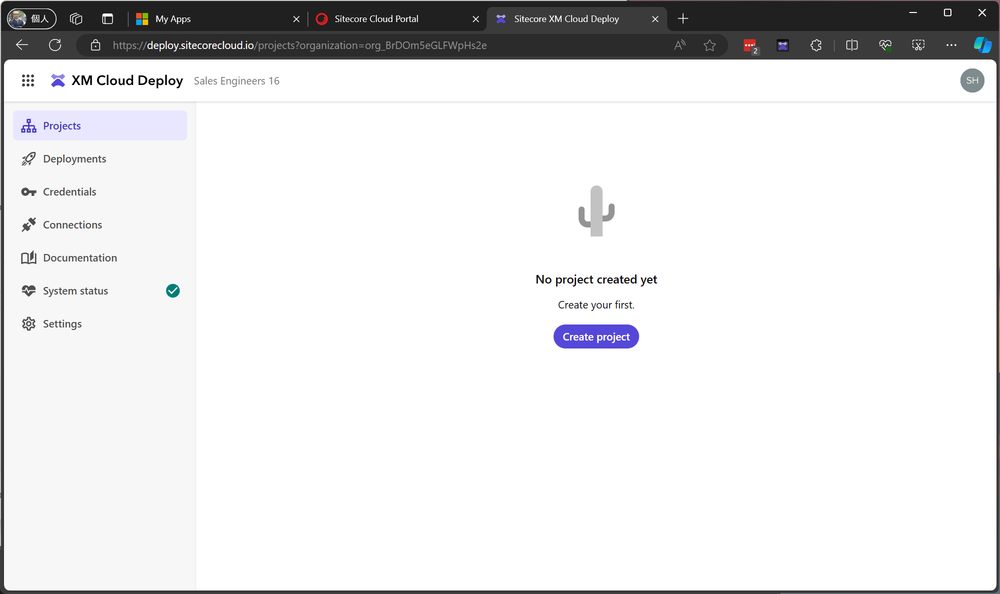

早速新しいプロジェクトを作成していきます。

<Steps>

1. 画面に表示されている `Create project` をクリックしてください（すでに Project が存在している場合は、右上に表示されます）。`Create Project` のボタンをクリックすると、以下の画面に切り替わります。

   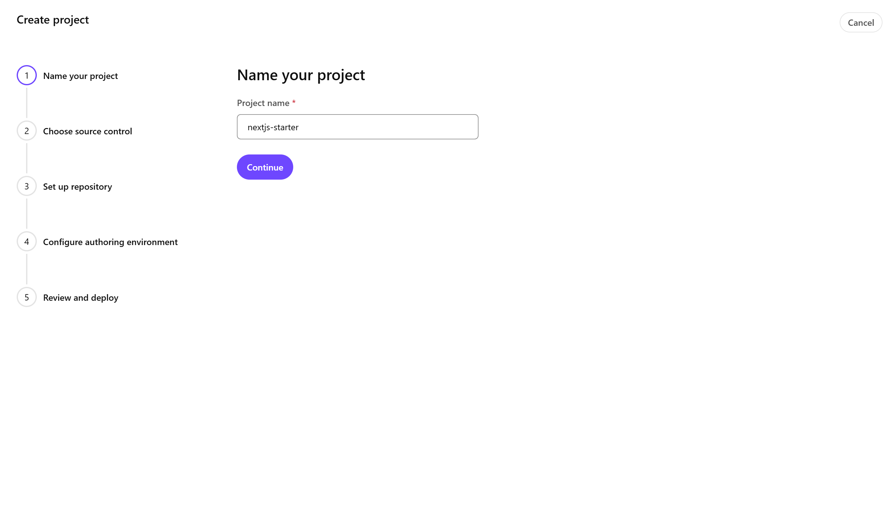

2. プロジェクト名を今回は `nextjs-starter` と設定します。`Continue` をクリックして次に進みます。

   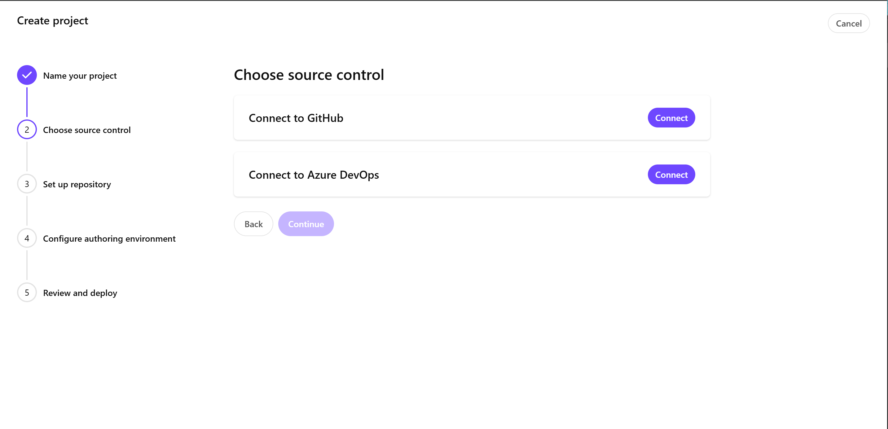

3. 上記の画面では、ソースコード管理の選択肢として、GitHub もしくは Azure DevOps のどちらを利用するか選択することが出来ます。今回は、GitHub を選択するために、 `Connect` のボタンをクリックして、Continue をクリックします。

4. リポジトリのセットアップ画面に切り替わります。

   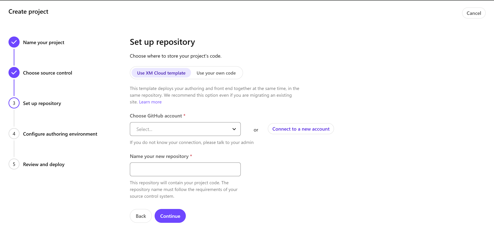

   リポジトリに関するセットアップとして、２つのタイプを選択することが出来ます。

   - **Use XM Cloud template**: これは Sitecore が提供している XM Cloud のテンプレートを利用する形となります。GitHub と連携をしている場合は、プライベートリポジトリが作成されます。
   - **Use your own code**: すでに開発を進めているコードがあれば、そのリポジトリを指定することができます。

5. 利用したいアカウントが一覧に表示されない場合、`Connect to a new account` をクリックすると連携の画面が表示されます。クリックをすると GitHub に画面が切り替わりログインをします。今回は organization に対して連携できるようにするため、以下のような形で Sitecore Deploy Prod の画面が表示されました。

   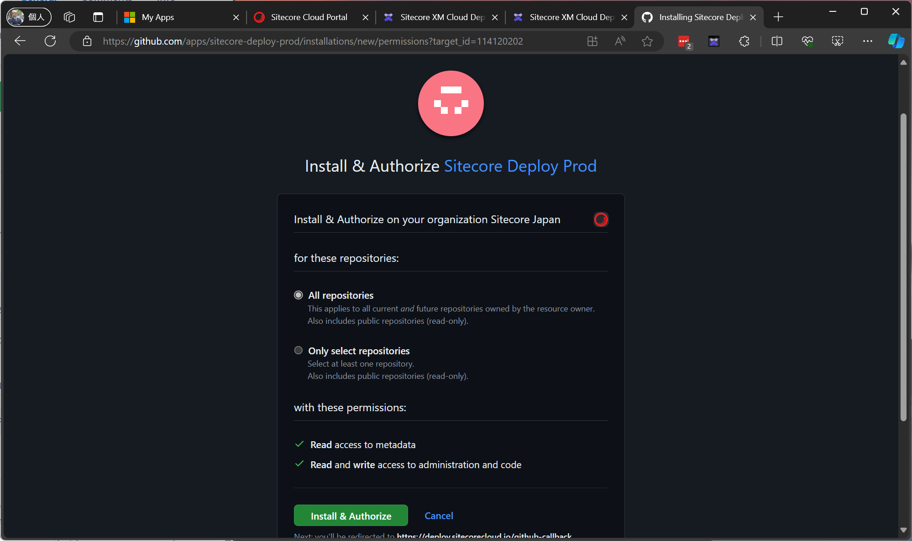

   Install & Authorize をクリックして連携ができるようにすると、一覧で選択できるようになります。

6. 新規に作成をする際には、対象となるアカウントの選択、そしてそのリポジトリの名前を設定します。`Continue` を押して次に進みます。

   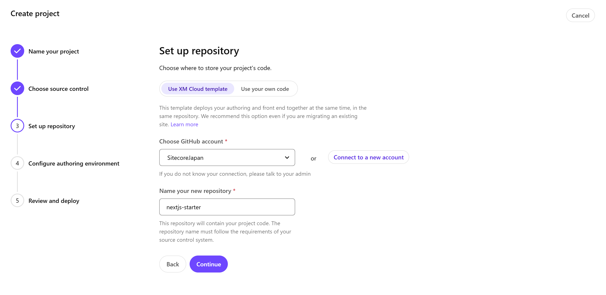

7. CMS の環境をどのように設定するかの確認画面が表示されます。

   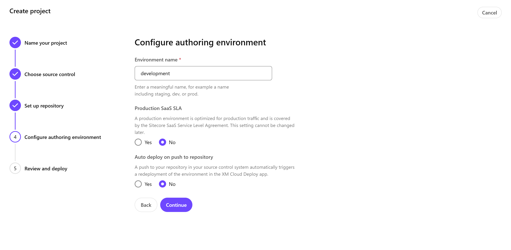

   この設定において、`Production SaaS SLA` の項目に関しては、後で変更をすることが出来ない形となります。最初は非本番環境として作成をして、実際の本番環境が必要なタイミングで作成するなど、運用に合わせて選択をしてください。

8. 最終確認の画面が表示されます。

   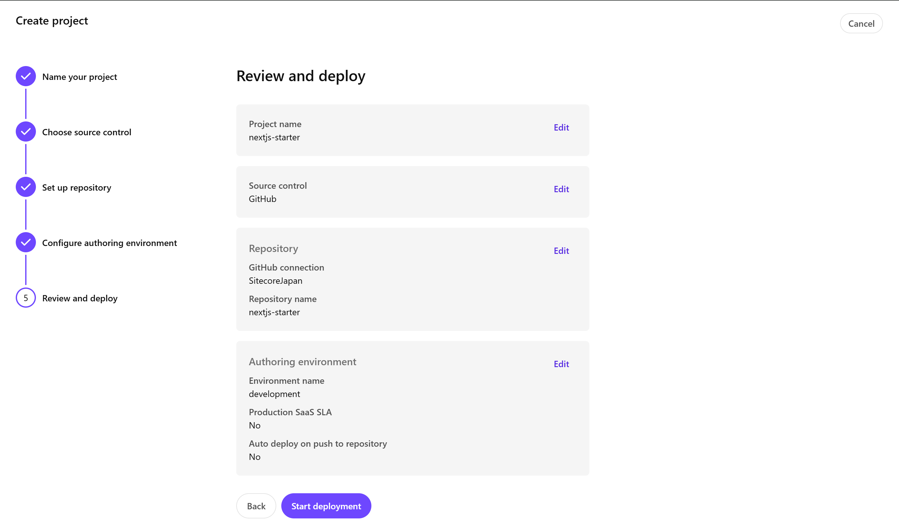

   内容に問題なければ、Start Deployment のボタンをクリックして展開を開始します。

</Steps>

これで新しいプロジェクトが作成されて、同時に新しい環境が１つ準備される形となります。

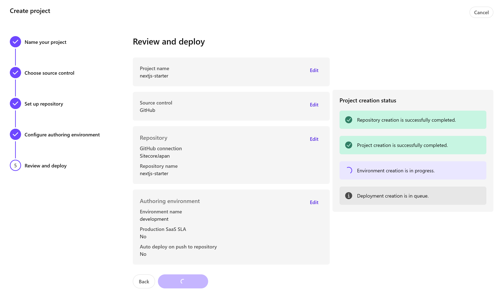

プロジェクトに対して、Production のサーバーを1台、Non-production のサーバーを 2 台作成することが可能となっています。

展開が完了すると、XM Cloud の管理画面にアクセスすることが可能となりました。

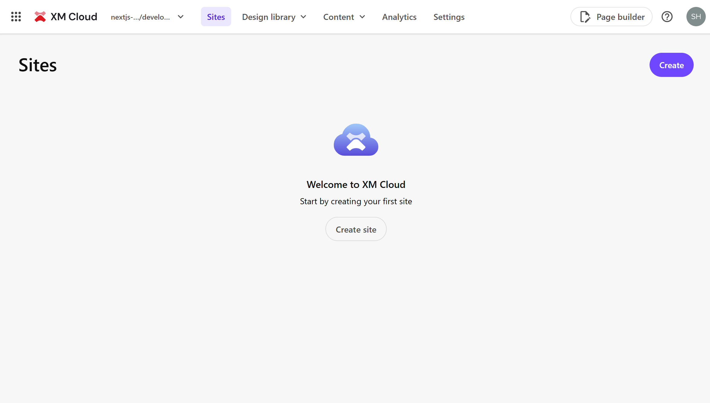

## 新しいサイトの追加

新しい Sitecore のインスタンスに対して、標準で用意されているサンプルのサイトを今回は追加していきます。手順としては、Collection を作成、そして Site の追加となります。

### Collection の作成

サイトのグループとして管理するために、Collection を作成します。

<Steps>

1. 新しい環境において、画面の右上に表示されている `Create` をクリックしてください。Site および Collection の選択が表示されます。

   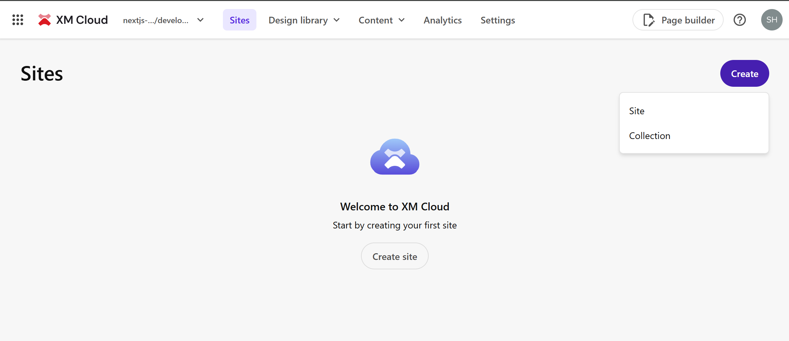

   今回は Collection を選択します。

2. Collection の名前を設定するダイアログが表示されます。

   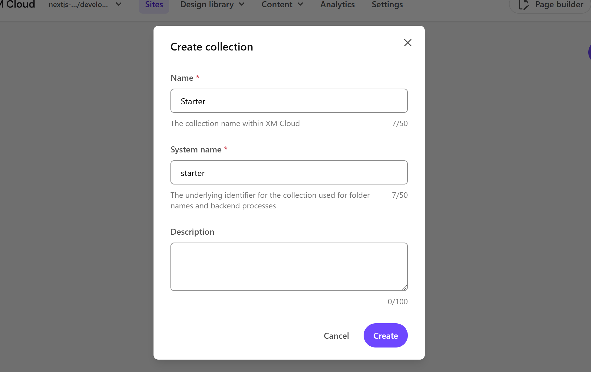

3. Create のボタンをクリックすると、新しい Collection が作成されます。

   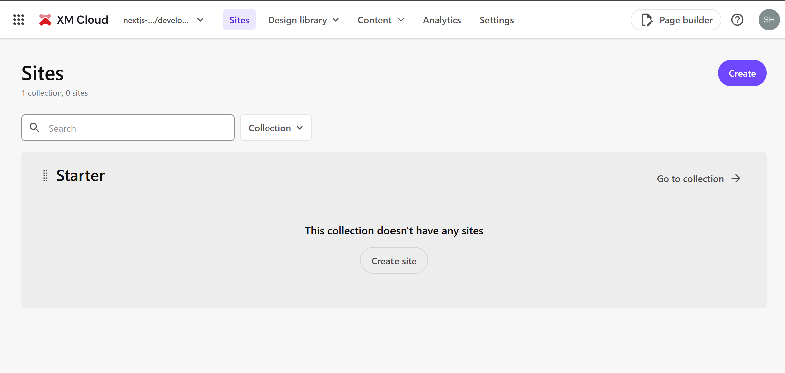

</Steps>

### Site の作成

Collection に対してサイトを作成するために、以下の手順を進めていきます。

<Steps>

1. 作成をした Collection のエリアに表示されている Create site をクリックします。

   

2. サイトのテンプレート画面が表示されます。今回は、Basic を選択します。

   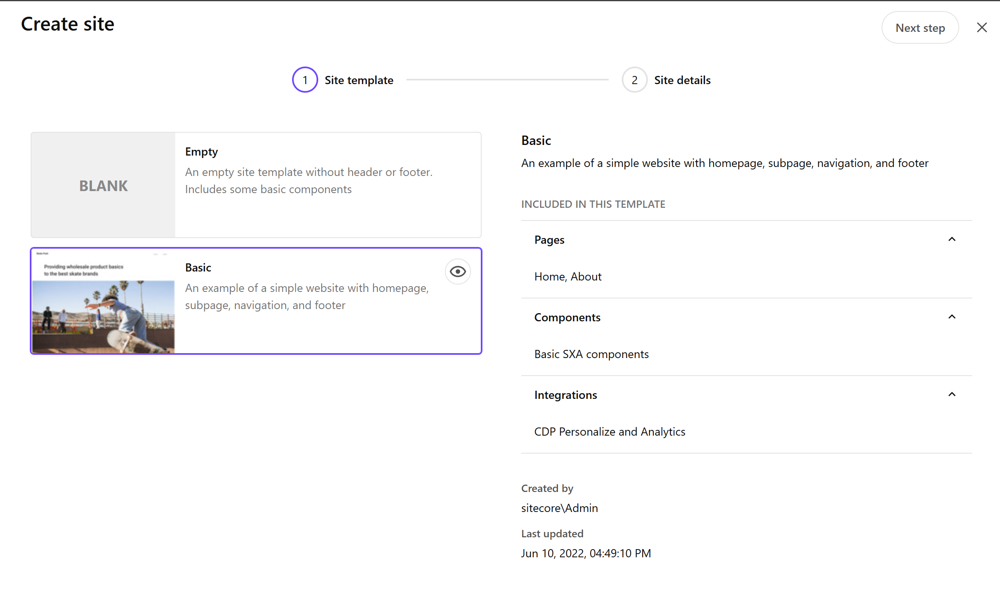

   このテンプレートの情報を確認すると以下の情報が表示されます。

   - Pages: Home と About のアイテムが準備されている
   - Components: 標準の SXA コンポーネント
   - Integration: Sitecore CDP + Personalize

3. 次のステップではサイトの情報を追加します

   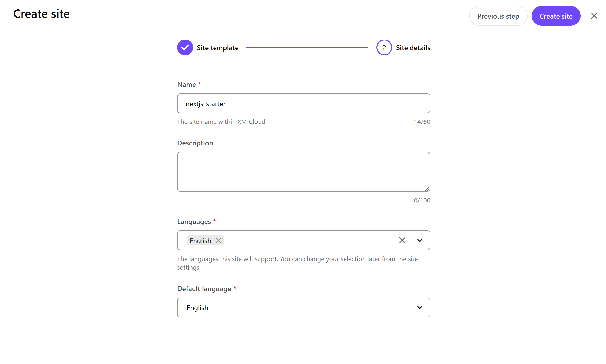

4. Create のボタンをクリックすると、新しいサイトの追加を開始します。

   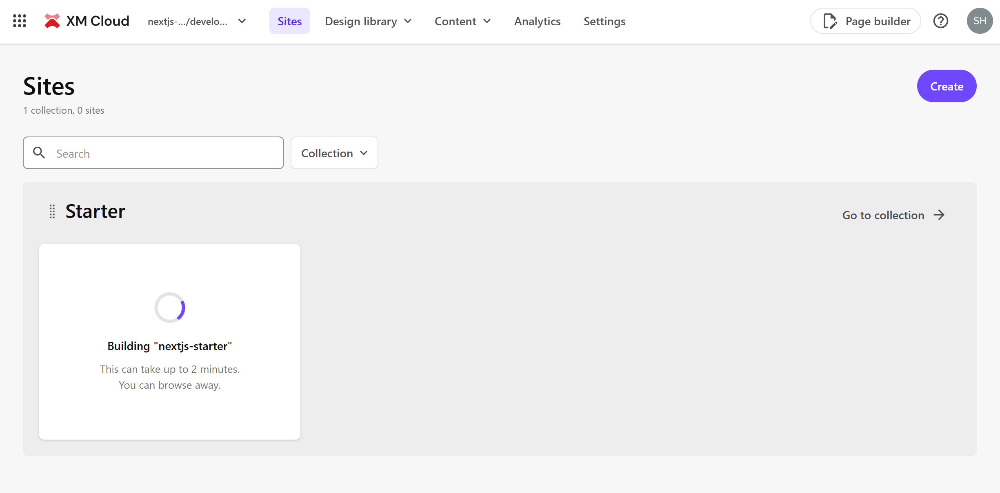

</Steps>

上記の手順が終わると、新しいサイトが追加されていることを確認できます。

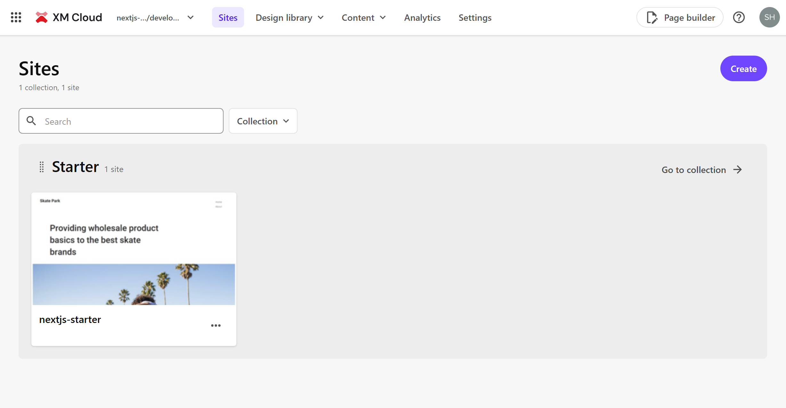

## 環境を追加する

新しいサーバー、新しいサイトの準備が出来ましたが、もう一つのサーバーを追加するために、Environment の追加作業を確認していきます。

<Steps>

1. GitHub のリポジトリに対して、Staging のブランチを追加します。

   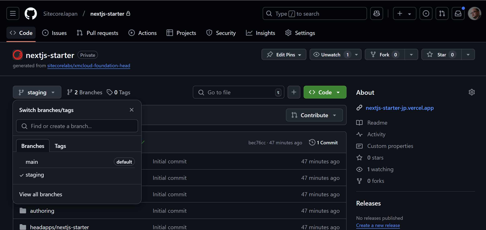

2. XM Cloud Deploy の管理画面に移動します。既に CMS が起動している場合は、環境一覧から `Manage environmets` の項目をクリックしても XM Cloud Deploy の管理画面に移動することが出来ます。

   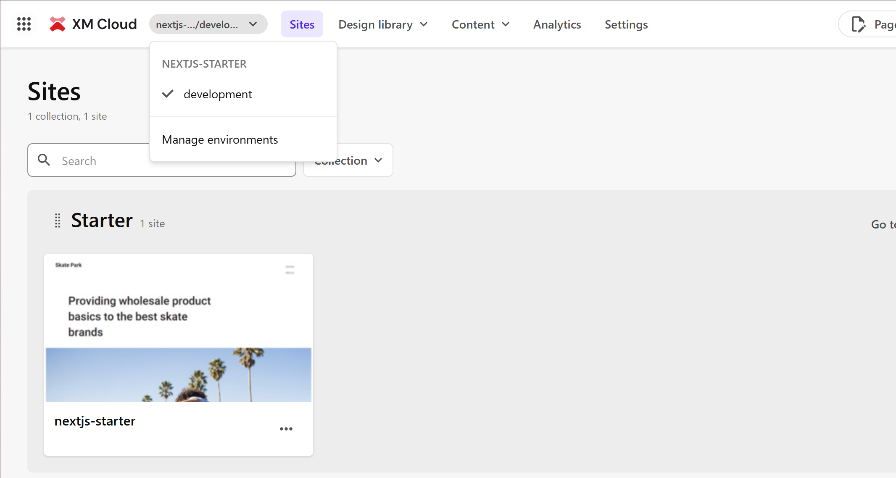

3. 利用しているプロジェクトの環境一覧の画面を開きます。

   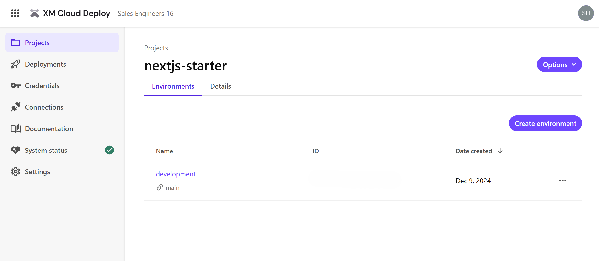

4. 新しい環境に対して、リポジトリのブランチ名を指定してください。

   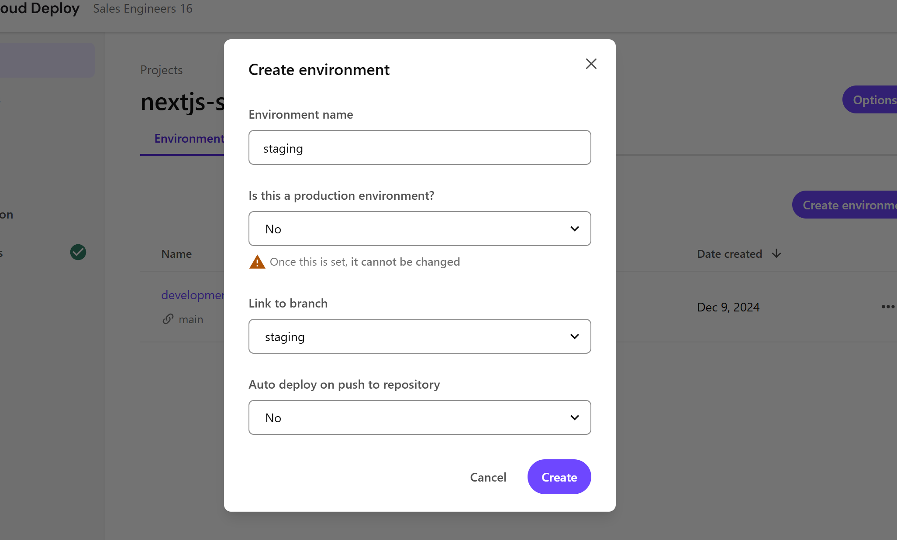

</Steps>

上記の設定が終わると、あとは初回の環境を作った手順と同じくしばらくの時間で新しいサーバーが立ち上がる形となります。

## Environment の詳細

XM Cloud Deploy の管理画面から環境に関する様々な値を得ることが出来ます。

- Deployments: サーバーの展開に関しての情報を確認できます
- Sites: 対象となる Environments で設定されている Web サイトの確認が出来ます
  - 全体の Publish を実行することが出来ます
  - サイトを Vercel に展開することが出来ます
- Details
  - Web サイトの展開先や、開発の際に利用する Context ID を取得できます
  - Environment ID の確認ができます
  - データセンター、インスタンスタイプの確認が出来ます
  - GraphQL などで利用する際の URL や Client Key を取得できます
- Logs
  - インスタンスで保持されている各種ログを参照できます
- Variables
  - CMS が利用する環境変数を確認することが出来ます
- Developer Settings
  - 開発者がよく利用する値を取得することが出来る画面になっています

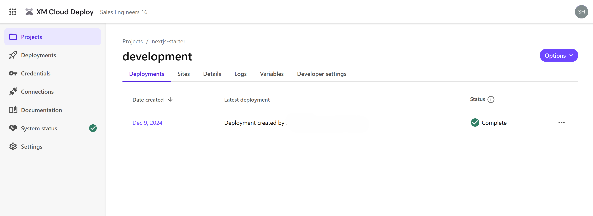

上記の値は、インフラエンジニア、開発者が利用するもので一般ユーザーは利用することはありません。

## Environment Variables について

CMS に対して環境変数の値を設定するための画面が Variables のタブとなります。

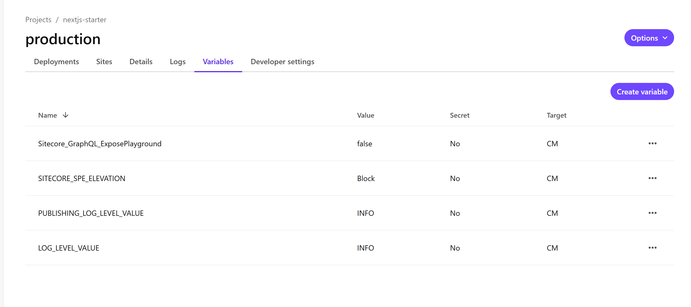

標準で以下の項目が設定されています。

| Name                              | Value | Secret | Target | Description                                                                                    |
| --------------------------------- | ----- | ------ | ------ | ---------------------------------------------------------------------------------------------- |
| Sitecore_GraphQL_ExposePlayground | false | No     | CM     | Sitecore Authoring and Management GraphQL APIプレイグラウンドへのアクセスを有効/無効にします。 |
| SITECORE_SPE_ELEVATION            | Block | No     | CM     | Sitecore PowerShell Extension（SPE）モジュールのユーザーアカウント制御アクションを指定します。 |
| PUBLISHING_LOG_LEVEL_VALUE        | INFO  | No     | CM     | パブリッシングプロセスのログレベルを設定する                                                   |
| LOG_LEVEL_VALUE                   | INFO  | No     | CM     | 一般ログのログレベルを設定する                                                                 |

上記以外で利用できる情報は、以下のページにまとめられています。

<LinkCard
  title="Environment variables"
  href="https://doc.sitecore.com/xmc/en/developers/xm-cloud/environment-variables.html"
  description="Modifying environment variables requires a rebuild/redeploy of your environment for the changes to take effect."
  target="_blank"
/>

### RichText Editor

Pages の管理画面において、リッチテキストの入力方式を環境変数を利用して切り替えることが出来ます。環境変数としては、`PAGES_ENABLE_NEW_RTE_EDITOR` を利用して、JSS v21.5.2 以降のバージョンで有効にすることが出来ます。なお、この項目は、2025年5月8日にはデフォルトでオンになる予定です。

<LinkCard
  title="The legacy rich text editor in Pages will be deprecated on May 8th, 2025"
  href="https://developers.sitecore.com/changelog/xm-cloud/13112024/the-legacy-rich-text-editor-in-pages-will-be-deprecated-on-may-8th%2c-2025"
  description="On May 8, 2025, Sitecore will deprecate the legacy Pages rich text editor previously accessible from the right-hand side panel. The newer CKEditor rich text editor will become the default. "
  target="_blank"
/>

まず最初に、前提条件としてこれまでのリッチテキストの編集画面は、以下のようにリッチテキストを選択すると、画面の右側でその属性を指定できるようになっています。

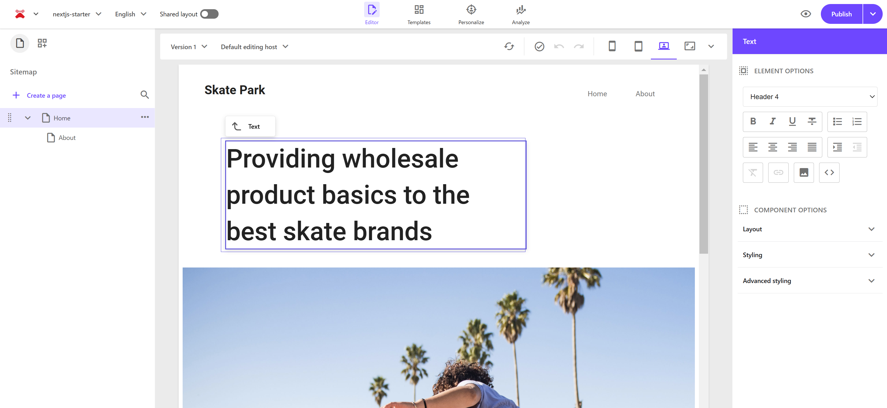

そこで、環境に対して `PAGES_ENABLE_NEW_RTE_EDITOR` の項目を追加します。

設定をしたあと、環境変数を有効にするために手動で Deploy を実施してください。しばらくして新しいインスタンスが起動したあと Pages にアクセスをすると、リッチテキストエディアの編集形式が変わります。

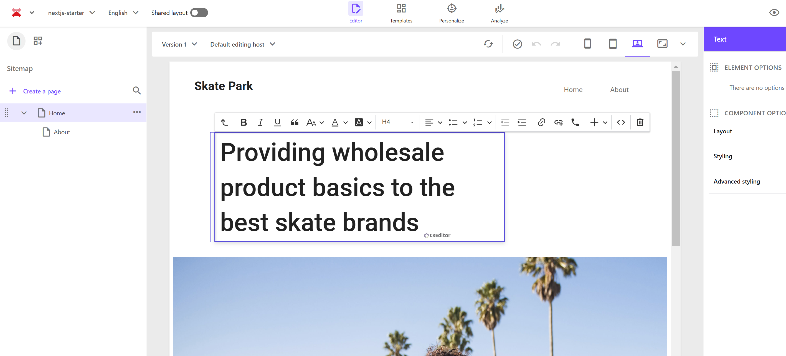

2025 年にこの設定は変わるため、今の段階で有効にして運用することが推奨となります。

### Sitecore Connect for Content Hub

Sitecore XM Cloud と Sitecore Content Hub を連携させる場合は、Environment Variables の項目を利用して連携させる形となります。この手順に関しては、以下のページで別途手順を紹介をしています。

- [Sitecore Connect for Content Hub](/ch/connect-for-content-hub/)

## 参考情報

<LinkCard
  title="Environment variables"
  href="https://doc.sitecore.com/xmc/en/developers/xm-cloud/environment-variables.html"
  description="Modifying environment variables requires a rebuild/redeploy of your environment for the changes to take effect."
  target="_blank"
/>

<LinkCard
  title="The legacy rich text editor in Pages will be deprecated on May 8th, 2025"
  href="https://developers.sitecore.com/changelog/xm-cloud/13112024/the-legacy-rich-text-editor-in-pages-will-be-deprecated-on-may-8th%2c-2025"
  description="On May 8, 2025, Sitecore will deprecate the legacy Pages rich text editor previously accessible from the right-hand side panel. The newer CKEditor rich text editor will become the default. "
  target="_blank"
/>

