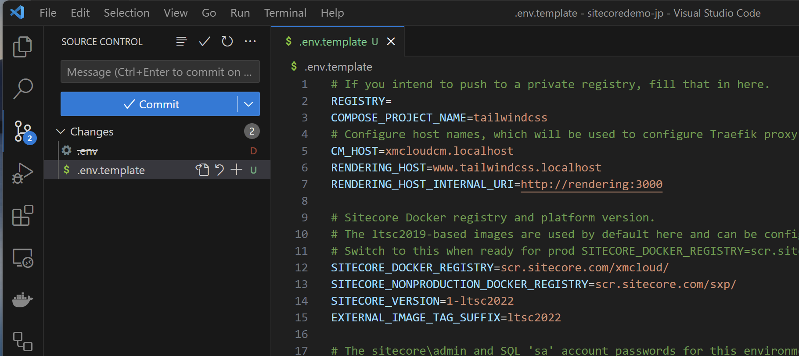
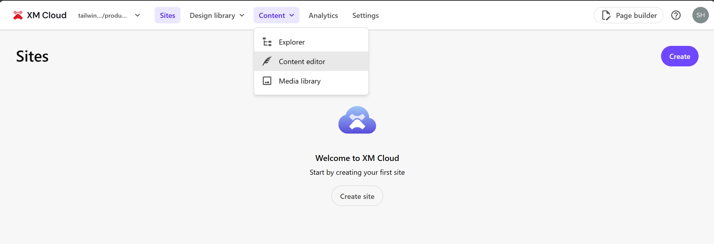

import { Steps, LinkCard, Aside, FileTree } from '@astrojs/starlight/components';
import { YouTube } from 'astro-embed';

このサイトで紹介をしている情報が含まれたテンプレートサイトとして、tailwind-starter を提供しています。このプロジェクトは標準テンプレート以外に、いくつか変更点を適用しているため、ここではその内容について紹介をします。

## 前提条件

このドキュメントで紹介をしている内容の前提条件は以下ので動作をさせています。

まず、ベースとなるイメージは以下のリポジトリを利用して作成しました。

<LinkCard
  title="XM Cloud Next.js Starter Kit"
  href="https://github.com/sitecorelabs/xmcloud-foundation-head"
  target="_blank"
/>

以下の環境で動作確認をしています。

- Windows 11 Pro
- Node.js 20.18.1
- Docker Desktop 4.36.0

上記のテンプレートを利用して、以下のリポジトリで新しいサンプルを提供しています。

<LinkCard
  title="XM Cloud Next.js Tailwind CSS Starter Kit"
  href="https://github.com/haramizu/tailwind-starter"
  target="_blank"
/>

## Docker 環境について

Docker 環境で動作させる .env ファイルには、その環境固有の情報が保存される形となります。そのままこのファイルを利用すると、GitHub などに公開をしたときにその情報と合わせて共有される形となります。そこで、ここでは .env ファイルを共有しないように設定を変更します。

この手順に関しては、以下の YouTube の動画が参考になります。

<YouTube id="https://youtu.be/uNkQQSC6n8o" title="XM Cloud Tutorials - Rename app #4" />

実際の手順は以下のようになります。

<Steps>

1. `.env` ファイルを `.env.template` にファイル名を変更します

2. `env.template` から環境固有のキーを削除します

   - SITECORE_ADMIN_PASSWORD
   - SQL_SA_PASSWORD
   - REPORTING_API_KEY
   - TELERIK_ENCRYPTION_KEY
   - MEDIA_REQUEST_PROTECTION_SHARED_SECRET
   - JSS_DEPLOYMENT_SECRET_xmcloudpreview
   - SITECORE_API_KEY_xmcloudpreview
   - JSS_EDITING_SECRET

3. .env ファイルを削除するために、一度 .env および .env.template の変更をコミットします

   

4. .gitignore を更新します

   ```txt
   // .gitignore

   # Environment file .env
   .env
   ```

   この変更により、`.env` ファイルが GitHub に公開されることが無くなります

5. `init.ps1` を実行する際に、`.env.template` を利用して `.env` を作成するようにスクリプトを変更します。

   ```ps1 {4-9}
   // local-containers\scripts\init.ps1
   $envFileLocation = "$RepoRoot/local-containers/.env"

   ################################
   # Create .env file
   ################################

   Write-Host "Create .env file." -ForegroundColor Green
   Copy-Item ".\.env.template" ".\.env" -Force

   ################################
   # Add Windows hosts file entries
   ################################
   ```

</Steps>

上記の変更で、 `.env` ファイルを保護して、ローカルで Docker を立ち上げるための準備がが整った形となります。

管理者権限で利用できる Terminal を起動して、以下のようにローカルの環境を起動します。

```ps1
cd local-containers
./scripts/init.ps1 -InitEnv -LicenseXmlPath "C:\license\license.xml" -AdminPassword "DesiredAdminPassword"
```

以下のように、.env ファイルが作成されて、環境が整います。


コンテナを起動するときは、以下のコマンドを管理者権限のある Terminal で実行します。

```ps1
./scripts/up.ps1
```

これでローカルの Docker の環境が起動するようになりました。

## up.ps1 の変更

標準で提供されている `local-containers\scripts\up.ps1` のファイルですが、デフォルトでは管理者権限が必要となっています。この権限を必要としているコードは、以下の部分になります。

```ps1
// local-containers\scripts\up.ps1
#set nuget version
$xmCloudBuild = Get-Content "$RepoRoot/xmcloud.build.json" | ConvertFrom-Json
$nodeVersion = $xmCloudBuild.renderingHosts.nextjsstarter.nodeVersion
if (![string]::IsNullOrWhitespace($nodeVersion)) {
    Set-EnvFileVariable "NODEJS_VERSION" -Value $xmCloudBuild.renderingHosts.nextjsstarter.nodeVersion -Path $envFileLocation
}
```

このコードは、XM Cloud の環境変数を定義している JSON ファイル `xmcloud.build.json` からNode.jsのバージョン情報を取得し、それを環境変数として設定するために使用されます。正しいバージョンが入っていることを確認して、この部分をコメントアウトすることで、管理者権限が無くても `./scripts/up.ps1` を実行できるようになります。

## 日本語のリソースの追加

Sitecore XM Cloud のクラウド環境およびローカルの Docker 環境に対して、Sitecore Experience Manager のリソースを追加することが出来ます。これにより、共通項目となっているアイテムに対する日本語のリソースをインポートすることが出来ます。

<Aside type="caution">この手順は公式サポートには含まれていません。</Aside>

### リソースファイルの準備

今回は Sitecore Experience Manager のリソースファイルを公式サイトからダウンロードをして利用します。以下のファイルをダウンロードします。

<LinkCard
  title="Sitecore Experience Platform 10.4 - Client translations"
  href="https://developers.sitecore.com/downloads/Sitecore_Experience_Platform/104/Sitecore_Experience_Platform_104#client-translations"
  target="_blank"
/>

<LinkCard
  title="Sitecore Experience Accelerator 10.4.0 - Client translations"
  href="https://developers.sitecore.com/downloads/Sitecore_Experience_Accelerator/10x/Sitecore_Experience_Accelerator_1040#client-translations"
  target="_blank"
/>

<LinkCard
  title="Sitecore Headless Rendering 22.0.0 - Client translations"
  href="https://developers.sitecore.com/downloads/Sitecore_Headless_Rendering/22x/Sitecore_Headless_Rendering_2200#client-translations"
  target="_blank"
/>

<LinkCard
  title="Sitecore Connect™ for Content Hub 5.2.0 - Client translations"
  href="https://developers.sitecore.com/downloads/Sitecore_Connect_for_Content_Hub/5x/Sitecore_Connect_for_Content_Hub_520#client-translations"
  target="_blank"
/>

上記からダウンロードをしたファイルを、`local-containers\docker\build\cm\App_Data` のフォルダを作成して、展開をします。なお、 Web に関するリソースは XM Cloud では不要なため、省略をしています。

<FileTree>

- local-containers
  - docker
    - build
      - cm
        - **App_Data**
          - items
            - core
              - localization
                - cmp.items.core.ja-JP.dat
                - dam.items.core.ja-JP.dat
                - items.core.ja-JP.dat
                - items.core.jss.ja-JP.dat
                - items.core.sxa.ja-JP.dat
            - master
              - localization
                - cmp.items.master.ja-JP.dat
                - dam.items.master.ja-JP.dat
                - items.master.ja-JP.dat
                - items.master.jss.ja-JP.dat
                - items.master.sxa.ja-JP.dat
          - localization
            - cmp.texts.ja-JP.xml
            - dam.texts.ja-JP.xml
            - texts.ja-JP.xml
            - texts.sxa.ja-JP.xml

</FileTree>

リソースファイルの準備が出来ました。

### Docker 環境に適用

今回は cm インスタンスに対してリソースファイルをコピーする形で適用できるため、以下のファイルにコピーのコマンドを1行追加します。

```dockerfile title="local-containers/docker/build/cm/Dockerfile" {15}
# escape=`

ARG PARENT_IMAGE
ARG SOLUTION_IMAGE
ARG TOOLS_IMAGE

FROM ${TOOLS_IMAGE} as tools
FROM ${PARENT_IMAGE}

SHELL ["powershell", "-Command", "$ErrorActionPreference = 'Stop'; $ProgressPreference = 'SilentlyContinue';"]

WORKDIR C:\inetpub\wwwroot

# resource copy
COPY .\App_Data\ .\App_Data

# Copy developer tools and entrypoint
COPY --from=tools C:\tools C:\tools
```

設定を変更したあと、ローカルの環境で適用して起動してください。

<Steps>

1. Desktop を起動します

2. 右下のアイコンをクリックして Core に切り替えます

   

3. Control Panel から Localization - `Add a new language` を選択します。

4. Japanese - Japan を追加します

   

5. 言語を追加した後、Desktop を起動してデータベースを master に戻します。

</Steps>

上記の手順で、日本語リソースを選択することが可能となります。ユーザーのプロファイルで、表示言語を日本語にすると、ローカルの環境では日本語のデータが表示されるようになりました。


### XM Cloud 環境に適用

XM Cloud の環境に対してリソースファイルを適用するためには、authoring で用意されているプロジェクトを通じて、XM Cloud Deploy がリソースファイルを含めて展開することが出来るように調整をする必要があります。手順は以下の通りです。

<Steps>

1. authoring\platform\App_Data のフォルダを作成して、local-containers\docker\build\cm\App_Data と同じ構造でファイルをコピーします。

   <FileTree>

   - authoring
     - platform
       - **App_Data**
         - items
           - core
             - localization
               - cmp.items.core.ja-JP.dat
               - dam.items.core.ja-JP.dat
               - items.core.ja-JP.dat
               - items.core.jss.ja-JP.dat
               - items.core.sxa.ja-JP.dat
           - master
             - localization
               - cmp.items.master.ja-JP.dat
               - dam.items.master.ja-JP.dat
               - items.master.ja-JP.dat
               - items.master.jss.ja-JP.dat
               - items.master.sxa.ja-JP.dat
         - localization
           - cmp.texts.ja-JP.xml
           - dam.texts.ja-JP.xml
           - texts.ja-JP.xml
           - texts.sxa.ja-JP.xml

   </FileTree>

2. `authoring\platform\Platform.csproj` のファイルに、上記のファイルを対象をプロジェクトファイルに含めるように、以下の行を追加します。

   ```xml title="authoring\platform\Platform.csproj" {2-16}
     <ItemGroup>
       <Content Include="App_Data\items\core\localization\cmp.items.core.ja-JP.dat" />
       <Content Include="App_Data\items\core\localization\dam.items.core.ja-JP.dat" />
       <Content Include="App_Data\items\core\localization\items.core.ja-JP.dat" />
       <Content Include="App_Data\items\core\localization\items.core.jss.ja-JP.dat" />
       <Content Include="App_Data\items\core\localization\items.core.sxa.ja-JP.dat" />
       <Content Include="App_Data\items\master\localization\cmp.items.master.ja-JP.dat" />
       <Content Include="App_Data\items\master\localization\dam.items.master.ja-JP.dat" />
       <Content Include="App_Data\items\master\localization\items.master.ja-JP.dat" />
       <Content Include="App_Data\items\master\localization\items.master.jss.ja-JP.dat" />
       <Content Include="App_Data\items\master\localization\items.master.sxa.ja-JP.dat" />
       <Content Include="App_Data\localization\cmp.texts.ja-JP.xml" />
       <Content Include="App_Data\localization\dam.texts.ja-JP.xml" />
       <Content Include="App_Data\localization\texts.ja-JP.xml" />
       <Content Include="App_Data\localization\texts.jss.ja-JP.xml" />
       <Content Include="App_Data\localization\texts.sxa.ja-JP.xml" />
       <None Include="Platform.wpp.targets" />
   ```

</Steps>

これでリソースファイルを含めて XM Cloud のインスタンスを立ち上げることが可能となります。

上記の設定を反映させたプロジェクトを、XM Cloud Deploy と連携をしてインスタンスを Build すると、リソースファイルを含む形で展開していることを確認することが出来ます。


新しい環境が起動したあと、以下の手順で日本語リソースを追加していきます。

<Steps>

1. サイト一覧を表示する Sites のメニューから、Settings を選択します。

   

2. 左側のメニューの Desktop を開きます

   

3. 右下のアイコンをクリックして Core に切り替えます

   

4. Control Panel から Localization - `Add a new language` を選択します。

5. Japanese - Japan を追加します

   

6. 言語を追加した後、Desktop を起動してデータベースを master に戻します。

</Steps>

上記の手順で、日本語リソースを選択することが可能となります。

Sitecore XM Cloud 全体で持っているリソースに対しては適用されませんが、共通のツールとなる Content Editor で日本語が表示されていることを確認できます。まず、Sites のメニューの Content の下にある Content Editor を開きます。



今回は言語が正しくインポートできるかの検証のために、ユーザーの言語を切り替えるのではなく、URL でここでは切り替えます。CMS にアクセスしている URL の最後の言語を `&sc_lang=ja-JP` に変更をします。すると、以下のように日本語のリソースで表示されました。


