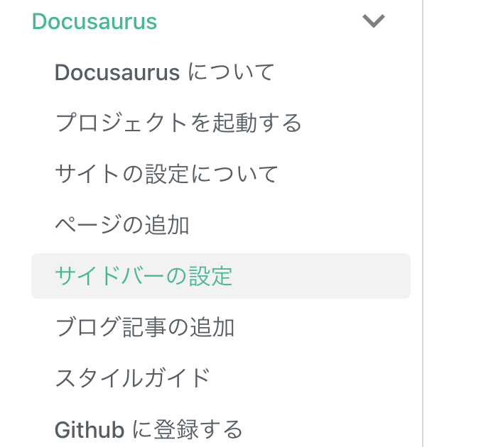

Docusaurus にコンテンツを追加していく場合は、 `sidebars.js` のファイルにドキュメントを追加していきます。

## sidebars.js の変更

今回は、Docusaurus に関する文書を追加するために、以下のファイルを追加していきます。

* Docusaurus.md
* Docusaurus-yarn-start.md
* Docusaurus-site-settings.md
* Docusaurus-create-doc.md
* Docusaurus-side-bars.md
* Docusaurus-style-guide.md
* Docusaurus-blog.md
* Docusaurus-github.md

デフォルトの値は sidebars.js の中身は以下のようになります。

```javascript
module.exports = {
  someSidebar: {
    Docusaurus: ['doc1', 'doc2', 'doc3'],
    Features: ['mdx'],
  },
};
```

上記のファイルを以下のように書き換えます。

```javascript
module.exports = {
  someSidebar: {
    Docusaurus: [
      "Docusaurus",
      "Docusaurus-yarn-start",
      "Docusaurus-site-settings",
      "Docusaurus-create-doc",
      "Docusaurus-side-bars", 
      "Docusaurus-blog",
      "Docusaurus-style-guide",
      "Docusaurus-github"
    ],
    Features: ['mdx'],
  },
};
```

上記のように変更をすると、左側のメニューに対して各 Markdown のファイルで定義した sidebar_label を利用してメニューが作成されます。



注意点としては、 `slug:` で他の Markdown ファイルで定義が被らないようにすること、また `id:` に関しても同様に被らないようにしないといけません。ファイル名と `id` は揃える必要はありませんが、別にして作っていくと対象のコンテンツを見つけるのが難しくなるので、合わせることを推奨します。