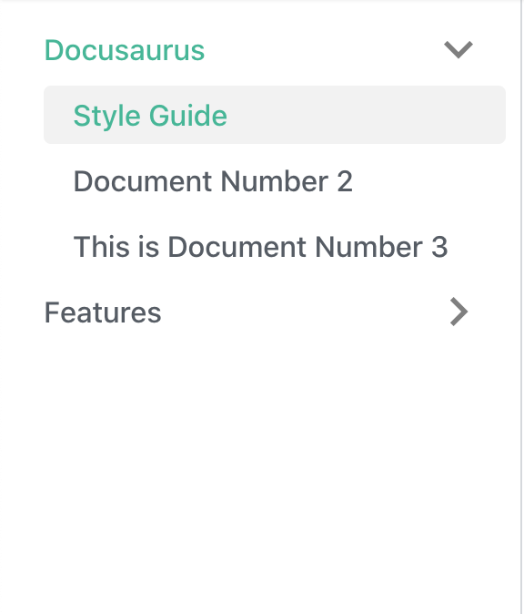
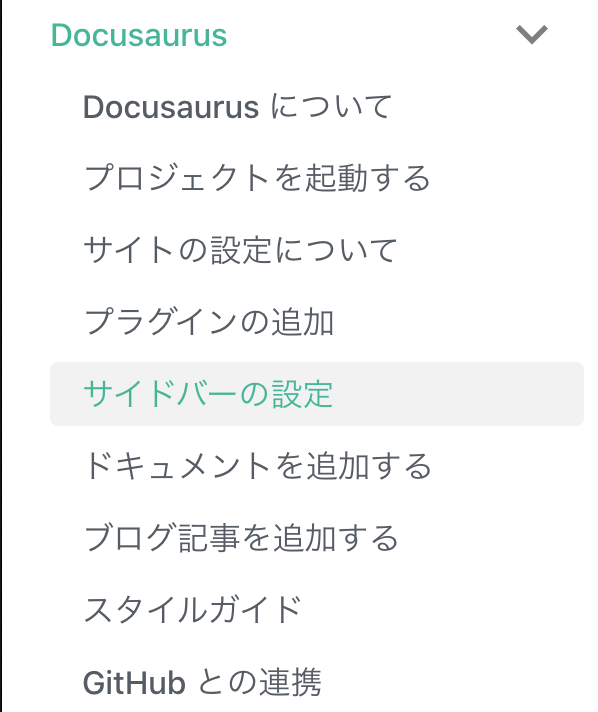

Docusaurus にコンテンツを追加していく場合は、サイドバーのファイルを変更していきます。

## sidebars.js の変更

今回は、Docusaurus に関するドキュメントを複数のページに分けて作っています。このため、以下のファイルをサイドバーに追加していきます。

* Docusaurus.md
* Docusaurus-yarn-start.md
* Docusaurus-site-settings.md
* Docusaurus-plugin.md
* Docusaurus-side-bars.md 
* Docusaurus-docs.md
* Docusaurus-blog.md
* Docusaurus-style-guide.md
* Docusaurus-github"

デフォルトの値は sidebars.js の中身は以下のような状態です。

```javascript
module.exports = {
  someSidebar: {
    Docusaurus: ['doc1', 'doc2', 'doc3'],
    Features: ['mdx'],
  },
};
```


基本的には .md ファイルに定義されている id を並べる形となっています。このため、今回は以下のように書き換えます。

```javascript
module.exports = {
  someSidebar: {
    Docusaurus: [
      "Docusaurus",
      "Docusaurus-yarn-start",
      "Docusaurus-site-settings",
      "Docusaurus-plugin",
      "Docusaurus-side-bars", 
      "Docusaurus-docs",
      "Docusaurus-blog",
      "Docusaurus-style-guide",
      "Docusaurus-github"
    ],
    Features: ['mdx'],
  },
};
```

これにより、左側のメニューは以下のようになりました。



